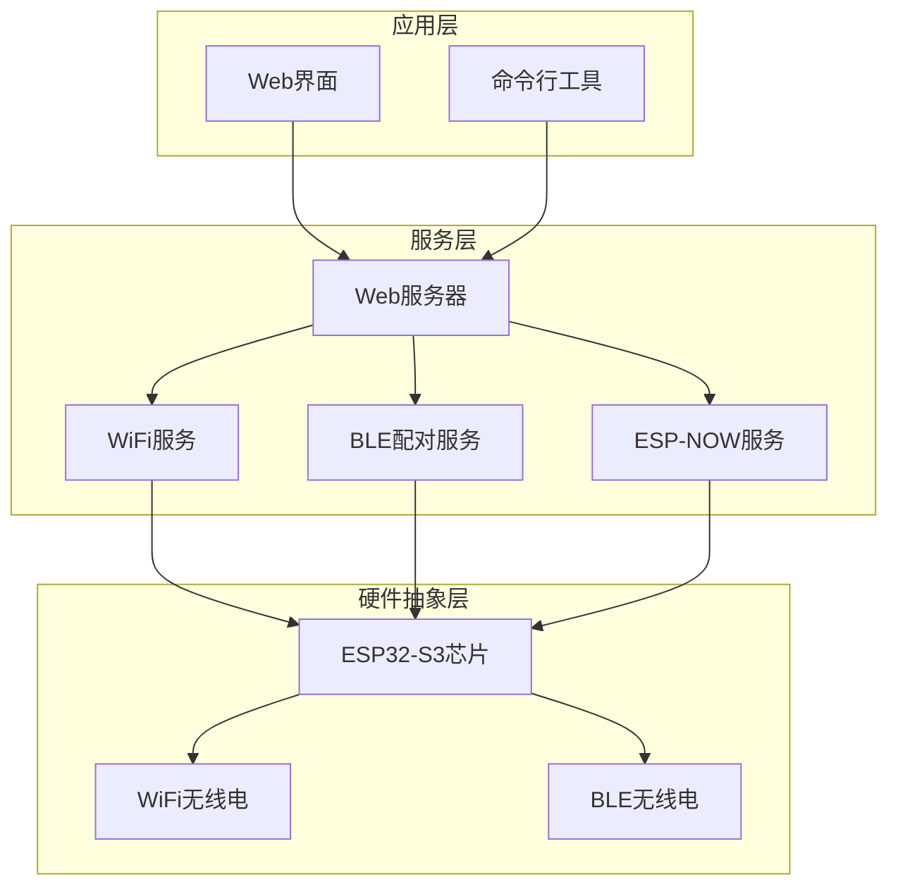
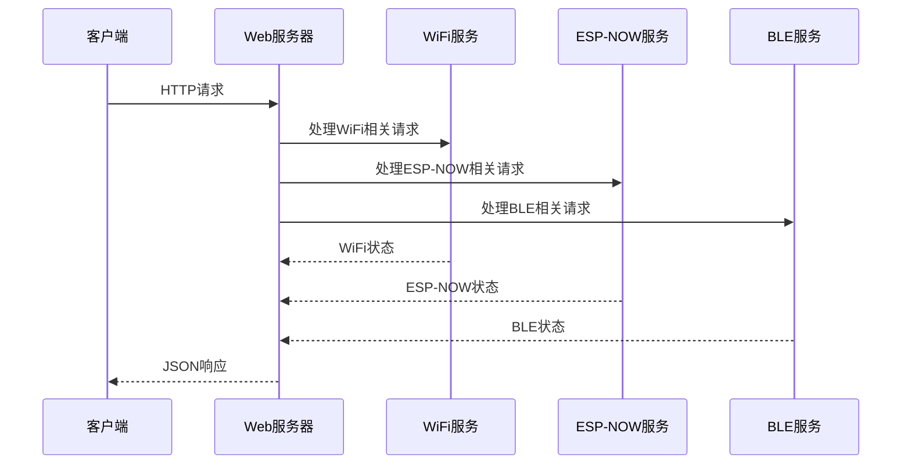
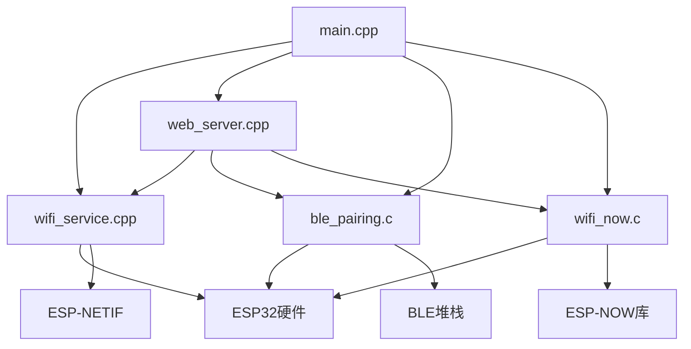
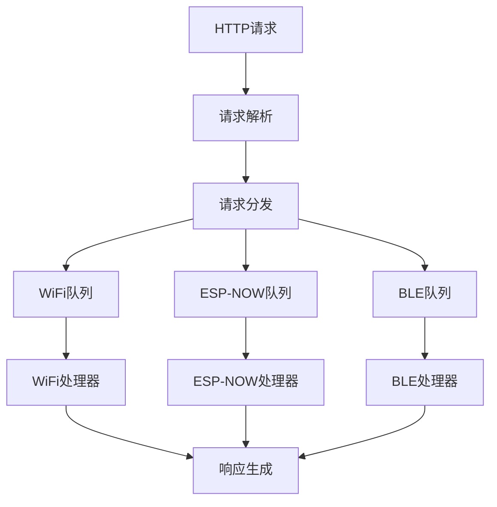

# API参考文档

<cite>
**本文档引用的文件**
- [main.cpp](file://main/main.cpp)
- [wifi_service.cpp](file://main/wifi_service.cpp)
- [wifi_service.h](file://main/wifi_service.h)
- [web_server.cpp](file://main/web_server.cpp)
- [web_server.h](file://main/web_server.h)
- [wifi_now.c](file://main/wifi_now.c)
- [wifi_now.h](file://main/wifi_now.h)
- [ble_pairing.c](file://main/ble_pairing.c)
- [ble_pairing.h](file://main/ble_pairing.h)
- [ESP_NOW_WiFi_API_Specification.md](file://docs/ESP_NOW_WiFi_API_Specification.md)
- [ESP_NOW_BLE_Discovery_Specification.md](file://docs/ESP_NOW_BLE_Discovery_Specification.md)
- [ESP_NOW_BLE_Quick_Reference_CN.md](file://docs/ESP_NOW_BLE_Quick_Reference_CN.md)
</cite>

## 目录
1. [简介](#简介)
2. [项目结构](#项目结构)
3. [核心组件](#核心组件)
4. [架构概览](#架构概览)
5. [详细组件分析](#详细组件分析)
6. [依赖关系分析](#依赖关系分析)
7. [性能考虑](#性能考虑)
8. [故障排除指南](#故障排除指南)
9. [结论](#结论)
10. [附录](#附录)

## 简介

本项目是一个基于ESP32-S3的WiFi管理器，提供了完整的API参考文档，涵盖WiFi API、BLE API、ESP-NOW API和Web API。该系统支持USB网络、WiFi热点和STA模式的双模运行，提供自动发现和配对功能。

## 项目结构

项目采用模块化设计，主要包含以下核心模块：



**图表来源**
- [main.cpp:19-81](file://main/main.cpp#L19-L81)
- [web_server.cpp:17-16](file://main/web_server.cpp#L17-L16)

**章节来源**
- [main.cpp:1-81](file://main/main.cpp#L1-L81)
- [web_server.h:1-22](file://main/web_server.h#L1-L22)

## 核心组件

### WiFi服务组件
WiFi服务提供完整的WiFi连接管理功能，支持STA模式、AP模式和AP+STA双模式运行。

### BLE配对组件
BLE配对服务实现自动设备发现和配对功能，支持广播和扫描模式。

### ESP-NOW组件
ESP-NOW服务提供点对点无线通信功能，支持自动配对和解绑。

### Web服务器组件
Web服务器提供RESTful API接口，支持HTTP方法、URL模式和JSON数据格式。

**章节来源**
- [wifi_service.h:1-99](file://main/wifi_service.h#L1-L99)
- [wifi_now.h:1-113](file://main/wifi_now.h#L1-L113)
- [ble_pairing.h:1-55](file://main/ble_pairing.h#L1-L55)

## 架构概览

系统采用分层架构设计，各组件之间通过清晰的接口进行通信：



**图表来源**
- [web_server.cpp:1147-1200](file://main/web_server.cpp#L1147-L1200)
- [wifi_service.cpp:604-703](file://main/wifi_service.cpp#L604-L703)

## 详细组件分析

### WiFi API参考

#### 基础WiFi管理API

**GET /api/wifi/status**
获取当前WiFi状态信息

**请求**
```
GET /api/wifi/status HTTP/1.1
Host: 192.168.4.1
```

**响应**
```json
{
  "mode": "apsta",
  "sta_ssid": "ESP32-S3-AP",
  "sta_password": "12345678",
  "sta_state": "connected",
  "sta_ip": "192.168.4.100",
  "sta_rssi": -65,
  "ap_ssid": "ESP32-S3-AP",
  "ap_password": "12345678",
  "ap_active": true,
  "ap_clients": 1,
  "sta_down_bps": 1024,
  "sta_up_bps": 512,
  "ap_down_bps": 2048,
  "ap_up_bps": 1024,
  "usb_down_bps": 0,
  "usb_up_bps": 0
}
```

**POST /api/wifi/connect**
连接到指定的WiFi网络

**请求**
```json
{
  "ssid": "MyNetwork",
  "password": "mypassword"
}
```

**响应**
```json
{
  "success": true,
  "message": "连接配置已保存"
}
```

**POST /api/wifi/ap/start**
启动WiFi热点

**请求**
```json
{
  "ssid": "ESP32-Hotspot",
  "password": "hotspot123"
}
```

**响应**
```json
{
  "success": true,
  "message": "热点已启动"
}
```

**POST /api/wifi/ap/stop**
停止WiFi热点

**请求**
```json
{}
```

**响应**
```json
{
  "success": true,
  "message": "热点已停止"
}
```

**章节来源**
- [web_server.cpp:1147-1200](file://main/web_server.cpp#L1147-L1200)
- [wifi_service.cpp:705-750](file://main/wifi_service.cpp#L705-L750)

#### WiFi扫描API

**POST /api/wifi/scan**
开始WiFi网络扫描

**请求**
```json
{}
```

**响应**
```json
{
  "scanning": true,
  "results": []
}
```

**GET /api/wifi/scan/results**
获取扫描结果

**请求**
```json
{}
```

**响应**
```json
{
  "scanning": false,
  "results": [
    {
      "ssid": "Network1",
      "rssi": -55,
      "channel": 6,
      "authmode": 4
    }
  ]
}
```

**章节来源**
- [wifi_service.cpp:79-88](file://main/wifi_service.cpp#L79-L88)
- [web_server.cpp:1186-1200](file://main/web_server.cpp#L1186-L1200)

### BLE API参考

#### BLE配对API

**GET /api/ble/status**
获取BLE配对状态

**请求**
```json
{}
```

**响应**
```json
{
  "advertising": true,
  "scanning": false,
  "auto_pair": true
}
```

**POST /api/ble/advertise**
控制BLE广告功能

**请求**
```json
{
  "enable": "1",
  "name": "ESP32-S3-NOW"
}
```

**响应**
```json
{
  "success": true,
  "message": "BLE广告已启动"
}
```

**POST /api/ble/scan**
开始BLE扫描

**请求**
```json
{}
```

**响应**
```json
{
  "success": true,
  "message": "BLE扫描已启动"
}
```

**GET /api/ble/devices**
获取扫描到的设备列表

**请求**
```json
{}
```

**响应**
```json
{
  "scanning": false,
  "devices": [
    {
      "index": 0,
      "name": "ESP32-Node1",
      "now_mac": "AA:BB:CC:DD:EE:FF",
      "rssi": -75
    }
  ]
}
```

**POST /api/ble/pair**
配对指定的BLE设备

**请求**
```json
{
  "index": 0
}
```

**响应**
```json
{
  "success": true,
  "message": "设备已配对"
}
```

**章节来源**
- [ble_pairing.c:310-361](file://main/ble_pairing.c#L310-L361)
- [web_server.cpp:662-720](file://main/web_server.cpp#L662-L720)

### ESP-NOW API参考

#### ESP-NOW核心API

**GET /api/espnow/master**
获取ESP-NOW主机信息

**请求**
```json
{}
```

**响应**
```json
{
  "mac": "3C:0F:02:D1:E6:94",
  "channel": 1
}
```

**POST /api/espnow/register**
注册ESP-NOW节点

**请求**
```json
{
  "mac": "AA:BB:CC:DD:EE:FF",
  "channel": 1,
  "name": "ESP32-Node1"
}
```

**响应**
```json
{
  "success": true,
  "ap_mac": "3C:0F:02:D1:E6:94",
  "ap_channel": 1
}
```

**POST /api/espnow/send**
发送ESP-NOW单播消息

**请求**
```json
{
  "mac": "AA:BB:CC:DD:EE:FF",
  "data": "48656c6c6f"
}
```

**响应**
```json
{
  "success": true,
  "sent": 5
}
```

**POST /api/espnow/broadcast**
广播ESP-NOW消息

**请求**
```json
{
  "data": "48656c6c6f"
}
```

**响应**
```json
{
  "success": true,
  "sent": 5
}
```

**POST /api/espnow/unpair**
解绑ESP-NOW节点

**请求**
```json
{
  "mac": "AA:BB:CC:DD:EE:FF"
}
```

**响应**
```json
{
  "success": true
}
```

**章节来源**
- [wifi_now.c:126-192](file://main/wifi_now.c#L126-L192)
- [web_server.cpp:819-837](file://main/web_server.cpp#L819-L837)

#### ESP-NOW节点管理API

**GET /api/now/mac**
获取ESP-NOW MAC地址

**请求**
```json
{}
```

**响应**
```json
{
  "mac": "3C:0F:02:D1:E6:94"
}
```

**GET /api/now/peers**
获取已配对的ESP-NOW节点列表

**请求**
```json
{}
```

**响应**
```json
{
  "peers": [
    {
      "mac": "AA:BB:CC:DD:EE:FF",
      "channel": 1,
      "name": "ESP32-Node1",
      "type": "slave"
    }
  ]
}
```

**POST /api/now/peer/remove**
移除指定的ESP-NOW节点

**请求**
```json
{
  "mac": "AA:BB:CC:DD:EE:FF"
}
```

**响应**
```json
{
  "success": true
}
```

**章节来源**
- [wifi_now.c:476-481](file://main/wifi_now.c#L476-L481)
- [web_server.cpp:722-746](file://main/web_server.cpp#L722-L746)

### Web API参考

#### DHCP客户端管理API

**GET /api/dhcp/clients**
获取DHCP客户端列表

**请求**
```json
{}
```

**响应**
```json
{
  "clients": [
    {
      "source": "ap",
      "mac": "AA:BB:CC:DD:EE:FF",
      "ip": "192.168.4.100"
    }
  ]
}
```

**POST /api/restart**
重启设备

**请求**
```json
{}
```

**响应**
```json
{
  "success": true
}
```

**章节来源**
- [web_server.cpp:499-515](file://main/web_server.cpp#L499-L515)
- [web_server.cpp:624-627](file://main/web_server.cpp#L624-L627)

## 依赖关系分析

系统组件之间的依赖关系如下：



**图表来源**
- [main.cpp:19-43](file://main/main.cpp#L19-L43)
- [wifi_service.cpp:604-632](file://main/wifi_service.cpp#L604-L632)

**章节来源**
- [main.cpp:1-81](file://main/main.cpp#L1-L81)
- [wifi_service.cpp:1-632](file://main/wifi_service.cpp#L1-L632)

## 性能考虑

### 线程安全性

系统采用FreeRTOS任务调度，确保各组件的线程安全性：

- **WiFi服务**：使用互斥锁保护共享状态
- **ESP-NOW服务**：通过队列机制处理异步操作
- **BLE服务**：使用信号量控制并发访问
- **Web服务器**：每个请求独立处理，避免阻塞

### 并发访问特性



**图表来源**
- [wifi_service.cpp:118-182](file://main/wifi_service.cpp#L118-L182)
- [web_server.cpp:1147-1154](file://main/web_server.cpp#L1147-L1154)

### 性能优化建议

1. **队列深度优化**：根据负载调整WiFi命令队列大小
2. **定时器频率**：合理设置RSSI和统计定时器周期
3. **内存管理**：使用静态分配减少动态内存碎片
4. **网络缓冲**：优化TCP/IP缓冲区大小

## 故障排除指南

### 常见问题及解决方案

#### WiFi连接问题

**问题**：无法连接到WiFi网络
**解决方案**：
1. 检查SSID和密码格式
2. 验证路由器兼容性
3. 确认信号强度足够

**问题**：WiFi状态显示为断开
**解决方案**：
1. 检查网络配置存储
2. 验证NVS分区完整性
3. 重新初始化WiFi服务

#### ESP-NOW通信问题

**问题**：ESP-NOW消息无法接收
**排查清单**：
1. ✅ PMK密钥一致性检查
2. ✅ 信道同步验证
3. ✅ 双向peer添加确认
4. ✅ encrypt参数设置
5. ✅ 接收回调注册
6. ✅ WiFi模式正确性
7. ✅ ESP-NOW初始化状态
8. ✅ 数据长度限制

**问题**：配对失败
**解决方案**：
1. 检查BLE广告状态
2. 验证扫描参数设置
3. 确认自动配对功能
4. 检查设备距离和信号

#### Web API访问问题

**问题**：HTTP请求超时
**解决方案**：
1. 检查网络连接稳定性
2. 验证防火墙设置
3. 确认端口开放状态
4. 检查服务器负载情况

**章节来源**
- [ESP_NOW_WiFi_API_Specification.md:787-800](file://docs/ESP_NOW_WiFi_API_Specification.md#L787-L800)
- [ble_pairing.c:228-288](file://main/ble_pairing.c#L228-L288)

## 结论

本项目提供了完整的WiFi管理和通信解决方案，具有以下特点：

1. **模块化设计**：清晰的组件分离和接口定义
2. **多协议支持**：同时支持WiFi、BLE和ESP-NOW通信
3. **RESTful API**：标准化的HTTP接口设计
4. **自动发现**：BLE自动配对和ESP-NOW节点发现
5. **线程安全**：基于FreeRTOS的任务调度和同步机制

系统适用于各种物联网应用场景，提供了灵活的配置选项和强大的扩展能力。

## 附录

### API版本信息

- **WiFi API**: v5.0
- **BLE API**: v3.0  
- **ESP-NOW API**: v4.0
- **Web API**: v1.0

### 废弃标记和迁移指南

**版本迁移**：
- v2.0 → v3.0：添加解绑功能
- v3.0 → v4.0：增强消息发送和广播功能
- v4.0 → v5.0：完善协议约定和调试支持

**迁移建议**：
1. 更新PMK设置到固定值
2. 检查信道同步机制
3. 验证双向peer添加逻辑
4. 测试新的解绑功能

### 使用限制和安全考虑

**使用限制**：
- ESP-NOW单帧最大250字节
- BLE广播数据最大31字节
- 最大配对节点数20个
- 最大发现设备数16个

**安全考虑**：
- 使用固定的PMK密钥进行ESP-NOW通信
- 验证所有输入参数的安全性
- 实施适当的访问控制机制
- 定期更新固件和安全补丁

**章节来源**
- [ESP_NOW_BLE_Discovery_Specification.md:662-677](file://docs/ESP_NOW_BLE_Discovery_Specification.md#L662-L677)
- [wifi_now.h:12-18](file://main/wifi_now.h#L12-L18)
- [ble_pairing.h:12-14](file://main/ble_pairing.h#L12-L14)