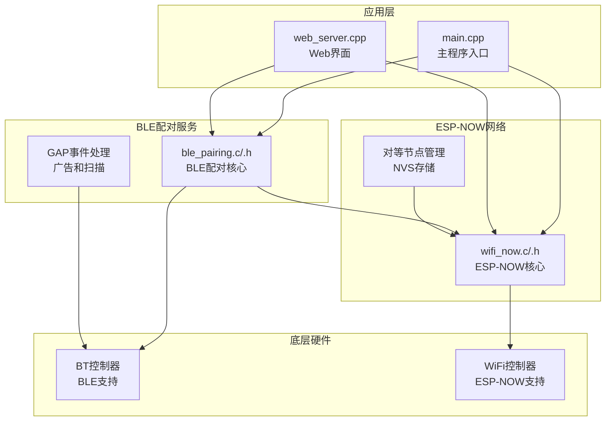
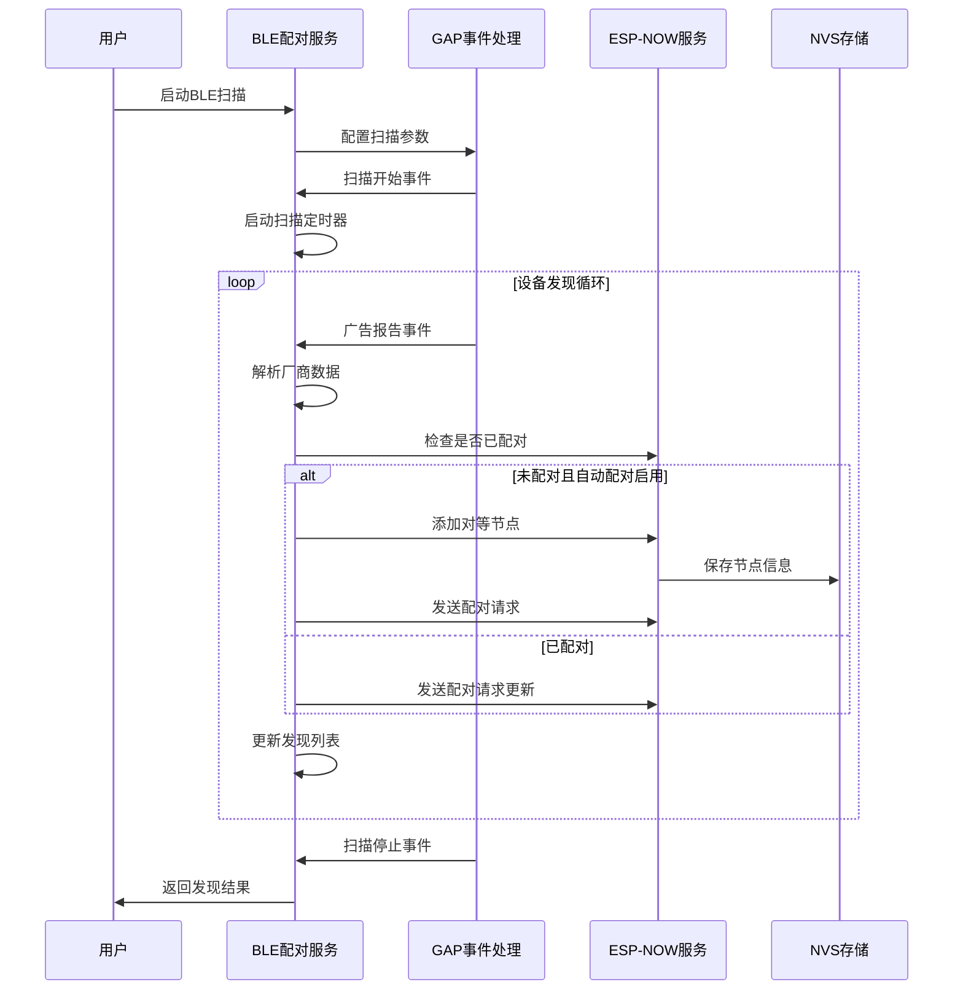
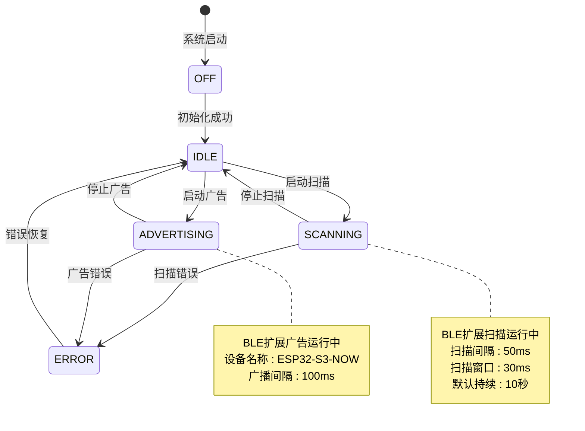
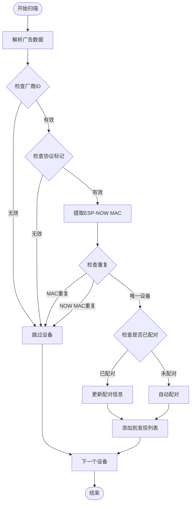
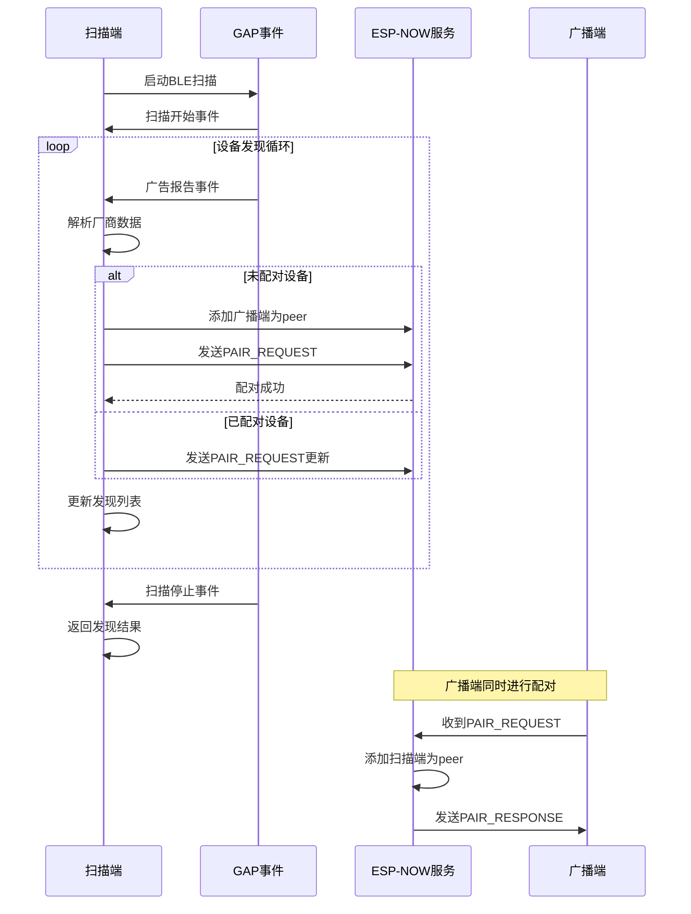
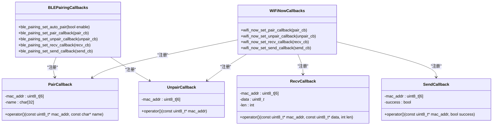
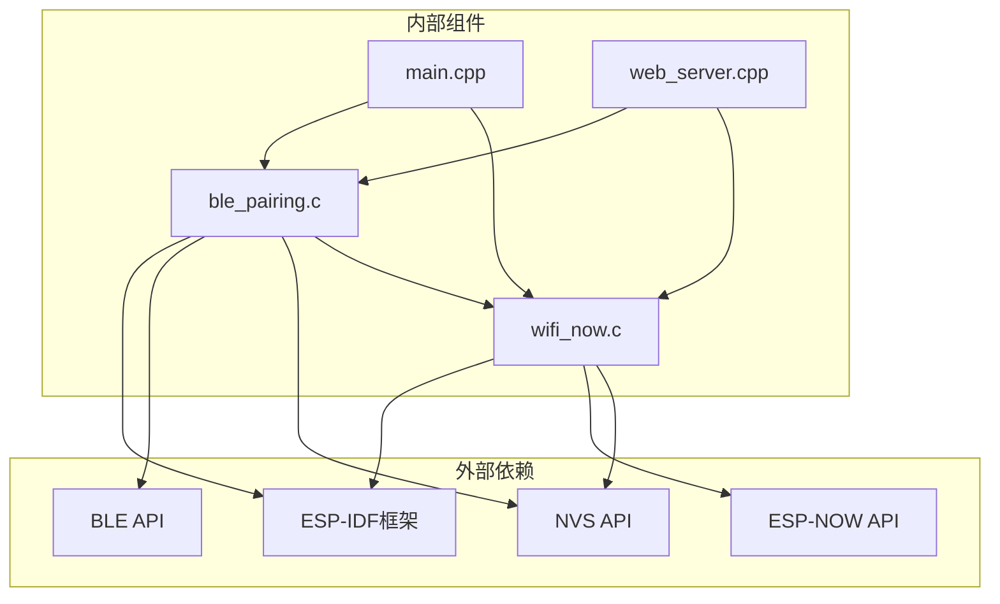

# BLE API

<cite>
**本文档引用的文件**
- [ble_pairing.h](file://main/ble_pairing.h)
- [ble_pairing.c](file://main/ble_pairing.c)
- [wifi_now.h](file://main/wifi_now.h)
- [wifi_now.c](file://main/wifi_now.c)
- [main.cpp](file://main/main.cpp)
- [ESP_NOW_BLE_Discovery_Specification.md](file://docs/ESP_NOW_BLE_Discovery_Specification.md)
- [ESP_NOW_BLE_Quick_Reference_CN.md](file://docs/ESP_NOW_BLE_Quick_Reference_CN.md)
</cite>

## 目录
1. [简介](#简介)
2. [项目结构](#项目结构)
3. [核心组件](#核心组件)
4. [架构概览](#架构概览)
5. [详细组件分析](#详细组件分析)
6. [依赖关系分析](#依赖关系分析)
7. [性能考虑](#性能考虑)
8. [故障排除指南](#故障排除指南)
9. [结论](#结论)
10. [附录](#附录)

## 简介

BLE API是一个基于ESP32-S3的BLE配对服务，实现了ESP-NOW网络的自动发现和配对功能。该系统通过BLE扩展广播实现设备发现，通过ESP-NOW消息实现双向配对，提供了完整的设备配对生命周期管理。

该API的核心特性包括：
- **自动设备发现**：通过BLE扩展广播实现零配置设备发现
- **双向自动配对**：扫描端和广播端自动互相添加为peer
- **设备命名识别**：支持设备名称显示和识别
- **持久化存储**：配对信息保存在NVS中，支持断电保持
- **超时控制**：扫描超时自动停止，防止资源泄漏
- **错误处理**：完善的错误检测和处理机制

## 项目结构

该项目采用模块化设计，主要包含以下核心模块：

**图表来源**
- [main.cpp:19-81](file://main/main.cpp#L19-L81)
- [ble_pairing.c:228-288](file://main/ble_pairing.c#L228-L288)
- [wifi_now.c:126-192](file://main/wifi_now.c#L126-L192)

**章节来源**
- [main.cpp:19-81](file://main/main.cpp#L19-L81)
- [ble_pairing.h:1-55](file://main/ble_pairing.h#L1-L55)
- [wifi_now.h:1-113](file://main/wifi_now.h#L1-L113)

## 核心组件

### BLE配对服务 (BLE Pairing Service)

BLE配对服务是整个系统的协调中心，负责BLE广告、扫描和配对逻辑的统一管理。

**主要功能**：
- BLE控制器初始化和配置
- BLE扩展广告参数设置
- BLE扩展扫描参数配置
- 设备发现和过滤
- 自动配对算法执行
- 资源管理和清理

**关键数据结构**：
- `ble_discovered_device_t`：已发现设备信息
- `ble_pair_state_t`：配对状态枚举
- 内部静态变量：状态跟踪、设备列表、定时器

**章节来源**
- [ble_pairing.c:228-288](file://main/ble_pairing.c#L228-L288)
- [ble_pairing.h:22-27](file://main/ble_pairing.h#L22-L27)

### ESP-NOW网络服务 (ESP-NOW Network Service)

ESP-NOW网络服务负责WiFi网络层的对等节点管理和消息传输。

**主要功能**：
- ESP-NOW协议栈初始化
- 对等节点添加、移除和查询
- 消息发送和接收处理
- 节点信息持久化存储
- 通道管理和网络配置

**关键数据结构**：
- `wifi_now_peer_info_t`：对等节点信息
- `esp_now_pair_msg_t`：配对消息结构
- 回调函数指针：事件通知机制

**章节来源**
- [wifi_now.c:126-192](file://main/wifi_now.c#L126-L192)
- [wifi_now.h:40-50](file://main/wifi_now.h#L40-L50)

## 架构概览

系统采用分层架构设计，实现了BLE发现层和ESP-NOW网络层的清晰分离：

**图表来源**
- [ble_pairing.c:129-220](file://main/ble_pairing.c#L129-L220)
- [wifi_now.c:662-712](file://main/wifi_now.c#L662-L712)

**章节来源**
- [ESP_NOW_BLE_Discovery_Specification.md:468-513](file://docs/ESP_NOW_BLE_Discovery_Specification.md#L468-L513)
- [ESP_NOW_BLE_Discovery_Specification.md:515-551](file://docs/ESP_NOW_BLE_Discovery_Specification.md#L515-L551)

## 详细组件分析

### BLE配对状态管理

BLE配对服务实现了完整的状态管理机制，确保系统在不同状态下正确处理各种操作：

**图表来源**
- [ble_pairing.c:310-315](file://main/ble_pairing.c#L310-L315)
- [ble_pairing.h:15-20](file://main/ble_pairing.h#L15-L20)

**章节来源**
- [ble_pairing.c:310-315](file://main/ble_pairing.c#L310-L315)
- [ble_pairing.c:357-360](file://main/ble_pairing.c#L357-L360)

### 设备发现和过滤机制

BLE配对服务实现了智能的设备发现和过滤机制，确保只处理有效的ESP-NOW设备：

**图表来源**
- [ble_pairing.c:81-111](file://main/ble_pairing.c#L81-L111)
- [ble_pairing.c:113-127](file://main/ble_pairing.c#L113-L127)

**章节来源**
- [ble_pairing.c:81-111](file://main/ble_pairing.c#L81-L111)
- [ble_pairing.c:174-216](file://main/ble_pairing.c#L174-L216)

### 自动配对算法

自动配对算法实现了双向配对的完整流程，确保两个设备都能成为彼此的peer：

**图表来源**
- [ble_pairing.c:182-197](file://main/ble_pairing.c#L182-L197)
- [wifi_now.c:662-712](file://main/wifi_now.c#L662-L712)

**章节来源**
- [ESP_NOW_BLE_Discovery_Specification.md:515-551](file://docs/ESP_NOW_BLE_Discovery_Specification.md#L515-L551)
- [ESP_NOW_BLE_Discovery_Specification.md:54-52](file://docs/ESP_NOW_BLE_Discovery_Specification.md#L54-L52)

### 回调函数接口和事件处理

系统实现了完整的回调函数机制，用于处理各种事件和状态变化：

**图表来源**
- [wifi_now.h:52-56](file://main/wifi_now.h#L52-L56)
- [wifi_now.c:482-513](file://main/wifi_now.c#L482-L513)

**章节来源**
- [wifi_now.h:52-56](file://main/wifi_now.h#L52-L56)
- [wifi_now.c:38-71](file://main/wifi_now.c#L38-L71)

## 依赖关系分析

系统各组件之间的依赖关系如下：

**图表来源**
- [main.cpp:12-13](file://main/main.cpp#L12-L13)
- [ble_pairing.c:1-16](file://main/ble_pairing.c#L1-L16)
- [wifi_now.c:1-12](file://main/wifi_now.c#L1-L12)

**章节来源**
- [main.cpp:12-13](file://main/main.cpp#L12-L13)
- [ble_pairing.c:1-16](file://main/ble_pairing.c#L1-L16)
- [wifi_now.c:1-12](file://main/wifi_now.c#L1-L12)

## 性能考虑

### 内存管理

系统采用了高效的内存管理策略：
- **静态分配**：设备列表和缓冲区使用静态分配，避免动态内存碎片
- **互斥锁保护**：使用FreeRTOS互斥锁保护共享资源访问
- **内存池**：NVS存储使用预分配的内存空间

### 扫描优化

扫描参数经过精心优化以平衡性能和功耗：
- **扫描间隔**：50ms，提供良好的实时性
- **扫描窗口**：30ms，确保足够的发现机会
- **默认持续时间**：10秒，防止无限扫描
- **重复过滤**：禁用重复过滤，确保所有设备都被发现

### 并发控制

系统实现了完善的并发控制机制：
- **互斥锁**：保护设备列表和状态变量
- **信号量**：同步BLE和WiFi操作
- **定时器**：管理扫描超时

## 故障排除指南

### 常见问题和解决方案

**BLE初始化失败**
- 检查BT控制器是否正确初始化
- 确认内存分配是否足够
- 验证BLE模式配置

**ESP-NOW配对失败**
- 检查WiFi是否已启动
- 验证PMK设置
- 确认节点数量限制

**设备发现异常**
- 检查BLE扫描参数
- 验证广告数据格式
- 确认设备名称长度

**章节来源**
- [ESP_NOW_BLE_Quick_Reference_CN.md:662-677](file://docs/ESP_NOW_BLE_Quick_Reference_CN.md#L662-L677)

### 调试建议

1. **启用详细日志**：查看BLE和ESP-NOW事件日志
2. **监控内存使用**：定期检查堆内存状态
3. **验证回调注册**：确保所有回调函数正确注册
4. **测试超时机制**：验证扫描超时功能正常

## 结论

BLE API提供了一个完整、可靠的BLE配对服务解决方案。通过BLE扩展广播实现设备发现，通过ESP-NOW消息实现双向配对，系统实现了零配置的设备连接体验。

**主要优势**：
- **自动化程度高**：从设备发现到配对完全自动化
- **可靠性强**：完善的错误处理和恢复机制
- **扩展性好**：支持多设备配对和动态管理
- **易用性强**：简洁的API接口和丰富的回调机制

**应用场景**：
- IoT设备配对和管理
- 无线传感器网络
- 智能家居设备连接
- 工业自动化设备通信

## 附录

### API参考

#### BLE配对服务API

| 函数 | 描述 | 参数 | 返回值 |
|------|------|------|--------|
| `ble_pairing_init()` | 初始化BLE配对服务 | 无 | void |
| `ble_pairing_deinit()` | 关闭BLE配对服务 | 无 | void |
| `ble_pairing_start_advertise(name)` | 开始BLE广告 | `const char*` 设备名称 | `bool` 成功/失败 |
| `ble_pairing_stop_advertise()` | 停止BLE广告 | 无 | void |
| `ble_pairing_is_advertising()` | 检查广告状态 | 无 | `bool` 在广告中 |
| `ble_pairing_start_scan(sec)` | 开始BLE扫描 | `uint8_t` 持续时间 | `bool` 成功/失败 |
| `ble_pairing_stop_scan()` | 停止BLE扫描 | 无 | void |
| `ble_pairing_is_scanning()` | 检查扫描状态 | 无 | `bool` 在扫描中 |
| `ble_pairing_get_discovered(devs, max)` | 获取发现设备 | `ble_discovered_device_t*`, `int` | `int` 设备数量 |
| `ble_pairing_pair_with_device(idx)` | 手动配对设备 | `int` 设备索引 | `bool` 成功/失败 |
| `ble_pairing_set_auto_pair(enable)` | 设置自动配对 | `bool` 启用/禁用 | void |
| `ble_pairing_get_auto_pair()` | 获取自动配对状态 | 无 | `bool` 状态 |

#### ESP-NOW服务API

| 函数 | 描述 | 参数 | 返回值 |
|------|------|------|--------|
| `wifi_now_init()` | 初始化ESP-NOW | 无 | void |
| `wifi_now_deinit()` | 关闭ESP-NOW | 无 | void |
| `wifi_now_add_peer(mac, ch)` | 添加对等节点 | `const uint8_t*`, `uint8_t` | `bool` 成功/失败 |
| `wifi_now_remove_peer(mac)` | 移除对等节点 | `const uint8_t*` | `bool` 成功/失败 |
| `wifi_now_get_peer_count()` | 获取节点数量 | 无 | `int` 数量 |
| `wifi_now_is_peer_exists(mac)` | 检查节点存在 | `const uint8_t*` | `bool` 存在/不存在 |
| `wifi_now_send(mac, data, len)` | 发送数据 | `const uint8_t*`, `const uint8_t*`, `int` | `int` 状态码 |
| `wifi_now_send_pair_request(mac)` | 发送配对请求 | `const uint8_t*` | `bool` 成功/失败 |
| `wifi_now_send_pair_response(mac)` | 发送配对响应 | `const uint8_t*` | `bool` 成功/失败 |
| `wifi_now_unpair_with_peer(mac)` | 解绑节点 | `const uint8_t*` | `bool` 成功/失败 |

### 配置选项

**BLE参数配置**：
- 广播间隔：100ms
- 扫描间隔：50ms
- 扫描窗口：30ms
- 默认扫描持续：10秒
- 最大发现设备：16个

**ESP-NOW参数配置**：
- 最大数据长度：250字节
- 最大节点数：20个
- 默认信道：1
- 广播MAC：FF:FF:FF:FF:FF:FF

### 最佳实践

1. **初始化顺序**：先初始化BLE，再初始化ESP-NOW
2. **资源管理**：及时释放扫描资源，避免内存泄漏
3. **错误处理**：始终检查API返回值
4. **回调注册**：在初始化完成后注册所有回调函数
5. **超时控制**：合理设置扫描超时时间
6. **持久化**：定期保存配对信息到NVS