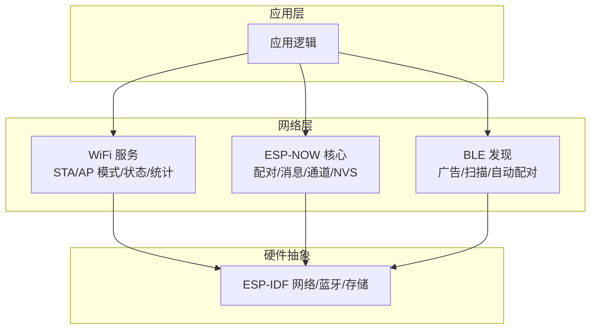
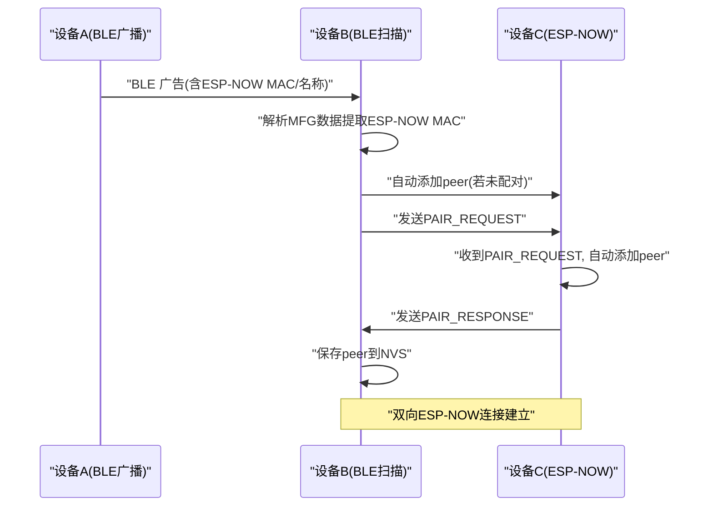
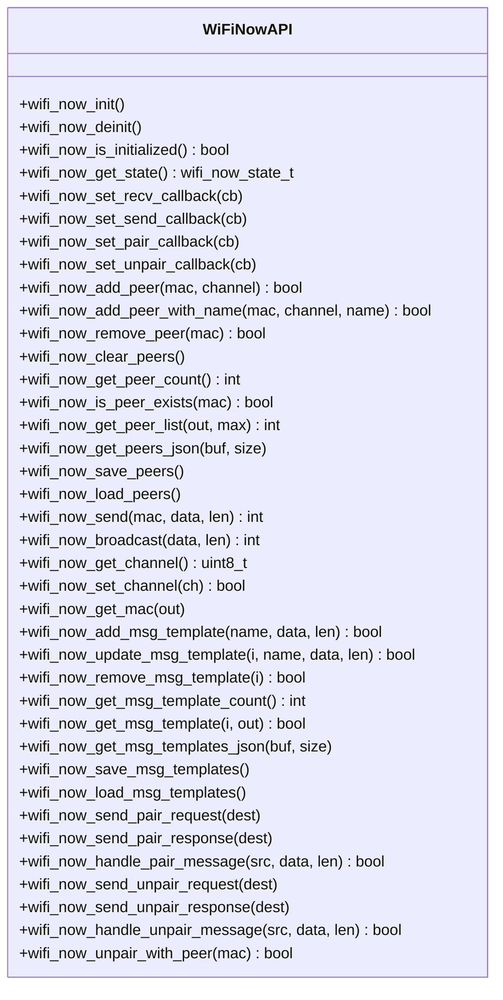
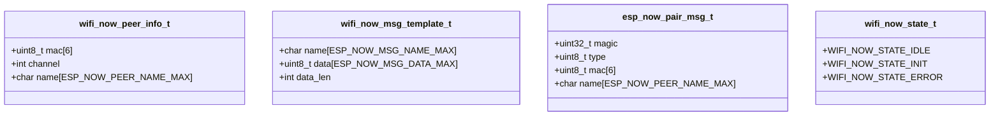
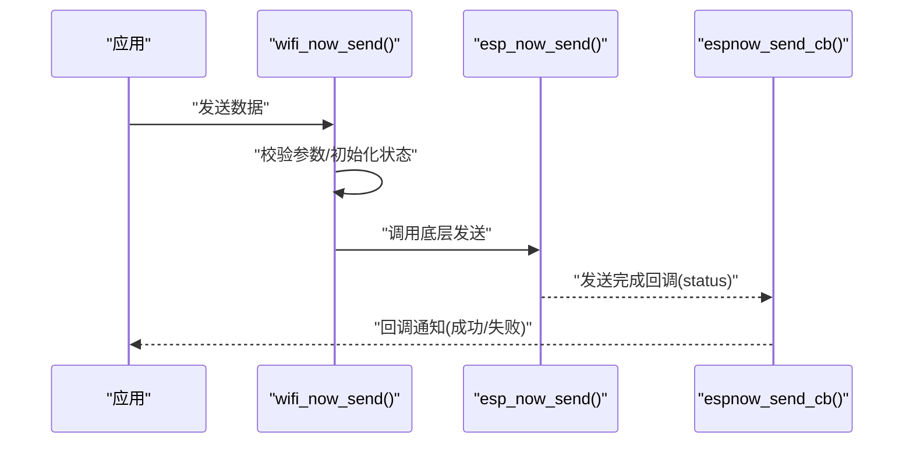
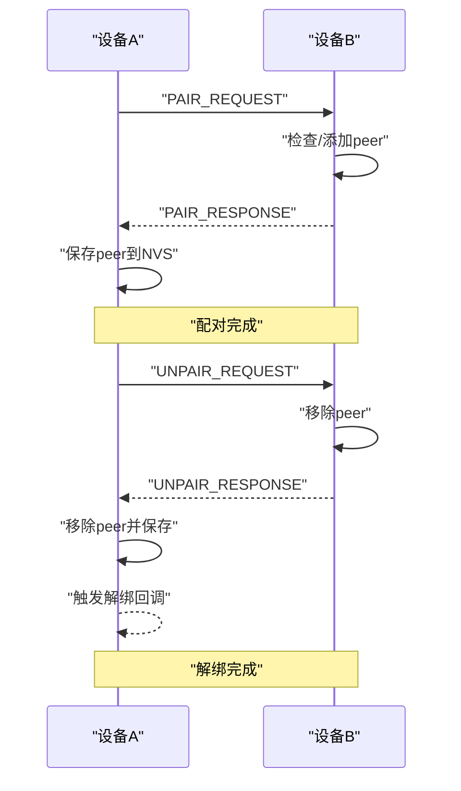
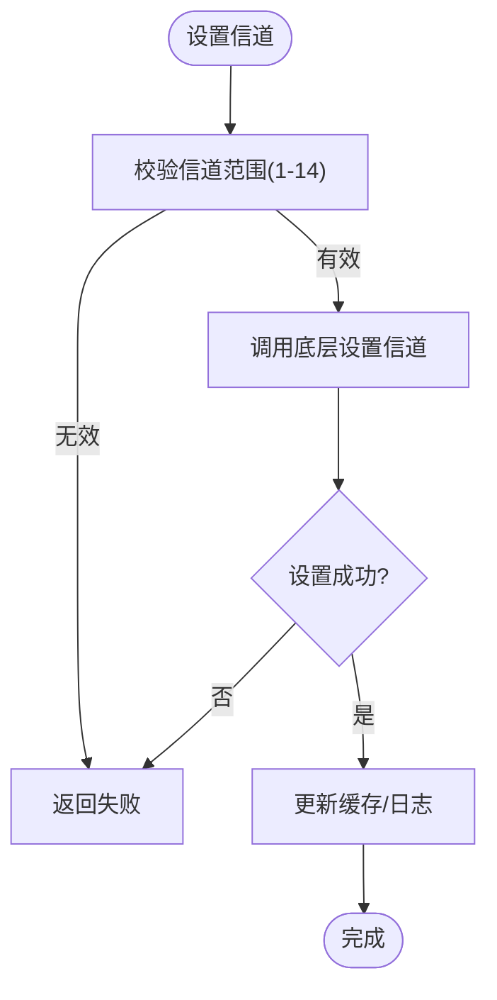
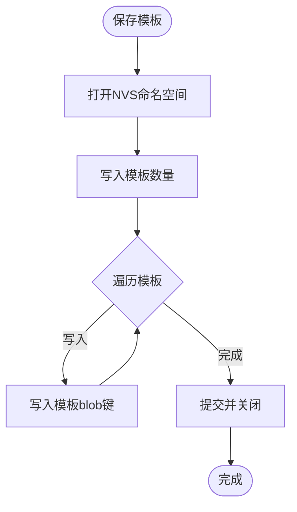
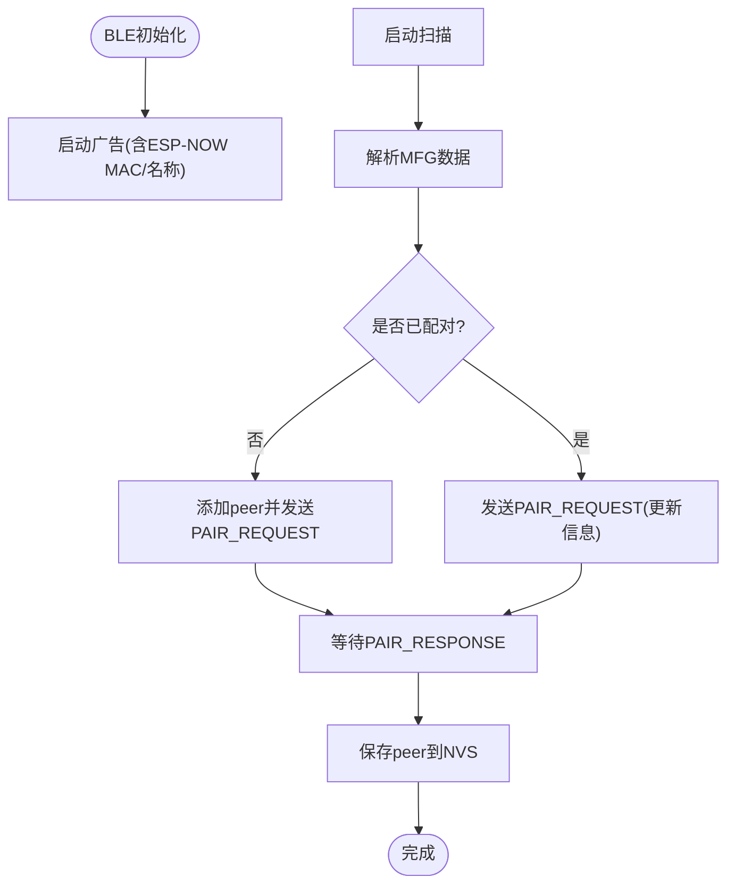
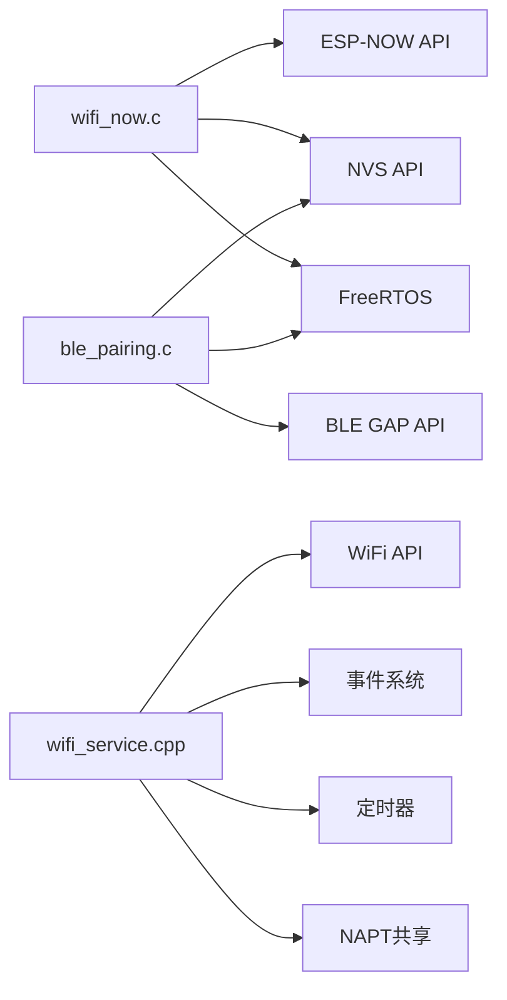

# ESP-NOW API

<cite>
**本文引用的文件**
- [wifi_now.h](file://main/wifi_now.h)
- [wifi_now.c](file://main/wifi_now.c)
- [ble_pairing.h](file://main/ble_pairing.h)
- [ble_pairing.c](file://main/ble_pairing.c)
- [wifi_service.h](file://main/wifi_service.h)
- [wifi_service.cpp](file://main/wifi_service.cpp)
- [ESP_NOW_WiFi_API_Specification.md](file://docs/ESP_NOW_WiFi_API_Specification.md)
- [ESP_NOW_BLE_Discovery_Specification.md](file://docs/ESP_NOW_BLE_Discovery_Specification.md)
</cite>

## 目录
1. [简介](#简介)
2. [项目结构](#项目结构)
3. [核心组件](#核心组件)
4. [架构总览](#架构总览)
5. [详细组件分析](#详细组件分析)
6. [依赖关系分析](#依赖关系分析)
7. [性能考虑](#性能考虑)
8. [故障排除指南](#故障排除指南)
9. [结论](#结论)
10. [附录](#附录)

## 简介
本文件为 ESP-NOW API 的权威参考文档，覆盖配对管理、消息发送、通道配置、消息模板、NVS 持久化、回调机制与并发控制等关键能力。文档基于仓库中的 C 源码与配套技术文档进行系统化梳理，帮助开发者快速理解并正确使用 ESP-NOW 通信接口，实现稳定的点对点或广播通信。

## 项目结构
本项目围绕“WiFi + ESP-NOW + BLE 自动发现”的架构组织，主要模块如下：
- ESP-NOW 核心：提供配对、消息发送/接收、通道与 MAC 管理、消息模板与持久化
- BLE 自动发现：通过 BLE 广告/扫描解析 ESP-NOW MAC，自动配对与解绑
- WiFi 服务：WiFi 模式切换、AP/STA 状态管理、DHCP 客户端统计、NAPT 共享
- 文档规范：ESP-NOW WiFi API 与 BLE 发现协议的技术规范

图表来源
- [wifi_service.cpp:604-703](file://main/wifi_service.cpp#L604-L703)
- [wifi_now.c:126-192](file://main/wifi_now.c#L126-L192)
- [ble_pairing.c:228-288](file://main/ble_pairing.c#L228-L288)

章节来源
- [wifi_now.h:1-113](file://main/wifi_now.h#L1-L113)
- [wifi_now.c:1-120](file://main/wifi_now.c#L1-L120)
- [ble_pairing.h:1-55](file://main/ble_pairing.h#L1-L55)
- [ble_pairing.c:1-120](file://main/ble_pairing.c#L1-L120)
- [wifi_service.h:1-99](file://main/wifi_service.h#L1-L99)
- [wifi_service.cpp:604-703](file://main/wifi_service.cpp#L604-L703)

## 核心组件
- ESP-NOW 核心接口：初始化/反初始化、状态查询、回调注册、对端管理、消息发送/广播、通道设置、MAC 查询、消息模板管理、配对/解绑消息处理
- BLE 自动发现：广告/扫描、设备发现、自动配对/解绑、设备名与 MAC 提取
- WiFi 服务：WiFi 模式、STA/AP 状态、DHCP 客户端、NAPT 共享、RSSI/流量统计定时器
- 文档规范：PMK、信道一致性、加密模式、消息大小限制、配对/解绑协议、消息序列化与 JSON 输出

章节来源
- [wifi_now.h:58-107](file://main/wifi_now.h#L58-L107)
- [wifi_now.c:126-192](file://main/wifi_now.c#L126-L192)
- [ble_pairing.h:29-50](file://main/ble_pairing.h#L29-L50)
- [ble_pairing.c:228-288](file://main/ble_pairing.c#L228-L288)
- [wifi_service.h:67-94](file://main/wifi_service.h#L67-L94)
- [wifi_service.cpp:604-703](file://main/wifi_service.cpp#L604-L703)
- [ESP_NOW_WiFi_API_Specification.md:27-88](file://docs/ESP_NOW_WiFi_API_Specification.md#L27-L88)
- [ESP_NOW_BLE_Discovery_Specification.md:1166-1197](file://docs/ESP_NOW_BLE_Discovery_Specification.md#L1166-L1197)

## 架构总览
ESP-NOW 通信由“BLE 发现 + ESP-NOW 配对 + ESP-NOW 数据传输”三层组成：
- BLE 层：通过扩展广告携带 ESP-NOW MAC 与设备名；扫描解析后自动添加对端为 peer
- ESP-NOW 层：注册收发回调，按需发送/广播数据；支持配对/解绑消息
- 应用层：业务逻辑、状态机、UI/日志

图表来源
- [ble_pairing.c:174-216](file://main/ble_pairing.c#L174-L216)
- [wifi_now.c:662-712](file://main/wifi_now.c#L662-L712)

章节来源
- [ESP_NOW_BLE_Discovery_Specification.md:515-551](file://docs/ESP_NOW_BLE_Discovery_Specification.md#L515-L551)
- [ESP_NOW_WiFi_API_Specification.md:655-716](file://docs/ESP_NOW_WiFi_API_Specification.md#L655-L716)

## 详细组件分析

### ESP-NOW 核心 API
- 初始化与状态
  - 初始化：注册收发回调、设置 PMK、加载持久化 peer 与消息模板、恢复广播 peer
  - 反初始化：注销回调、反初始化底层
  - 状态查询：空闲/初始化/错误
- 对端管理
  - 添加/带名添加/移除/清空
  - 查询数量、是否存在、列出
  - JSON 导出/导入
- 通道与 MAC
  - 获取/设置通道
  - 获取本机 MAC
- 回调注册
  - 接收回调、发送回调、配对回调、解绑回调
- 消息发送
  - 单播发送
  - 广播发送
- 消息模板
  - 增删改查、JSON 导出、NVS 持久化
- 配对/解绑消息
  - 发送请求/响应
  - 处理请求/响应
  - 解绑流程与回调

图表来源
- [wifi_now.h:58-107](file://main/wifi_now.h#L58-L107)

章节来源
- [wifi_now.h:27-107](file://main/wifi_now.h#L27-L107)
- [wifi_now.c:126-862](file://main/wifi_now.c#L126-L862)

### ESP-NOW 数据结构与常量
- 对端信息结构：包含 MAC、信道、名称
- 消息模板结构：包含名称、数据与长度
- 配对消息结构：包含魔数、类型、发送者 MAC、名称
- 状态枚举：空闲/初始化/错误
- 回调类型：接收、发送、配对、解绑
- 常量：最大对端数、广播 MAC、名称长度、消息模板数、消息体大小、消息类型、魔数

图表来源
- [wifi_now.h:27-56](file://main/wifi_now.h#L27-L56)

章节来源
- [wifi_now.h:12-56](file://main/wifi_now.h#L12-L56)

### 消息发送与接收流程
- 单播发送：校验初始化与参数，调用底层发送，异步回调报告发送结果
- 广播发送：使用广播 MAC 调用单播发送
- 接收回调：优先尝试解析配对/解绑消息，否则转发至用户回调

图表来源
- [wifi_now.c:422-441](file://main/wifi_now.c#L422-L441)
- [wifi_now.c:61-71](file://main/wifi_now.c#L61-L71)

章节来源
- [wifi_now.c:422-446](file://main/wifi_now.c#L422-L446)
- [wifi_now.c:38-71](file://main/wifi_now.c#L38-L71)

### 配对与解绑协议
- 配对消息：PAIR_REQUEST/PAIR_RESPONSE，携带魔数、类型、发送者 MAC 与名称
- 解绑消息：UNPAIR_REQUEST/UNPAIR_RESPONSE，同样结构
- 自动配对：BLE 扫描发现后自动添加 peer 并发送请求，收到请求后自动添加并回响应
- 解绑流程：发起方发送请求，收到响应后移除本地 peer 并触发回调

图表来源
- [wifi_now.c:487-559](file://main/wifi_now.c#L487-L559)
- [wifi_now.c:610-637](file://main/wifi_now.c#L610-L637)
- [wifi_now.c:662-712](file://main/wifi_now.c#L662-L712)
- [wifi_now.c:561-608](file://main/wifi_now.c#L561-L608)

章节来源
- [ESP_NOW_BLE_Discovery_Specification.md:195-213](file://docs/ESP_NOW_BLE_Discovery_Specification.md#L195-L213)
- [ESP_NOW_BLE_Discovery_Specification.md:330-341](file://docs/ESP_NOW_BLE_Discovery_Specification.md#L330-L341)
- [ESP_NOW_BLE_Discovery_Specification.md:515-551](file://docs/ESP_NOW_BLE_Discovery_Specification.md#L515-L551)
- [ESP_NOW_BLE_Discovery_Specification.md:596-629](file://docs/ESP_NOW_BLE_Discovery_Specification.md#L596-L629)

### 通道配置与 MAC 管理
- 通道设置：范围校验、底层设置、缓存更新
- 信道获取：从 WiFi 查询当前信道
- 本机 MAC：读取 WiFi STA MAC

图表来源
- [wifi_now.c:457-474](file://main/wifi_now.c#L457-L474)

章节来源
- [wifi_now.c:448-480](file://main/wifi_now.c#L448-L480)

### 消息模板与 JSON 序列化
- 模板管理：增删改查、计数、导出 JSON
- JSON 导出：模板名称、数据十六进制字符串、长度
- NVS 持久化：模板数量键与每个模板 blob 键

图表来源
- [wifi_now.c:809-830](file://main/wifi_now.c#L809-L830)
- [wifi_now.c:832-861](file://main/wifi_now.c#L832-L861)

章节来源
- [wifi_now.c:713-807](file://main/wifi_now.c#L713-L807)
- [wifi_now.c:809-861](file://main/wifi_now.c#L809-L861)

### NVS 持久化与并发控制
- NVS 命名空间：统一使用“espnow_cfg”
- 对端持久化：peer_cnt 计数 + peer_0..N blob
- 模板持久化：msg_cnt 计数 + msg_0..N blob
- 并发控制：互斥信号量保护状态与缓存访问

章节来源
- [wifi_now.c:14-21](file://main/wifi_now.c#L14-L21)
- [wifi_now.c:73-116](file://main/wifi_now.c#L73-L116)
- [wifi_now.c:811-828](file://main/wifi_now.c#L811-L828)

### BLE 自动发现与配对
- 广告参数：扩展广告、间隔、PHY、通道映射
- 扫描参数：主动扫描、间隔/窗口、去重、过滤策略
- 设备发现：解析厂商数据提取 ESP-NOW MAC 与名称
- 自动配对：未配对则添加 peer 并发送请求；已配对则发送请求更新
- 自动解绑：发送 UNPAIR_REQUEST，收到后移除 peer 并发送响应

图表来源
- [ble_pairing.c:129-220](file://main/ble_pairing.c#L129-L220)
- [ble_pairing.c:362-405](file://main/ble_pairing.c#L362-L405)

章节来源
- [ble_pairing.h:29-50](file://main/ble_pairing.h#L29-L50)
- [ble_pairing.c:228-288](file://main/ble_pairing.c#L228-L288)
- [ESP_NOW_BLE_Discovery_Specification.md:97-150](file://docs/ESP_NOW_BLE_Discovery_Specification.md#L97-L150)
- [ESP_NOW_BLE_Discovery_Specification.md:468-513](file://docs/ESP_NOW_BLE_Discovery_Specification.md#L468-L513)

### WiFi 服务与网络状态
- WiFi 模式：STA/AP/APSTA 切换与配置
- 事件处理：STA 连接/断开、AP 客户端接入/离线、IP 分配
- 统计与钩子：RSSI 定时器、流量钩子、NAPT 共享
- DHCP 客户端：AP/USB 下的 DHCP 客户端列表与 JSON 导出

章节来源
- [wifi_service.h:16-94](file://main/wifi_service.h#L16-L94)
- [wifi_service.cpp:416-595](file://main/wifi_service.cpp#L416-L595)
- [wifi_service.cpp:604-703](file://main/wifi_service.cpp#L604-L703)

## 依赖关系分析
- 组件耦合
  - wifi_now.c 依赖 ESP-IDF 的 esp_now、esp_wifi、nvs、freertos
  - ble_pairing.c 依赖 ESP-IDF 的 BLE GAP、esp_bt、nvs、freertos
  - wifi_service.cpp 依赖 ESP-IDF 的 WiFi、事件、定时器、NAPT
- 外部依赖
  - NVS：非易失性存储，用于 peer 与模板持久化
  - FreeRTOS：互斥量、定时器、任务队列
- 潜在循环依赖
  - 当前模块间通过头文件声明与源文件实现分离，未见直接循环 include
- 接口契约
  - ESP-NOW PMK 固定值、加密标志为 false、信道一致、消息长度不超过 250 字节

图表来源
- [wifi_now.c:1-14](file://main/wifi_now.c#L1-L14)
- [ble_pairing.c:1-16](file://main/ble_pairing.c#L1-L16)
- [wifi_service.cpp:1-21](file://main/wifi_service.cpp#L1-L21)

章节来源
- [wifi_now.c:1-14](file://main/wifi_now.c#L1-L14)
- [ble_pairing.c:1-16](file://main/ble_pairing.c#L1-L16)
- [wifi_service.cpp:1-21](file://main/wifi_service.cpp#L1-L21)

## 性能考虑
- 发送路径
  - esp_now_send() 返回成功仅表示入队，实际投递状态通过回调通知
  - 广播会针对每个 peer 触发一次底层发送，注意对端数量与吞吐
- 内存与存储
  - peer 与模板数组驻内存，建议合理设置上限常量
  - NVS 写入采用批量提交，避免频繁写入
- 并发
  - 关键路径使用互斥量保护全局状态与缓存
  - 回调在中断/任务上下文触发，避免阻塞
- 通道与信道一致性
  - 严格保持双方在同一信道，避免静默丢包
- PMK 一致性
  - 双方必须使用相同 PMK，否则消息被丢弃且无错误提示

[本节为通用指导，不直接分析具体文件]

## 故障排除指南
- 收不到消息
  - PMK 是否一致
  - 信道是否一致
  - 是否双向添加 peer
  - encrypt 是否为 false
  - 是否注册了接收回调
  - WiFi 模式与 ESP-NOW 是否初始化
  - 数据长度是否超过 250 字节
- 解绑后仍无法通信
  - 确认双方均已移除 peer
  - 检查 NVS 中 peer 列表是否持久化更新
  - 重启后是否重新加载 peer
- 广播无效
  - 确认至少存在一个已配对 peer
  - 检查广播地址与底层实现
- BLE 发现失败
  - 广告/扫描参数是否正确
  - MFG 数据格式是否符合规范
  - 是否启用自动配对

章节来源
- [ESP_NOW_WiFi_API_Specification.md:787-800](file://docs/ESP_NOW_WiFi_API_Specification.md#L787-L800)
- [ESP_NOW_BLE_Discovery_Specification.md:668-710](file://docs/ESP_NOW_BLE_Discovery_Specification.md#L668-L710)

## 结论
本项目提供了完整的 ESP-NOW 通信栈：BLE 自动发现与配对、ESP-NOW 数据传输、消息模板与持久化、通道与 MAC 管理、回调与并发控制。遵循文档规范中的 PMK、信道、加密与消息大小限制，即可实现稳定可靠的点对点与广播通信。建议在生产环境中结合 NVS 持久化与回调机制，确保设备重启后自动恢复通信状态。

[本节为总结性内容，不直接分析具体文件]

## 附录

### API 参考速查
- 初始化/状态
  - wifi_now_init()
  - wifi_now_deinit()
  - wifi_now_is_initialized()
  - wifi_now_get_state()
- 回调
  - wifi_now_set_recv_callback()
  - wifi_now_set_send_callback()
  - wifi_now_set_pair_callback()
  - wifi_now_set_unpair_callback()
- 对端管理
  - wifi_now_add_peer()/wifi_now_add_peer_with_name()
  - wifi_now_remove_peer()
  - wifi_now_clear_peers()
  - wifi_now_get_peer_count()
  - wifi_now_is_peer_exists()
  - wifi_now_get_peer_list()/wifi_now_get_peers_json()
  - wifi_now_save_peers()/wifi_now_load_peers()
- 通道与 MAC
  - wifi_now_get_channel()/wifi_now_set_channel()
  - wifi_now_get_mac()
- 消息发送
  - wifi_now_send()
  - wifi_now_broadcast()
- 消息模板
  - wifi_now_add_msg_template()/update/remove/get/count/get_json/save/load
- 配对/解绑
  - wifi_now_send_pair_request()/send_pair_response()/handle_pair_message()
  - wifi_now_send_unpair_request()/send_unpair_response()/handle_unpair_message()/unpair_with_peer()

章节来源
- [wifi_now.h:58-107](file://main/wifi_now.h#L58-L107)

### 数据结构与常量
- wifi_now_peer_info_t
- wifi_now_msg_template_t
- esp_now_pair_msg_t
- wifi_now_state_t
- 常量：ESP_NOW_MAX_PEERS、ESP_NOW_BCAST_MAC、ESP_NOW_PEER_NAME_MAX、ESP_NOW_MSG_NAME_MAX、ESP_NOW_MAX_MSG_TEMPLATES、ESP_NOW_MSG_DATA_MAX、ESP_NOW_MSG_*、ESP_NOW_PAIR_MAGIC

章节来源
- [wifi_now.h:12-56](file://main/wifi_now.h#L12-L56)

### 文档规范要点
- PMK 固定值、加密标志、信道一致性、消息大小限制
- 配对/解绑消息类型与处理流程
- BLE 广告/扫描参数与厂商数据格式
- NVS 键命名与持久化策略

章节来源
- [ESP_NOW_WiFi_API_Specification.md:27-88](file://docs/ESP_NOW_WiFi_API_Specification.md#L27-L88)
- [ESP_NOW_BLE_Discovery_Specification.md:97-150](file://docs/ESP_NOW_BLE_Discovery_Specification.md#L97-L150)
- [ESP_NOW_BLE_Discovery_Specification.md:1166-1197](file://docs/ESP_NOW_BLE_Discovery_Specification.md#L1166-L1197)