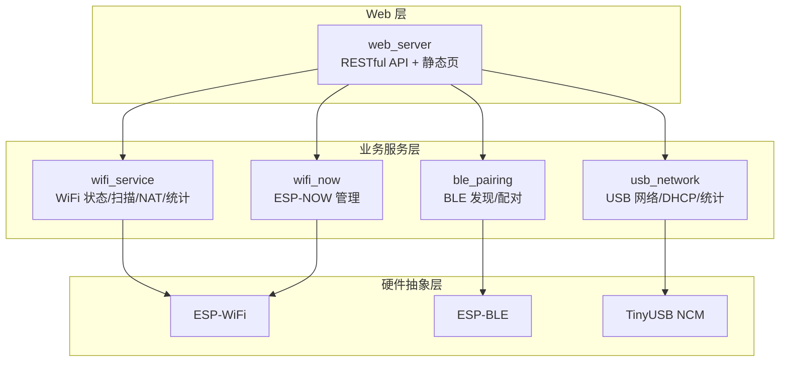
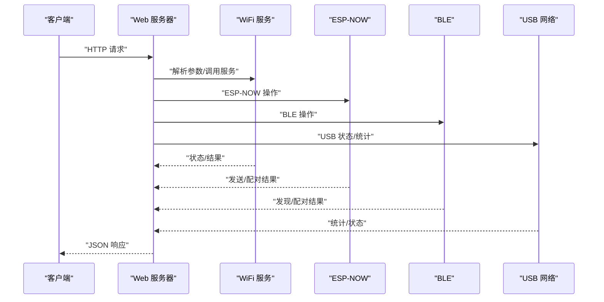
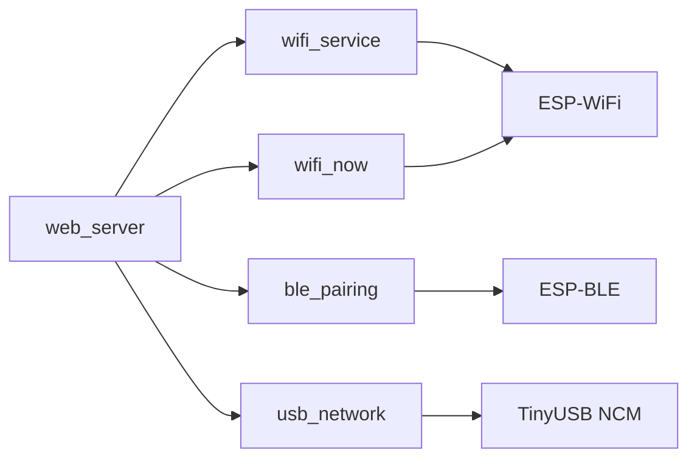

# Web API

<cite>
**本文引用的文件**
- [web_server.cpp](file://main/web_server.cpp)
- [web_server.h](file://main/web_server.h)
- [wifi_service.cpp](file://main/wifi_service.cpp)
- [wifi_service.h](file://main/wifi_service.h)
- [wifi_now.c](file://main/wifi_now.c)
- [wifi_now.h](file://main/wifi_now.h)
- [ble_pairing.c](file://main/ble_pairing.c)
- [ble_pairing.h](file://main/ble_pairing.h)
- [usb_network.cpp](file://main/usb_network.cpp)
- [usb_network.h](file://main/usb_network.h)
- [ESP_NOW_WiFi_API_Specification.md](file://docs/ESP_NOW_WiFi_API_Specification.md)
- [ESP_NOW_BLE_Discovery_Specification.md](file://docs/ESP_NOW_BLE_Discovery_Specification.md)
- [ESP_NOW_BLE_Quick_Reference_CN.md](file://docs/ESP_NOW_BLE_Quick_Reference_CN.md)
</cite>

## 目录
1. [简介](#简介)
2. [项目结构](#项目结构)
3. [核心组件](#核心组件)
4. [架构总览](#架构总览)
5. [详细组件分析](#详细组件分析)
6. [依赖关系分析](#依赖关系分析)
7. [性能考量](#性能考量)
8. [故障排查指南](#故障排查指南)
9. [结论](#结论)
10. [附录](#附录)

## 简介
本文件为 ESP32-S3 WiFi 管理器的 Web API 参考文档，覆盖以下能力：
- WiFi 状态查询与配置（STA/AP 模式切换、热点启停、密码保存）
- DHCP 客户端列表查询
- BLE 发现与配对（自动/手动）
- ESP-NOW 节点管理（配对、解绑、消息收发、广播）
- USB 网络状态与统计
- Web 服务器路由机制、中间件处理与安全考虑
- API 版本管理、缓存策略与性能优化建议

## 项目结构
项目采用模块化设计，核心模块包括：
- Web 服务器：基于 ESP-IDF httpd，提供 RESTful API 与静态页面
- WiFi 服务：STA/AP 模式管理、扫描、NAT、流量统计
- ESP-NOW：点对点通信、配对/解绑、消息模板
- BLE：BLE 广播与扫描、自动配对
- USB 网络：TinyUSB NCM 网卡、DHCP 服务、统计计数

图表来源
- [web_server.cpp:1-2350](file://main/web_server.cpp#L1-L2350)
- [wifi_service.cpp:1-1105](file://main/wifi_service.cpp#L1-L1105)
- [wifi_now.c:1-862](file://main/wifi_now.c#L1-L862)
- [ble_pairing.c:1-487](file://main/ble_pairing.c#L1-L487)
- [usb_network.cpp:1-312](file://main/usb_network.cpp#L1-L312)

章节来源
- [web_server.h:1-22](file://main/web_server.h#L1-L22)
- [wifi_service.h:1-99](file://main/wifi_service.h#L1-L99)
- [wifi_now.h:1-113](file://main/wifi_now.h#L1-L113)
- [ble_pairing.h:1-55](file://main/ble_pairing.h#L1-L55)
- [usb_network.h:1-22](file://main/usb_network.h#L1-L22)

## 核心组件
- Web 服务器
  - 提供 HTTP RESTful API 与静态 HTML 页面
  - 负责路由分发、参数解析、JSON 响应生成
- WiFi 服务
  - 管理 STA/AP 模式、热点配置、NAT 共享、RSSI/吞吐统计
  - 提供扫描、DHCP 客户端查询、状态导出
- ESP-NOW
  - 管理 peer 列表、通道、消息模板、配对/解绑消息处理
  - 提供单播/广播发送接口
- BLE
  - BLE 广播与扫描，自动配对/解绑，设备发现列表
- USB 网络
  - TinyUSB NCM 网卡、DHCP 服务器、统计计数

章节来源
- [web_server.cpp:1-2350](file://main/web_server.cpp#L1-L2350)
- [wifi_service.cpp:1-1105](file://main/wifi_service.cpp#L1-L1105)
- [wifi_now.c:1-862](file://main/wifi_now.c#L1-L862)
- [ble_pairing.c:1-487](file://main/ble_pairing.c#L1-L487)
- [usb_network.cpp:1-312](file://main/usb_network.cpp#L1-L312)

## 架构总览
Web API 的典型调用链：浏览器/客户端 → Web 服务器 → 业务服务层 → 硬件抽象层。

图表来源
- [web_server.cpp:1-2350](file://main/web_server.cpp#L1-L2350)
- [wifi_service.cpp:1-1105](file://main/wifi_service.cpp#L1-L1105)
- [wifi_now.c:1-862](file://main/wifi_now.c#L1-L862)
- [ble_pairing.c:1-487](file://main/ble_pairing.c#L1-L487)
- [usb_network.cpp:1-312](file://main/usb_network.cpp#L1-L312)

## 详细组件分析

### Web 服务器与路由机制
- 路由分发：根据路径匹配到具体处理函数，统一设置 Content-Type 与缓存头
- 中间件：全局缓存控制、跨域、内容类型设置
- 静态页面：根路径返回 HTML 控制台，内嵌 JS 与 API 调用逻辑
- 安全考虑：当前实现未内置认证/授权；生产环境建议增加 Basic/Digest 认证、HTTPS、CSRF 保护

章节来源
- [web_server.cpp:30-800](file://main/web_server.cpp#L30-L800)
- [web_server.h:11-22](file://main/web_server.h#L11-L22)

### WiFi 管理 API
- 端点
  - GET /api/wifi/status
    - 功能：返回 WiFi 模式、STA/AP 状态、IP、RSSI、各接口吞吐
    - 请求：无
    - 响应：JSON，字段见 WiFiStatus 定义
  - POST /api/wifi/connect
    - 功能：保存并连接指定 SSID/密码
    - 请求体：application/x-www-form-urlencoded，字段 ssid/password
    - 响应：JSON，success/message
  - POST /api/wifi/ap/start
    - 功能：启动 AP（SSID/密码）
    - 请求体：application/x-www-form-urlencoded，字段 ssid/password
    - 响应：JSON，success
  - POST /api/wifi/ap/stop
    - 功能：停止 AP
    - 请求：无
    - 响应：JSON，success
  - GET /api/wifi/scan
    - 功能：扫描可用网络（轮询直到完成）
    - 查询：无
    - 响应：JSON，scanning/results
  - GET /api/dhcp/clients
    - 功能：返回 DHCP 分配的客户端列表（AP/USB）
    - 响应：JSON 数组，每项含 source/mac/ip

- 参数校验与错误响应
  - 密码长度至少 8
  - 连接失败返回 message 字段
  - 扫描期间返回 scanning:true

- 使用示例（概念性）
  - 获取状态：curl http://192.168.4.1/api/wifi/status
  - 连接 WiFi：curl -X POST http://192.168.4.1/api/wifi/connect -H "Content-Type: application/x-www-form-urlencoded" -d "ssid=MySSID&password=MyPass"
  - 启动热点：curl -X POST http://192.168.4.1/api/wifi/ap/start -H "Content-Type: application/x-www-form-urlencoded" -d "ssid=ESP32-AP&password=12345678"

章节来源
- [web_server.cpp:1-2350](file://main/web_server.cpp#L1-L2350)
- [wifi_service.h:46-63](file://main/wifi_service.h#L46-L63)
- [wifi_service.cpp:705-780](file://main/wifi_service.cpp#L705-L780)

### BLE 发现与配对 API
- 端点
  - GET /api/ble/status
    - 功能：查询 BLE 广播/扫描状态
    - 响应：JSON，advertising/scanning
  - POST /api/ble/advertise
    - 功能：开始/停止 BLE 广播（enable=0/1）
    - 请求体：application/x-www-form-urlencoded，字段 enable/name
    - 响应：JSON，success
  - POST /api/ble/scan
    - 功能：开始 BLE 扫描（自动配对）
    - 请求：无
    - 响应：JSON，success
  - GET /api/ble/devices
    - 功能：获取扫描到的设备列表
    - 响应：JSON，devices（含 name/rssi/now_mac/index）

- 参数校验与错误响应
  - enable 仅允许 0/1
  - 设备列表为空时返回 scanning 状态

- 使用示例（概念性）
  - 开始广播：curl -X POST http://192.168.4.1/api/ble/advertise -H "Content-Type: application/x-www-form-urlencoded" -d "enable=1&name=ESP32-S3-NOW"
  - 扫描设备：curl -X POST http://192.168.4.1/api/ble/scan
  - 获取设备：curl http://192.168.4.1/api/ble/devices

章节来源
- [web_server.cpp:1-2350](file://main/web_server.cpp#L1-L2350)
- [ble_pairing.h:29-55](file://main/ble_pairing.h#L29-L55)
- [ble_pairing.c:317-487](file://main/ble_pairing.c#L317-L487)

### ESP-NOW 管理 API
- 端点
  - GET /api/espnow/master
    - 功能：获取主机 ESP-NOW MAC 与当前信道
    - 响应：JSON，mac/channel
  - GET /api/now/mac
    - 功能：获取本机 ESP-NOW MAC（BLE）
    - 响应：JSON，mac
  - GET /api/now/peers
    - 功能：获取已配对节点列表
    - 响应：JSON，peers[]
  - POST /api/now/peer/remove
    - 功能：移除指定节点
    - 请求体：JSON，字段 mac
    - 响应：JSON，success
  - POST /api/espnow/unpair
    - 功能：解绑指定节点（双向删除并通知）
    - 请求体：JSON，字段 mac
    - 响应：JSON，success
  - POST /api/espnow/send
    - 功能：向指定节点发送数据（hex 编码）
    - 请求体：JSON，字段 mac,data
    - 响应：JSON，success,sent
  - POST /api/espnow/broadcast
    - 功能：向所有已配对节点广播（hex 编码）
    - 请求体：JSON，字段 data
    - 响应：JSON，success,sent

- 参数校验与错误响应
  - data 为 hex 字符串，长度 ≤ 500（对应 250 字节上限）
  - mac 格式为 XX:XX:XX:XX:XX:XX
  - 发送成功仅表示入队成功，实际投递状态通过回调通知

- 使用示例（概念性）
  - 发送数据：curl -X POST http://192.168.4.1/api/espnow/send -H "Content-Type: application/json" -d '{"mac":"AA:BB:CC:DD:EE:FF","data":"48656c6c6f"}'
  - 广播：curl -X POST http://192.168.4.1/api/espnow/broadcast -H "Content-Type: application/json" -d '{"data":"48656c6c6f"}'

章节来源
- [web_server.cpp:1-2350](file://main/web_server.cpp#L1-L2350)
- [wifi_now.h:58-113](file://main/wifi_now.h#L58-L113)
- [wifi_now.c:422-536](file://main/wifi_now.c#L422-L536)
- [ESP_NOW_WiFi_API_Specification.md:142-653](file://docs/ESP_NOW_WiFi_API_Specification.md#L142-L653)

### 系统状态与重启 API
- 端点
  - POST /api/restart
    - 功能：重启设备
    - 响应：JSON，success

- 使用示例（概念性）
  - 重启：curl -X POST http://192.168.4.1/api/restart

章节来源
- [web_server.cpp:1-2350](file://main/web_server.cpp#L1-L2350)

### 数据模型与 JSON 结构
- WiFiStatus（状态导出）
  - 字段：mode/sta_ssid/sta_password/sta_state/sta_ip/sta_rssi/ap_ssid/ap_password/ap_active/ap_clients/sta_down_bps/sta_up_bps/ap_down_bps/ap_up_bps/usb_down_bps/usb_up_bps
- DHCP 客户端
  - 字段：source/mac/ip（source: ap/usb）
- ESP-NOW Peer
  - 字段：mac/channel/name/type
- BLE 设备
  - 字段：name/rssi/now_mac/index

章节来源
- [wifi_service.h:46-63](file://main/wifi_service.h#L46-L63)
- [wifi_now.h:40-50](file://main/wifi_now.h#L40-L50)
- [ble_pairing.h:22-27](file://main/ble_pairing.h#L22-L27)

## 依赖关系分析
- Web 服务器依赖
  - wifi_service：状态查询、扫描、AP 控制、DHCP 客户端
  - wifi_now：ESP-NOW 管理、消息发送/广播
  - ble_pairing：BLE 广播/扫描、自动配对
  - usb_network：USB 统计、DHCP 状态
- 业务服务层内部耦合
  - wifi_service 与 usb_network 通过 LwIP/NAPT 协作实现共享
  - wifi_now 与 ble_pairing 通过配对消息实现自动添加 peer
- 外部依赖
  - ESP-IDF httpd、ESP-WiFi、ESP-BLE、TinyUSB

图表来源
- [web_server.cpp:1-2350](file://main/web_server.cpp#L1-L2350)
- [wifi_service.cpp:1-1105](file://main/wifi_service.cpp#L1-L1105)
- [wifi_now.c:1-862](file://main/wifi_now.c#L1-L862)
- [ble_pairing.c:1-487](file://main/ble_pairing.c#L1-L487)
- [usb_network.cpp:1-312](file://main/usb_network.cpp#L1-L312)

## 性能考量
- 缓存策略
  - 根路径返回 HTML 时设置 no-cache/no-store/must-revalidate，确保前端实时获取最新状态
  - 建议在客户端对频繁查询的状态进行本地缓存与去抖（如扫描/状态轮询）
- 吞吐统计
  - 服务端定时器周期性采集各接口 RX/TX 字节，计算 BPS，避免每次请求重复计算
- 并发与阻塞
  - Web 服务器为单线程/多任务模型，建议将耗时操作（扫描、配对）放入队列/任务中执行
- 网络栈
  - NAT 与 DHCP 由 LwIP/TinyUSB 驱动，注意内存与中断处理开销

章节来源
- [web_server.cpp:30-800](file://main/web_server.cpp#L30-L800)
- [wifi_service.cpp:207-229](file://main/wifi_service.cpp#L207-L229)
- [usb_network.cpp:1-312](file://main/usb_network.cpp#L1-L312)

## 故障排查指南
- WiFi 连接失败
  - 检查密码长度（≥8）
  - 查看返回 message 字段
  - 确认 AP 信道与设备兼容
- ESP-NOW 无法收发
  - 确认双方 PMK 一致（固定值）
  - 确认双方在同一信道
  - 确认双方 peer 已互相添加且 encrypt=false
  - 确认 data 为合法 hex 字符串且长度 ≤ 250 字节
- BLE 自动配对无效
  - 确认 BLE 广播/扫描已启动
  - 确认设备名与 MAC 能被正确解析
  - 检查自动配对开关状态
- USB 网络异常
  - 检查 USB 是否连接、驱动是否加载
  - 观察 TX 失败计数与 link-down 状态

章节来源
- [ESP_NOW_WiFi_API_Specification.md:27-88](file://docs/ESP_NOW_WiFi_API_Specification.md#L27-L88)
- [ESP_NOW_BLE_Discovery_Specification.md:788-800](file://docs/ESP_NOW_BLE_Discovery_Specification.md#L788-L800)
- [ble_pairing.c:362-426](file://main/ble_pairing.c#L362-L426)
- [usb_network.cpp:41-91](file://main/usb_network.cpp#L41-L91)

## 结论
本 Web API 提供了完整的 WiFi、BLE、ESP-NOW、USB 管理能力，具备良好的模块化与扩展性。生产部署建议补充认证、HTTPS、限流与审计日志，以提升安全性与稳定性。

## 附录

### API 端点一览（按功能分类）
- WiFi 管理
  - GET /api/wifi/status
  - POST /api/wifi/connect
  - POST /api/wifi/ap/start
  - POST /api/wifi/ap/stop
  - GET /api/wifi/scan
  - GET /api/dhcp/clients
- BLE 管理
  - GET /api/ble/status
  - POST /api/ble/advertise
  - POST /api/ble/scan
  - GET /api/ble/devices
- ESP-NOW 管理
  - GET /api/espnow/master
  - GET /api/now/mac
  - GET /api/now/peers
  - POST /api/now/peer/remove
  - POST /api/espnow/unpair
  - POST /api/espnow/send
  - POST /api/espnow/broadcast
- 系统
  - POST /api/restart

章节来源
- [web_server.cpp:1-2350](file://main/web_server.cpp#L1-L2350)
- [ESP_NOW_WiFi_API_Specification.md:142-168](file://docs/ESP_NOW_WiFi_API_Specification.md#L142-L168)