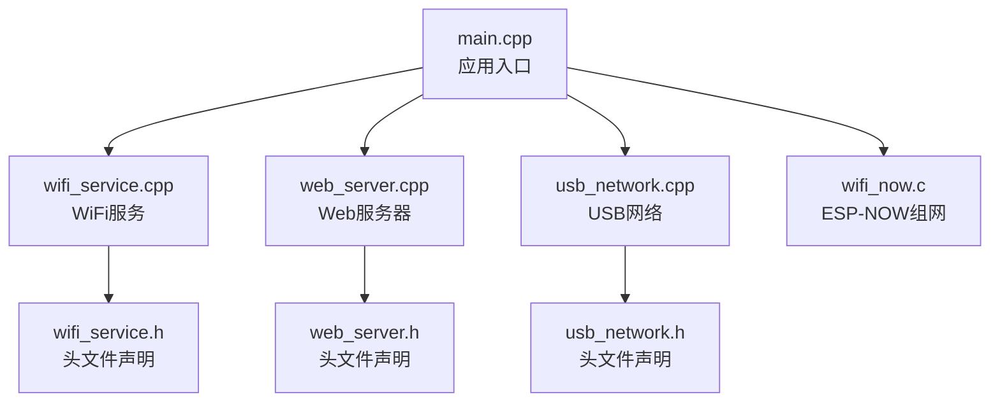
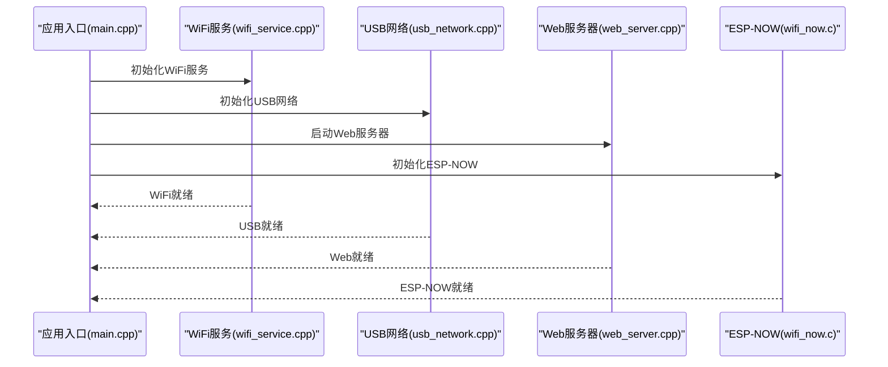
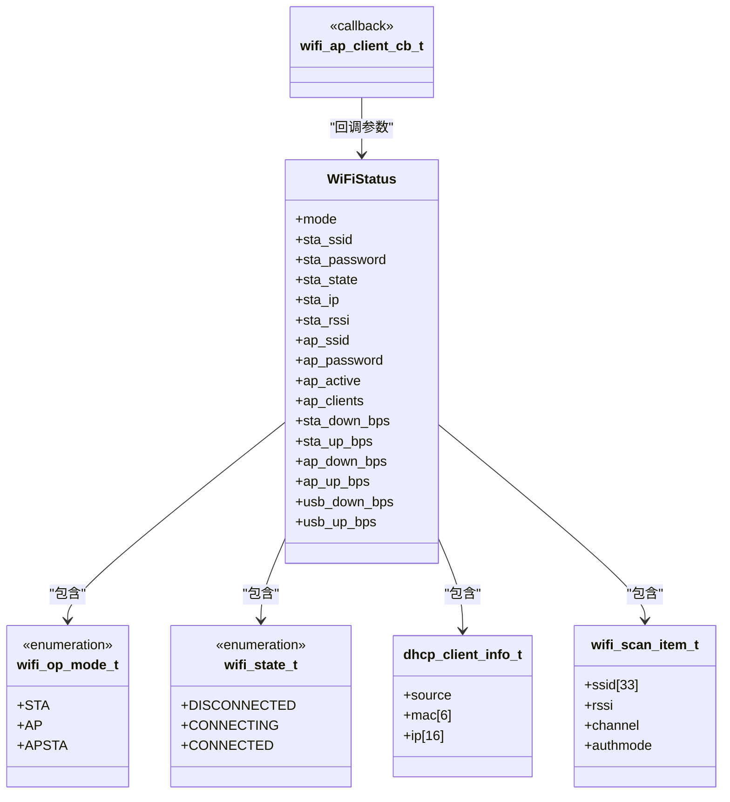
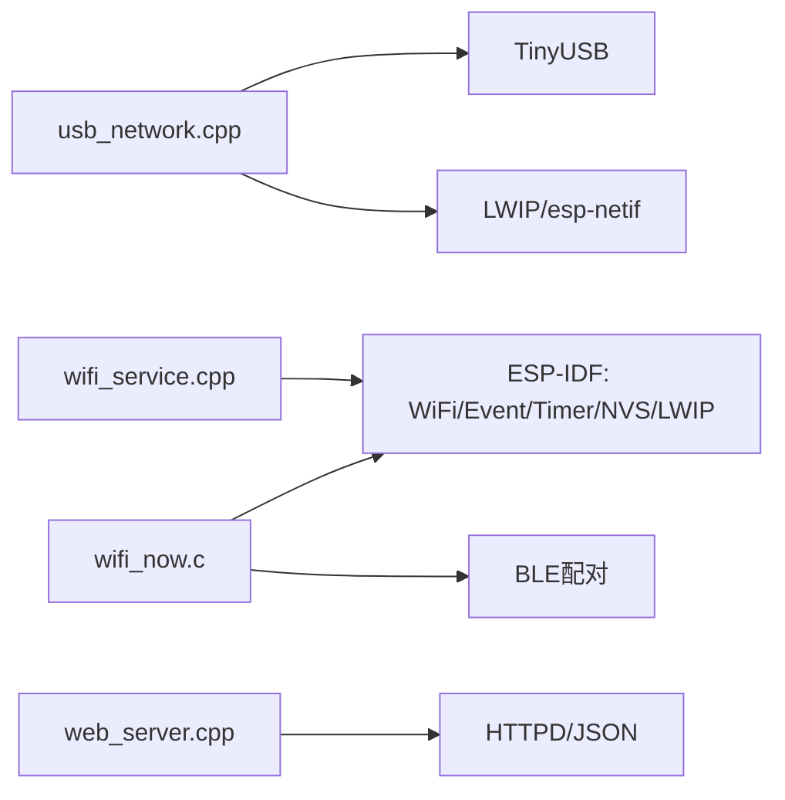

# WiFi API

<cite>
**本文引用的文件**
- [main/wifi_service.h](file://main/wifi_service.h)
- [main/wifi_service.cpp](file://main/wifi_service.cpp)
- [main/web_server.h](file://main/web_server.h)
- [main/web_server.cpp](file://main/web_server.cpp)
- [main/usb_network.h](file://main/usb_network.h)
- [main/usb_network.cpp](file://main/usb_network.cpp)
- [main/main.cpp](file://main/main.cpp)
- [docs/ESP_NOW_WiFi_API_Specification.md](file://docs/ESP_NOW_WiFi_API_Specification.md)
</cite>

## 目录
1. [简介](#简介)
2. [项目结构](#项目结构)
3. [核心组件](#核心组件)
4. [架构总览](#架构总览)
5. [详细组件分析](#详细组件分析)
6. [依赖关系分析](#依赖关系分析)
7. [性能考量](#性能考量)
8. [故障排查指南](#故障排查指南)
9. [结论](#结论)
10. [附录](#附录)

## 简介
本文件为 ESP32-S3 WiFi API 的详细参考文档，覆盖 WiFi 连接管理、扫描、状态查询、DHCP 客户端管理、吞吐量统计、ESP-NOW 组网能力以及线程安全与性能优化建议。文档面向不同技术背景的读者，既提供高层概览，也给出代码级的结构与流程图示，帮助快速理解与正确使用 API。

## 项目结构
该项目采用模块化设计，核心由以下模块组成：
- WiFi 服务模块：负责 WiFi 连接、断开、扫描、状态查询、DHCP 客户端管理、吞吐量统计、AP 模式管理等。
- USB 网络模块：通过 TinyUSB 提供 USB CDC/NCM 网络适配，实现 USB 到以太网桥接。
- Web 服务器模块：提供 HTTP API 与前端页面，用于 WiFi 状态查看、扫描、连接、AP 启停、DHCP 客户端列表等。
- 主入口：应用启动顺序初始化 WiFi、USB、Web 服务器、ESP-NOW、BLE 等子系统。

图表来源
- [main/main.cpp:19-81](file://main/main.cpp#L19-L81)
- [main/wifi_service.cpp:604-703](file://main/wifi_service.cpp#L604-L703)
- [main/web_server.cpp:1147-1154](file://main/web_server.cpp#L1147-L1154)
- [main/usb_network.cpp:191-290](file://main/usb_network.cpp#L191-L290)

章节来源
- [main/main.cpp:19-81](file://main/main.cpp#L19-L81)

## 核心组件
- WiFi 服务接口：提供连接、断开、扫描、状态查询、AP 启停、模式切换、DHCP 客户端管理、吞吐量统计等。
- USB 网络接口：提供 USB 网络初始化、网卡句柄获取、重连、累计收发字节统计。
- Web 服务器接口：提供 HTTP API 与前端页面，用于状态查询、扫描、连接、AP 启停、DHCP 客户端列表等。
- ESP-NOW 组网接口：提供配对、解绑、消息发送/广播、消息模板管理等。

章节来源
- [main/wifi_service.h:69-93](file://main/wifi_service.h#L69-L93)
- [main/usb_network.h:12-16](file://main/usb_network.h#L12-L16)
- [main/web_server.h:11-16](file://main/web_server.h#L11-L16)

## 架构总览
WiFi API 的整体架构围绕“服务层 + 事件驱动 + 定时器 + 统计钩子”的模式构建。WiFi 服务通过 ESP-IDF 事件循环监听连接状态变化，定时器周期性更新 RSSI 与吞吐量；USB 网络通过 TinyUSB 提供 USB 到以太网桥接；Web 服务器提供 HTTP API 与前端页面；ESP-NOW 与 BLE 配对模块提供无线组网能力。

图表来源
- [main/main.cpp:25-42](file://main/main.cpp#L25-L42)
- [main/wifi_service.cpp:604-703](file://main/wifi_service.cpp#L604-L703)
- [main/usb_network.cpp:191-290](file://main/usb_network.cpp#L191-L290)
- [main/web_server.cpp:1147-1154](file://main/web_server.cpp#L1147-L1154)

## 详细组件分析

### WiFi 服务接口与数据结构
- WiFiStatus 结构体：封装 STA/AP 当前状态、IP、RSSI、客户端数量、各接口吞吐量等。
- WiFiState 枚举：断开、连接中、已连接。
- WiFiMode 枚举：STA、AP、AP+STA。
- DHCP 客户端信息结构体：来源（AP/USB）、MAC、IP。
- 扫描结果项结构体：SSID、RSSI、信道、认证方式。
- 回调类型：AP 客户端连接回调。

图表来源
- [main/wifi_service.h:33-63](file://main/wifi_service.h#L33-L63)
- [main/wifi_service.h:16-26](file://main/wifi_service.h#L16-L26)
- [main/wifi_service.h:28-31](file://main/wifi_service.h#L28-L31)
- [main/wifi_service.h:65](file://main/wifi_service.h#L65)

章节来源
- [main/wifi_service.h:16-63](file://main/wifi_service.h#L16-L63)

#### 连接管理接口
- 连接：wifi_service_connect(ssid, password)
- 断开：wifi_service_disconnect()
- 保存配置：wifi_service_save_config(ssid, password)
- 是否存在配置：wifi_service_has_config()
- 启动 AP：wifi_service_start_ap(ssid, password)
- 停止 AP：wifi_service_stop_ap()
- 是否 AP 活跃：wifi_service_is_ap_active()
- 获取 AP 配置：wifi_service_get_ap_config(ssid, ssid_len, password, pass_len)
- 设置模式：wifi_service_set_mode(mode)
- 获取模式：wifi_service_get_mode()

章节来源
- [main/wifi_service.h:70-88](file://main/wifi_service.h#L70-L88)
- [main/wifi_service.cpp:705-737](file://main/wifi_service.cpp#L705-L737)
- [main/wifi_service.cpp:739-762](file://main/wifi_service.cpp#L739-L762)
- [main/wifi_service.cpp:764-800](file://main/wifi_service.cpp#L764-L800)
- [main/wifi_service.cpp:801-849](file://main/wifi_service.cpp#L801-L849)
- [main/wifi_service.cpp:850-866](file://main/wifi_service.cpp#L850-L866)
- [main/wifi_service.cpp:867-873](file://main/wifi_service.cpp#L867-L873)
- [main/wifi_service.cpp:874-880](file://main/wifi_service.cpp#L874-L880)
- [main/wifi_service.cpp:881-887](file://main/wifi_service.cpp#L881-L887)
- [main/wifi_service.cpp:888-893](file://main/wifi_service.cpp#L888-L893)

#### 扫描与状态查询接口
- 扫描：wifi_service_scan(items, max_count)
- 开始扫描：wifi_service_scan_start()
- 扫描结果 JSON：wifi_service_get_scan_json(buffer, buffer_size)
- 获取状态：wifi_service_get_status(status)
- 获取状态 JSON：wifi_service_get_status_json(buffer, buffer_size)
- 获取 DHCP 客户端：wifi_service_get_dhcp_clients(clients, max_count)
- 获取 DHCP 客户端 JSON：wifi_service_get_dhcp_clients_json(buffer, buffer_size)

章节来源
- [main/wifi_service.h:79-81](file://main/wifi_service.h#L79-L81)
- [main/wifi_service.h:74-77](file://main/wifi_service.h#L74-L77)
- [main/wifi_service.cpp:1002-1036](file://main/wifi_service.cpp#L1002-L1036)
- [main/wifi_service.cpp:1038-1060](file://main/wifi_service.cpp#L1038-L1060)
- [main/wifi_service.cpp:902-914](file://main/wifi_service.cpp#L902-L914)
- [main/wifi_service.cpp:916-963](file://main/wifi_service.cpp#L916-L963)
- [main/wifi_service.cpp:965-975](file://main/wifi_service.cpp#L965-L975)
- [main/wifi_service.cpp:977-995](file://main/wifi_service.cpp#L977-L995)

#### 线程安全与内部机制
- 互斥量：s_status_mutex 保护 WiFi 状态；s_dhcp_mutex 保护 DHCP 客户端列表。
- 事件组：s_wifi_events 用于连接事件通知。
- 定时器：s_rssi_timer 每 3 秒更新 RSSI；s_stats_timer 每 1 秒计算吞吐量。
- 命令队列与任务：s_cmd_queue + cmd_task 提供异步命令派发，避免阻塞调用。
- 网卡钩子：安装 netif hook 统计 STA/AP 的上下行字节。

```mermaid
flowchart TD
Start(["进入函数"]) --> Lock["获取互斥量"]
Lock --> CheckParam{"参数有效?"}
CheckParam --> |否| ReturnErr["返回错误/无效"]
CheckParam --> |是| DoWork["执行业务逻辑"]
DoWork --> UpdateStats["更新内部状态/统计数据"]
UpdateStats --> Unlock["释放互斥量"]
Unlock --> End(["返回"])
ReturnErr --> End
```

图表来源
- [main/wifi_service.cpp:183-198](file://main/wifi_service.cpp#L183-L198)
- [main/wifi_service.cpp:207-229](file://main/wifi_service.cpp#L207-L229)
- [main/wifi_service.cpp:118-144](file://main/wifi_service.cpp#L118-L144)

章节来源
- [main/wifi_service.cpp:52-65](file://main/wifi_service.cpp#L52-L65)
- [main/wifi_service.cpp:183-229](file://main/wifi_service.cpp#L183-L229)
- [main/wifi_service.cpp:118-144](file://main/wifi_service.cpp#L118-L144)

### USB 网络模块
- 初始化：usb_network_init()
- 获取网卡：usb_network_get_netif()
- 重连：usb_network_reconnect()
- 累计 RX/TX：usb_network_get_rx_total(), usb_network_get_tx_total()

章节来源
- [main/usb_network.h:12-16](file://main/usb_network.h#L12-L16)
- [main/usb_network.cpp:191-290](file://main/usb_network.cpp#L191-L290)
- [main/usb_network.cpp:304-312](file://main/usb_network.cpp#L304-L312)

### Web 服务器与 HTTP API
- 状态查询：GET /api/wifi/status
- 扫描：GET /api/wifi/scan
- 连接：POST /api/wifi/connect
- AP 启停：POST /api/wifi/ap/start, POST /api/wifi/ap/stop
- DHCP 客户端：GET /api/dhcp/clients
- 其他 API：BLE、ESP-NOW 等（详见文档）

章节来源
- [main/web_server.cpp:1147-1154](file://main/web_server.cpp#L1147-L1154)
- [main/web_server.cpp:524-580](file://main/web_server.cpp#L524-L580)
- [main/web_server.cpp:588-601](file://main/web_server.cpp#L588-L601)
- [main/web_server.cpp:603-622](file://main/web_server.cpp#L603-L622)
- [main/web_server.cpp:499-515](file://main/web_server.cpp#L499-L515)

### ESP-NOW 组网接口（补充）
- 初始化/反初始化：wifi_now_init(), wifi_now_deinit()
- 状态查询：wifi_now_get_state()
- Peer 管理：添加/移除/清空/获取列表
- 消息发送/广播：wifi_now_send(), wifi_now_broadcast()
- 消息模板：添加/更新/删除/获取
- 配对/解绑：wifi_now_send_pair_request(), wifi_now_unpair_with_peer()

章节来源
- [docs/ESP_NOW_WiFi_API_Specification.md:142-167](file://docs/ESP_NOW_WiFi_API_Specification.md#L142-L167)
- [docs/ESP_NOW_WiFi_API_Specification.md:301-395](file://docs/ESP_NOW_WiFi_API_Specification.md#L301-L395)
- [docs/ESP_NOW_WiFi_API_Specification.md:467-523](file://docs/ESP_NOW_WiFi_API_Specification.md#L467-L523)
- [docs/ESP_NOW_WiFi_API_Specification.md:526-652](file://docs/ESP_NOW_WiFi_API_Specification.md#L526-L652)

## 依赖关系分析
- WiFi 服务依赖 ESP-IDF 的 WiFi、事件、定时器、NVS、LWIP 等组件。
- USB 网络依赖 TinyUSB、LWIP、esp-netif。
- Web 服务器依赖 HTTPD、JSON 序列化。
- ESP-NOW 依赖 ESP-IDF 的 ESP-NOW、BLE 配对模块。

图表来源
- [main/wifi_service.cpp:1-19](file://main/wifi_service.cpp#L1-L19)
- [main/usb_network.cpp:1-16](file://main/usb_network.cpp#L1-L16)
- [main/web_server.cpp:1-13](file://main/web_server.cpp#L1-L13)

章节来源
- [main/wifi_service.cpp:1-19](file://main/wifi_service.cpp#L1-L19)
- [main/usb_network.cpp:1-16](file://main/usb_network.cpp#L1-L16)
- [main/web_server.cpp:1-13](file://main/web_server.cpp#L1-L13)

## 性能考量
- 定时器周期：RSSI 每 3 秒更新一次，吞吐量每 1 秒计算一次，兼顾实时性与 CPU 开销。
- 统计钩子：通过 netif hook 记录上下行字节，避免轮询带来的额外开销。
- 事件驱动：WiFi 事件与 IP 事件通过事件循环处理，减少轮询。
- 内存与堆：USB 网络模块在接收路径进行内存分配，注意堆空间与 OOM 处理。
- 扫描策略：主动扫描配置最小/最大时间，避免长时间占用 RF。

章节来源
- [main/wifi_service.cpp:30-32](file://main/wifi_service.cpp#L30-L32)
- [main/wifi_service.cpp:207-229](file://main/wifi_service.cpp#L207-L229)
- [main/usb_network.cpp:30-34](file://main/usb_network.cpp#L30-L34)
- [main/wifi_service.cpp:1020-1036](file://main/wifi_service.cpp#L1020-L1036)

## 故障排查指南
- WiFi 连接失败：检查 SSID/密码长度、认证方式、扫描结果与 RSSI。
- AP 启动失败：确认模式设置、密码长度、DHCP 选项、NAPT 状态。
- USB 网络不可达：检查 USB 设备枚举、TinyUSB 初始化、DHCP 重启、链路状态。
- Web 页面无法访问：确认 HTTP 服务器启动、端口开放、路由可达。
- ESP-NOW 无法通信：核对 PMK、信道、encrypt、双向 peer 添加、回调注册。

章节来源
- [main/wifi_service.cpp:416-595](file://main/wifi_service.cpp#L416-L595)
- [main/usb_network.cpp:152-188](file://main/usb_network.cpp#L152-L188)
- [docs/ESP_NOW_WiFi_API_Specification.md:787-800](file://docs/ESP_NOW_WiFi_API_Specification.md#L787-L800)

## 结论
本 WiFi API 提供了完整的 WiFi 连接管理、扫描、状态查询、AP 管理、DHCP 客户端统计与吞吐量监控能力，并通过 Web 服务器与前端页面提供直观的操作界面。结合 USB 网络与 ESP-NOW 组网能力，形成“USB 管理 + WiFi 连接 + 无线组网”的综合解决方案。遵循线程安全与性能优化建议，可在资源受限的嵌入式环境中稳定运行。

## 附录

### 函数与参数说明（摘要）
- wifi_service_connect(const char* ssid, const char* password)
  - 参数：ssid、password
  - 返回：无
  - 错误：若未启用 STA 模式则不生效
- wifi_service_disconnect()
  - 参数：无
  - 返回：无
  - 错误：若未启用 STA 模式则忽略
- wifi_service_save_config(const char* ssid, const char* password)
  - 参数：ssid、password
  - 返回：无
  - 错误：NVS 写入失败
- wifi_service_has_config()
  - 参数：无
  - 返回：是否存在保存的配置
- wifi_service_set_mode(wifi_op_mode_t mode)
  - 参数：模式（STA/AP/APSTA）
  - 返回：无
  - 错误：模式切换失败
- wifi_service_start_ap(const char* ssid, const char* password)
  - 参数：ssid、password
  - 返回：无
  - 错误：AP 启动失败
- wifi_service_stop_ap()
  - 参数：无
  - 返回：无
  - 错误：AP 停止失败
- wifi_service_scan_start()
  - 参数：无
  - 返回：无
  - 错误：STA 模式不可用或扫描失败
- wifi_service_get_status_json(char* buffer, size_t buffer_size)
  - 参数：缓冲区指针与大小
  - 返回：JSON 字符串
  - 错误：无（内部使用互斥量保护）
- wifi_service_get_dhcp_clients_json(char* buffer, size_t buffer_size)
  - 参数：缓冲区指针与大小
  - 返回：JSON 字符串
  - 错误：无（内部使用互斥量保护）

章节来源
- [main/wifi_service.h:70-93](file://main/wifi_service.h#L70-L93)
- [main/wifi_service.cpp:705-737](file://main/wifi_service.cpp#L705-L737)
- [main/wifi_service.cpp:739-762](file://main/wifi_service.cpp#L739-L762)
- [main/wifi_service.cpp:764-800](file://main/wifi_service.cpp#L764-L800)
- [main/wifi_service.cpp:801-849](file://main/wifi_service.cpp#L801-L849)
- [main/wifi_service.cpp:1002-1036](file://main/wifi_service.cpp#L1002-L1036)
- [main/wifi_service.cpp:916-963](file://main/wifi_service.cpp#L916-L963)
- [main/wifi_service.cpp:977-995](file://main/wifi_service.cpp#L977-L995)

### 使用示例（步骤说明）
- 初始化系统：调用 wifi_service_init()，随后初始化 USB、Web、ESP-NOW、BLE。
- 连接 WiFi：调用 wifi_service_connect(ssid, password)，或通过 Web 页面提交表单。
- 查询状态：调用 wifi_service_get_status_json() 或访问 /api/wifi/status。
- 启动 AP：调用 wifi_service_start_ap(ssid, password)，或通过 Web 页面提交表单。
- 扫描网络：调用 wifi_service_scan_start()，或通过 Web 页面点击“扫描”。
- 查看 DHCP 客户端：访问 /api/dhcp/clients。
- 统计吞吐量：从状态 JSON 中读取各接口的下行/上行 BPS。

章节来源
- [main/main.cpp:25-42](file://main/main.cpp#L25-L42)
- [main/wifi_service.cpp:604-703](file://main/wifi_service.cpp#L604-L703)
- [main/web_server.cpp:524-580](file://main/web_server.cpp#L524-L580)
- [main/web_server.cpp:1147-1154](file://main/web_server.cpp#L1147-L1154)
- [main/web_server.cpp:499-515](file://main/web_server.cpp#L499-L515)