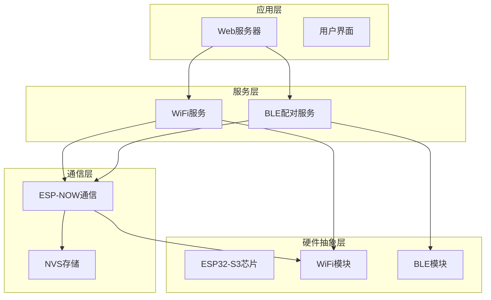
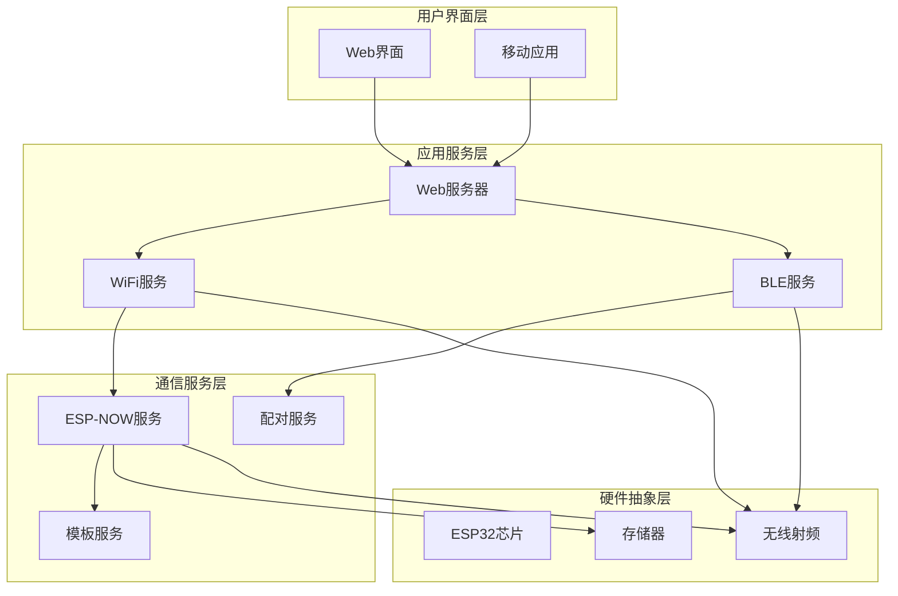
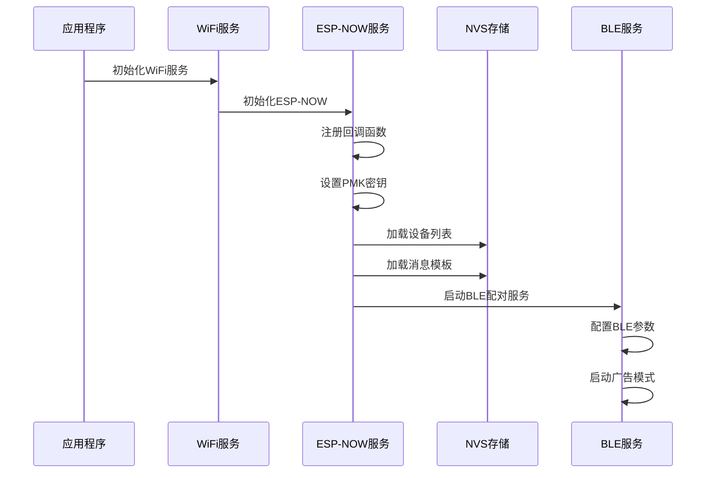
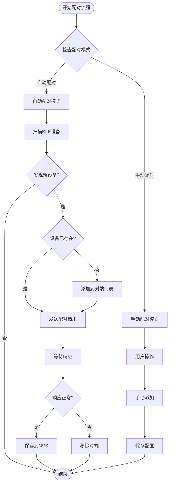
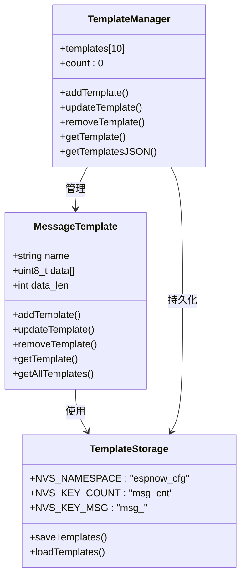
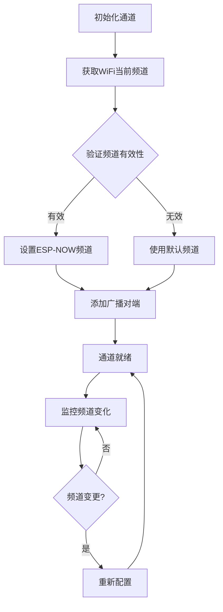
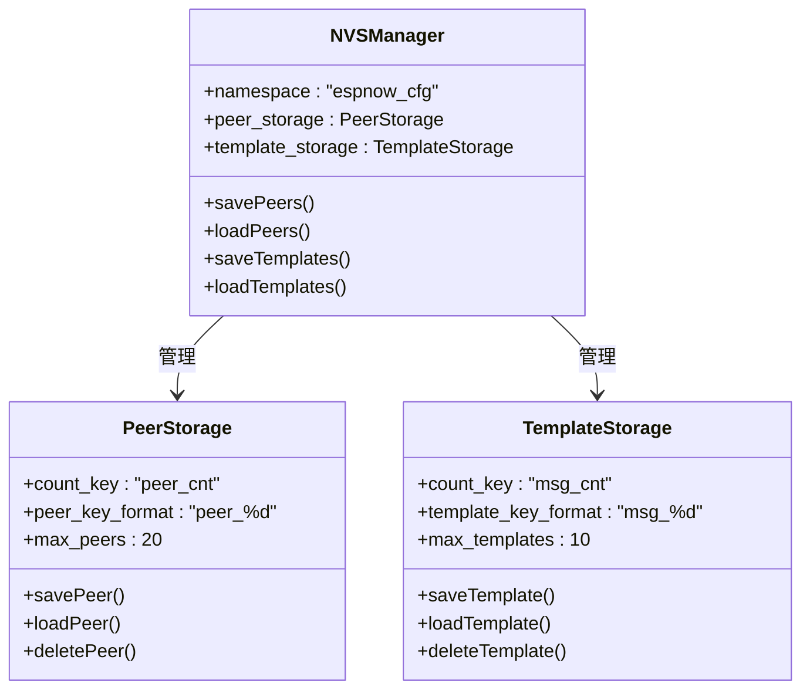
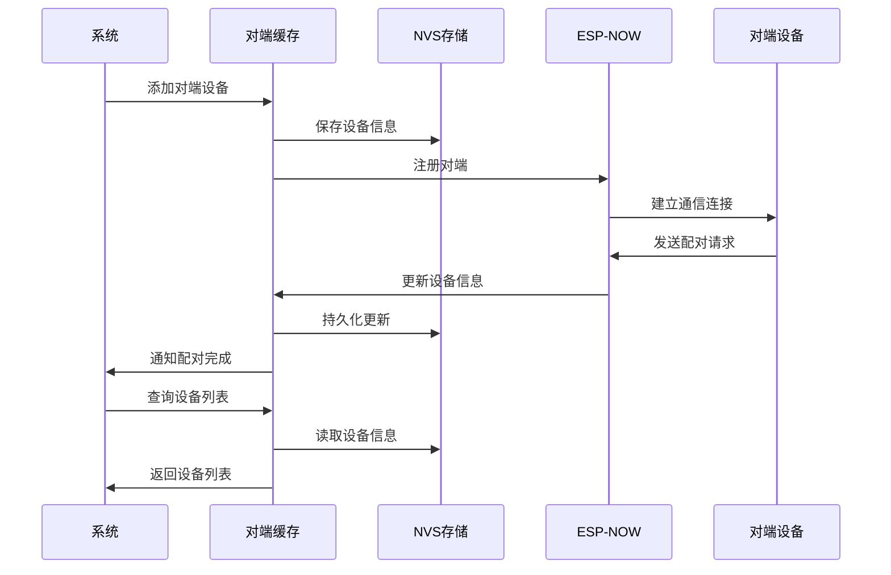
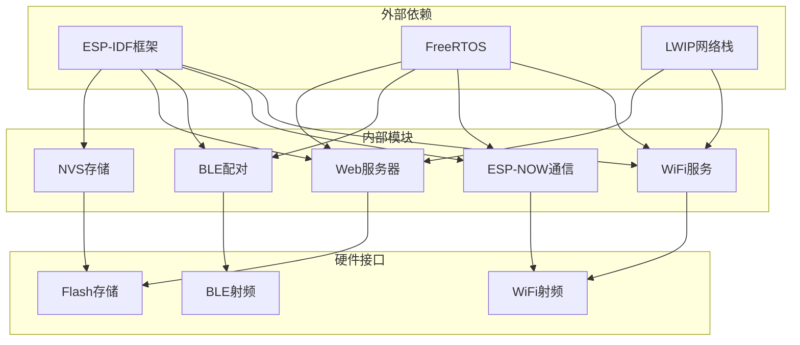
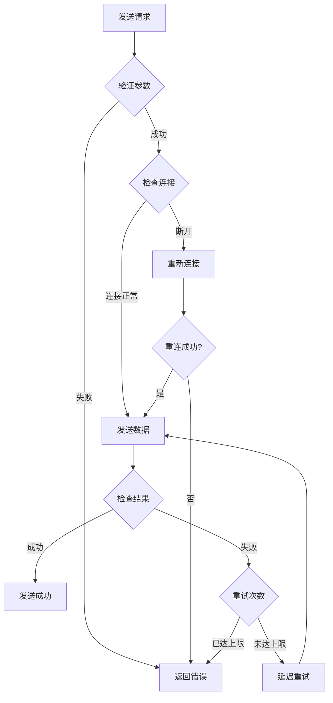

# ESP-NOW通信系统

<cite>
**本文档引用的文件**
- [wifi_now.h](file://main/wifi_now.h)
- [wifi_now.c](file://main/wifi_now.c)
- [ble_pairing.h](file://main/ble_pairing.h)
- [ble_pairing.c](file://main/ble_pairing.c)
- [main.cpp](file://main/main.cpp)
- [wifi_service.h](file://main/wifi_service.h)
- [wifi_service.cpp](file://main/wifi_service.cpp)
- [web_server.h](file://main/web_server.h)
- [web_server.cpp](file://main/web_server.cpp)
</cite>

## 目录
1. [简介](#简介)
2. [项目结构](#项目结构)
3. [核心组件](#核心组件)
4. [架构概览](#架构概览)
5. [详细组件分析](#详细组件分析)
6. [依赖关系分析](#依赖关系分析)
7. [性能考虑](#性能考虑)
8. [故障排除指南](#故障排除指南)
9. [结论](#结论)

## 简介

ESP-NOW通信系统是一个基于乐鑫ESP32-S3芯片的无线通信解决方案，集成了ESP-NOW物理层通信、BLE配对服务和Web管理界面。该系统提供了完整的点对点和广播通信能力，支持自动配对、消息模板管理和NVS持久化存储。

系统的核心特性包括：
- 基于ESP-NOW的低延迟无线通信
- 自动BLE配对机制
- 消息模板系统
- NVS非易失性存储
- Web管理界面
- 实时状态监控

## 项目结构

项目采用模块化设计，主要包含以下核心模块：

**图表来源**
- [main.cpp:19-81](file://main/main.cpp#L19-L81)
- [wifi_service.cpp:604-703](file://main/wifi_service.cpp#L604-L703)
- [ble_pairing.c:228-288](file://main/ble_pairing.c#L228-L288)

**章节来源**
- [main.cpp:19-81](file://main/main.cpp#L19-L81)
- [wifi_service.h:1-99](file://main/wifi_service.h#L1-L99)
- [web_server.h:1-22](file://main/web_server.h#L1-L22)

## 核心组件

### ESP-NOW通信核心

ESP-NOW通信模块是系统的核心，负责底层无线数据传输和设备管理。

**关键数据结构：**
- `wifi_now_peer_info_t`: 设备对端信息缓存
- `wifi_now_msg_template_t`: 消息模板定义
- `esp_now_pair_msg_t`: 配对消息格式

**主要功能：**
- 设备配对管理
- 消息发送和接收
- 通道管理
- NVS持久化

**章节来源**
- [wifi_now.h:27-50](file://main/wifi_now.h#L27-L50)
- [wifi_now.c:23-36](file://main/wifi_now.c#L23-L36)

### BLE配对服务

BLE配对服务提供自动设备发现和配对功能，通过BLE广播和扫描实现设备间的自动连接。

**核心特性：**
- BLE广告模式启动和停止
- 主动扫描和设备发现
- 自动配对策略
- 设备信息管理

**章节来源**
- [ble_pairing.h:15-27](file://main/ble_pairing.h#L15-L27)
- [ble_pairing.c:228-288](file://main/ble_pairing.c#L228-L288)

### Web管理界面

Web服务器提供完整的图形化管理界面，支持实时状态监控和配置管理。

**功能特性：**
- 实时WiFi状态显示
- BLE设备扫描和配对
- ESP-NOW设备管理
- 消息模板编辑
- 系统状态监控

**章节来源**
- [web_server.cpp:1146-1145](file://main/web_server.cpp#L1146-L1145)
- [web_server.cpp:1596-1698](file://main/web_server.cpp#L1596-L1698)

## 架构概览

系统采用分层架构设计，各层职责明确，耦合度低。

**图表来源**
- [main.cpp:19-81](file://main/main.cpp#L19-L81)
- [web_server.cpp:1146-1145](file://main/web_server.cpp#L1146-L1145)
- [wifi_service.cpp:604-703](file://main/wifi_service.cpp#L604-L703)

## 详细组件分析

### ESP-NOW通信实现

#### 初始化流程

ESP-NOW初始化过程包含多个关键步骤：

**图表来源**
- [wifi_now.c:126-192](file://main/wifi_now.c#L126-L192)
- [ble_pairing.c:228-288](file://main/ble_pairing.c#L228-L288)

#### 配对管理机制

系统实现了完整的配对管理机制，支持主动配对和自动配对两种模式：

**图表来源**
- [ble_pairing.c:182-197](file://main/ble_pairing.c#L182-L197)
- [wifi_now.c:662-712](file://main/wifi_now.c#L662-L712)

**章节来源**
- [wifi_now.c:126-192](file://main/wifi_now.c#L126-L192)
- [ble_pairing.c:182-197](file://main/ble_pairing.c#L182-L197)

#### 消息模板系统

消息模板系统提供了预定义消息的快速发送功能：

**图表来源**
- [wifi_now.h:46-50](file://main/wifi_now.h#L46-L50)
- [wifi_now.c:713-861](file://main/wifi_now.c#L713-L861)

**章节来源**
- [wifi_now.h:46-50](file://main/wifi_now.h#L46-L50)
- [wifi_now.c:713-861](file://main/wifi_now.c#L713-L861)

### 通道管理

系统实现了动态通道管理功能，确保设备间通信的稳定性：

**图表来源**
- [wifi_now.c:448-474](file://main/wifi_now.c#L448-L474)
- [wifi_now.c:179-189](file://main/wifi_now.c#L179-L189)

**章节来源**
- [wifi_now.c:448-474](file://main/wifi_now.c#L448-L474)
- [wifi_now.c:179-189](file://main/wifi_now.c#L179-L189)

### NVS持久化

NVS（Non-Volatile Storage）提供了数据的持久化存储：

**图表来源**
- [wifi_now.c:73-116](file://main/wifi_now.c#L73-L116)
- [wifi_now.c:832-861](file://main/wifi_now.c#L832-L861)

**章节来源**
- [wifi_now.c:73-116](file://main/wifi_now.c#L73-L116)
- [wifi_now.c:832-861](file://main/wifi_now.c#L832-L861)

### 对端设备信息维护

系统实现了完整的对端设备信息维护机制：

**图表来源**
- [wifi_now.c:229-311](file://main/wifi_now.c#L229-L311)
- [wifi_now.c:405-420](file://main/wifi_now.c#L405-L420)

**章节来源**
- [wifi_now.c:229-311](file://main/wifi_now.c#L229-L311)
- [wifi_now.c:405-420](file://main/wifi_now.c#L405-L420)

## 依赖关系分析

系统采用模块化设计，各组件间依赖关系清晰：

**图表来源**
- [main.cpp:19-81](file://main/main.cpp#L19-L81)
- [wifi_service.cpp:604-703](file://main/wifi_service.cpp#L604-L703)
- [ble_pairing.c:228-288](file://main/ble_pairing.c#L228-L288)

**章节来源**
- [main.cpp:19-81](file://main/main.cpp#L19-L81)
- [wifi_service.cpp:604-703](file://main/wifi_service.cpp#L604-L703)

## 性能考虑

### 通信性能优化

系统在设计时充分考虑了性能优化：

**缓冲区管理：**
- ESP-NOW最大数据包大小限制为250字节
- 支持批量消息发送和广播
- 内存池管理减少碎片化

**并发控制：**
- 使用互斥锁保护共享资源
- 异步回调处理提高响应速度
- 任务优先级合理分配

**网络优化：**
- 自动频道选择避免干扰
- 批量操作减少开销
- 连接状态监控及时发现异常

### 错误处理和重试机制

系统实现了完善的错误处理机制：

**图表来源**
- [wifi_now.c:422-441](file://main/wifi_now.c#L422-L441)
- [wifi_now.c:561-608](file://main/wifi_now.c#L561-L608)

## 故障排除指南

### 常见问题诊断

**ESP-NOW初始化失败：**
- 检查WiFi是否正确初始化
- 验证ESP-NOW库版本兼容性
- 确认内存分配是否充足

**设备配对失败：**
- 检查BLE扫描是否正常工作
- 验证设备MAC地址格式
- 确认频道设置正确

**消息发送失败：**
- 检查目标设备是否在线
- 验证消息长度限制
- 确认对端是否已注册

**章节来源**
- [wifi_now.c:126-150](file://main/wifi_now.c#L126-L150)
- [ble_pairing.c:182-197](file://main/ble_pairing.c#L182-L197)

### 调试工具和方法

系统提供了多种调试工具：

**日志输出：**
- 详细的初始化日志
- 通信状态跟踪
- 错误码解析

**状态监控：**
- 实时连接状态
- 性能指标统计
- 设备列表管理

**章节来源**
- [wifi_now.c:38-71](file://main/wifi_now.c#L38-L71)
- [ble_pairing.c:129-220](file://main/ble_pairing.c#L129-L220)

## 结论

ESP-NOW通信系统是一个功能完整、设计合理的嵌入式无线通信解决方案。系统的主要优势包括：

**技术优势：**
- 模块化设计便于维护和扩展
- 完善的错误处理和恢复机制
- 高效的内存和资源管理
- 用户友好的Web管理界面

**应用场景：**
- 物联网设备通信
- 嵌入式控制系统
- 无线传感器网络
- 设备间数据传输

**未来改进方向：**
- 增加加密通信支持
- 优化多设备并发处理
- 扩展消息格式支持
- 增强网络拓扑管理

该系统为开发者提供了一个可靠的ESP-NOW通信基础，可以作为各种无线应用项目的良好起点。