# USB网络共享系统

<cite>
**本文档引用的文件**
- [usb_network.h](file://main/usb_network.h)
- [usb_network.cpp](file://main/usb_network.cpp)
- [wifi_service.h](file://main/wifi_service.h)
- [wifi_service.cpp](file://main/wifi_service.cpp)
- [tusb_config.h](file://main/tusb_config.h)
- [web_server.h](file://main/web_server.h)
- [web_server.cpp](file://main/web_server.cpp)
- [main.cpp](file://main/main.cpp)
- [idf_component.yml](file://main/idf_component.yml)
- [CMakeLists.txt](file://CMakeLists.txt)
</cite>

## 目录
1. [简介](#简介)
2. [项目结构](#项目结构)
3. [核心组件](#核心组件)
4. [架构概览](#架构概览)
5. [详细组件分析](#详细组件分析)
6. [依赖关系分析](#依赖关系分析)
7. [性能考虑](#性能考虑)
8. [故障排除指南](#故障排除指南)
9. [结论](#结论)
10. [附录](#附录)

## 简介

USB网络共享系统是一个基于ESP32-S3芯片的双模网络路由器，集成了USB网络共享和WiFi热点功能。该系统通过TinyUSB适配层实现USB网络接口，支持NCM（Network Control Model）模式，为计算机提供以太网连接。系统还集成了WiFi服务，支持STA/AP/混合模式运行，并提供NAPT（网络地址转换）功能实现多网络接口的数据转发。

该系统的主要特点包括：
- USB网络共享：通过NCM模式提供稳定的以太网连接
- WiFi热点服务：支持STA、AP和AP+STA三种模式
- NAPT支持：实现WiFi STA网络与USB/AP网络之间的数据转发
- 实时监控：提供网络流量统计和状态监控
- 热插拔支持：自动检测USB设备连接状态变化
- 集成管理：通过Web界面提供统一的配置和监控平台

## 项目结构

该项目采用模块化设计，主要包含以下核心模块：

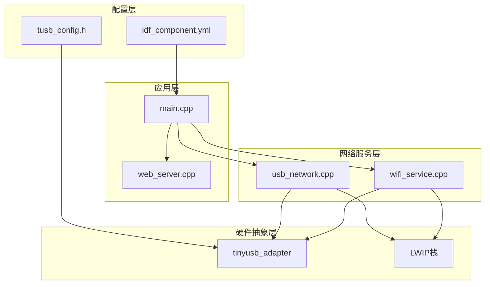

**图表来源**
- [main.cpp:19-81](file://main/main.cpp#L19-L81)
- [usb_network.cpp:191-290](file://main/usb_network.cpp#L191-L290)
- [wifi_service.cpp:604-703](file://main/wifi_service.cpp#L604-L703)

**章节来源**
- [main.cpp:19-81](file://main/main.cpp#L19-L81)
- [CMakeLists.txt:1-7](file://CMakeLists.txt#L1-L7)
- [idf_component.yml:1-6](file://main/idf_component.yml#L1-L6)

## 核心组件

### USB网络适配器组件

USB网络适配器是系统的核心组件之一，负责通过TinyUSB实现USB网络接口。其主要职责包括：

- **USB设备初始化**：配置TinyUSB驱动程序和NCM网络适配器
- **数据包处理**：实现网络数据包的发送和接收回调函数
- **状态管理**：监控USB连接状态和网络链路状态
- **DHCP服务**：为连接的设备提供DHCP服务配置
- **流量统计**：收集USB网络接口的传输统计数据

### WiFi服务组件

WiFi服务组件提供完整的WiFi网络管理功能：

- **多模式支持**：支持STA、AP和AP+STA三种操作模式
- **网络配置**：管理WiFi网络参数和连接状态
- **客户端管理**：跟踪AP模式下的连接客户端
- **NAPT集成**：与NAPT功能集成实现网络地址转换
- **状态监控**：提供实时的网络状态和性能监控

### Web管理界面

Web管理界面提供用户友好的图形化管理工具：

- **实时监控**：显示STA、AP和USB网络的实时状态
- **配置管理**：允许用户配置WiFi网络参数
- **设备管理**：展示连接的DHCP客户端信息
- **系统控制**：提供重启等系统管理功能

**章节来源**
- [usb_network.h:12-16](file://main/usb_network.h#L12-L16)
- [wifi_service.h:69-94](file://main/wifi_service.h#L69-L94)
- [web_server.h:15-16](file://main/web_server.h#L15-L16)

## 架构概览

系统采用分层架构设计，确保各组件之间的松耦合和高内聚：

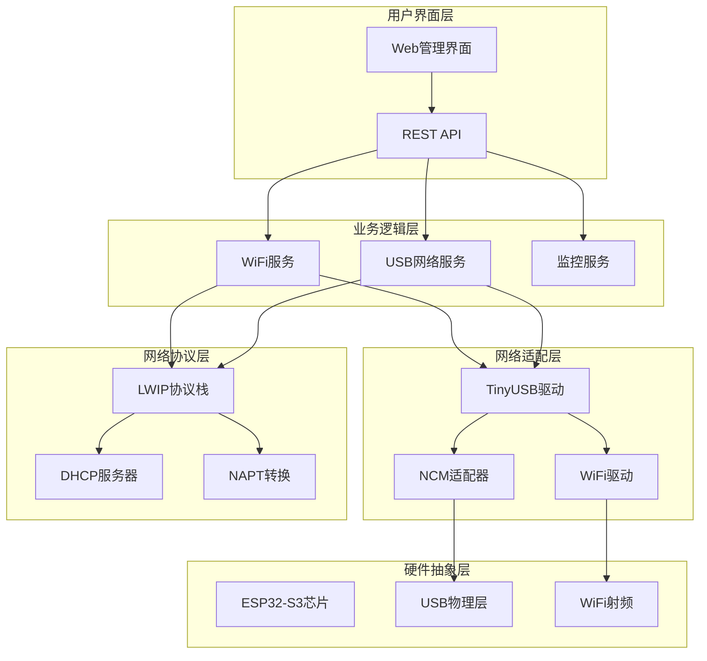

**图表来源**
- [main.cpp:25-45](file://main/main.cpp#L25-L45)
- [wifi_service.cpp:604-703](file://main/wifi_service.cpp#L604-L703)
- [usb_network.cpp:191-290](file://main/usb_network.cpp#L191-L290)

## 详细组件分析

### USB网络适配器详细分析

#### 初始化流程

USB网络适配器的初始化过程涉及多个层次的配置和设置：

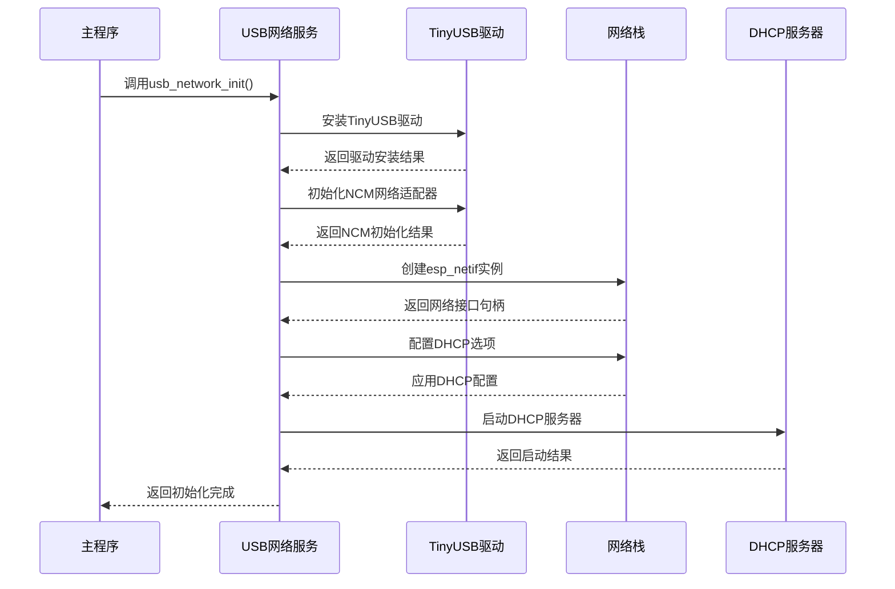

**图表来源**
- [usb_network.cpp:191-290](file://main/usb_network.cpp#L191-L290)
- [usb_network.cpp:218-231](file://main/usb_network.cpp#L218-L231)

#### 数据传输机制

USB网络适配器实现了完整的数据包处理机制：

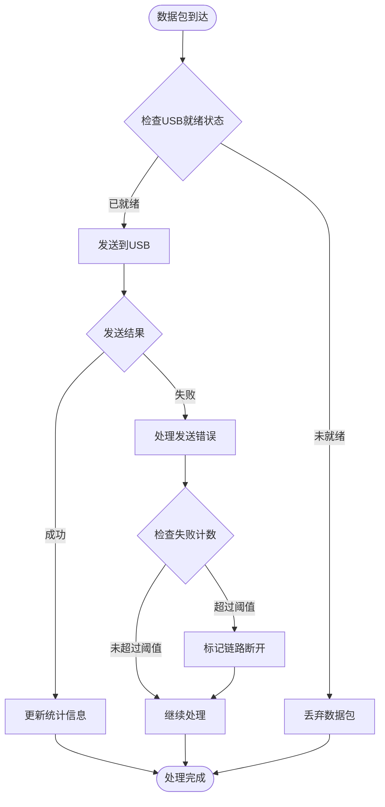

**图表来源**
- [usb_network.cpp:41-67](file://main/usb_network.cpp#L41-L67)
- [usb_network.cpp:69-91](file://main/usb_network.cpp#L69-L91)

#### 热插拔支持机制

系统实现了完整的USB热插拔检测和响应机制：

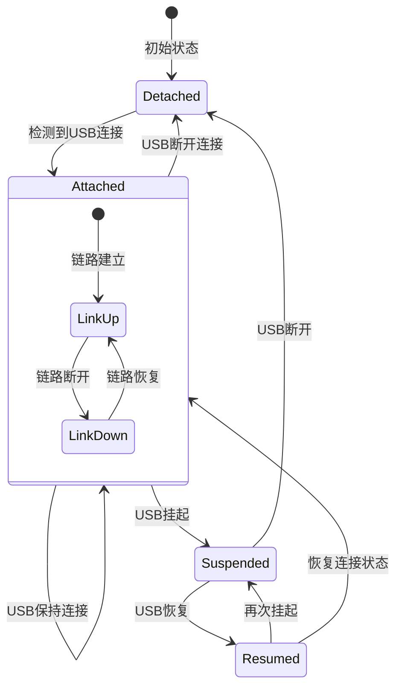

**图表来源**
- [usb_network.cpp:152-188](file://main/usb_network.cpp#L152-L188)

**章节来源**
- [usb_network.cpp:191-290](file://main/usb_network.cpp#L191-L290)
- [usb_network.cpp:41-91](file://main/usb_network.cpp#L41-L91)
- [usb_network.cpp:152-188](file://main/usb_network.cpp#L152-L188)

### WiFi服务详细分析

#### 多模式网络架构

WiFi服务支持三种操作模式，每种模式都有特定的网络拓扑和数据流：

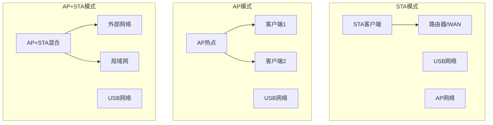

**图表来源**
- [wifi_service.cpp:301-306](file://main/wifi_service.cpp#L301-L306)
- [wifi_service.h:16-20](file://main/wifi_service.h#L16-L20)

#### NAPT网络地址转换

系统集成了NAPT功能，实现不同网络接口之间的数据包转换：

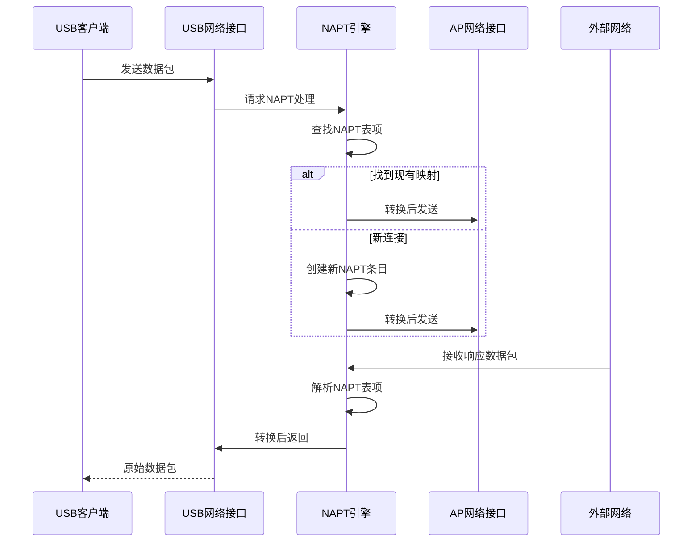

**图表来源**
- [wifi_service.cpp:236-299](file://main/wifi_service.cpp#L236-L299)

**章节来源**
- [wifi_service.cpp:301-306](file://main/wifi_service.cpp#L301-L306)
- [wifi_service.cpp:236-299](file://main/wifi_service.cpp#L236-L299)

### Web管理界面详细分析

#### 实时监控架构

Web管理界面提供了多层次的实时监控功能：

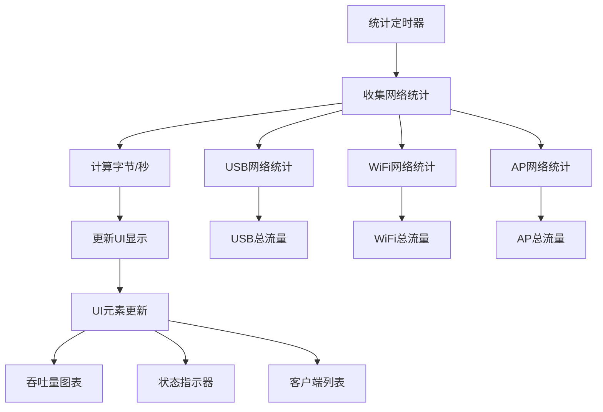

**图表来源**
- [wifi_service.cpp:207-229](file://main/wifi_service.cpp#L207-L229)
- [web_server.cpp:426-493](file://main/web_server.cpp#L426-L493)

#### DHCP客户端管理

系统实现了完整的DHCP客户端生命周期管理：

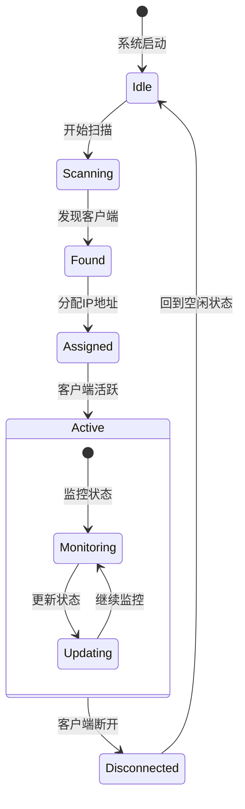

**图表来源**
- [wifi_service.cpp:565-594](file://main/wifi_service.cpp#L565-L594)

**章节来源**
- [wifi_service.cpp:207-229](file://main/wifi_service.cpp#L207-L229)
- [web_server.cpp:426-493](file://main/web_server.cpp#L426-L493)
- [wifi_service.cpp:565-594](file://main/wifi_service.cpp#L565-L594)

## 依赖关系分析

### 外部依赖关系

系统依赖于多个外部组件和库：

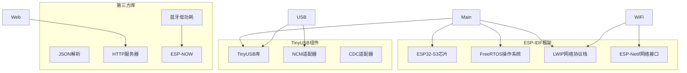

**图表来源**
- [idf_component.yml:2-3](file://main/idf_component.yml#L2-L3)
- [main.cpp:9-13](file://main/main.cpp#L9-L13)

### 内部模块依赖

系统内部模块之间存在清晰的依赖关系：

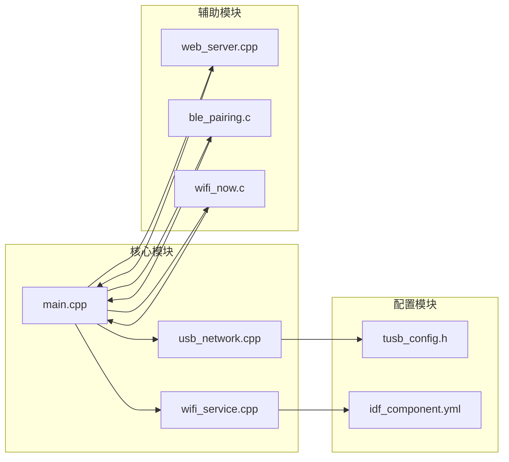

**图表来源**
- [main.cpp:19-81](file://main/main.cpp#L19-L81)
- [usb_network.cpp:191-290](file://main/usb_network.cpp#L191-L290)
- [wifi_service.cpp:604-703](file://main/wifi_service.cpp#L604-L703)

**章节来源**
- [idf_component.yml:2-3](file://main/idf_component.yml#L2-L3)
- [main.cpp:19-81](file://main/main.cpp#L19-L81)

## 性能考虑

### 网络性能优化

系统在设计时充分考虑了性能优化：

- **缓冲区管理**：USB网络适配器使用动态内存分配处理网络数据包，避免固定大小缓冲区的限制
- **中断处理**：TinyUSB驱动采用中断驱动方式，减少CPU占用率
- **定时器优化**：使用ESP-IDF的高性能定时器进行周期性任务调度
- **内存管理**：实施严格的内存使用监控，防止内存泄漏

### 并发处理策略

系统采用多线程并发处理模式：

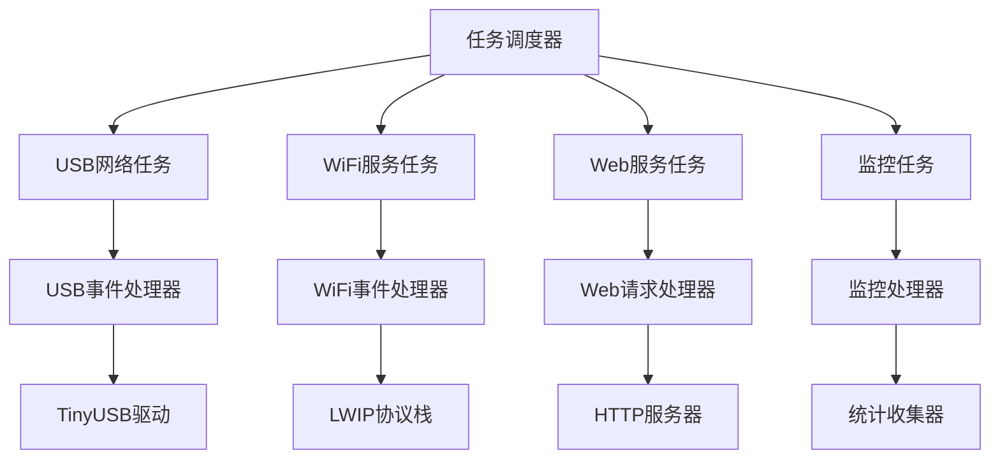

**图表来源**
- [usb_network.cpp:152-188](file://main/usb_network.cpp#L152-L188)
- [wifi_service.cpp:118-144](file://main/wifi_service.cpp#L118-L144)

### 错误处理和恢复机制

系统实现了多层次的错误处理和自动恢复机制：

- **USB连接恢复**：检测到USB断开后自动重连，恢复网络服务
- **网络状态监控**：持续监控网络连接状态，异常时自动切换到备用模式
- **内存泄漏防护**：实施严格的内存分配和释放策略
- **超时处理**：对所有网络操作设置合理的超时机制

## 故障排除指南

### 常见问题诊断

#### USB网络连接问题

**症状**：计算机无法识别USB网络适配器或无法获得IP地址

**诊断步骤**：
1. 检查USB连接是否稳定
2. 查看系统日志中的USB事件记录
3. 验证TinyUSB驱动是否正确加载
4. 检查DHCP服务器状态

**解决方案**：
- 重新插拔USB连接线
- 更新USB驱动程序
- 重启DHCP服务
- 检查电源供应是否充足

#### WiFi连接不稳定

**症状**：WiFi信号强度波动或频繁断开连接

**诊断步骤**：
1. 检查WiFi信道干扰情况
2. 验证路由器配置
3. 查看RSSI信号强度
4. 检查WiFi驱动状态

**解决方案**：
- 更换WiFi信道
- 调整路由器位置
- 更新WiFi驱动
- 降低传输功率

#### NAPT功能异常

**症状**：USB网络与WiFi网络之间无法正常通信

**诊断步骤**：
1. 检查NAPT引擎状态
2. 验证网络接口配置
3. 查看NAPT表项状态
4. 检查防火墙规则

**解决方案**：
- 重启NAPT服务
- 清理NAPT缓存
- 检查网络路由配置
- 重新配置NAPT规则

### 系统监控和调试

#### 日志分析

系统提供了详细的日志记录功能，便于问题诊断：

- **USB事件日志**：记录USB连接、断开、挂起等事件
- **网络状态日志**：记录WiFi连接状态变化
- **错误日志**：记录网络传输错误和异常情况
- **性能日志**：记录网络吞吐量和延迟指标

#### 性能监控

系统内置了实时性能监控功能：

- **流量统计**：实时显示各网络接口的上传下载速率
- **连接状态**：显示当前连接的客户端数量和状态
- **资源使用**：监控CPU和内存使用情况
- **错误统计**：统计各类网络错误的发生次数

**章节来源**
- [usb_network.cpp:41-67](file://main/usb_network.cpp#L41-L67)
- [wifi_service.cpp:416-450](file://main/wifi_service.cpp#L416-L450)

## 结论

USB网络共享系统是一个功能完整、架构清晰的嵌入式网络路由器解决方案。系统成功实现了以下目标：

**技术成就**：
- 成功集成USB网络共享和WiFi热点功能
- 实现了NCM模式的USB网络适配
- 集成了NAPT功能实现多网络接口数据转发
- 提供了完整的Web管理界面和实时监控功能

**设计优势**：
- 模块化架构设计，便于维护和扩展
- 完善的错误处理和自动恢复机制
- 实时性能监控和状态反馈
- 支持多种网络模式灵活切换

**应用场景**：
- 移动设备网络共享
- 远程办公网络接入
- IoT设备网络桥接
- 临时网络基础设施

该系统为开发者提供了一个可靠的参考实现，展示了如何在资源受限的嵌入式环境中实现复杂的网络功能。

## 附录

### 配置示例

#### USB网络配置

系统默认配置：
- USB IP地址：192.168.5.1
- 子网掩码：255.255.255.0
- 默认网关：192.168.5.1
- DNS服务器：8.8.8.8
- DHCP租期：3600秒

#### WiFi网络配置

WiFi默认配置：
- AP SSID：ESP32-S3-AP
- AP密码：12345678
- 最大客户端数：4
- 信道：1
- 认证方式：WPA2-PSK

### API参考

#### USB网络API

| 函数名 | 参数 | 返回值 | 描述 |
|--------|------|--------|------|
| usb_network_init | 无 | esp_err_t | 初始化USB网络适配器 |
| usb_network_get_netif | 无 | esp_netif_t* | 获取USB网络接口句柄 |
| usb_network_reconnect | 无 | void | 重新连接USB网络 |
| usb_network_get_rx_total | 无 | uint64_t | 获取接收字节数 |
| usb_network_get_tx_total | 无 | uint64_t | 获取发送字节数 |

#### WiFi服务API

| 函数名 | 参数 | 返回值 | 描述 |
|--------|------|--------|------|
| wifi_service_init | 无 | void | 初始化WiFi服务 |
| wifi_service_connect | ssid, password | void | 连接到WiFi网络 |
| wifi_service_disconnect | 无 | void | 断开WiFi连接 |
| wifi_service_set_mode | mode | void | 设置WiFi工作模式 |
| wifi_service_get_status | status* | void | 获取WiFi状态信息 |
| wifi_service_get_dhcp_clients | clients, max_count | int | 获取DHCP客户端列表 |

### 故障排除检查清单

- [ ] USB连接线是否完好
- [ ] TinyUSB驱动是否正确安装
- [ ] DHCP服务是否正常运行
- [ ] WiFi网络配置是否正确
- [ ] NAPT功能是否启用
- [ ] 系统日志是否有错误信息
- [ ] 网络接口状态是否正常
- [ ] 客户端连接是否稳定