# HTTP服务器实现

<cite>
**本文档引用的文件**
- [web_server.h](file://main/web_server.h)
- [web_server.cpp](file://main/web_server.cpp)
- [main.cpp](file://main/main.cpp)
- [wifi_service.h](file://main/wifi_service.h)
- [ble_pairing.h](file://main/ble_pairing.h)
- [wifi_now.h](file://main/wifi_now.h)
- [usb_network.h](file://main/usb_network.h)
- [CMakeLists.txt](file://CMakeLists.txt)
</cite>

## 目录
1. [简介](#简介)
2. [项目结构](#项目结构)
3. [核心组件](#核心组件)
4. [架构概览](#架构概览)
5. [详细组件分析](#详细组件分析)
6. [依赖关系分析](#依赖关系分析)
7. [性能考虑](#性能考虑)
8. [故障排除指南](#故障排除指南)
9. [结论](#结论)

## 简介

本文档详细介绍了基于ESP-IDF httpd框架的HTTP服务器实现。该服务器作为ESP32-S3 WiFi路由器的核心组件，提供了完整的Web界面管理和API接口，支持WiFi连接配置、AP热点管理、BLE配对、ESP-NOW通信等功能。

该HTTP服务器采用事件驱动架构，使用ESP-IDF的轻量级HTTP服务器框架，实现了从静态HTML页面到RESTful API的完整Web服务功能。服务器通过回调函数机制处理各种HTTP请求，集成了多个硬件组件的服务接口。

## 项目结构

该项目采用模块化设计，主要包含以下关键目录和文件：

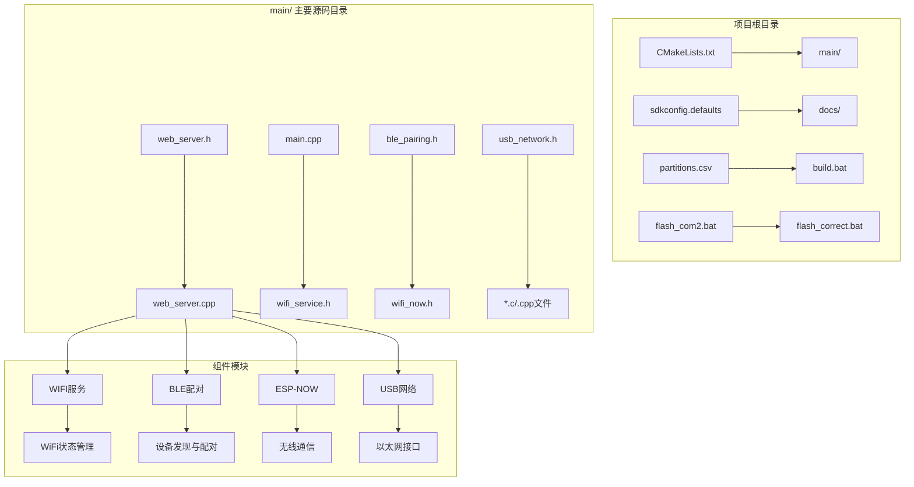

**图表来源**
- [main.cpp:19-81](file://main/main.cpp#L19-L81)
- [web_server.cpp:2272-2350](file://main/web_server.cpp#L2272-L2350)

**章节来源**
- [main.cpp:19-81](file://main/main.cpp#L19-L81)
- [CMakeLists.txt:1-7](file://CMakeLists.txt#L1-L7)

## 核心组件

### WebServer 结构体设计

WebServer结构体是HTTP服务器的核心数据容器，设计简洁而高效：

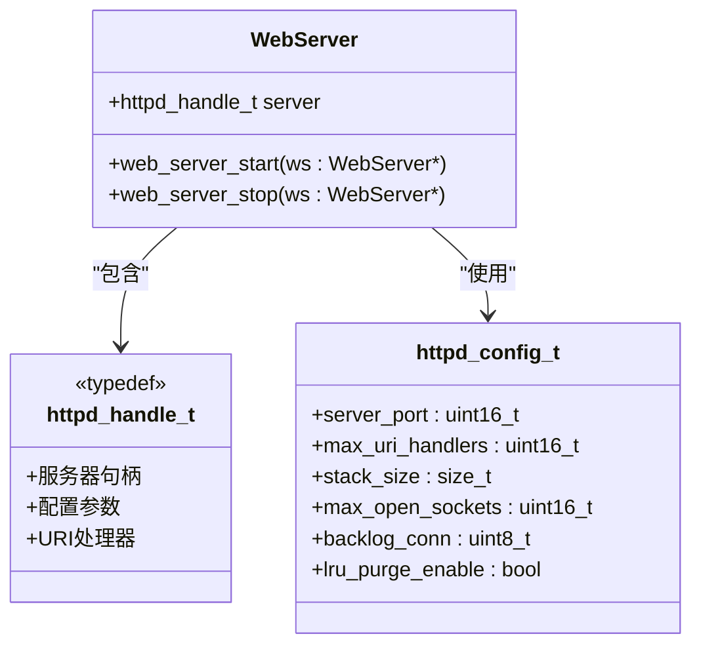

**图表来源**
- [web_server.h:11-13](file://main/web_server.h#L11-L13)
- [web_server.cpp:2274-2278](file://main/web_server.cpp#L2274-L2278)

WebServer结构体采用最小化设计原则，仅包含一个核心成员变量`server`，这体现了嵌入式系统中资源优化的重要性。该设计确保了内存占用的最小化，同时保持了功能的完整性。

### 服务器初始化配置

HTTP服务器的初始化过程涉及多个关键步骤：

1. **配置参数设置**：使用`HTTPD_DEFAULT_CONFIG()`获取默认配置，然后自定义端口、URI处理器数量和栈大小
2. **URI处理器注册**：为每个API端点创建对应的URI处理器
3. **服务器启动**：调用`httpd_start()`启动HTTP服务器
4. **回调函数绑定**：注册WiFi AP客户端连接回调

**章节来源**
- [web_server.cpp:2272-2350](file://main/web_server.cpp#L2272-L2350)

## 架构概览

该HTTP服务器采用分层架构设计，实现了清晰的关注点分离：

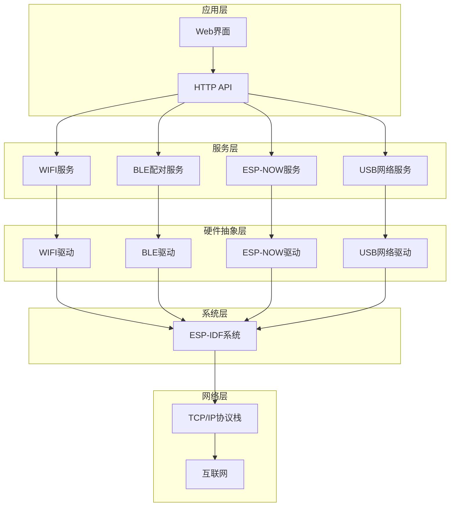

**图表来源**
- [web_server.cpp:17-13](file://main/web_server.cpp#L17-L13)
- [main.cpp:25-42](file://main/main.cpp#L25-L42)

### 事件驱动架构

HTTP服务器采用事件驱动架构，所有请求处理都是异步的：

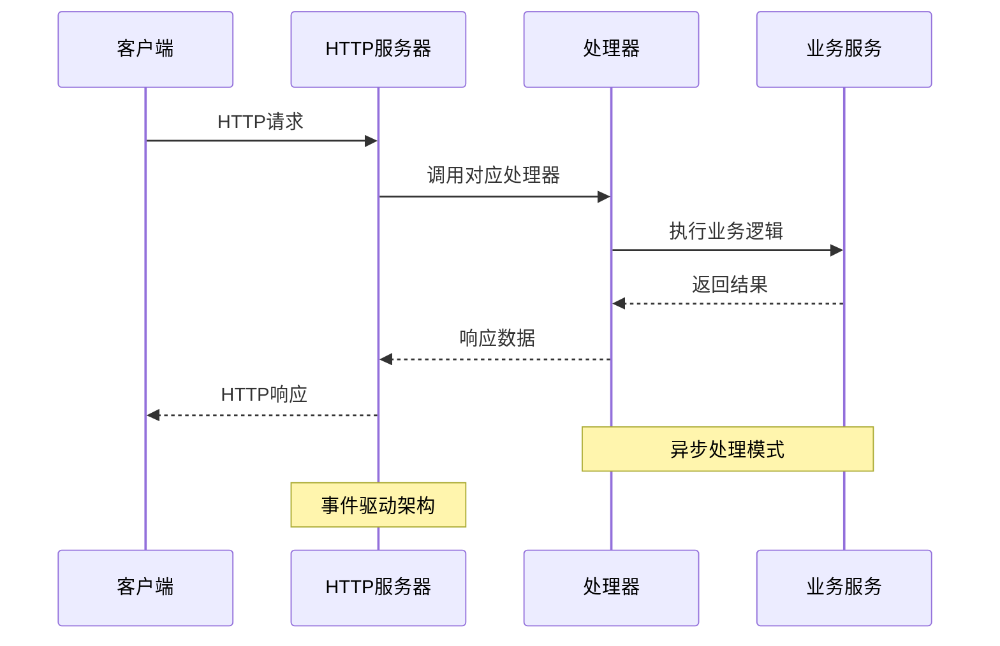

**图表来源**
- [web_server.cpp:30-1145](file://main/web_server.cpp#L30-L1145)
- [web_server.cpp:1147-2350](file://main/web_server.cpp#L1147-L2350)

## 详细组件分析

### 根页面处理器

根页面处理器负责返回主控制界面：

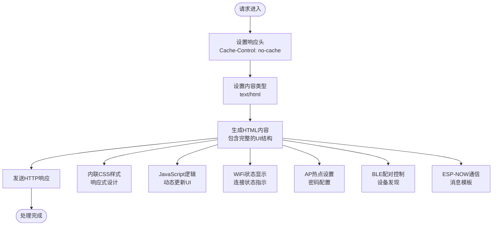

**图表来源**
- [web_server.cpp:30-1145](file://main/web_server.cpp#L30-L1145)

根页面处理器实现了完整的单页应用(SPA)架构，所有交互逻辑都在前端JavaScript中实现，通过AJAX请求与后端API通信。

### WiFi状态API处理器

WiFi状态API处理器提供实时的WiFi连接状态信息：

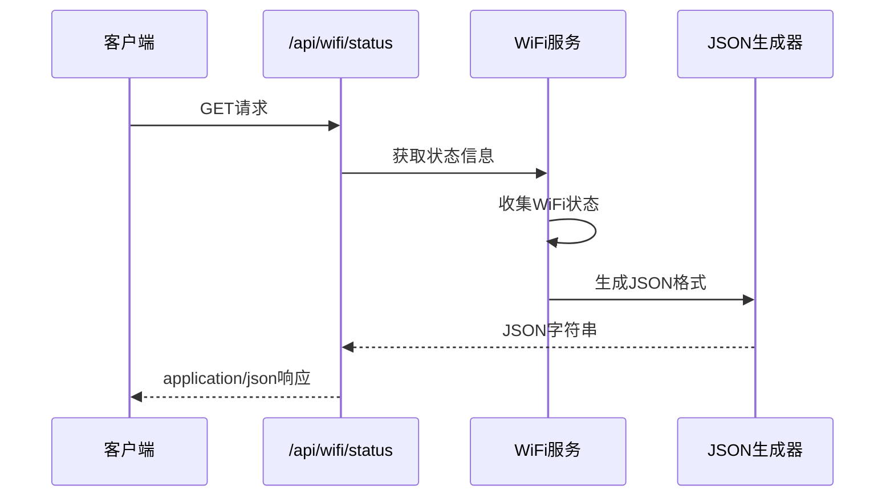

**图表来源**
- [web_server.cpp:1147-1154](file://main/web_server.cpp#L1147-L1154)
- [wifi_service.h:74-77](file://main/wifi_service.h#L74-L77)

### WiFi连接处理器

WiFi连接处理器处理STA模式下的WiFi连接请求：

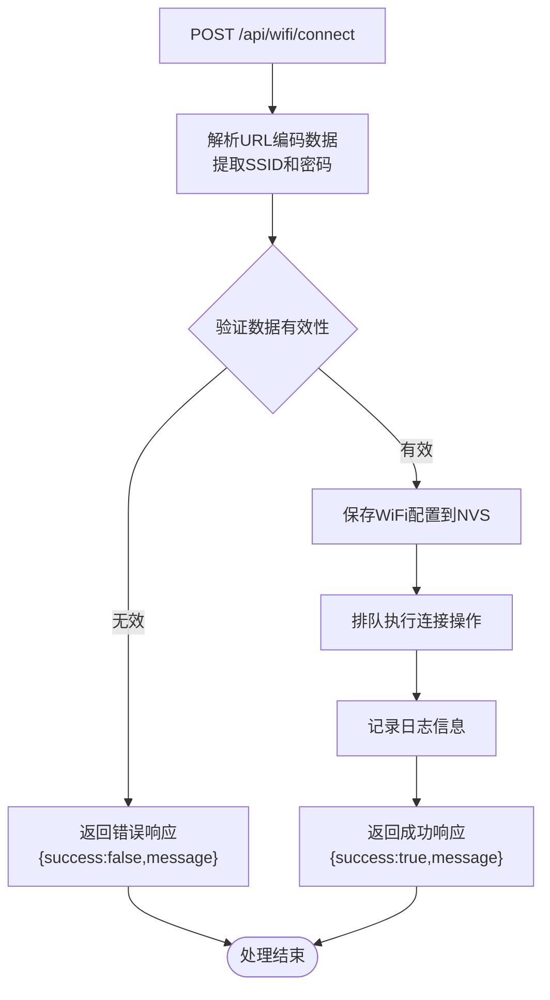

**图表来源**
- [web_server.cpp:1186-1213](file://main/web_server.cpp#L1186-L1213)

### AP热点管理处理器

AP热点管理处理器提供了完整的热点配置和控制功能：

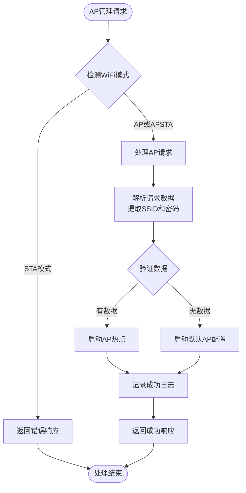

**图表来源**
- [web_server.cpp:1239-1269](file://main/web_server.cpp#L1239-L1269)

### ESP-NOW通信处理器

ESP-NOW通信处理器实现了完整的无线数据传输功能：

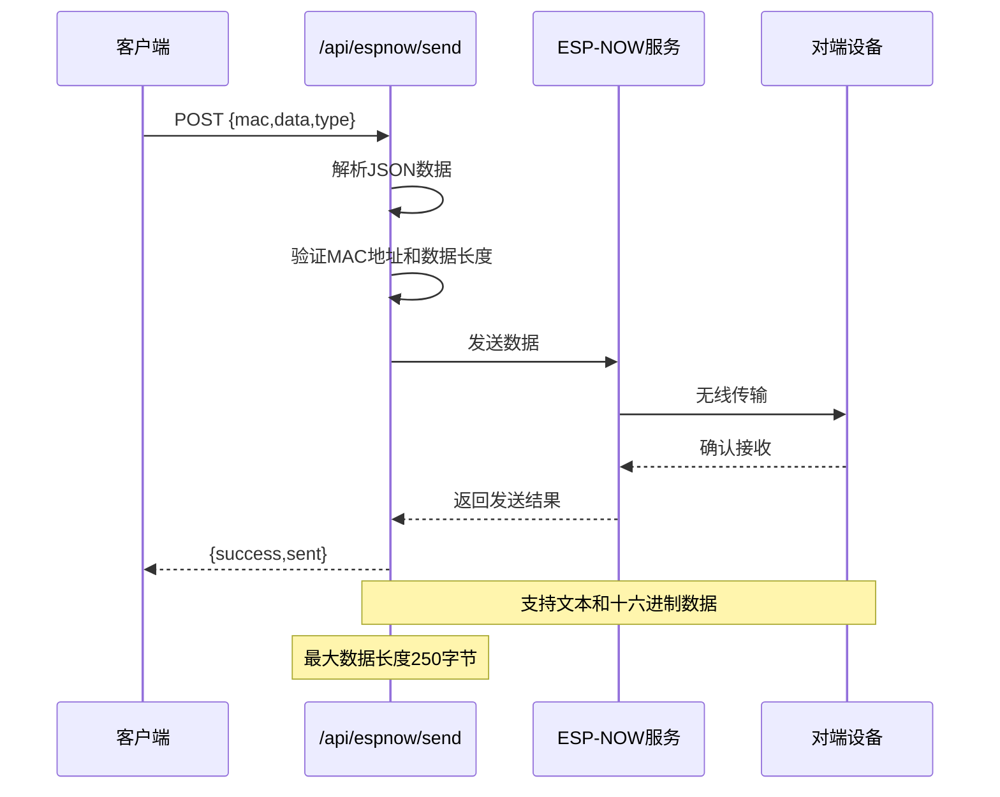

**图表来源**
- [web_server.cpp:1762-1860](file://main/web_server.cpp#L1762-L1860)
- [web_server.cpp:1862-1939](file://main/web_server.cpp#L1862-L1939)

### BLE配对处理器

BLE配对处理器提供了完整的蓝牙低功耗设备配对功能：

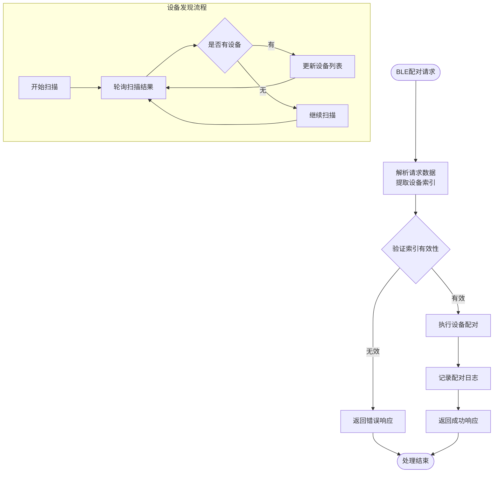

**图表来源**
- [web_server.cpp:1530-1545](file://main/web_server.cpp#L1530-L1545)
- [web_server.cpp:1451-1482](file://main/web_server.cpp#L1451-L1482)

## 依赖关系分析

### 组件依赖图

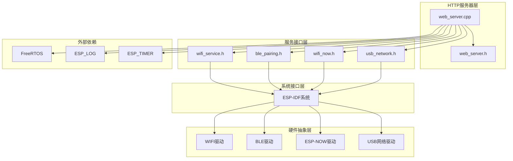

**图表来源**
- [web_server.cpp:1-14](file://main/web_server.cpp#L1-L14)
- [main.cpp:9-13](file://main/main.cpp#L9-L13)

### 内存管理策略

HTTP服务器采用了多种内存管理策略来适应ESP32的有限资源：

1. **静态HTML内联存储**：根页面的HTML内容直接内联在代码中，避免额外的Flash存储需求
2. **动态内存分配限制**：扫描结果缓冲区最大4KB，JSON缓冲区最大4KB
3. **任务栈优化**：HTTP服务器栈大小设置为16KB，满足多任务处理需求
4. **内存池管理**：WiFi扫描结果使用动态分配，但及时释放

**章节来源**
- [web_server.cpp:1310-1376](file://main/web_server.cpp#L1310-L1376)
- [web_server.cpp:2274-2278](file://main/web_server.cpp#L2274-L2278)

### 线程安全考虑

HTTP服务器在多线程环境下采用了以下安全措施：

1. **全局变量保护**：WiFi扫描状态使用静态变量，配合扫描任务实现线程同步
2. **回调函数机制**：AP客户端连接回调通过队列机制异步处理
3. **JSON生成线程安全**：所有JSON生成操作在单个任务上下文中执行
4. **内存访问保护**：动态分配的内存使用严格的边界检查

**章节来源**
- [web_server.cpp:19-28](file://main/web_server.cpp#L19-L28)
- [web_server.cpp:1314-1376](file://main/web_server.cpp#L1314-L1376)

## 性能考虑

### 请求处理性能

HTTP服务器针对嵌入式环境进行了多项性能优化：

1. **零拷贝优化**：静态HTML内容直接发送，避免不必要的数据复制
2. **缓存控制**：根页面设置了适当的缓存控制头，减少重复加载
3. **异步处理**：所有长时间运行的操作都通过FreeRTOS任务异步执行
4. **内存复用**：JSON缓冲区在扫描任务间复用，减少内存分配开销

### 并发处理能力

服务器能够有效处理并发请求：

- **最大URI处理器数**：32个，支持同时处理多个API请求
- **任务优先级**：HTTP服务器任务优先级设置为5
- **扫描任务**：独立的任务处理WiFi扫描，不影响主HTTP服务
- **回调机制**：异步回调处理WiFi连接事件

**章节来源**
- [web_server.cpp:2274-2278](file://main/web_server.cpp#L2274-L2278)
- [web_server.cpp:1401](file://main/web_server.cpp#L1401)

## 故障排除指南

### 常见问题及解决方案

#### 服务器启动失败

**症状**：HTTP服务器无法启动，返回错误

**可能原因**：
1. 端口80已被其他服务占用
2. 内存不足导致服务器启动失败
3. 配置参数不正确

**解决方法**：
```c
// 检查服务器状态
if (httpd_start(&ws->server, &config) != ESP_OK) {
    ESP_LOGE(TAG, "HTTP服务器启动失败");
    // 实施降级方案或重启
}
```

#### API响应超时

**症状**：客户端请求超时，响应时间过长

**可能原因**：
1. WiFi扫描任务阻塞
2. ESP-NOW通信延迟
3. JSON生成过于复杂

**解决方法**：
- 优化JSON生成算法
- 减少扫描任务的执行频率
- 实施请求超时机制

#### 内存泄漏问题

**症状**：系统运行一段时间后内存不足

**解决方法**：
- 确保所有动态分配的内存都有对应的释放
- 检查WiFi扫描结果的内存释放
- 监控内存使用情况

**章节来源**
- [web_server.cpp:1337-1376](file://main/web_server.cpp#L1337-L1376)
- [web_server.cpp:2344-2350](file://main/web_server.cpp#L2344-L2350)

## 结论

该HTTP服务器实现展示了在资源受限的嵌入式环境中构建高性能Web服务的最佳实践。通过合理的架构设计、内存管理和线程安全考虑，该服务器成功地将复杂的WiFi管理功能封装为直观的Web界面。

### 主要成就

1. **模块化设计**：清晰的组件分离，便于维护和扩展
2. **资源优化**：针对ESP32的内存和处理能力进行专门优化
3. **事件驱动**：高效的异步处理机制
4. **完整功能**：从基础Web界面到高级WiFi管理的全面支持

### 技术亮点

- 使用ESP-IDF httpd框架实现轻量级HTTP服务器
- 通过回调函数机制实现事件驱动架构
- 集成多种硬件服务接口，提供统一的管理界面
- 实现完整的单页应用(SPA)架构

该实现为类似的嵌入式Web服务器项目提供了优秀的参考模板，展示了如何在资源受限的环境中实现功能丰富且性能优异的Web服务。