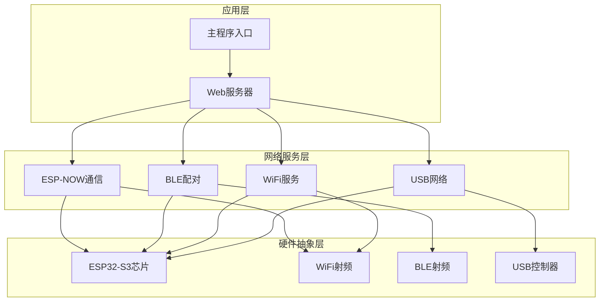
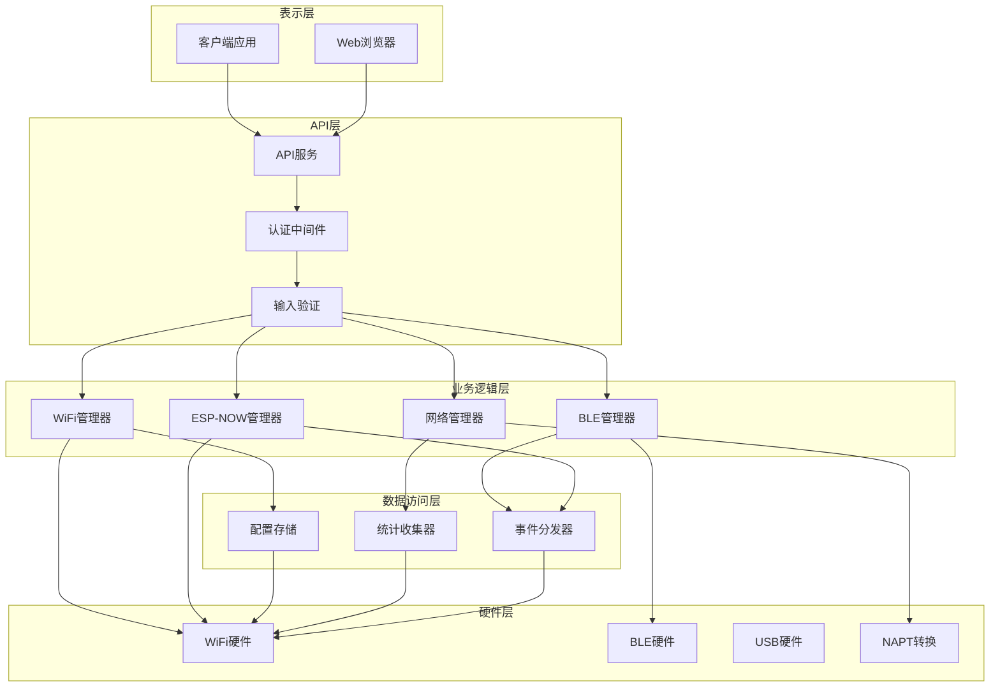
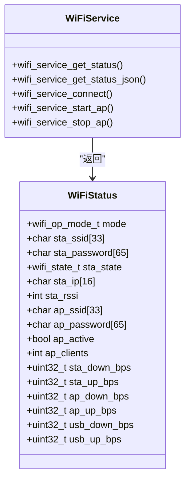
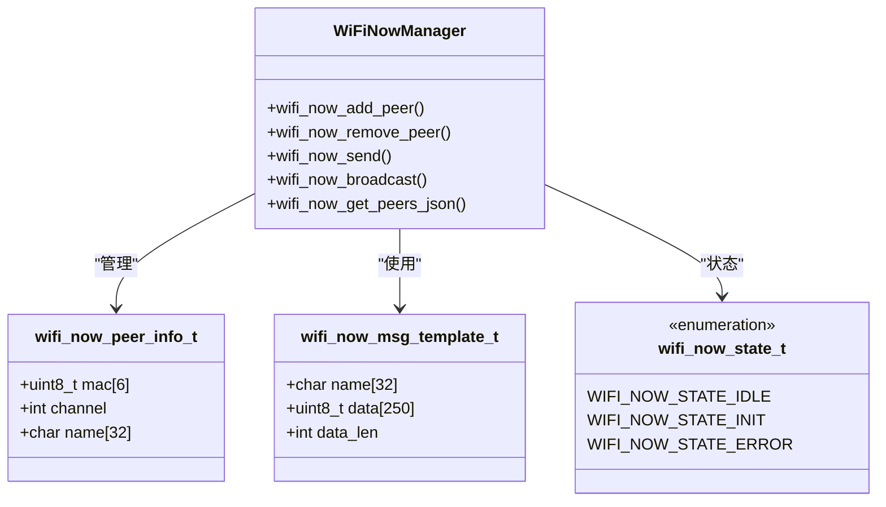
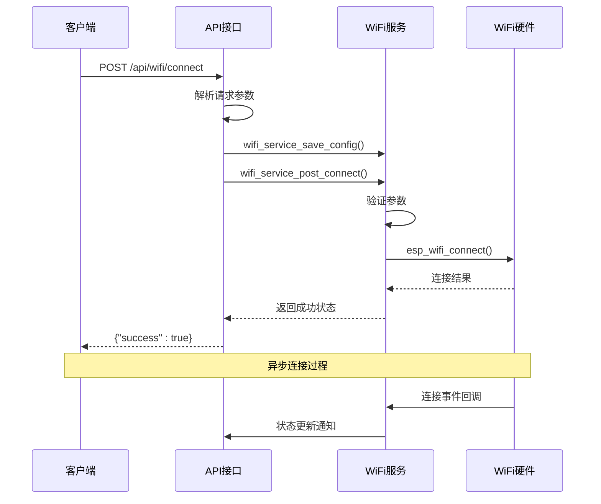
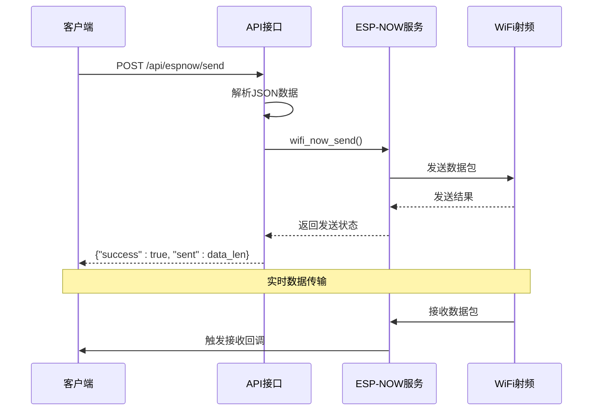
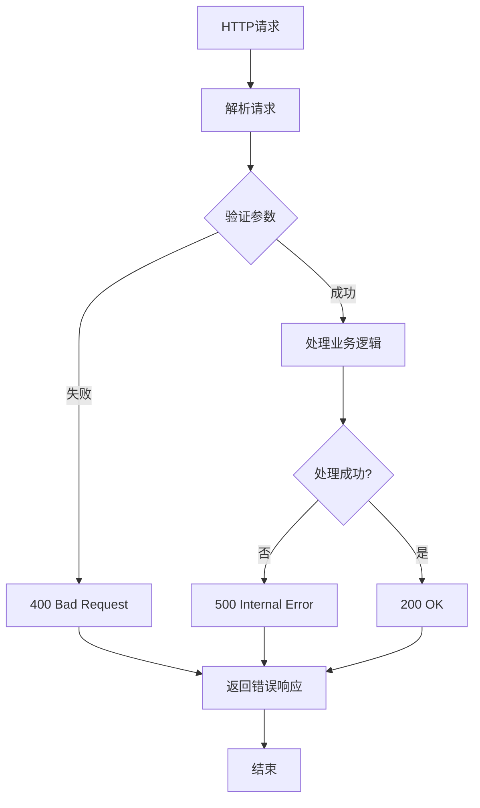
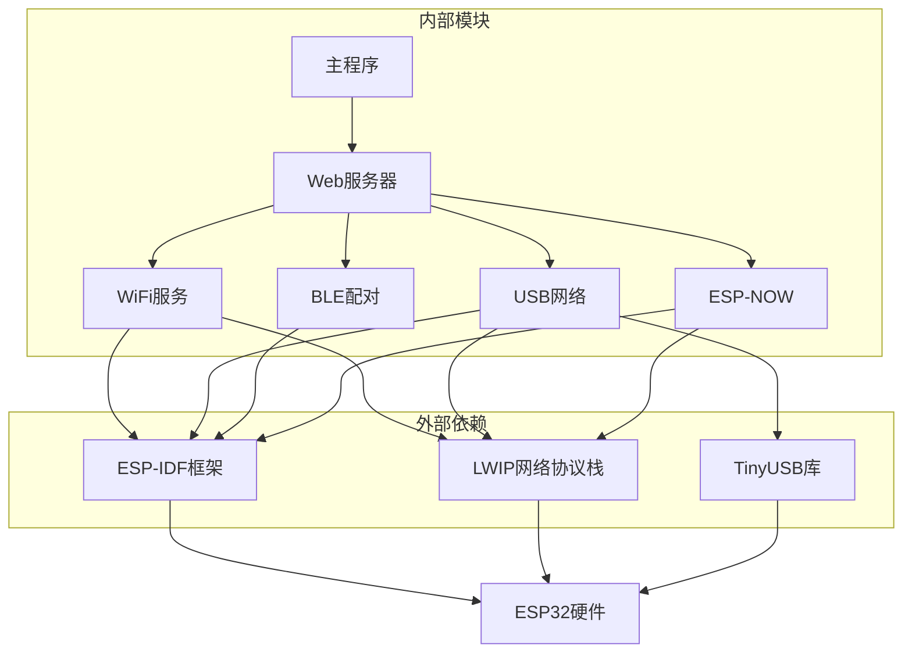

# RESTful API设计

<cite>
**本文档引用的文件**
- [web_server.cpp](file://main/web_server.cpp)
- [web_server.h](file://main/web_server.h)
- [wifi_service.cpp](file://main/wifi_service.cpp)
- [wifi_service.h](file://main/wifi_service.h)
- [wifi_now.c](file://main/wifi_now.c)
- [wifi_now.h](file://main/wifi_now.h)
- [ble_pairing.c](file://main/ble_pairing.c)
- [ble_pairing.h](file://main/ble_pairing.h)
- [usb_network.cpp](file://main/usb_network.cpp)
- [main.cpp](file://main/main.cpp)
</cite>

## 目录
1. [简介](#简介)
2. [项目结构](#项目结构)
3. [核心组件](#核心组件)
4. [架构概览](#架构概览)
5. [详细组件分析](#详细组件分析)
6. [依赖关系分析](#依赖关系分析)
7. [性能考虑](#性能考虑)
8. [故障排除指南](#故障排除指南)
9. [结论](#结论)
10. [附录](#附录)

## 简介

本项目是一个基于ESP32-S3的WiFi路由器管理系统，提供了完整的RESTful API接口，支持WiFi连接管理、热点配置、BLE配对、ESP-NOW通信等功能。该系统采用嵌入式C/C++开发，运行在ESP-IDF框架上，通过内置Web服务器提供HTTP API服务。

系统主要功能包括：
- WiFi网络连接管理（STA模式）
- WiFi热点服务（AP模式）
- USB网络共享功能
- BLE自动配对和设备发现
- ESP-NOW无线数据传输
- 实时状态监控和统计

## 项目结构

项目采用模块化设计，主要由以下核心模块组成：



**图表来源**
- [main.cpp:19-81](file://main/main.cpp#L19-L81)
- [web_server.cpp:2272-2350](file://main/web_server.cpp#L2272-L2350)

**章节来源**
- [main.cpp:19-81](file://main/main.cpp#L19-L81)
- [web_server.h:11-22](file://main/web_server.h#L11-L22)

## 核心组件

### Web服务器组件
Web服务器是整个系统的API入口点，基于ESP-IDF的HTTP服务器框架构建。它负责：
- 处理HTTP请求和响应
- 路由API端点
- JSON数据序列化和反序列化
- 错误处理和状态码返回

### WiFi服务组件
WiFi服务组件提供完整的WiFi网络管理功能：
- 连接状态监控
- 网络参数配置
- 扫描和发现功能
- 模式切换（STA/AP/APSTA）

### USB网络组件
USB网络组件实现USB到以太网的桥接功能：
- USB CDC网络功能
- DHCP服务器配置
- 网络流量统计
- 设备事件处理

### BLE配对组件
BLE配对组件支持BLE自动发现和配对：
- BLE广告和扫描
- 设备发现和过滤
- 自动配对逻辑
- 配对状态管理

### ESP-NOW通信组件
ESP-NOW通信组件提供无线数据传输功能：
- 设备配对管理
- 数据包发送和接收
- 广播通信支持
- 消息模板管理

**章节来源**
- [web_server.cpp:2272-2350](file://main/web_server.cpp#L2272-L2350)
- [wifi_service.h:16-99](file://main/wifi_service.h#L16-L99)
- [usb_network.cpp:191-312](file://main/usb_network.cpp#L191-L312)
- [ble_pairing.h:15-55](file://main/ble_pairing.h#L15-L55)
- [wifi_now.h:27-113](file://main/wifi_now.h#L27-L113)

## 架构概览

系统采用分层架构设计，各层职责明确：



**图表来源**
- [main.cpp:25-46](file://main/main.cpp#L25-L46)
- [web_server.cpp:2272-2350](file://main/web_server.cpp#L2272-L2350)

## 详细组件分析

### API端点设计

#### WiFi管理API

**状态查询接口**
- 方法：GET
- 路径：`/api/wifi/status`
- 功能：获取当前WiFi状态信息
- 响应数据结构：
```json
{
  "mode": "apsta",
  "sta_ssid": "string",
  "sta_password": "string",
  "sta_state": "connected",
  "sta_ip": "192.168.x.x",
  "sta_rssi": -50,
  "ap_ssid": "string",
  "ap_password": "string",
  "ap_active": true,
  "ap_clients": 2,
  "sta_down_bps": 1024,
  "sta_up_bps": 512,
  "ap_down_bps": 2048,
  "ap_up_bps": 1024,
  "usb_down_bps": 4096,
  "usb_up_bps": 2048
}
```

**WiFi连接接口**
- 方法：POST
- 路径：`/api/wifi/connect`
- 请求体：`ssid=网络名称&password=密码`
- 功能：建立WiFi连接
- 响应：`{"success": true, "message": "Connecting..."}`

**模式设置接口**
- 方法：POST
- 路径：`/api/wifi/mode`
- 请求体：`mode=apsta|ap|sta`
- 功能：设置WiFi工作模式
- 响应：`{"success": true}`

**热点启动接口**
- 方法：POST
- 路径：`/api/wifi/ap/start`
- 请求体：`ssid=热点名称&password=密码`
- 功能：启动WiFi热点
- 响应：`{"success": true}`

**热点停止接口**
- 方法：POST
- 路径：`/api/wifi/ap/stop`
- 功能：停止WiFi热点
- 响应：`{"success": true}`

**WiFi扫描接口**
- 方法：GET
- 路径：`/api/wifi/scan`
- 查询参数：无
- 功能：扫描可用WiFi网络
- 响应数据结构：
```json
{
  "scanning": false,
  "results": [
    {
      "ssid": "network_name",
      "rssi": -60,
      "channel": 6,
      "authmode": 4
    }
  ]
}
```

**DHCP客户端查询接口**
- 方法：GET
- 路径：`/api/dhcp/clients`
- 功能：获取DHCP客户端列表
- 响应数据结构：
```json
[
  {
    "source": "ap",
    "mac": "xx:xx:xx:xx:xx:xx",
    "ip": "192.168.x.x"
  }
]
```

**系统重启接口**
- 方法：POST
- 路径：`/api/restart`
- 功能：重启设备
- 响应：`{"success": true}`

**USB NAPT开关接口**
- 方法：GET
- 路径：`/api/usb/napt`
- 功能：查询 USB NAPT 开关状态
- 响应：`{"enabled": true/false}`

- 方法：POST
- 路径：`/api/usb/napt`
- 请求体：`enable=0/1`
- 功能：开启或关闭 USB NAPT
- 响应：`{"success": true}`
- 说明：仅控制 USB 接口的 NAPT，AP NAPT 不受此接口影响（AP NAPT 始终跟随 STA 连接状态）

#### BLE配对API

**BLE状态查询接口**
- 方法：GET
- 路径：`/api/ble/status`
- 功能：获取BLE状态
- 响应：`{"state": 1, "advertising": true, "scanning": false}`

**BLE广告控制接口**
- 方法：POST
- 路径：`/api/ble/advertise`
- 请求体：`enable=1&name=设备名`
- 功能：控制BLE广告
- 响应：`{"success": true}`

**BLE扫描接口**
- 方法：POST
- 路径：`/api/ble/scan`
- 功能：开始BLE扫描
- 响应：`{"success": true}`

**BLE设备列表接口**
- 方法：GET
- 路径：`/api/ble/devices`
- 功能：获取发现的BLE设备列表
- 响应数据结构：
```json
{
  "scanning": false,
  "devices": [
    {
      "index": 0,
      "ble_mac": "xx:xx:xx:xx:xx:xx",
      "now_mac": "xx:xx:xx:xx:xx:xx",
      "name": "device_name",
      "rssi": -70
    }
  ]
}
```

**BLE配对接口**
- 方法：POST
- 路径：`/api/ble/pair`
- 请求体：`index=设备索引`
- 功能：与BLE设备配对
- 响应：`{"success": true}`

#### ESP-NOW通信API

**ESP-NOW设备列表接口**
- 方法：GET
- 路径：`/api/now/peers`
- 功能：获取ESP-NOW设备列表
- 响应数据结构：
```json
[
  {
    "mac": "xx:xx:xx:xx:xx:xx",
    "channel": 6,
    "name": "device_name",
    "type": "slave"
  }
]
```

**ESP-NOW设备移除接口**
- 方法：POST
- 路径：`/api/now/peer/remove`
- 请求体：`mac=xx:xx:xx:xx:xx:xx`
- 功能：移除ESP-NOW设备
- 响应：`{"success": true}`

**ESP-NOW MAC地址接口**
- 方法：GET
- 路径：`/api/now/mac`
- 功能：获取ESP-NOW MAC地址
- 响应：`{"mac": "xx:xx:xx:xx:xx:xx"}`

**ESP-NOW注册接口**
- 方法：POST
- 路径：`/api/espnow/register`
- 请求体：JSON格式
```json
{
  "mac": "xx:xx:xx:xx:xx:xx",
  "channel": 6,
  "name": "device_name"
}
```
- 功能：注册ESP-NOW设备
- 响应：`{"success": true, "ap_mac": "...", "ap_channel": 6}`

**ESP-NOW主控信息接口**
- 方法：GET
- 路径：`/api/espnow/master`
- 功能：获取ESP-NOW主控信息
- 响应：`{"mac": "...", "channel": 6}`

**ESP-NOW取消配对接口**
- 方法：POST
- 路径：`/api/espnow/unpair`
- 请求体：JSON格式
```json
{
  "mac": "xx:xx:xx:xx:xx:xx"
}
```
- 功能：取消ESP-NOW配对
- 响应：`{"success": true}`

**ESP-NOW单播发送接口**
- 方法：POST
- 路径：`/api/espnow/send`
- 请求体：JSON格式
```json
{
  "mac": "xx:xx:xx:xx:xx:xx",
  "type": "text|hex",
  "data": "message_data"
}
```
- 功能：向指定设备发送数据
- 响应：`{"success": true, "sent": 10}`

**ESP-NOW广播发送接口**
- 方法：POST
- 路径：`/api/espnow/broadcast`
- 请求体：JSON格式
```json
{
  "type": "text|hex",
  "data": "message_data"
}
```
- 功能：广播发送数据
- 响应：`{"success": true, "sent": 10}`

**消息模板管理接口**
- 获取模板：GET `/api/espnow/templates`
- 添加模板：POST `/api/espnow/template/add`
- 更新模板：POST `/api/espnow/template/update`
- 删除模板：POST `/api/espnow/template/remove`

**章节来源**
- [web_server.cpp:1146-1599](file://main/web_server.cpp#L1146-L1599)
- [web_server.cpp:1596-1899](file://main/web_server.cpp#L1596-L1899)

### 数据模型设计

#### WiFi状态数据模型


**图表来源**
- [wifi_service.h:46-63](file://main/wifi_service.h#L46-L63)
- [wifi_service.cpp:705-728](file://main/wifi_service.cpp#L705-L728)

#### ESP-NOW设备数据模型


**图表来源**
- [wifi_now.h:40-56](file://main/wifi_now.h#L40-L56)
- [wifi_now.c:229-311](file://main/wifi_now.c#L229-L311)

### API调用流程

#### WiFi连接流程


**图表来源**
- [web_server.cpp:1186-1213](file://main/web_server.cpp#L1186-L1213)
- [wifi_service.cpp:705-728](file://main/wifi_service.cpp#L705-L728)

#### ESP-NOW数据传输流程


**图表来源**
- [web_server.cpp:1762-1860](file://main/web_server.cpp#L1762-L1860)
- [wifi_now.c:422-446](file://main/wifi_now.c#L422-L446)

### 错误处理机制

系统采用统一的错误处理策略：



**图表来源**
- [web_server.cpp:1186-1213](file://main/web_server.cpp#L1186-L1213)

## 依赖关系分析

系统模块间的依赖关系如下：



**图表来源**
- [main.cpp:9-13](file://main/main.cpp#L9-L13)
- [web_server.cpp:1-15](file://main/web_server.cpp#L1-L15)

**章节来源**
- [main.cpp:9-13](file://main/main.cpp#L9-L13)
- [web_server.cpp:1-15](file://main/web_server.cpp#L1-L15)

## 性能考虑

### 内存管理
- 使用静态缓冲区避免动态内存分配
- 限制JSON响应大小防止内存溢出
- 实现内存使用监控和告警

### 网络性能
- 实时流量统计采用定时器机制
- 网络事件异步处理减少阻塞
- TCP/IP堆栈优化提升吞吐量

### 并发控制
- FreeRTOS任务调度保证实时性
- 信号量和互斥锁保护共享资源
- 队列机制实现异步命令处理

## 故障排除指南

### 常见问题及解决方案

**WiFi连接失败**
- 检查SSID和密码是否正确
- 确认网络信号强度足够
- 验证密码长度至少8位

**ESP-NOW通信异常**
- 确认设备在同一频道
- 检查设备是否已配对
- 验证数据长度不超过限制

**BLE配对问题**
- 确认BLE功能正常启用
- 检查设备距离和障碍物
- 验证设备名称长度限制

**USB网络不可用**
- 检查USB连接状态
- 确认主机驱动安装
- 验证IP地址配置

**章节来源**
- [web_server.cpp:1186-1213](file://main/web_server.cpp#L1186-L1213)
- [wifi_now.c:229-311](file://main/wifi_now.c#L229-L311)

## 结论

本RESTful API设计实现了完整的WiFi路由器管理功能，具有以下特点：

1. **模块化设计**：清晰的分层架构便于维护和扩展
2. **完整的功能覆盖**：从基础WiFi管理到高级无线通信
3. **良好的性能表现**：优化的内存管理和并发处理
4. **可靠的错误处理**：完善的异常处理和恢复机制
5. **简洁的API设计**：直观的RESTful接口符合标准

系统适用于工业级WiFi路由器应用，为开发者提供了完整的API参考和实现指导。

## 附录

### API使用示例

**获取WiFi状态**
```bash
curl -X GET http://192.168.4.1/api/wifi/status
```

**连接WiFi网络**
```bash
curl -X POST http://192.168.4.1/api/wifi/connect \
  -H "Content-Type: application/x-www-form-urlencoded" \
  -d "ssid=network_name&password=password"
```

**启动WiFi热点**
```bash
curl -X POST http://192.168.4.1/api/wifi/ap/start \
  -H "Content-Type: application/x-www-form-urlencoded" \
  -d "ssid=hotspot_name&password=password"
```

**ESP-NOW数据发送**
```bash
curl -X POST http://192.168.4.1/api/espnow/send \
  -H "Content-Type: application/json" \
  -d '{"mac":"xx:xx:xx:xx:xx:xx","type":"text","data":"hello"}'
```

### 安全考虑

- 所有API接口均运行在本地网络内
- 未实现认证和授权机制
- 建议在网络边界部署防火墙
- 生产环境建议添加HTTPS支持