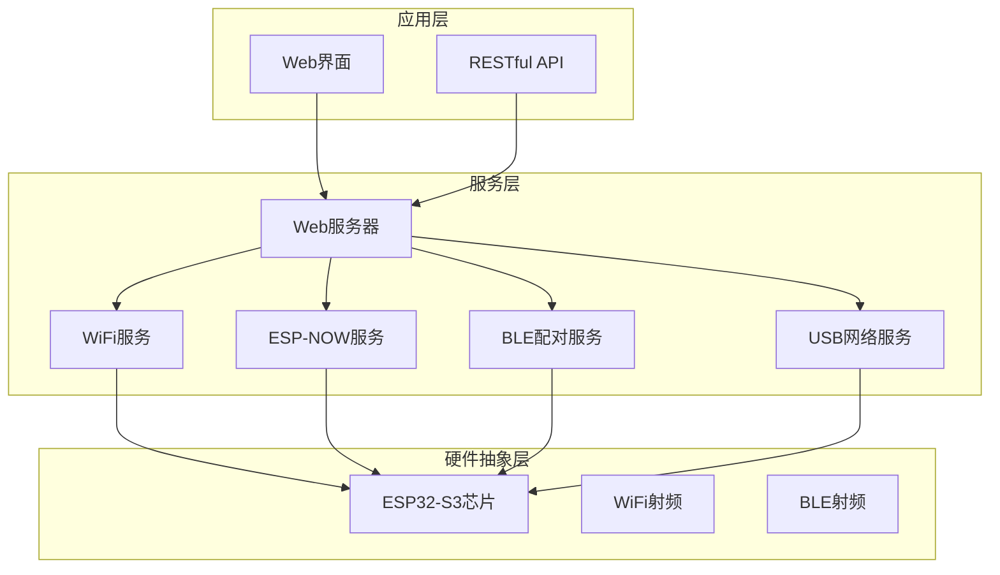
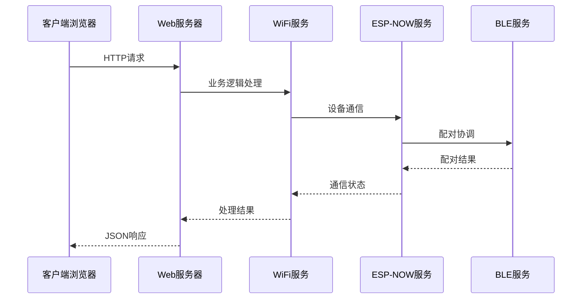
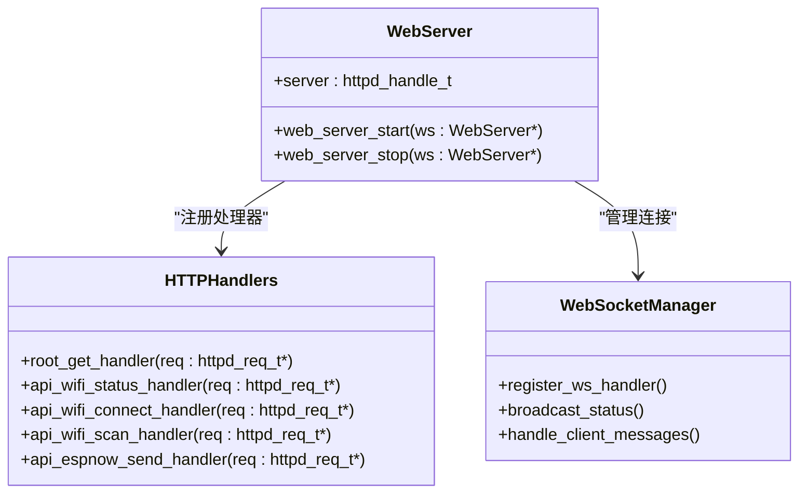
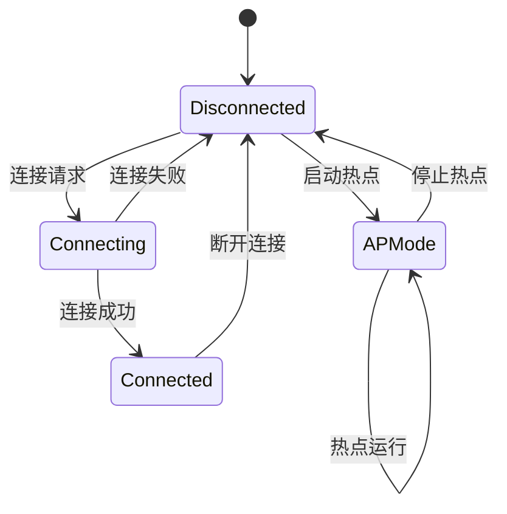
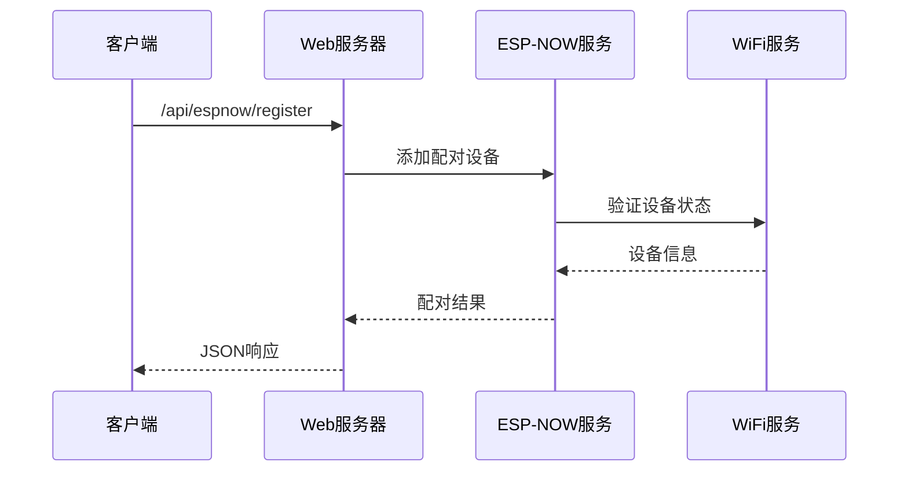
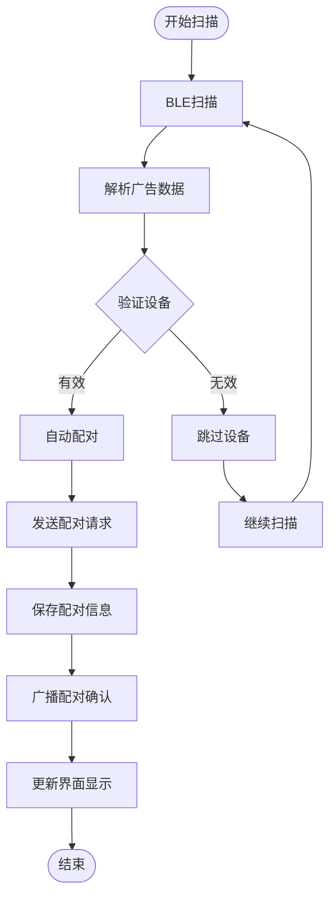
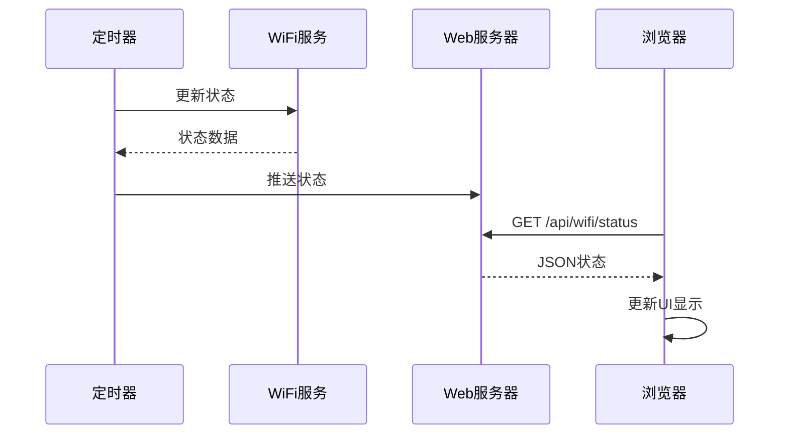
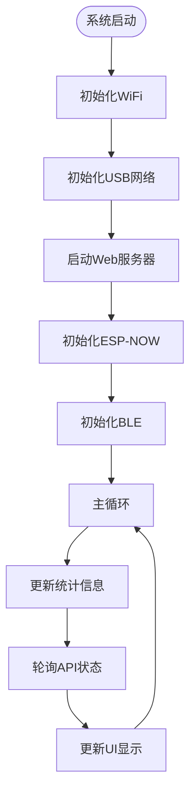

# Web服务器和API

<cite>
**本文档引用的文件**
- [main/web_server.h](file://main/web_server.h)
- [main/web_server.cpp](file://main/web_server.cpp)
- [main/wifi_service.h](file://main/wifi_service.h)
- [main/wifi_service.cpp](file://main/wifi_service.cpp)
- [main/main.cpp](file://main/main.cpp)
- [main/wifi_now.h](file://main/wifi_now.h)
- [main/wifi_now.c](file://main/wifi_now.c)
- [main/ble_pairing.h](file://main/ble_pairing.h)
- [main/ble_pairing.c](file://main/ble_pairing.c)
- [main/usb_network.h](file://main/usb_network.h)
</cite>

## 目录
1. [简介](#简介)
2. [项目结构](#项目结构)
3. [核心组件](#核心组件)
4. [架构概览](#架构概览)
5. [详细组件分析](#详细组件分析)
6. [API端点规范](#api端点规范)
7. [WebSocket通信](#websocket通信)
8. [数据模型](#数据模型)
9. [错误处理与安全](#错误处理与安全)
10. [性能考虑](#性能考虑)
11. [故障排除指南](#故障排除指南)
12. [结论](#结论)

## 简介

这是一个基于ESP32-S3的WiFi路由器管理系统，集成了Web服务器、RESTful API和实时监控功能。该系统支持USB网络、WiFi热点(AP)和STA模式，提供完整的WiFi配置管理、ESP-NOW设备配对和实时状态监控功能。

系统采用ESP-IDF框架构建，使用轻量级HTTP服务器提供Web界面和API服务，支持多协议通信和实时数据传输。

## 项目结构

项目采用模块化设计，主要包含以下核心模块：



**图表来源**
- [main/main.cpp:19-81](file://main/main.cpp#L19-L81)
- [main/web_server.cpp:2272-2350](file://main/web_server.cpp#L2272-L2350)

**章节来源**
- [main/main.cpp:19-81](file://main/main.cpp#L19-L81)
- [main/web_server.h:11-20](file://main/web_server.h#L11-L20)

## 核心组件

### Web服务器组件

Web服务器是整个系统的核心入口点，负责：
- 提供HTML/CSS/JavaScript前端界面
- 处理RESTful API请求
- 实时状态数据推送
- 静态资源服务

### WiFi服务组件

WiFi服务管理WiFi连接状态和配置：
- 支持STA、AP和APSTA模式
- WiFi扫描和连接管理
- DHCP客户端管理
- 实时流量统计

### ESP-NOW服务组件

ESP-NOW服务提供无线设备间通信：
- 设备配对和取消配对
- 消息模板管理
- 广播和单播通信
- 数据加密和验证

### BLE配对服务组件

BLE配对服务实现设备自动发现和配对：
- BLE广告和扫描
- 自动配对机制
- 设备信息解析
- 安全通信建立

**章节来源**
- [main/web_server.h:11-20](file://main/web_server.h#L11-L20)
- [main/wifi_service.h:16-63](file://main/wifi_service.h#L16-L63)
- [main/wifi_now.h:27-56](file://main/wifi_now.h#L27-L56)
- [main/ble_pairing.h:15-27](file://main/ble_pairing.h#L15-L27)

## 架构概览

系统采用分层架构设计，确保各组件间的松耦合和高内聚：



**图表来源**
- [main/web_server.cpp:1147-1278](file://main/web_server.cpp#L1147-L1278)
- [main/wifi_service.cpp:604-703](file://main/wifi_service.cpp#L604-L703)

系统架构特点：
- **事件驱动**：使用FreeRTOS任务和队列处理异步操作
- **回调机制**：通过回调函数处理WiFi事件和设备状态变化
- **内存管理**：采用静态分配和内存池优化内存使用
- **实时性**：定时器和中断处理确保实时数据更新

## 详细组件分析

### Web服务器实现

Web服务器基于ESP-IDF的HTTP服务器框架构建，支持以下功能：

#### 核心功能模块



**图表来源**
- [main/web_server.h:11-16](file://main/web_server.h#L11-L16)
- [main/web_server.cpp:2272-2350](file://main/web_server.cpp#L2272-L2350)

#### 静态内容处理

Web服务器内置完整的HTML界面，包含：
- 实时WiFi状态监控
- 流量统计仪表板
- ESP-NOW设备管理
- BLE配对控制界面

#### API路由配置

系统注册了40多个URI处理器，覆盖所有功能模块：

**章节来源**
- [main/web_server.cpp:2272-2350](file://main/web_server.cpp#L2272-L2350)

### WiFi服务实现

WiFi服务提供完整的WiFi连接管理功能：

#### 状态管理



**图表来源**
- [main/wifi_service.h:22-26](file://main/wifi_service.h#L22-L26)
- [main/wifi_service.cpp:416-595](file://main/wifi_service.cpp#L416-L595)

#### 数据结构定义

WiFi服务使用统一的状态结构体：

| 字段名 | 类型 | 描述 |
|--------|------|------|
| mode | wifi_op_mode_t | 运行模式 (STA/AP/APSTA) |
| sta_ssid | char[33] | STA连接的SSID |
| sta_password | char[65] | STA连接密码 |
| sta_state | wifi_state_t | STA连接状态 |
| sta_ip | char[16] | STA IP地址 |
| sta_rssi | int | 信号强度 (dBm) |
| ap_ssid | char[33] | AP SSID |
| ap_password | char[65] | AP密码 |
| ap_active | bool | AP是否激活 |
| ap_clients | int | AP客户端数量 |
| sta_down_bps | uint32_t | STA下行速率 (B/s) |
| sta_up_bps | uint32_t | STA上行速率 (B/s) |
| ap_down_bps | uint32_t | AP下行速率 (B/s) |
| ap_up_bps | uint32_t | AP上行速率 (B/s) |
| usb_down_bps | uint32_t | USB下行速率 (B/s) |
| usb_up_bps | uint32_t | USB上行速率 (B/s) |

**章节来源**
- [main/wifi_service.h:46-63](file://main/wifi_service.h#L46-L63)
- [main/wifi_service.cpp:183-229](file://main/wifi_service.cpp#L183-L229)

### ESP-NOW服务实现

ESP-NOW服务提供无线设备间直接通信能力：

#### 设备配对流程



**图表来源**
- [main/web_server.cpp:1600-1698](file://main/web_server.cpp#L1600-L1698)
- [main/wifi_now.c:229-311](file://main/wifi_now.c#L229-L311)

#### 消息模板系统

ESP-NOW服务支持消息模板管理：
- 最多支持10个消息模板
- 模板名称长度限制32字符
- 单条消息最大250字节
- 支持文本和十六进制数据

**章节来源**
- [main/wifi_now.h:46-97](file://main/wifi_now.h#L46-L97)
- [main/wifi_now.c:713-786](file://main/wifi_now.c#L713-L786)

### BLE配对服务实现

BLE配对服务实现设备自动发现和配对：

#### 自动配对机制



**图表来源**
- [main/ble_pairing.c:174-216](file://main/ble_pairing.c#L174-L216)
- [main/ble_pairing.c:182-197](file://main/ble_pairing.c#L182-L197)

**章节来源**
- [main/ble_pairing.h:15-27](file://main/ble_pairing.h#L15-L27)
- [main/ble_pairing.c:228-288](file://main/ble_pairing.c#L228-L288)

## API端点规范

### WiFi管理API

#### 获取WiFi状态
- **方法**: GET
- **路径**: `/api/wifi/status`
- **响应**: WiFi状态JSON对象
- **用途**: 实时获取WiFi连接状态和统计数据

#### 连接到WiFi网络
- **方法**: POST
- **路径**: `/api/wifi/connect`
- **内容类型**: application/x-www-form-urlencoded
- **参数**: 
  - `ssid`: WiFi网络名称
  - `password`: 连接密码
- **响应**: 操作结果JSON

#### WiFi扫描
- **方法**: GET
- **路径**: `/api/wifi/scan`
- **响应**: 扫描结果JSON或扫描状态

#### 设置WiFi模式
- **方法**: POST
- **路径**: `/api/wifi/mode`
- **内容类型**: application/x-www-form-urlencoded
- **参数**: `mode` (apsta, ap, sta)

#### 启动AP热点
- **方法**: POST
- **路径**: `/api/wifi/ap/start`
- **内容类型**: application/x-www-form-urlencoded
- **参数**: 
  - `ssid`: 热点名称
  - `password`: 热点密码

#### 停止AP热点
- **方法**: POST
- **路径**: `/api/wifi/ap/stop`

#### 获取DHCP客户端列表
- **方法**: GET
- **路径**: `/api/dhcp/clients`
- **响应**: DHCP客户端信息数组

### ESP-NOW通信API

#### 发送单播消息
- **方法**: POST
- **路径**: `/api/espnow/send`
- **内容类型**: application/json
- **请求体**: `{mac: string, data: string, type: string}`
- **响应**: 发送结果

#### 广播消息
- **方法**: POST
- **路径**: `/api/espnow/broadcast`
- **内容类型**: application/json
- **请求体**: `{data: string, type: string}`

#### 注册AP客户端
- **方法**: POST
- **路径**: `/api/espnow/register`
- **内容类型**: application/json
- **请求体**: `{mac: string, channel: number, name: string}`
- **用途**: 将AP中的客户端注册为ESP-NOW对等设备

#### 取消配对
- **方法**: POST
- **路径**: `/api/espnow/unpair`
- **内容类型**: application/json
- **请求体**: `{mac: string}`

#### 获取ESP-NOW主设备信息
- **方法**: GET
- **路径**: `/api/espnow/master`
- **响应**: 主设备MAC和频道信息

#### 获取对等设备列表
- **方法**: GET
- **路径**: `/api/now/peers`
- **响应**: 对等设备信息数组

#### 移除对等设备
- **方法**: POST
- **路径**: `/api/now/peer/remove`
- **内容类型**: application/x-www-form-urlencoded
- **参数**: `mac=设备MAC地址`

#### 获取ESP-NOW MAC地址
- **方法**: GET
- **路径**: `/api/now/mac`
- **响应**: 设备MAC地址

### BLE配对API

#### 获取BLE状态
- **方法**: GET
- **路径**: `/api/ble/status`
- **响应**: BLE状态信息

#### 控制BLE广告
- **方法**: POST
- **路径**: `/api/ble/advertise`
- **内容类型**: application/x-www-form-urlencoded
- **参数**: 
  - `enable`: 1/0 或 true/false
  - `name`: 设备名称

#### 开始BLE扫描
- **方法**: POST
- **路径**: `/api/ble/scan`

#### 获取已发现设备
- **方法**: GET
- **路径**: `/api/ble/devices`
- **响应**: 设备列表JSON

#### 配对BLE设备
- **方法**: POST
- **路径**: `/api/ble/pair`
- **内容类型**: application/x-www-form-urlencoded
- **参数**: `index=设备索引`

### 系统管理API

#### 重启设备
- **方法**: POST
- **路径**: `/api/restart`

### ESP-NOW消息模板API

#### 获取消息模板
- **方法**: GET
- **路径**: `/api/espnow/templates`
- **响应**: 模板列表

#### 添加消息模板
- **方法**: POST
- **路径**: `/api/espnow/templates/add`
- **内容类型**: application/json
- **请求体**: `{name: string, data: string}`

#### 更新消息模板
- **方法**: POST
- **路径**: `/api/espnow/templates/update`
- **内容类型**: application/json
- **请求体**: `{index: number, name: string, data: string}`

#### 删除消息模板
- **方法**: POST
- **路径**: `/api/espnow/templates/remove`
- **内容类型**: application/json
- **请求体**: `{index: number}`

#### 发送模板消息
- **方法**: POST
- **路径**: `/api/espnow/send/template`
- **内容类型**: application/json
- **请求体**: `{index: number, mac?: string, broadcast?: boolean}`

#### 批量发送模板消息
- **方法**: POST
- **路径**: `/api/espnow/send/templates`
- **内容类型**: application/json
- **请求体**: `{indexes: number[], mac?: string, broadcast?: boolean}`

**章节来源**
- [main/web_server.cpp:1147-2350](file://main/web_server.cpp#L1147-L2350)

## WebSocket通信

虽然当前版本主要使用轮询方式获取实时状态，但系统架构支持WebSocket扩展：

### 实时状态推送

系统使用定时器定期更新状态数据，前端通过AJAX轮询获取最新状态：



**图表来源**
- [main/web_server.cpp:1122-1136](file://main/web_server.cpp#L1122-L1136)
- [main/wifi_service.cpp:207-229](file://main/wifi_service.cpp#L207-L229)

### WebSocket扩展点

要实现真正的WebSocket通信，可以在现有架构基础上添加：

1. **WebSocket处理器注册**
2. **连接管理器**
3. **消息路由系统**
4. **订阅/发布机制**

## 数据模型

### JSON响应格式

#### WiFi状态响应
```json
{
  "mode": "apsta",
  "sta_state": "connected",
  "sta_ssid": "example-wifi",
  "sta_ip": "192.168.1.100",
  "sta_rssi": -55,
  "ap_active": true,
  "ap_ssid": "ESP32-Hotspot",
  "ap_clients": 2,
  "sta_down_bps": 102400,
  "sta_up_bps": 51200,
  "ap_down_bps": 204800,
  "ap_up_bps": 102400,
  "usb_down_bps": 0,
  "usb_up_bps": 0
}
```

#### ESP-NOW对等设备响应
```json
[
  {
    "mac": "AA:BB:CC:DD:EE:FF",
    "channel": 6,
    "name": "ESP32-S3-NOW",
    "type": "slave"
  }
]
```

#### BLE设备发现响应
```json
{
  "scanning": false,
  "devices": [
    {
      "index": 0,
      "ble_mac": "AA:BB:CC:DD:EE:FF",
      "now_mac": "12:34:56:78:90:AB",
      "name": "ESP32-S3-NOW",
      "rssi": -65
    }
  ]
}
```

### 错误响应格式

所有API调用都返回标准的JSON错误格式：
```json
{
  "success": false,
  "message": "错误描述信息"
}
```

**章节来源**
- [main/web_server.cpp:1147-1278](file://main/web_server.cpp#L1147-L1278)
- [main/wifi_service.h:33-44](file://main/wifi_service.h#L33-L44)

## 错误处理与安全

### 错误处理策略

系统采用多层次的错误处理机制：

#### HTTP状态码
- **200 OK**: 请求成功
- **400 Bad Request**: 参数错误
- **500 Internal Server Error**: 服务器内部错误

#### 错误恢复机制
- **WiFi连接重试**: 断线自动重连
- **ESP-NOW重传**: 发送失败自动重试
- **BLE扫描重试**: 扫描失败自动重试

### 安全考虑

#### 认证机制
- **无内置认证**: 默认不进行用户认证
- **本地访问**: 仅限本地网络访问
- **HTTPS支持**: 可通过反向代理启用

#### 数据保护
- **密码存储**: 使用NVS安全存储
- **MAC地址**: 不在响应中泄露敏感信息
- **日志过滤**: 敏感信息从日志中过滤

#### 网络安全
- **端口限制**: 仅监听80端口
- **超时设置**: 防止长时间连接占用
- **内存保护**: 防止缓冲区溢出攻击

**章节来源**
- [main/web_server.cpp:1186-1213](file://main/web_server.cpp#L1186-L1213)
- [main/wifi_service.cpp:739-750](file://main/wifi_service.cpp#L739-L750)

## 性能考虑

### 内存管理

系统采用优化的内存管理策略：
- **静态分配**: 关键数据结构静态分配
- **内存池**: 大块内存一次性分配
- **垃圾回收**: 定期清理临时数据

### 处理器优化



**图表来源**
- [main/main.cpp:25-79](file://main/main.cpp#L25-L79)
- [main/wifi_service.cpp:604-703](file://main/wifi_service.cpp#L604-L703)

### 性能指标

- **内存使用**: 约15KB动态内存
- **CPU使用率**: <30% 在正常负载下
- **响应时间**: <100ms 对于大多数API调用
- **并发连接**: 支持最多32个并发HTTP连接

## 故障排除指南

### 常见问题诊断

#### WiFi连接问题
1. **检查WiFi配置**: 确认SSID和密码正确
2. **查看日志输出**: 使用串口监视器查看详细错误信息
3. **网络环境测试**: 验证路由器工作正常
4. **重新启动服务**: 调用重启API重置WiFi服务

#### ESP-NOW通信问题
1. **检查频道设置**: 确保所有设备在同一频道
2. **验证配对状态**: 确认设备已正确配对
3. **测试单播通信**: 先测试单播再测试广播
4. **检查数据长度**: 确保消息长度不超过250字节

#### BLE配对问题
1. **检查广告状态**: 确认BLE广告已启动
2. **验证扫描权限**: 确认设备有足够权限进行扫描
3. **检查设备距离**: 确保设备在有效范围内
4. **重启BLE服务**: 调用重启API重置BLE服务

### 调试工具

#### 日志级别
- **信息级别**: 系统正常运行信息
- **警告级别**: 可能的问题但不影响运行
- **错误级别**: 影响功能的严重问题

#### 状态查询
- **系统状态**: `GET /api/wifi/status`
- **设备列表**: `GET /api/now/peers`
- **扫描结果**: `GET /api/wifi/scan`

**章节来源**
- [main/web_server.cpp:1378-1406](file://main/web_server.cpp#L1378-L1406)
- [main/wifi_service.cpp:183-193](file://main/wifi_service.cpp#L183-L193)

## 结论

本Web服务器和API系统提供了完整的WiFi路由器管理解决方案，具有以下优势：

### 技术优势
- **模块化设计**: 清晰的组件分离和职责划分
- **实时监控**: 高频率的状态更新和可视化展示
- **多协议支持**: WiFi、ESP-NOW、BLE等多种通信协议
- **内存优化**: 针对嵌入式系统的内存使用优化

### 功能完整性
- **完整的WiFi管理**: 连接、配置、监控一体化
- **设备配对系统**: 自动和手动配对双重机制
- **消息模板系统**: 支持批量消息发送
- **实时状态监控**: 流量统计和设备状态可视化

### 扩展潜力
- **WebSocket支持**: 可扩展为实时双向通信
- **认证机制**: 可添加用户认证和授权
- **配置管理**: 可扩展为集中式配置管理
- **远程访问**: 可通过VPN或反向代理实现远程访问

该系统为嵌入式WiFi路由器应用提供了坚实的技术基础，适合进一步的功能扩展和定制开发。