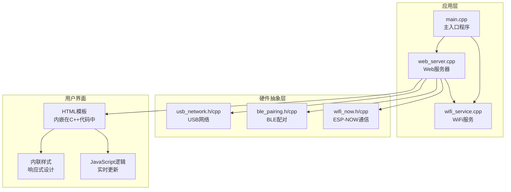
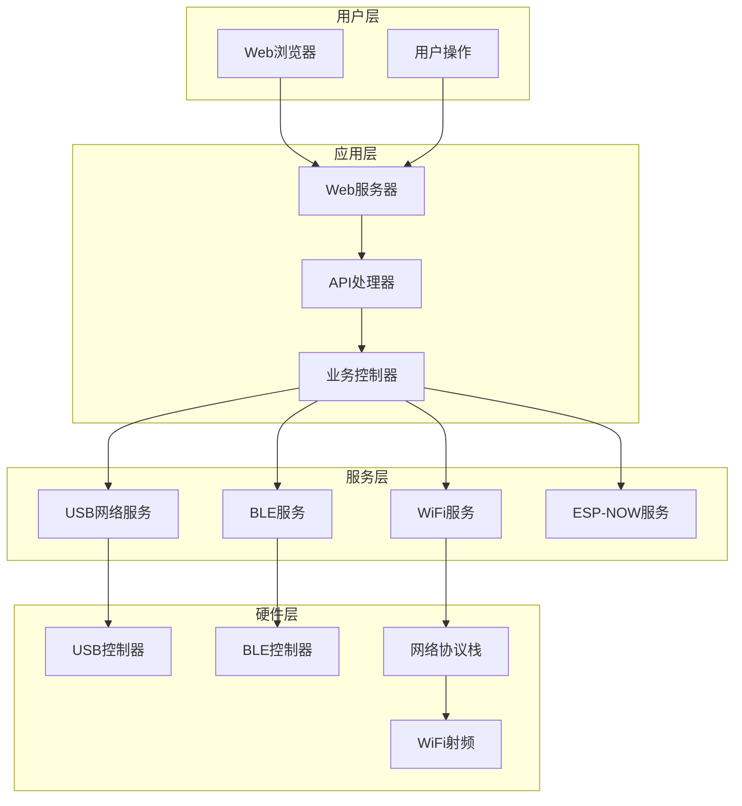
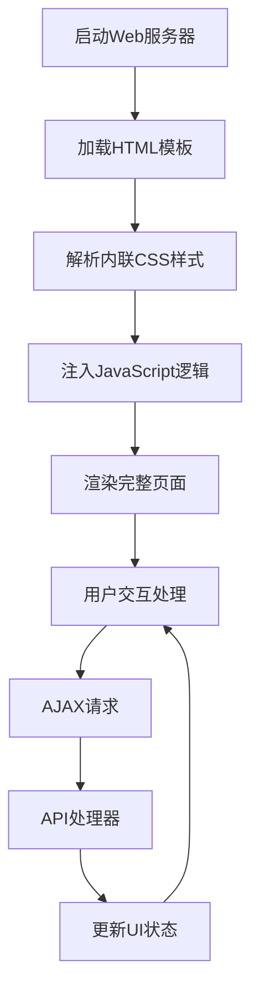
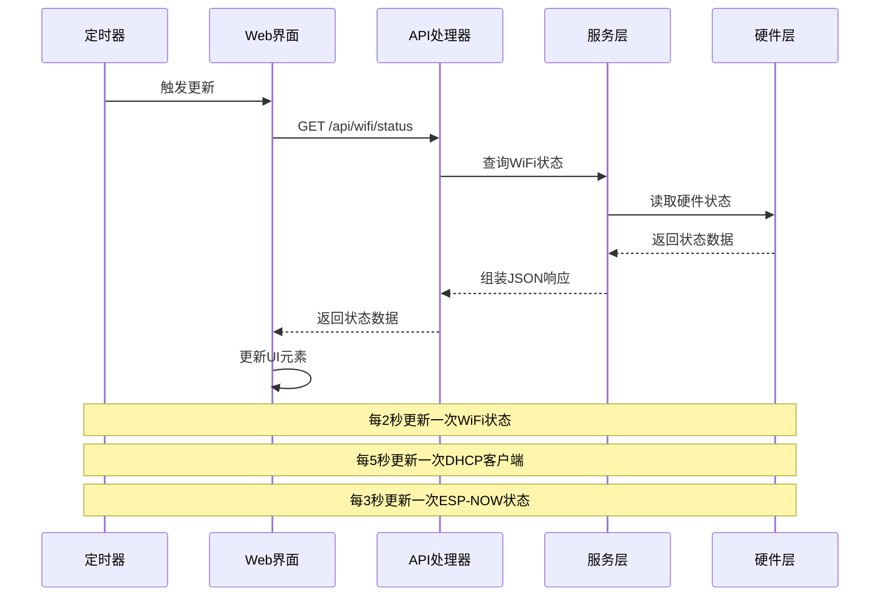
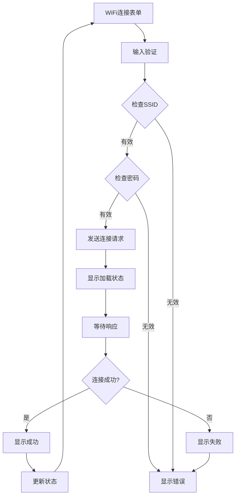
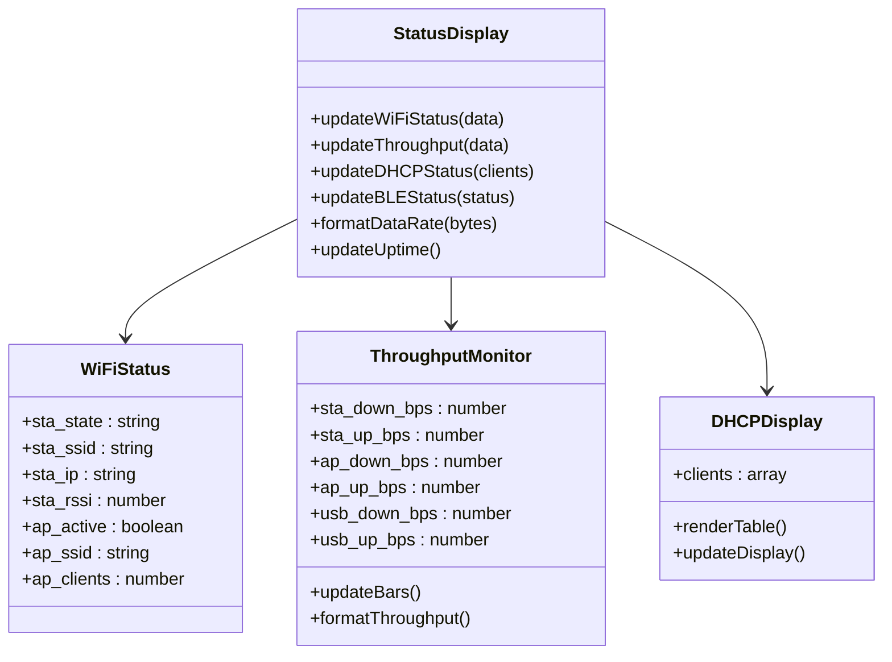
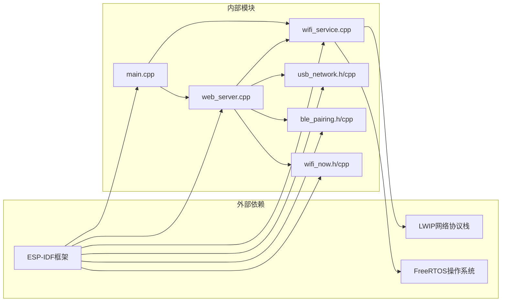

# Web界面架构

<cite>
**本文档引用的文件**
- [web_server.cpp](file://main/web_server.cpp)
- [web_server.h](file://main/web_server.h)
- [main.cpp](file://main/main.cpp)
- [wifi_service.cpp](file://main/wifi_service.cpp)
- [index.html](file://managed_components/espressif__tinyusb/examples/device/webusb_serial/website/index.html)
- [style.css](file://managed_components/espressif__tinyusb/examples/device/webusb_serial/website/style.css)
- [application.js](file://managed_components/espressif__tinyusb/examples/device/webusb_serial/website/application.js)
</cite>

## 目录
1. [简介](#简介)
2. [项目结构](#项目结构)
3. [核心组件](#核心组件)
4. [架构概览](#架构概览)
5. [详细组件分析](#详细组件分析)
6. [依赖关系分析](#依赖关系分析)
7. [性能考虑](#性能考虑)
8. [故障排除指南](#故障排除指南)
9. [结论](#结论)

## 简介

这是一个基于ESP32-S3的WiFi路由器项目，提供了完整的Web界面管理系统。该系统集成了USB网络、WiFi AP/STA双模运行、BLE配对和ESP-NOW通信功能，通过直观的Web界面实现了设备状态监控、配置管理和实时数据传输。

系统采用嵌入式C++开发，使用ESP-IDF框架构建，Web界面通过本地HTTP服务器提供服务，支持实时状态更新和用户交互操作。

## 项目结构

该项目采用模块化架构设计，主要包含以下核心模块：

**图表来源**
- [main.cpp:19-81](file://main/main.cpp#L19-L81)
- [web_server.cpp:2272-2350](file://main/web_server.cpp#L2272-L2350)

**章节来源**
- [main.cpp:1-81](file://main/main.cpp#L1-L81)
- [web_server.h:1-22](file://main/web_server.h#L1-L22)

## 核心组件

### Web服务器组件

Web服务器是整个系统的前端控制中心，负责处理HTTP请求和提供Web界面服务。

**主要特性：**
- 内置HTTP服务器，端口80
- 支持RESTful API接口
- 实时状态监控更新
- 用户交互处理

**API接口列表：**
- `/api/wifi/status` - 获取WiFi状态
- `/api/wifi/connect` - 连接WiFi网络
- `/api/wifi/ap/start` - 启动热点
- `/api/wifi/ap/stop` - 停止热点
- `/api/dhcp/clients` - 获取DHCP客户端信息
- `/api/ble/status` - 获取BLE状态
- `/api/espnow/send` - 发送ESP-NOW消息

**章节来源**
- [web_server.cpp:2279-2336](file://main/web_server.cpp#L2279-L2336)

### WiFi服务组件

WiFi服务组件负责WiFi网络的配置和管理，支持STA、AP和APSTA三种模式。

**核心功能：**
- WiFi连接管理
- 热点配置和控制
- 网络状态监控
- 实时流量统计

**章节来源**
- [wifi_service.cpp:604-703](file://main/wifi_service.cpp#L604-L703)

### 用户界面组件

Web界面采用现代化的设计理念，提供了完整的用户交互体验。

**界面特色：**
- 响应式设计，支持移动设备
- 实时状态指示器
- 流量监控图表
- 配置表单验证

**章节来源**
- [web_server.cpp:34-1139](file://main/web_server.cpp#L34-L1139)

## 架构概览

系统采用分层架构设计，确保了良好的模块分离和可维护性：

**图表来源**
- [main.cpp:25-46](file://main/main.cpp#L25-L46)
- [web_server.cpp:2272-2350](file://main/web_server.cpp#L2272-L2350)

## 详细组件分析

### Web界面渲染引擎

Web界面采用内联HTML模板的方式，直接在C++代码中定义完整的HTML结构：

**图表来源**
- [web_server.cpp:34-1141](file://main/web_server.cpp#L34-L1141)

**章节来源**
- [web_server.cpp:395-1137](file://main/web_server.cpp#L395-L1137)

### 实时状态监控系统

系统实现了多维度的实时状态监控，通过定时器和事件驱动机制确保数据的及时更新：

**图表来源**
- [web_server.cpp:1122-1136](file://main/web_server.cpp#L1122-L1136)

**章节来源**
- [web_server.cpp:495-515](file://main/web_server.cpp#L495-L515)
- [web_server.cpp:1122-1136](file://main/web_server.cpp#L1122-L1136)

### 用户认证界面

系统提供了完整的WiFi网络连接界面，支持安全的网络配置：

**图表来源**
- [web_server.cpp:588-601](file://main/web_server.cpp#L588-L601)

**章节来源**
- [web_server.cpp:588-601](file://main/web_server.cpp#L588-L601)

### 配置管理页面

系统提供了灵活的配置管理功能，支持多种网络模式的切换：

**支持的配置选项：**
- WiFi网络名称和密码设置
- 热点参数配置
- 网络模式选择（STA/AP/APSTA）
- 设备重启功能

**章节来源**
- [web_server.cpp:603-627](file://main/web_server.cpp#L603-L627)

### 状态显示组件

系统实现了丰富的状态显示组件，提供直观的网络状态可视化：

**图表来源**
- [web_server.cpp:426-493](file://main/web_server.cpp#L426-L493)
- [web_server.cpp:414-424](file://main/web_server.cpp#L414-L424)

**章节来源**
- [web_server.cpp:426-493](file://main/web_server.cpp#L426-L493)

### 主题配置和响应式设计

系统采用了现代化的主题配置和响应式设计：

**主题特性：**
- 深色/浅色主题切换
- 自适应布局设计
- 移动设备优化
- 动画和过渡效果

**章节来源**
- [style.css:217-297](file://managed_components/espressif__tinyusb/examples/device/webusb_serial/website/style.css#L217-L297)

## 依赖关系分析

系统各组件之间的依赖关系清晰明确，遵循了良好的软件工程原则：

**图表来源**
- [main.cpp:1-14](file://main/main.cpp#L1-L14)
- [web_server.h:4-5](file://main/web_server.h#L4-L5)

**章节来源**
- [main.cpp:1-14](file://main/main.cpp#L1-L14)
- [web_server.h:4-5](file://main/web_server.h#L4-L5)

## 性能考虑

系统在设计时充分考虑了性能优化：

**内存管理：**
- 使用静态分配减少动态内存碎片
- 合理的缓冲区大小控制
- 及时释放不再使用的资源

**网络优化：**
- 定时器精确控制更新频率
- 批量处理网络请求
- 避免阻塞操作

**用户体验：**
- 实时状态更新避免用户等待
- 输入验证防止无效请求
- 错误处理提供友好提示

## 故障排除指南

### 常见问题及解决方案

**Web界面无法访问：**
1. 检查设备是否正确连接到网络
2. 确认Web服务器是否正常启动
3. 验证防火墙设置是否允许HTTP访问

**WiFi连接失败：**
1. 确认WiFi密码长度至少8位
2. 检查目标网络是否支持WPA2加密
3. 验证网络名称拼写是否正确

**实时数据不更新：**
1. 检查浏览器JavaScript是否启用
2. 确认网络连接稳定
3. 刷新页面重新建立连接

**章节来源**
- [web_server.cpp:595-600](file://main/web_server.cpp#L595-L600)

## 结论

该Web界面架构展现了现代嵌入式系统设计的最佳实践。通过模块化设计、清晰的层次结构和完善的错误处理机制，系统实现了功能丰富且易于维护的网络管理平台。

**主要优势：**
- 完整的功能覆盖：从基础WiFi管理到高级ESP-NOW通信
- 良好的用户体验：直观的界面设计和实时反馈
- 良好的性能表现：高效的资源管理和优化的更新机制
- 易于扩展：模块化架构便于功能扩展和维护

该架构为类似嵌入式网络管理系统的开发提供了优秀的参考模板，展示了如何在资源受限的环境中实现复杂的Web界面功能。