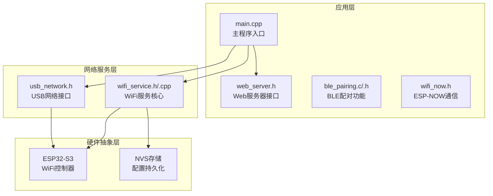
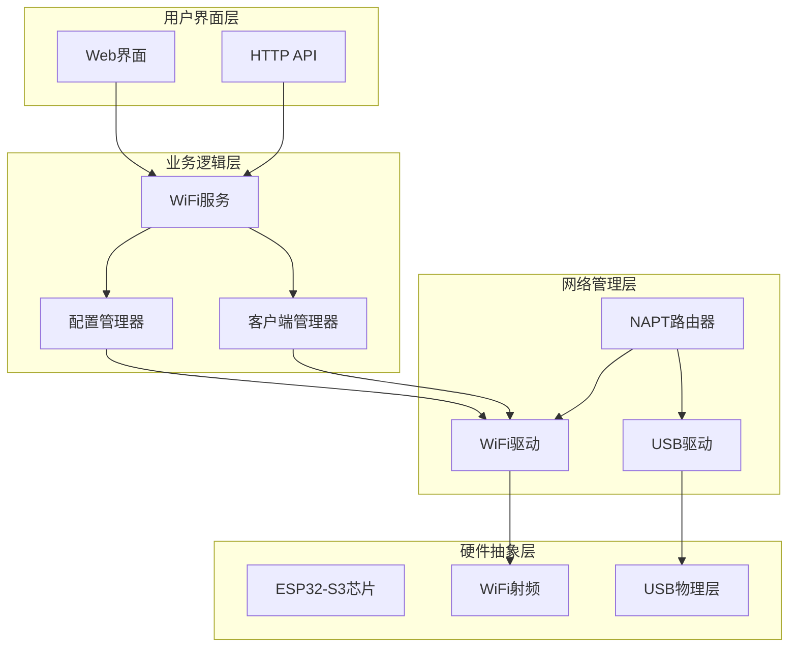
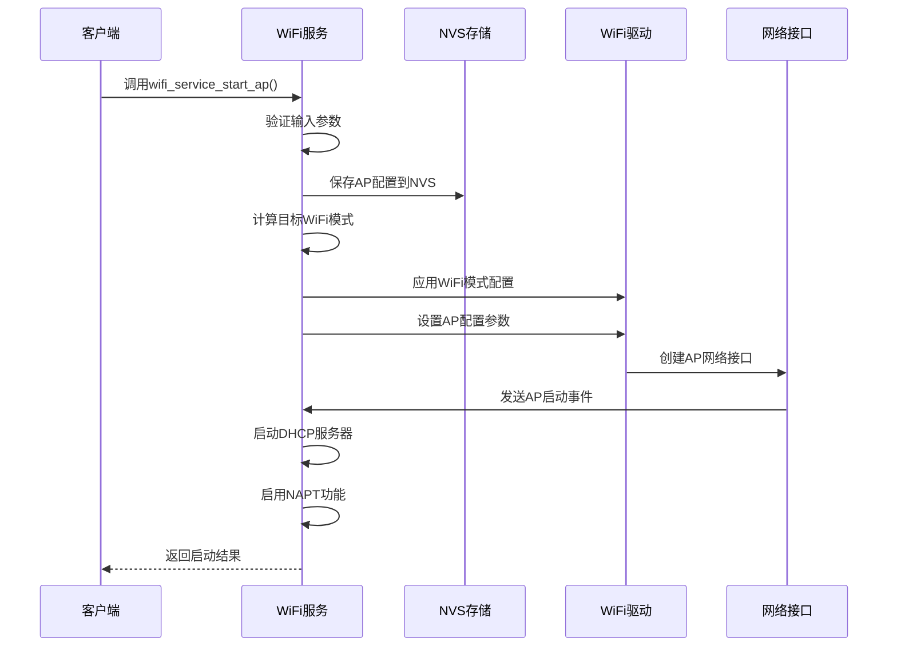
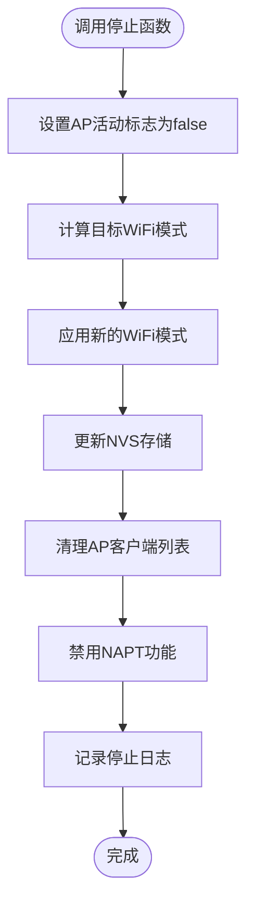
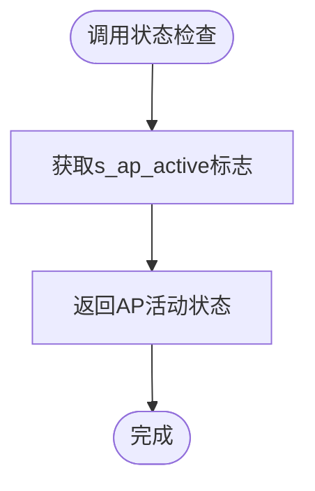
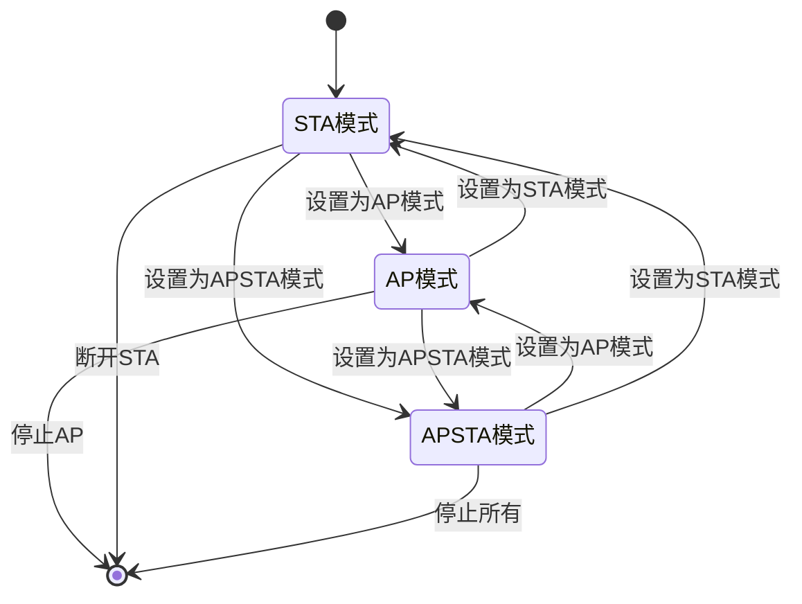
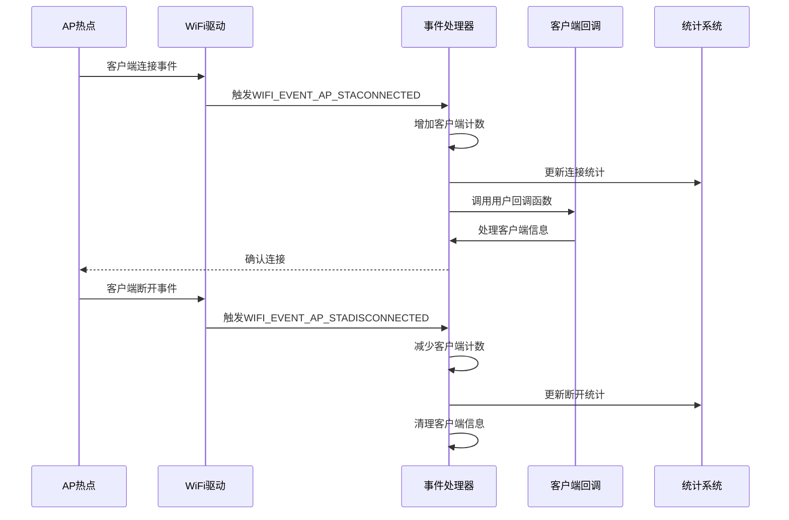
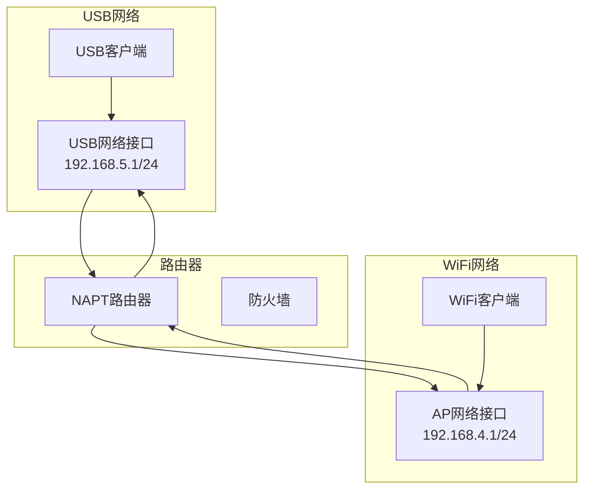
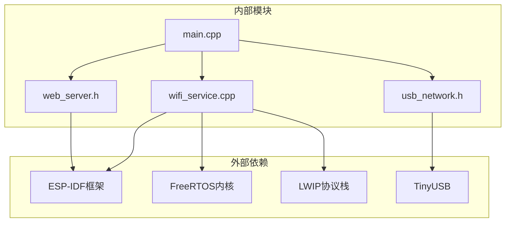

# WiFi AP配置

<cite>
**本文档引用的文件**
- [wifi_service.h](file://main/wifi_service.h)
- [wifi_service.cpp](file://main/wifi_service.cpp)
- [main.cpp](file://main/main.cpp)
- [web_server.h](file://main/web_server.h)
- [usb_network.h](file://main/usb_network.h)
- [wifi_now.h](file://main/wifi_now.h)
- [sdkconfig.defaults](file://sdkconfig.defaults)
- [partitions.csv](file://partitions.csv)
</cite>

## 目录
1. [简介](#简介)
2. [项目结构](#项目结构)
3. [核心组件](#核心组件)
4. [架构概览](#架构概览)
5. [详细组件分析](#详细组件分析)
6. [依赖关系分析](#依赖关系分析)
7. [性能考虑](#性能考虑)
8. [故障排除指南](#故障排除指南)
9. [结论](#结论)

## 简介

本项目是一个基于ESP32-S3的WiFi AP配置管理系统，提供了完整的WiFi接入点(AP)功能，包括AP模式的启动和停止机制、客户端管理、网络拓扑控制以及多种操作模式支持。该系统集成了USB网络共享功能，通过NAPT技术实现WiFi与USB网络之间的流量转发，为用户提供灵活的网络配置选项。

## 项目结构

该项目采用模块化设计，主要包含以下核心模块：

**图表来源**
- [main.cpp:19-81](file://main/main.cpp#L19-L81)
- [wifi_service.h:1-99](file://main/wifi_service.h#L1-L99)
- [usb_network.h:1-22](file://main/usb_network.h#L1-L22)

**章节来源**
- [main.cpp:19-81](file://main/main.cpp#L19-L81)
- [CMakeLists.txt:1-7](file://CMakeLists.txt#L1-L7)

## 核心组件

### WiFi服务核心组件

WiFi服务是整个系统的核心，负责管理WiFi的各种操作模式和配置。主要组件包括：

- **WiFi状态管理**：维护STA、AP、APSTA三种操作模式的状态
- **AP配置管理**：管理AP的SSID、密码、信道等配置参数
- **客户端管理**：跟踪AP客户端连接状态和统计数据
- **网络事件处理**：响应WiFi事件并执行相应的处理逻辑

### 网络接口组件

系统提供了多种网络接口以支持不同的使用场景：

- **USB网络接口**：通过TinyUSB实现USB网络共享
- **Web服务器接口**：提供HTTP API用于配置管理和状态查询
- **ESP-NOW接口**：支持设备间直接通信

**章节来源**
- [wifi_service.h:16-63](file://main/wifi_service.h#L16-L63)
- [wifi_service.cpp:42-65](file://main/wifi_service.cpp#L42-L65)

## 架构概览

系统采用分层架构设计，实现了清晰的职责分离：

**图表来源**
- [wifi_service.cpp:604-703](file://main/wifi_service.cpp#L604-L703)
- [sdkconfig.defaults:7-10](file://sdkconfig.defaults#L7-L10)

## 详细组件分析

### AP模式启动机制

AP模式的启动通过`wifi_service_start_ap`函数实现，该函数负责配置AP参数并启动WiFi AP功能。

#### 启动流程

**图表来源**
- [wifi_service.cpp:817-855](file://main/wifi_service.cpp#L817-L855)
- [wifi_service.cpp:308-328](file://main/wifi_service.cpp#L308-L328)

#### AP配置参数详解

系统支持以下AP配置参数：

| 参数名称 | 默认值 | 最大长度 | 描述 |
|---------|--------|----------|------|
| SSID | "ESP32-S3-AP" | 32字符 | WiFi网络名称 |
| 密码 | "12345678" | 64字符 | WiFi网络密码 |
| 最大连接数 | 4 | 无限制 | AP允许的最大客户端数量 |
| 信道 | 1 | 1-14 | WiFi工作信道 |
| 认证模式 | WPA2-PSK | 固定 | WiFi认证方式 |

**章节来源**
- [wifi_service.cpp:36-41](file://main/wifi_service.cpp#L36-L41)
- [wifi_service.cpp:318-326](file://main/wifi_service.cpp#L318-L326)
- [wifi_service.cpp:835-844](file://main/wifi_service.cpp#L835-L844)

### AP模式停止机制

AP模式的停止通过`wifi_service_stop_ap`函数实现，负责清理AP资源并恢复到之前的WiFi模式。

#### 停止流程

**图表来源**
- [wifi_service.cpp:857-867](file://main/wifi_service.cpp#L857-L867)

**章节来源**
- [wifi_service.cpp:857-867](file://main/wifi_service.cpp#L857-L867)

### AP活动状态检查

活动状态检查通过`wifi_service_is_ap_active`函数实现，该函数返回当前AP是否处于活动状态。

#### 状态检查逻辑

**图表来源**
- [wifi_service.cpp:869-872](file://main/wifi_service.cpp#L869-L872)

**章节来源**
- [wifi_service.cpp:869-872](file://main/wifi_service.cpp#L869-L872)

### 模式设置与管理

系统支持三种操作模式，通过`wifi_service_set_mode`和`wifi_service_get_mode`函数进行管理。

#### 模式切换流程

**图表来源**
- [wifi_service.cpp:764-810](file://main/wifi_service.cpp#L764-L810)
- [wifi_service.cpp:812-815](file://main/wifi_service.cpp#L812-L815)

**章节来源**
- [wifi_service.cpp:764-810](file://main/wifi_service.cpp#L764-L810)
- [wifi_service.cpp:812-815](file://main/wifi_service.cpp#L812-L815)

### AP客户端管理

系统提供了完整的AP客户端管理功能，包括客户端连接事件处理和统计信息收集。

#### 客户端事件处理

**图表来源**
- [wifi_service.cpp:452-497](file://main/wifi_service.cpp#L452-L497)
- [wifi_service.cpp:72-76](file://main/wifi_service.cpp#L72-L76)

#### 客户端回调机制

系统提供了灵活的客户端回调机制，允许应用程序在客户端连接或断开时接收通知。

**章节来源**
- [wifi_service.h:65-67](file://main/wifi_service.h#L65-L67)
- [wifi_service.cpp:452-497](file://main/wifi_service.cpp#L452-L497)

### 网络拓扑和流量管理

系统集成了NAPT（网络地址转换）功能，实现WiFi网络与USB网络之间的流量共享。

#### 网络拓扑结构

**图表来源**
- [wifi_service.cpp:248-299](file://main/wifi_service.cpp#L248-L299)
- [sdkconfig.defaults:7-10](file://sdkconfig.defaults#L7-L10)

**章节来源**
- [wifi_service.cpp:248-299](file://main/wifi_service.cpp#L248-L299)
- [sdkconfig.defaults:7-10](file://sdkconfig.defaults#L7-L10)

## 依赖关系分析

系统的主要依赖关系如下：

**图表来源**
- [main.cpp:10-13](file://main/main.cpp#L10-L13)
- [wifi_service.cpp:1-20](file://main/wifi_service.cpp#L1-L20)

**章节来源**
- [main.cpp:10-13](file://main/main.cpp#L10-L13)
- [wifi_service.cpp:1-20](file://main/wifi_service.cpp#L1-L20)

## 性能考虑

### 内存管理

系统采用了高效的内存管理策略：

- **静态分配**：关键数据结构采用静态分配，避免运行时内存碎片
- **缓冲区管理**：合理设置缓冲区大小，平衡内存使用和性能
- **垃圾回收**：及时清理不再使用的资源，防止内存泄漏

### 任务调度

系统使用FreeRTOS进行任务调度：

- **优先级设置**：根据任务重要性设置不同优先级
- **队列机制**：使用队列实现异步任务处理
- **信号量同步**：使用信号量保证线程安全

### 网络性能优化

- **定时器优化**：合理设置定时器周期，平衡CPU使用和响应性
- **事件驱动**：采用事件驱动模型减少轮询开销
- **流量控制**：实现流量控制机制防止网络拥塞

## 故障排除指南

### 常见问题及解决方案

#### AP启动失败

**症状**：调用`wifi_service_start_ap`后AP无法启动

**可能原因**：
1. WiFi驱动初始化失败
2. NVS存储写入失败
3. 网络接口创建失败

**解决步骤**：
1. 检查WiFi驱动状态
2. 验证NVS存储权限
3. 确认网络接口配置

#### 客户端连接异常

**症状**：客户端能够连接但无法访问网络

**可能原因**：
1. NAPT功能未启用
2. DHCP服务器配置错误
3. 防火墙规则阻止流量

**解决步骤**：
1. 检查NAPT状态
2. 验证DHCP配置
3. 检查防火墙规则

#### 内存不足

**症状**：系统运行一段时间后出现内存不足

**可能原因**：
1. 缓冲区溢出
2. 内存泄漏
3. 配置不当

**解决步骤**：
1. 检查内存使用情况
2. 分析内存泄漏源
3. 调整缓冲区大小

**章节来源**
- [wifi_service.cpp:416-595](file://main/wifi_service.cpp#L416-L595)

## 结论

本WiFi AP配置系统提供了完整而灵活的WiFi接入点管理功能。通过模块化的架构设计和完善的错误处理机制，系统能够在各种使用场景下稳定运行。主要特点包括：

1. **多模式支持**：支持STA、AP、APSTA三种操作模式
2. **完整的AP管理**：从启动到停止的完整生命周期管理
3. **客户端管理**：提供客户端连接状态监控和统计
4. **网络共享**：通过NAPT实现WiFi与USB网络的流量共享
5. **配置持久化**：使用NVS存储实现配置的持久化

该系统为开发者提供了强大的WiFi AP配置能力，适用于各种物联网和嵌入式应用场景。