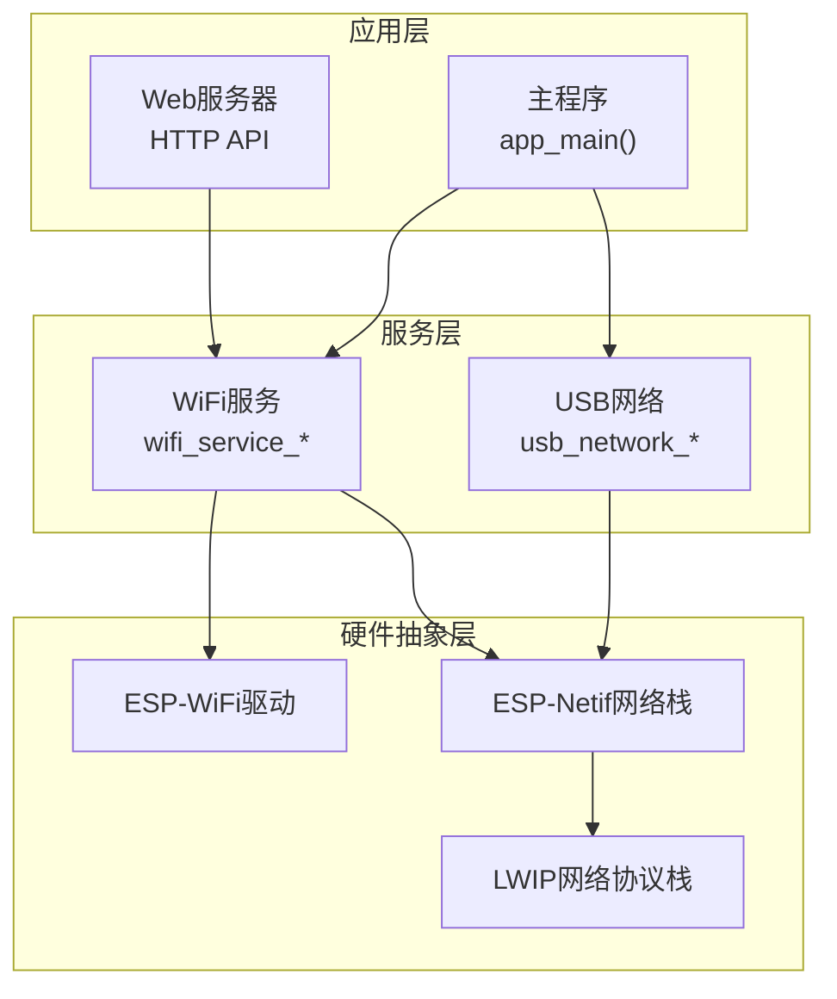
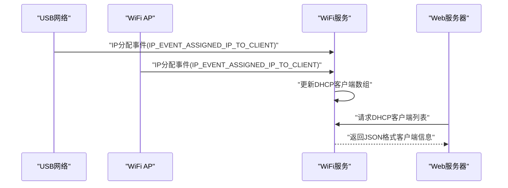
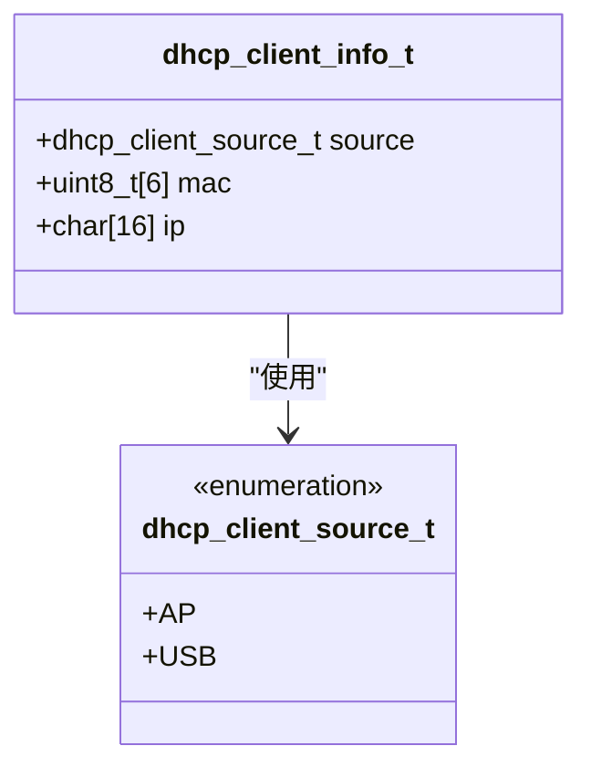
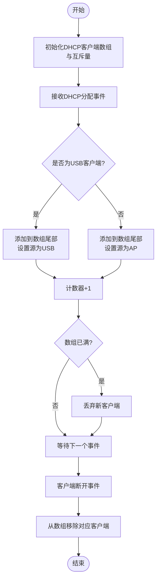
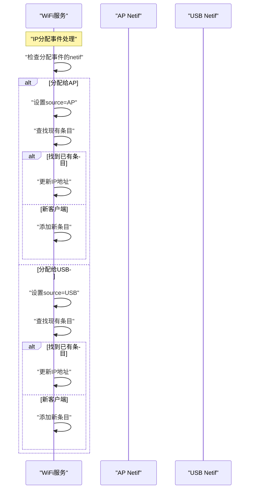
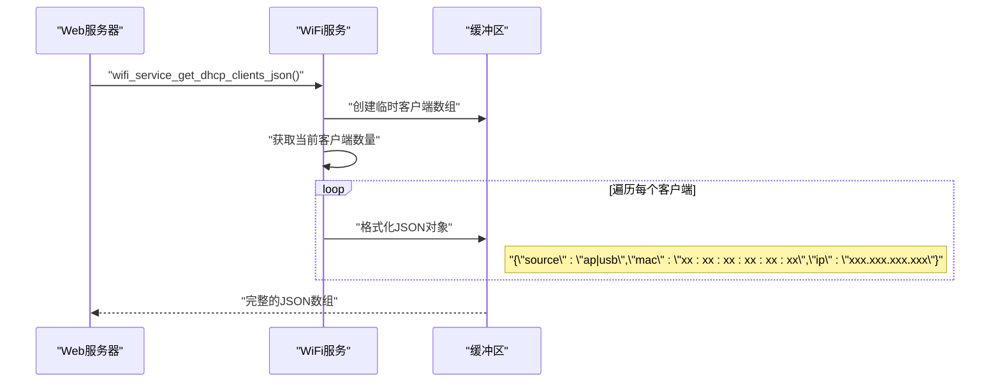
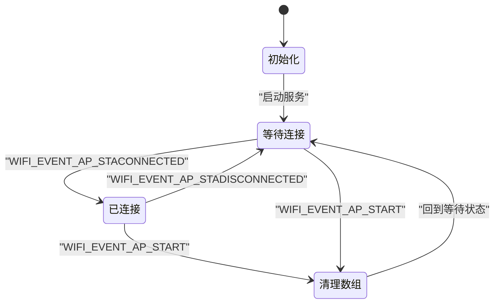
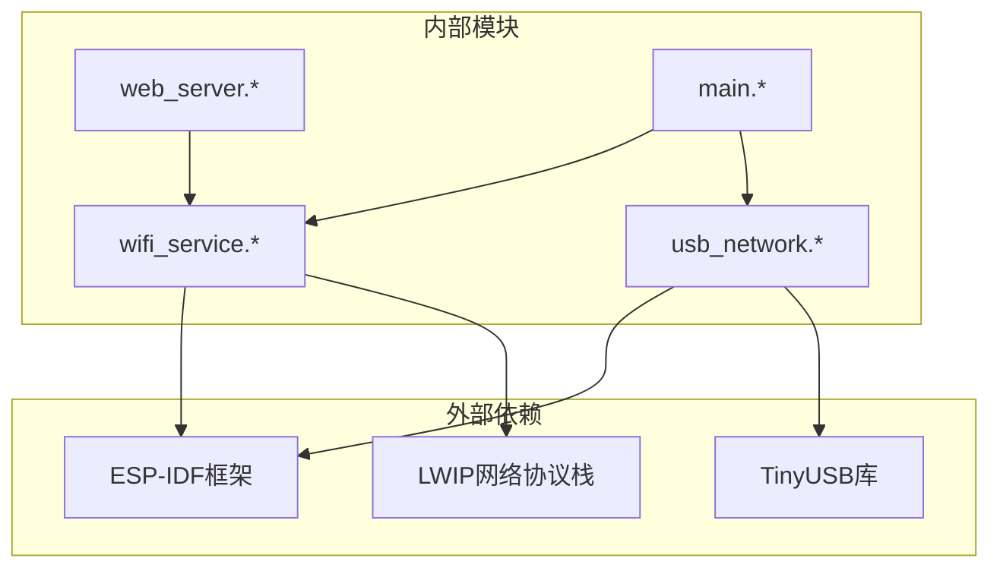

# WiFi DHCP客户端管理

<cite>
**本文档引用的文件**
- [wifi_service.h](file://main/wifi_service.h)
- [wifi_service.cpp](file://main/wifi_service.cpp)
- [usb_network.h](file://main/usb_network.h)
- [usb_network.cpp](file://main/usb_network.cpp)
- [web_server.cpp](file://main/web_server.cpp)
- [main.cpp](file://main/main.cpp)
</cite>

## 目录
1. [简介](#简介)
2. [项目结构](#项目结构)
3. [核心组件](#核心组件)
4. [架构概览](#架构概览)
5. [详细组件分析](#详细组件分析)
6. [依赖关系分析](#依赖关系分析)
7. [性能考量](#性能考量)
8. [故障诊断指南](#故障诊断指南)
9. [结论](#结论)

## 简介
本文件详细说明了ESP32-S3 WiFi DHCP客户端管理系统的设计与实现。系统通过统一的DHCP客户端信息结构体管理来自不同网络接口的客户端，包括AP热点模式下的无线客户端和USB网络模式下的客户端，并提供获取客户端列表及JSON格式化输出的能力。同时，系统实现了客户端连接事件处理、状态跟踪、监控统计以及故障诊断方法。

## 项目结构
该项目采用模块化设计，主要涉及以下模块：
- WiFi服务模块：负责WiFi初始化、连接、断开、扫描、状态查询以及DHCP客户端管理
- USB网络模块：负责USB CDC NCM网络适配器初始化、数据收发、DHCP服务器功能
- Web服务器模块：提供REST API接口，用于获取DHCP客户端信息等
- 主程序模块：应用入口，协调各模块初始化与运行

**图表来源**
- [main.cpp:19-81](file://main/main.cpp#L19-L81)
- [wifi_service.cpp:604-703](file://main/wifi_service.cpp#L604-L703)
- [usb_network.cpp:191-290](file://main/usb_network.cpp#L191-L290)

**章节来源**
- [main.cpp:19-81](file://main/main.cpp#L19-L81)
- [wifi_service.h:1-99](file://main/wifi_service.h#L1-L99)
- [usb_network.h:1-22](file://main/usb_network.h#L1-L22)

## 核心组件
本节介绍与DHCP客户端管理直接相关的核心组件及其职责。

- DHCP客户端信息结构体
  - 字段含义：来源类型、MAC地址、IP地址
  - 用途：统一存储来自AP或USB的DHCP客户端信息
  - 限制：最大支持16个客户端

- 客户端管理机制
  - 存储结构：固定大小数组配合计数器
  - 并发控制：互斥量保护数组访问
  - 生命周期：基于WiFi事件自动增删

- 获取函数族
  - 同步接口：返回客户端数量与填充缓冲区
  - JSON接口：直接生成标准JSON数组

**章节来源**
- [wifi_service.h:12-37](file://main/wifi_service.h#L12-L37)
- [wifi_service.cpp:60-62](file://main/wifi_service.cpp#L60-L62)
- [wifi_service.cpp:965-995](file://main/wifi_service.cpp#L965-L995)

## 架构概览
系统通过事件驱动的方式处理WiFi和USB网络中的DHCP分配事件，自动维护DHCP客户端列表，并提供统一的查询接口。

**图表来源**
- [wifi_service.cpp:565-594](file://main/wifi_service.cpp#L565-L594)
- [web_server.cpp:1280-1287](file://main/web_server.cpp#L1280-L1287)

## 详细组件分析

### DHCP客户端信息结构体分析
dhcp_client_info_t是系统的核心数据结构，用于统一表示不同来源的DHCP客户端。

**图表来源**
- [wifi_service.h:28-37](file://main/wifi_service.h#L28-L37)

该结构体的特点：
- 固定内存布局，便于序列化和传输
- 源类型字段明确区分AP客户端与USB客户端
- MAC地址以字节数组存储，便于比较和打印
- IP地址以字符串存储，便于JSON序列化

**章节来源**
- [wifi_service.h:28-37](file://main/wifi_service.h#L28-L37)

### 客户端管理机制
系统通过静态数组和互斥量实现线程安全的客户端管理。

**图表来源**
- [wifi_service.cpp:565-594](file://main/wifi_service.cpp#L565-L594)
- [wifi_service.cpp:477-497](file://main/wifi_service.cpp#L477-L497)

管理机制的关键点：
- 数组容量限制：最多16个客户端
- 事件驱动：仅在IP分配和断开事件时更新
- 线程安全：所有访问均通过互斥量保护
- 来源区分：根据分配事件对应的netif判断来源

**章节来源**
- [wifi_service.cpp:60-62](file://main/wifi_service.cpp#L60-L62)
- [wifi_service.cpp:565-594](file://main/wifi_service.cpp#L565-L594)
- [wifi_service.cpp:477-497](file://main/wifi_service.cpp#L477-L497)

### 不同来源的DHCP客户端识别与管理
系统能够区分来自AP和USB的不同来源客户端，并分别进行管理。

**图表来源**
- [wifi_service.cpp:565-594](file://main/wifi_service.cpp#L565-L594)

识别逻辑：
- 通过事件参数中的esp_netif指针判断来源
- AP来源：分配给AP netif的客户端
- USB来源：分配给USB netif的客户端

**章节来源**
- [wifi_service.cpp:565-594](file://main/wifi_service.cpp#L565-L594)

### 客户端获取函数与JSON格式化输出
系统提供了两种获取客户端信息的接口：同步获取和JSON格式化输出。

**图表来源**
- [wifi_service.cpp:977-995](file://main/wifi_service.cpp#L977-L995)
- [web_server.cpp:1280-1287](file://main/web_server.cpp#L1280-L1287)

接口特点：
- 同步接口：wifi_service_get_dhcp_clients()返回数量并填充缓冲区
- JSON接口：wifi_service_get_dhcp_clients_json()直接生成JSON数组
- 输出格式：标准JSON数组，每个元素包含source、mac、ip字段

**章节来源**
- [wifi_service.cpp:965-995](file://main/wifi_service.cpp#L965-L995)
- [web_server.cpp:1280-1287](file://main/web_server.cpp#L1280-L1287)

### 客户端连接事件处理与状态跟踪
系统通过WiFi事件处理器实时跟踪客户端连接状态变化。

**图表来源**
- [wifi_service.cpp:452-540](file://main/wifi_service.cpp#L452-L540)

事件处理流程：
- 连接事件：增加AP客户端计数，触发回调通知
- 断开事件：减少AP客户端计数，从DHCP数组移除对应条目
- AP启动事件：重置AP客户端计数，清理AP来源的DHCP条目

**章节来源**
- [wifi_service.cpp:452-540](file://main/wifi_service.cpp#L452-L540)

### 客户端监控与故障诊断
系统提供了多种监控手段和故障诊断方法。

监控指标：
- 客户端数量：实时跟踪AP连接的客户端数量
- 带宽统计：STA、AP、USB三个接口的上下行速率
- RSSI信号强度：WiFi连接质量指标
- DHCP客户端列表：完整客户端信息快照

故障诊断方法：
- 日志输出：详细的事件日志和错误信息
- 内存检查：堆内存使用情况监控
- USB链路状态：TX失败计数和链路状态检测
- DHCP重启：USB枚举或恢复后的DHCP服务重启

**章节来源**
- [wifi_service.cpp:183-229](file://main/wifi_service.cpp#L183-L229)
- [usb_network.cpp:30-34](file://main/usb_network.cpp#L30-L34)
- [usb_network.cpp:41-67](file://main/usb_network.cpp#L41-L67)
- [usb_network.cpp:117-139](file://main/usb_network.cpp#L117-L139)

## 依赖关系分析

**图表来源**
- [main.cpp:9-13](file://main/main.cpp#L9-L13)
- [wifi_service.cpp:1-20](file://main/wifi_service.cpp#L1-L20)
- [usb_network.cpp:1-16](file://main/usb_network.cpp#L1-L16)

模块间依赖关系：
- WiFi服务模块依赖ESP-IDF的WiFi和Netif组件
- USB网络模块依赖TinyUSB和ESP-IDF的网络栈
- Web服务器模块依赖WiFi服务模块提供的接口
- 主程序模块协调各模块初始化顺序

**章节来源**
- [main.cpp:9-13](file://main/main.cpp#L9-L13)
- [wifi_service.cpp:1-20](file://main/wifi_service.cpp#L1-L20)
- [usb_network.cpp:1-16](file://main/usb_network.cpp#L1-L16)

## 性能考量
系统在设计时充分考虑了性能和资源使用效率。

内存使用：
- DHCP客户端数组：16个条目 × 23字节 = 约368字节
- 互斥量：每个客户端管理需要独立的互斥量
- JSON缓冲区：最大约768字节（16个客户端）

并发性能：
- 事件处理：基于ESP-IDF事件循环，非阻塞处理
- 访问控制：互斥量保护数组访问，避免竞态条件
- 统计计算：定时器周期性更新带宽统计，降低CPU占用

资源优化：
- 定时器：RSSI和统计定时器，周期分别为3秒和1秒
- 缓冲管理：USB网络使用动态内存分配，但有严格的错误处理
- 任务调度：命令队列和命令任务分离，避免阻塞主事件循环

**章节来源**
- [wifi_service.cpp:30-35](file://main/wifi_service.cpp#L30-L35)
- [wifi_service.cpp:60-62](file://main/wifi_service.cpp#L60-L62)
- [usb_network.cpp:75-86](file://main/usb_network.cpp#L75-L86)

## 故障诊断指南

常见问题与解决方案：

1. DHCP客户端数量异常
   - 症状：客户端数量超过限制或不正确
   - 排查：检查AP最大连接数配置和DHCP客户端数组容量
   - 解决：调整AP_MAX_CONNECTIONS或增加DHCP_CLIENT_MAX

2. USB网络连接不稳定
   - 症状：频繁的TX失败和链路中断
   - 排查：监控tx_fail_count和link_down标志
   - 解决：检查USB设备枚举状态，必要时重启DHCP服务

3. Web API响应异常
   - 症状：无法获取DHCP客户端JSON数据
   - 排查：确认Web服务器已启动，API端点正确
   - 解决：检查HTTP响应头和缓冲区大小

4. 内存不足
   - 症状：RX malloc失败和堆内存告警
   - 排查：定期检查heap_caps_get_free_size
   - 解决：优化内存使用或增加可用堆空间

**章节来源**
- [usb_network.cpp:30-34](file://main/usb_network.cpp#L30-L34)
- [usb_network.cpp:75-86](file://main/usb_network.cpp#L75-L86)
- [web_server.cpp:1280-1287](file://main/web_server.cpp#L1280-L1287)

## 结论
本WiFi DHCP客户端管理系统通过统一的数据结构和事件驱动机制，成功实现了对AP和USB两种来源客户端的集中管理。系统具备完善的监控、诊断和故障处理能力，能够在保证性能的同时提供可靠的客户端管理服务。通过标准化的JSON接口，系统易于集成到各种上位机应用中，为用户提供完整的WiFi网络管理解决方案。