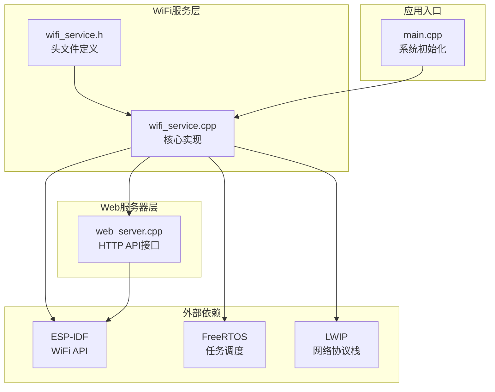
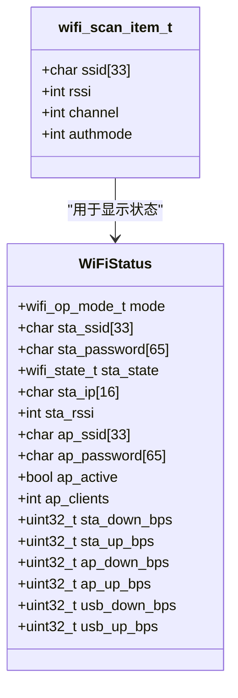
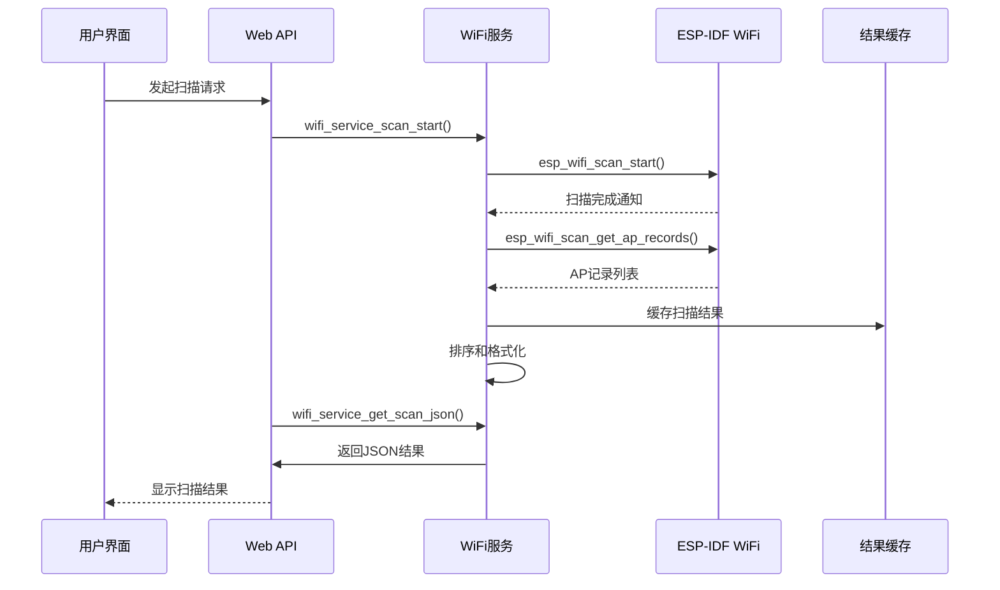
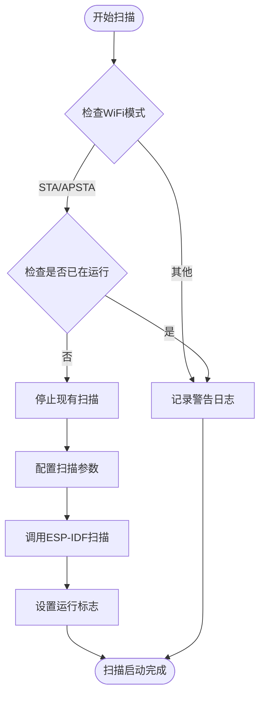
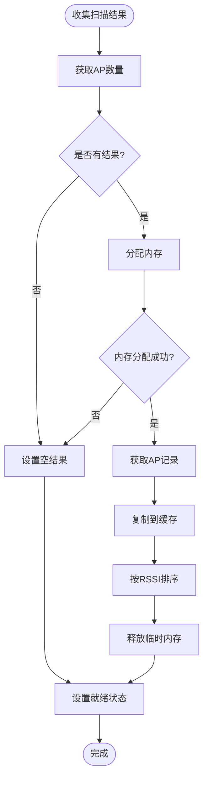
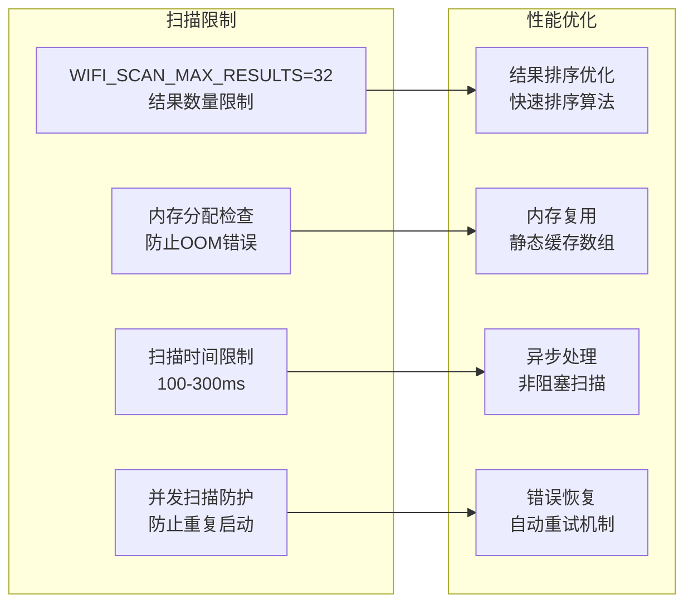
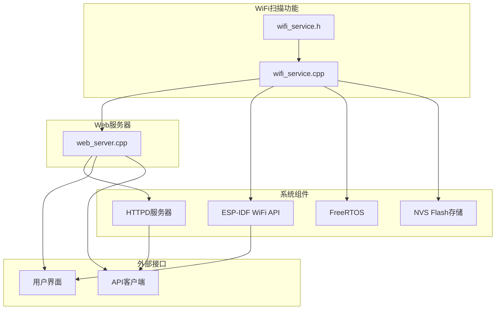
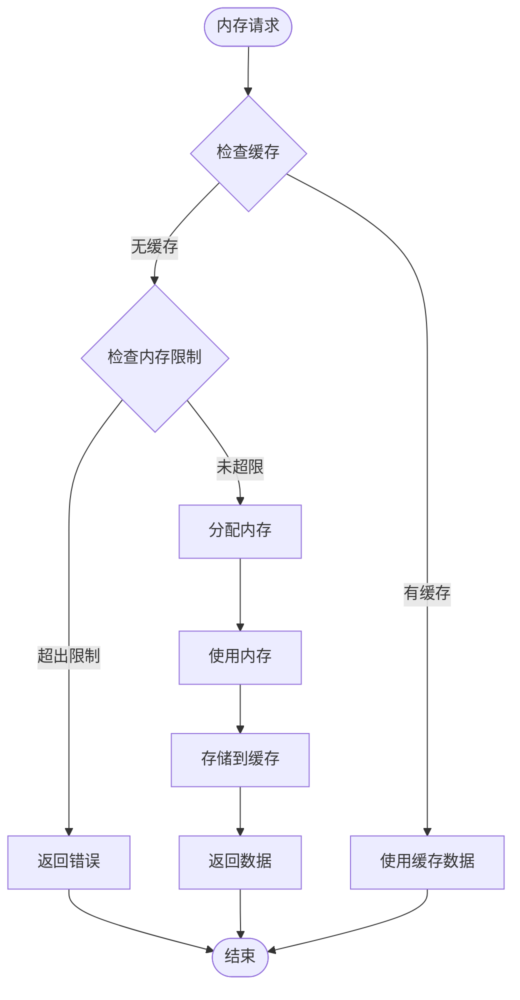

# WiFi扫描功能

<cite>
**本文档引用的文件**
- [wifi_service.h](file://main/wifi_service.h)
- [wifi_service.cpp](file://main/wifi_service.cpp)
- [web_server.cpp](file://main/web_server.cpp)
- [main.cpp](file://main/main.cpp)
</cite>

## 目录
1. [简介](#简介)
2. [项目结构](#项目结构)
3. [核心组件](#核心组件)
4. [架构概览](#架构概览)
5. [详细组件分析](#详细组件分析)
6. [依赖关系分析](#依赖关系分析)
7. [性能考虑](#性能考虑)
8. [故障排除指南](#故障排除指南)
9. [结论](#结论)

## 简介

WiFi扫描功能是ESP32-S3 WiFi管理器的核心特性之一，提供了无线网络发现和连接能力。该功能通过主动扫描模式检测周围的WiFi网络，收集网络信息并以JSON格式提供给用户界面和API接口。

本功能支持以下主要特性：
- 主动WiFi扫描（Active Scan）
- 扫描结果缓存和排序
- 实时RSSI信号强度监控
- 多种认证模式识别
- 内存优化和资源管理
- 完整的JSON格式化输出

## 项目结构

WiFi扫描功能位于项目的main目录中，包含以下关键文件：

**图表来源**
- [wifi_service.h:1-99](file://main/wifi_service.h#L1-L99)
- [wifi_service.cpp:1-1105](file://main/wifi_service.cpp#L1-L1105)
- [web_server.cpp:1-2350](file://main/web_server.cpp#L1-L2350)

**章节来源**
- [main.cpp:19-81](file://main/main.cpp#L19-L81)
- [wifi_service.h:1-99](file://main/wifi_service.h#L1-L99)

## 核心组件

### 扫描配置常量

WiFi扫描功能使用以下关键配置参数：

| 常量名称 | 值 | 描述 |
|---------|----|------|
| WIFI_SCAN_MAX_RESULTS | 32 | 扫描结果最大数量限制 |
| RSSI_TIMER_PERIOD_US | 3,000,000 | RSSI更新定时器周期（微秒） |
| STATS_TIMER_PERIOD_US | 1,000,000 | 性能统计定时器周期（微秒） |
| CMD_QUEUE_SIZE | 8 | 命令队列大小 |
| CMD_TASK_STACK_SIZE | 4096 | 命令任务堆栈大小 |

### 扫描结果数据结构

扫描结果通过`wifi_scan_item_t`结构体表示：

**图表来源**
- [wifi_service.h:39-63](file://main/wifi_service.h#L39-L63)

### 扫描状态管理

系统维护以下扫描相关状态变量：

| 变量名 | 类型 | 描述 |
|-------|------|------|
| s_scan_cache | wifi_scan_item_t[WIFI_SCAN_MAX_RESULTS] | 扫描结果缓存数组 |
| s_scan_count | int | 当前扫描结果数量 |
| s_scan_ready | bool | 扫描结果是否就绪 |
| s_scan_running | bool | 是否正在执行扫描 |

**章节来源**
- [wifi_service.h:14](file://main/wifi_service.h#L14)
- [wifi_service.cpp:67-70](file://main/wifi_service.cpp#L67-L70)

## 架构概览

WiFi扫描功能采用分层架构设计，确保模块间的清晰分离和职责明确：

**图表来源**
- [wifi_service.cpp:1002-1036](file://main/wifi_service.cpp#L1002-L1036)
- [wifi_service.cpp:1079-1105](file://main/wifi_service.cpp#L1079-L1105)

## 详细组件分析

### 扫描启动流程

扫描启动通过`wifi_service_scan_start()`函数实现，该函数负责配置扫描参数并启动实际的WiFi扫描过程：

**图表来源**
- [wifi_service.cpp:1002-1036](file://main/wifi_service.cpp#L1002-L1036)

扫描配置参数说明：
- 扫描类型：主动扫描（Active Scan）
- 最小扫描时间：100ms
- 最大扫描时间：300ms
- 非阻塞模式：false

### 扫描结果收集

扫描结果收集通过`collect_scan_results()`函数实现，该函数负责从ESP-IDF获取AP记录并进行必要的处理：

**图表来源**
- [wifi_service.cpp:1038-1077](file://main/wifi_service.cpp#L1038-L1077)

### JSON格式化输出

扫描结果通过`wifi_service_get_scan_json()`函数转换为JSON格式，供Web界面和API使用：

| 字段名 | 类型 | 描述 | 示例值 |
|--------|------|------|--------|
| running | boolean | 扫描是否正在进行中 | true/false |
| count | integer | 扫描结果数量 | 15 |
| results | array | 扫描结果数组 | [] |
| results[].ssid | string | 网络名称 | "MyWiFiNetwork" |
| results[].rssi | integer | 信号强度（dBm） | -65 |
| results[].channel | integer | 工作信道 | 6 |
| results[].auth | string | 认证模式 | "secure/open/wep" |

**章节来源**
- [wifi_service.cpp:1079-1105](file://main/wifi_service.cpp#L1079-L1105)

### 资源管理策略

系统采用多种策略确保资源的有效管理和内存安全：

1. **内存分配保护**：在分配动态内存失败时，系统会优雅降级并返回空结果
2. **内存释放**：所有临时分配的内存都会在使用后及时释放
3. **缓冲区边界检查**：所有字符串操作都包含边界检查，防止缓冲区溢出
4. **并发安全**：使用互斥锁保护共享数据结构的访问

### 扫描限制配置

系统实现了多层扫描限制以确保稳定性和性能：

**图表来源**
- [wifi_service.h:14](file://main/wifi_service.h#L14)
- [wifi_service.cpp:1049-1056](file://main/wifi_service.cpp#L1049-L1056)

**章节来源**
- [wifi_service.h:14](file://main/wifi_service.h#L14)
- [wifi_service.cpp:1049-1077](file://main/wifi_service.cpp#L1049-L1077)

## 依赖关系分析

WiFi扫描功能与系统的其他组件存在紧密的依赖关系：

**图表来源**
- [wifi_service.cpp:1-19](file://main/wifi_service.cpp#L1-L19)
- [web_server.cpp:1-14](file://main/web_server.cpp#L1-L14)

### 关键依赖关系

1. **ESP-IDF WiFi API依赖**：直接依赖ESP-IDF提供的WiFi扫描功能
2. **FreeRTOS任务调度**：使用任务和队列机制实现异步处理
3. **NVS存储依赖**：使用NVS存储WiFi配置信息
4. **HTTPD服务器集成**：通过Web API提供扫描结果访问

**章节来源**
- [wifi_service.cpp:1-19](file://main/wifi_service.cpp#L1-L19)
- [web_server.cpp:1-14](file://main/web_server.cpp#L1-L14)

## 性能考虑

### 扫描性能优化

系统采用了多项优化措施来提升扫描性能：

1. **主动扫描配置**：使用主动扫描模式，扫描时间控制在100-300ms范围内
2. **内存预分配**：使用静态数组作为扫描结果缓存，避免频繁的内存分配
3. **快速排序算法**：使用qsort函数对扫描结果按信号强度排序
4. **异步处理**：扫描过程不阻塞主任务，通过回调机制处理结果

### 内存管理策略

**图表来源**
- [wifi_service.cpp:1049-1077](file://main/wifi_service.cpp#L1049-L1077)

### 扫描频率控制

系统通过定时器机制控制扫描频率，避免过度扫描消耗资源：

- **RSSI更新定时器**：每3秒更新一次信号强度
- **性能统计定时器**：每1秒更新一次网络统计
- **扫描轮询间隔**：Web界面扫描轮询间隔为500ms

## 故障排除指南

### 常见问题及解决方案

| 问题类型 | 症状 | 可能原因 | 解决方案 |
|----------|------|----------|----------|
| 扫描失败 | 返回空结果或错误 | WiFi模式不正确 | 检查WiFi模式设置，确保STA或APSTA模式 |
| 内存不足 | 扫描结果为空 | 动态内存分配失败 | 检查可用内存，优化内存使用 |
| 扫描超时 | 扫描长时间运行 | 扫描配置不当 | 调整扫描时间参数 |
| 结果排序异常 | RSSI排序不正确 | 数据类型错误 | 检查compare_rssi函数实现 |

### 调试信息

系统提供了详细的日志信息，帮助诊断问题：

- **扫描启动日志**：记录扫描开始和结束信息
- **错误日志**：记录扫描失败的具体原因
- **性能日志**：记录扫描耗时和结果数量
- **状态日志**：记录WiFi状态变化

**章节来源**
- [wifi_service.cpp:1031](file://main/wifi_service.cpp#L1031)
- [wifi_service.cpp:1076](file://main/wifi_service.cpp#L1076)

## 结论

WiFi扫描功能通过精心设计的架构和优化策略，为用户提供了一个高效、可靠的无线网络发现解决方案。该功能的主要优势包括：

1. **高性能**：通过主动扫描和内存优化，确保快速响应
2. **稳定性**：完善的错误处理和资源管理机制
3. **可扩展性**：模块化设计便于功能扩展和维护
4. **用户体验**：直观的Web界面和实时反馈

该功能为后续的WiFi连接、网络配置和设备管理奠定了坚实的基础，是整个ESP32-S3 WiFi管理器的重要组成部分。