# WiFi服务管理

<cite>
**本文档引用的文件**
- [main/wifi_service.h](file://main/wifi_service.h)
- [main/wifi_service.cpp](file://main/wifi_service.cpp)
- [main/wifi_now.h](file://main/wifi_now.h)
- [main/wifi_now.c](file://main/wifi_now.c)
- [main/main.cpp](file://main/main.cpp)
- [main/usb_network.h](file://main/usb_network.h)
- [main/usb_network.cpp](file://main/usb_network.cpp)
- [main/web_server.h](file://main/web_server.h)
- [main/web_server.cpp](file://main/web_server.cpp)
- [main/ble_pairing.h](file://main/ble_pairing.h)
- [main/ble_pairing.c](file://main/ble_pairing.c)
- [docs/ESP_NOW_WiFi_API_Specification.md](file://docs/ESP_NOW_WiFi_API_Specification.md)
- [docs/ESP_NOW_BLE_Discovery_Specification.md](file://docs/ESP_NOW_BLE_Discovery_Specification.md)
</cite>

## 目录
1. [简介](#简介)
2. [项目结构](#项目结构)
3. [核心组件](#核心组件)
4. [架构概览](#架构概览)
5. [详细组件分析](#详细组件分析)
6. [依赖关系分析](#依赖关系分析)
7. [性能考虑](#性能考虑)
8. [故障排除指南](#故障排除指南)
9. [结论](#结论)
10. [附录](#附录)

## 简介

这是一个基于ESP32-S3的WiFi服务管理系统，集成了STA模式连接、AP热点创建、AP+STA双模式支持、ESP-NOW通信、USB网络共享等功能。该系统提供了完整的WiFi状态管理、连接控制机制、AP模式配置、WiFi扫描功能、配置持久化和吞吐量统计能力。

## 项目结构

项目采用模块化设计，主要包含以下核心模块：

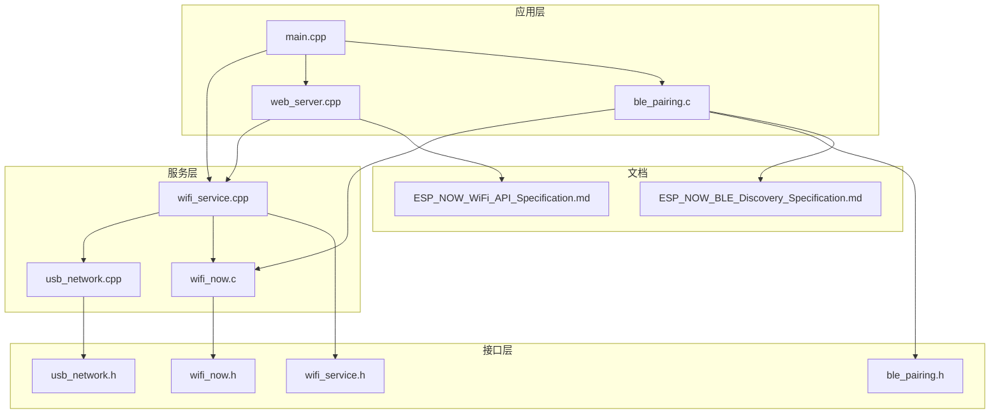

**图表来源**
- [main/main.cpp:19-81](file://main/main.cpp#L19-L81)
- [main/wifi_service.cpp:604-703](file://main/wifi_service.cpp#L604-L703)
- [main/wifi_now.c:126-192](file://main/wifi_now.c#L126-L192)
- [main/usb_network.cpp:191-290](file://main/usb_network.cpp#L191-L290)

**章节来源**
- [main/main.cpp:19-81](file://main/main.cpp#L19-L81)
- [main/CMakeLists.txt](file://main/CMakeLists.txt)

## 核心组件

### WiFi服务管理器

WiFi服务管理器是整个系统的核心，负责WiFi状态管理、连接控制和AP模式配置：

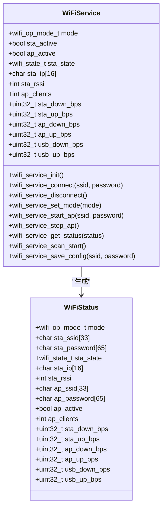

**图表来源**
- [main/wifi_service.h:46-63](file://main/wifi_service.h#L46-L63)
- [main/wifi_service.cpp:887-914](file://main/wifi_service.cpp#L887-L914)

### ESP-NOW通信模块

ESP-NOW模块提供无线点对点通信能力，支持自动配对和消息传输：

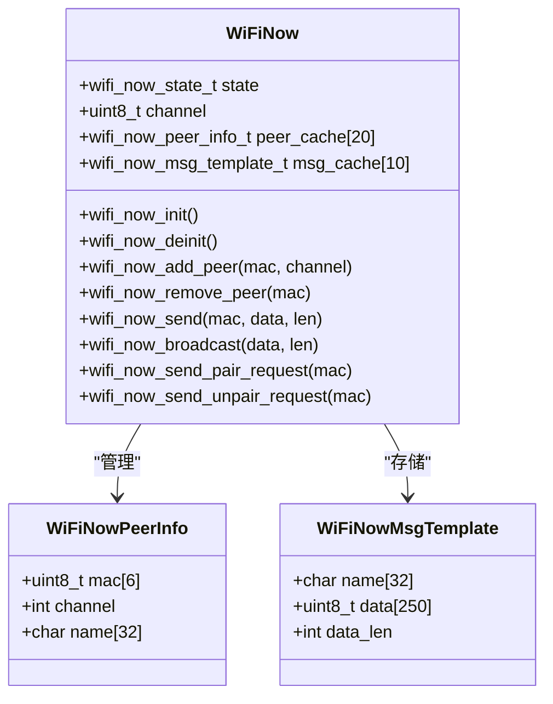

**图表来源**
- [main/wifi_now.h:40-50](file://main/wifi_now.h#L40-L50)
- [main/wifi_now.c:27-31](file://main/wifi_now.c#L27-L31)

### USB网络共享

USB网络模块提供USB到WiFi的网络桥接功能：

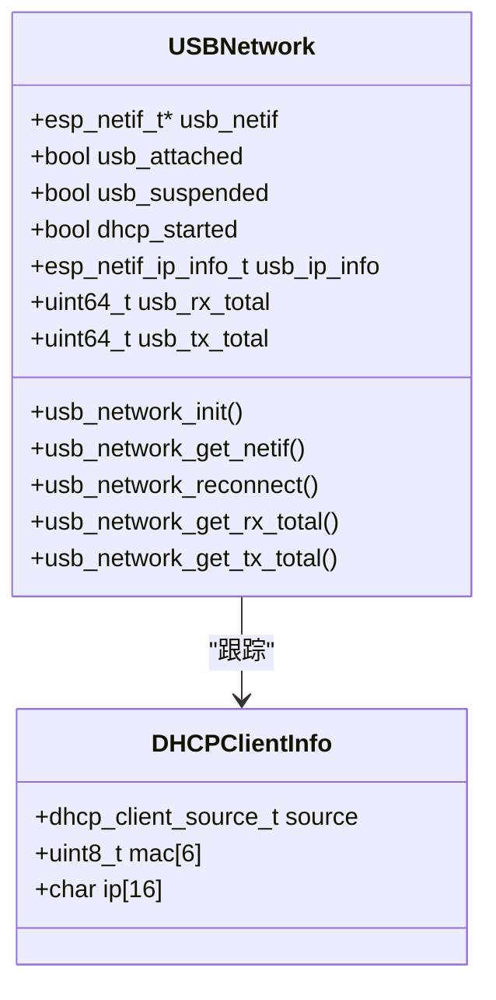

**图表来源**
- [main/usb_network.h:12-16](file://main/usb_network.h#L12-L16)
- [main/usb_network.cpp:19-28](file://main/usb_network.cpp#L19-L28)

**章节来源**
- [main/wifi_service.h:16-63](file://main/wifi_service.h#L16-L63)
- [main/wifi_now.h:34-56](file://main/wifi_now.h#L34-L56)
- [main/usb_network.h:12-16](file://main/usb_network.h#L12-L16)

## 架构概览

系统采用分层架构设计，实现了WiFi服务管理、通信协议集成和用户界面交互的有机结合：

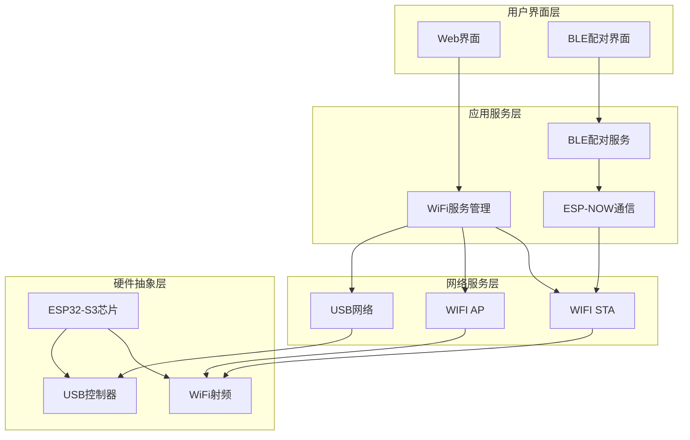

**图表来源**
- [main/main.cpp:25-42](file://main/main.cpp#L25-L42)
- [main/web_server.cpp:17-28](file://main/web_server.cpp#L17-L28)
- [main/ble_pairing.c:228-288](file://main/ble_pairing.c#L228-L288)

系统初始化流程展示了各组件的启动顺序和依赖关系：

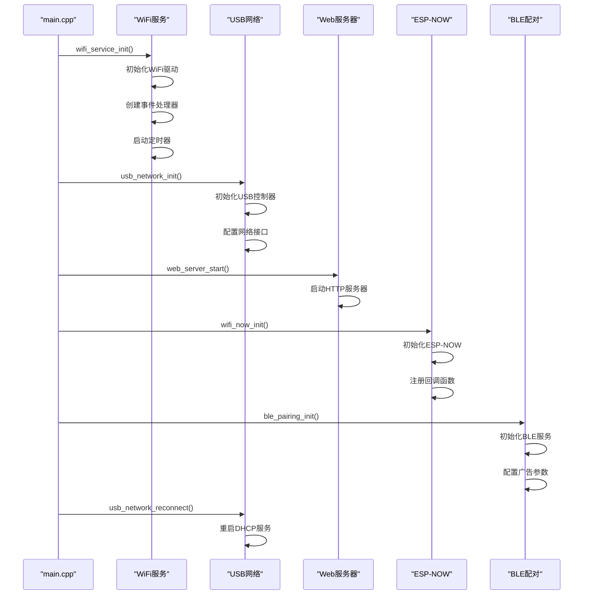

**图表来源**
- [main/main.cpp:25-46](file://main/main.cpp#L25-L46)
- [main/wifi_service.cpp:604-703](file://main/wifi_service.cpp#L604-L703)
- [main/usb_network.cpp:191-290](file://main/usb_network.cpp#L191-L290)

**章节来源**
- [main/main.cpp:19-81](file://main/main.cpp#L19-L81)
- [main/wifi_service.cpp:604-703](file://main/wifi_service.cpp#L604-L703)

## 详细组件分析

### WiFi状态管理

WiFi状态管理实现了完整的STA/AP模式切换和状态监控：

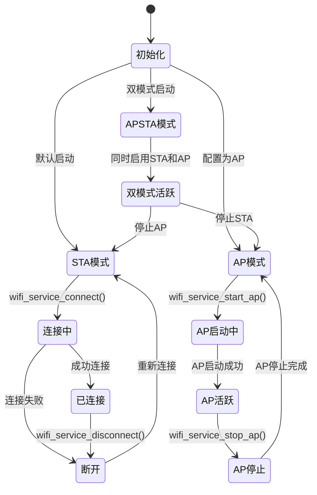

**图表来源**
- [main/wifi_service.cpp:705-737](file://main/wifi_service.cpp#L705-L737)
- [main/wifi_service.cpp:817-867](file://main/wifi_service.cpp#L817-L867)

WiFi状态转换的关键实现包括：

1. **STA模式连接管理**：实现了自动重连机制，当连接断开时会根据原因进行重连
2. **AP模式配置**：支持动态修改AP配置，包括SSID、密码和信道
3. **双模式支持**：同时管理STA和AP状态，实现复杂的网络拓扑

**章节来源**
- [main/wifi_service.cpp:416-595](file://main/wifi_service.cpp#L416-L595)
- [main/wifi_service.cpp:705-800](file://main/wifi_service.cpp#L705-L800)

### 连接控制机制

连接控制机制提供了线程安全的WiFi操作接口：

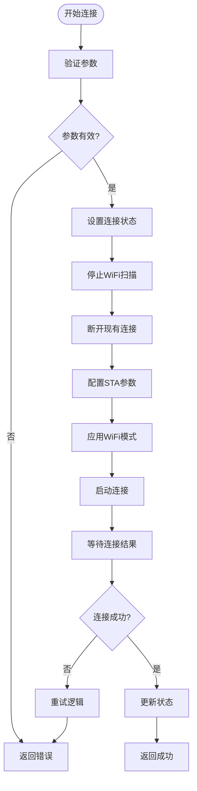

**图表来源**
- [main/wifi_service.cpp:705-728](file://main/wifi_service.cpp#L705-L728)

连接控制的关键特性：

1. **命令队列机制**：使用FreeRTOS队列确保WiFi操作的线程安全性
2. **状态原子性**：通过互斥锁保护WiFi状态变量
3. **自动重连**：智能的重连策略，避免不必要的频繁重连

**章节来源**
- [main/wifi_service.cpp:118-181](file://main/wifi_service.cpp#L118-L181)
- [main/wifi_service.cpp:705-728](file://main/wifi_service.cpp#L705-L728)

### AP模式配置

AP模式配置支持灵活的热点管理和客户端连接监控：

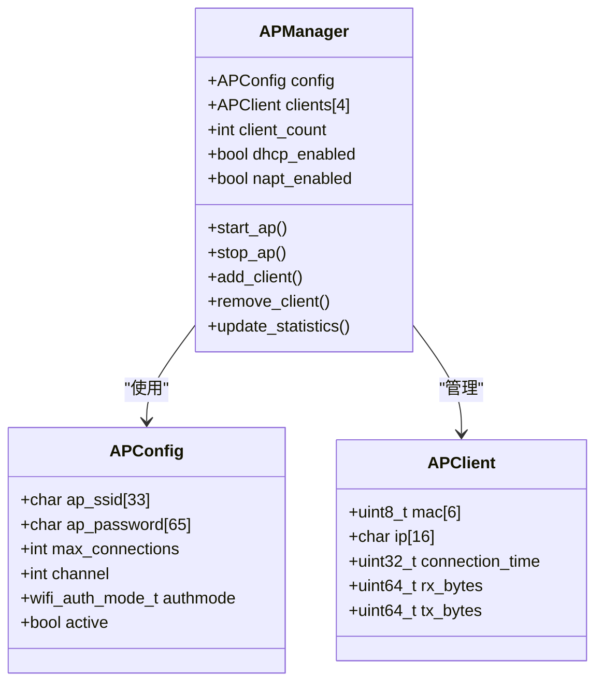

**图表来源**
- [main/wifi_service.cpp:318-326](file://main/wifi_service.cpp#L318-L326)
- [main/wifi_service.cpp:452-497](file://main/wifi_service.cpp#L452-L497)

AP模式的关键功能：

1. **客户端管理**：实时跟踪AP客户端连接状态和统计数据
2. **DHCP服务**：自动分配IP地址和DNS配置
3. **NAPT支持**：实现网络地址转换，允许客户端访问互联网
4. **动态配置**：支持运行时修改AP配置参数

**章节来源**
- [main/wifi_service.cpp:817-885](file://main/wifi_service.cpp#L817-L885)
- [main/wifi_service.cpp:499-540](file://main/wifi_service.cpp#L499-L540)

### WiFi扫描功能

WiFi扫描功能提供了主动和被动的网络发现能力：

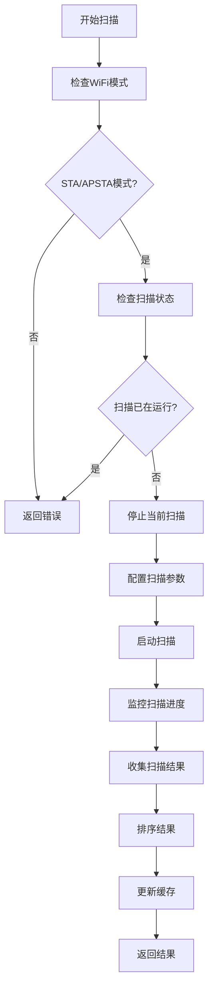

**图表来源**
- [main/wifi_service.cpp:1002-1036](file://main/wifi_service.cpp#L1002-L1036)
- [main/wifi_service.cpp:1038-1077](file://main/wifi_service.cpp#L1038-L1077)

扫描功能的实现特点：

1. **主动扫描**：使用WIFI_ALL_CHANNEL_SCAN模式进行全面网络发现
2. **结果排序**：按信号强度对AP进行降序排列
3. **缓存机制**：维护扫描结果缓存，支持快速查询
4. **线程安全**：通过互斥锁保护扫描状态和结果

**章节来源**
- [main/wifi_service.cpp:1002-1105](file://main/wifi_service.cpp#L1002-L1105)

### 配置持久化

配置持久化机制确保系统重启后能够恢复之前的设置：

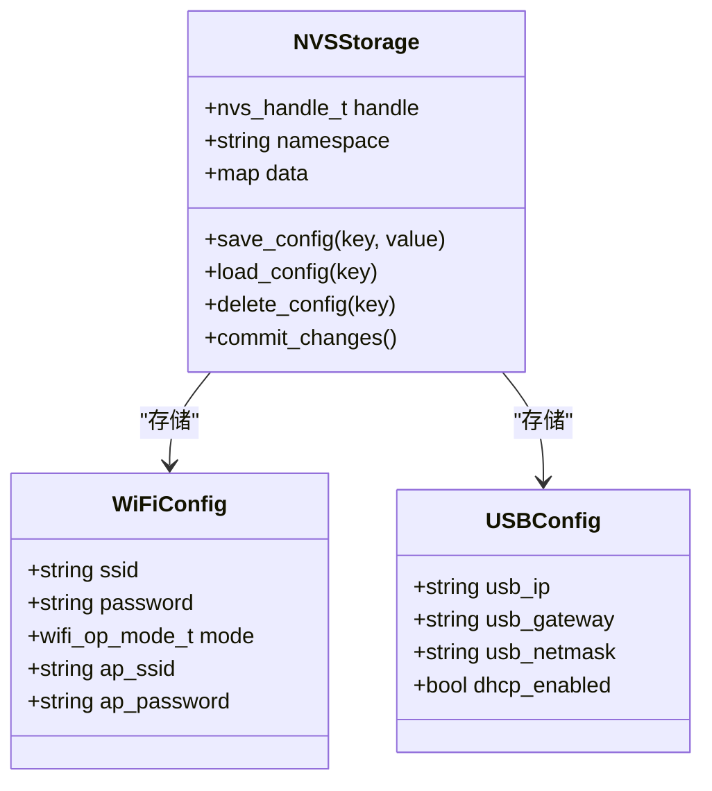

**图表来源**
- [main/wifi_service.cpp:330-338](file://main/wifi_service.cpp#L330-L338)
- [main/usb_network.cpp:98-115](file://main/usb_network.cpp#L98-L115)

配置持久化的关键实现：

1. **命名空间隔离**：WiFi配置和USB配置分别存储在不同命名空间
2. **自动加载**：系统启动时自动加载之前保存的配置
3. **版本兼容**：处理NVS版本升级和页面清理
4. **安全存储**：使用NVS提供的安全存储机制

**章节来源**
- [main/wifi_service.cpp:653-684](file://main/wifi_service.cpp#L653-L684)
- [main/usb_network.cpp:98-115](file://main/usb_network.cpp#L98-L115)

### 吞吐量统计

吞吐量统计系统提供了精确的网络流量监控：

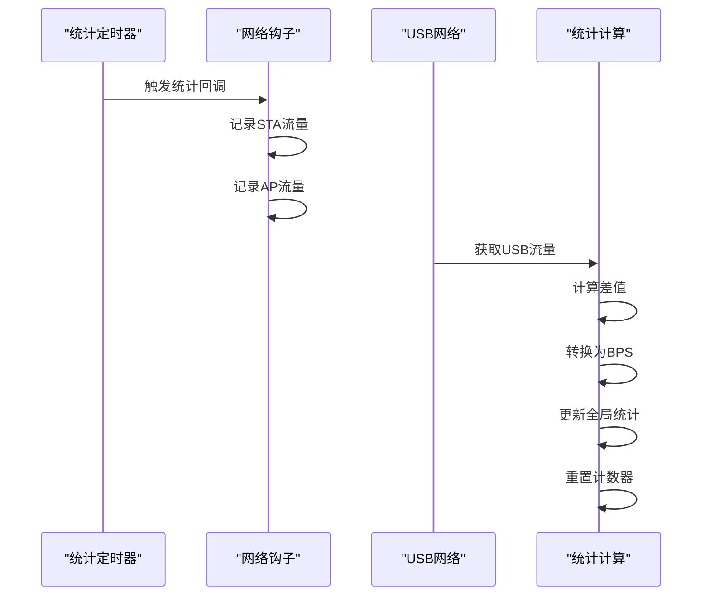

**图表来源**
- [main/wifi_service.cpp:207-229](file://main/wifi_service.cpp#L207-L229)
- [main/wifi_service.cpp:340-362](file://main/wifi_service.cpp#L340-L362)

吞吐量统计的实现细节：

1. **网络钩子**：在LWIP网络栈中安装钩子函数捕获数据包
2. **定时采样**：每秒进行一次流量统计采样
3. **差值计算**：通过比较当前和上次的累计值计算瞬时速率
4. **多源统计**：同时统计STA、AP和USB三个网络接口的流量

**章节来源**
- [main/wifi_service.cpp:207-229](file://main/wifi_service.cpp#L207-L229)
- [main/wifi_service.cpp:340-362](file://main/wifi_service.cpp#L340-L362)

### ESP-NOW通信集成

ESP-NOW通信模块实现了与WiFi服务的深度集成：

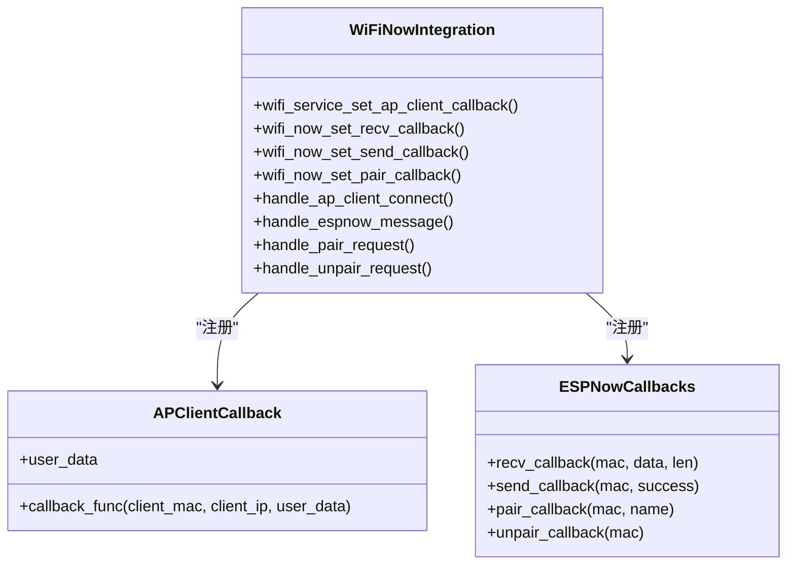

**图表来源**
- [main/wifi_service.h:65-67](file://main/wifi_service.h#L65-L67)
- [main/wifi_now.c:38-71](file://main/wifi_now.c#L38-L71)

ESP-NOW与WiFi服务的集成特性：

1. **AP客户端回调**：当AP有客户端连接时通知ESP-NOW模块
2. **消息路由**：通过WiFi服务转发ESP-NOW消息到相应的网络接口
3. **配对状态同步**：保持ESP-NOW配对状态与WiFi连接状态的一致性
4. **资源管理**：统一管理ESP-NOW和WiFi服务的生命周期

**章节来源**
- [main/wifi_service.cpp:452-474](file://main/wifi_service.cpp#L452-L474)
- [main/wifi_now.c:38-71](file://main/wifi_now.c#L38-L71)

## 依赖关系分析

系统组件之间的依赖关系展现了清晰的分层架构：

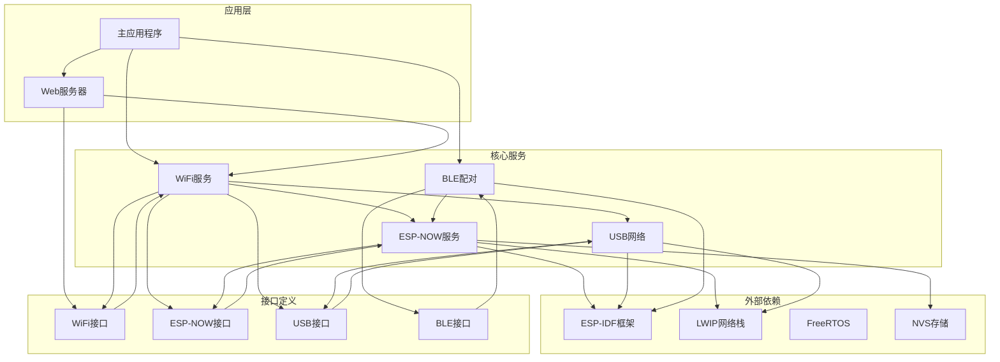

**图表来源**
- [main/main.cpp:19-42](file://main/main.cpp#L19-L42)
- [main/wifi_service.cpp:19-21](file://main/wifi_service.cpp#L19-L21)

依赖关系的关键特点：

1. **低耦合高内聚**：每个模块都有明确的职责边界
2. **接口抽象**：通过头文件定义清晰的接口契约
3. **向上依赖**：下层模块依赖上层模块的接口定义
4. **向下依赖**：上层模块依赖底层系统的具体实现

**章节来源**
- [main/main.cpp:19-42](file://main/main.cpp#L19-L42)
- [main/wifi_service.cpp:19-21](file://main/wifi_service.cpp#L19-L21)

## 性能考虑

### 内存管理优化

系统采用了多种内存管理策略来优化内存使用：

1. **静态内存分配**：关键数据结构使用静态分配，避免动态内存碎片
2. **缓冲区复用**：扫描结果和消息缓冲区在生命周期内复用
3. **内存池管理**：USB网络层使用专门的内存池管理数据包缓冲区

### 中断处理优化

WiFi事件处理通过中断机制实现高效响应：

1. **事件驱动架构**：使用ESP-IDF事件循环处理WiFi状态变化
2. **非阻塞操作**：所有WiFi操作都是非阻塞的，避免阻塞主任务
3. **优先级分离**：WiFi事件和用户请求使用不同的优先级

### 网络性能优化

网络层实现了多项性能优化措施：

1. **流量统计采样**：每秒进行一次流量统计，平衡精度和性能
2. **定时器优化**：使用高精度定时器减少统计误差
3. **钩子函数优化**：网络钩子函数最小化开销，避免不必要的处理

## 故障排除指南

### 常见问题诊断

#### WiFi连接问题

**症状**：STA模式无法连接到WiFi网络

**诊断步骤**：
1. 检查WiFi配置是否正确保存
2. 验证AP是否存在且信号正常
3. 确认密码是否正确
4. 检查是否有过多的重连尝试

**解决方法**：
- 清除NVS中的WiFi配置并重新设置
- 使用WiFi扫描功能验证AP可见性
- 检查路由器配置和信号强度

#### AP模式问题

**症状**：AP模式无法启动或客户端无法连接

**诊断步骤**：
1. 检查AP配置参数（SSID、密码、信道）
2. 验证WiFi模式设置
3. 检查DHCP服务状态
4. 确认NAPT功能是否启用

**解决方法**：
- 重新配置AP参数并重启AP
- 检查USB网络连接状态
- 验证客户端设备的WiFi设置

#### ESP-NOW通信问题

**症状**：ESP-NOW消息无法正常传输

**诊断步骤**：
1. 检查ESP-NOW初始化状态
2. 验证PMK设置一致性
3. 确认信道配置匹配
4. 检查加密设置

**解决方法**：
- 重新初始化ESP-NOW服务
- 确保两端使用相同的PMK
- 检查并调整信道设置
- 验证加密参数配置

### 错误处理机制

系统实现了完善的错误处理机制：

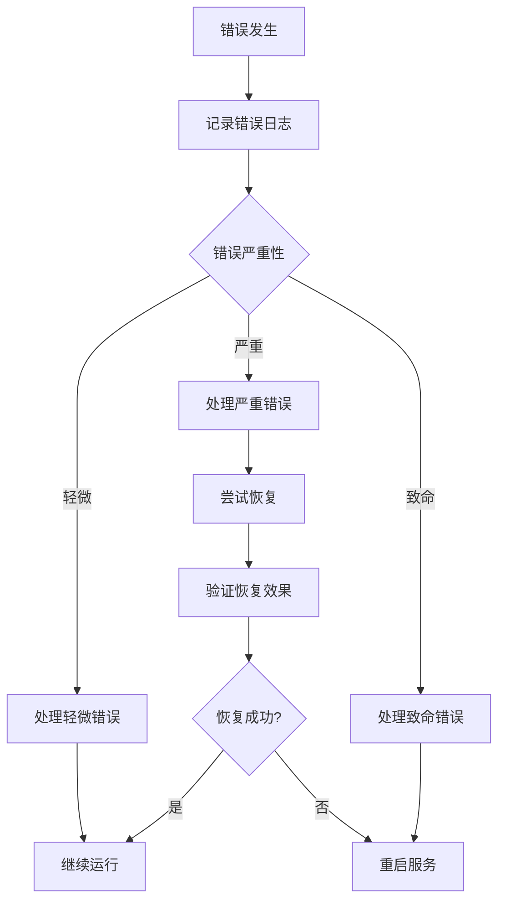

**图表来源**
- [main/wifi_service.cpp:430-449](file://main/wifi_service.cpp#L430-L449)
- [main/wifi_now.c:145-149](file://main/wifi_now.c#L145-L149)

**章节来源**
- [main/wifi_service.cpp:430-449](file://main/wifi_service.cpp#L430-L449)
- [main/wifi_now.c:145-149](file://main/wifi_now.c#L145-L149)

## 结论

WiFi服务管理系统是一个功能完整、架构清晰的嵌入式网络解决方案。系统的主要优势包括：

1. **模块化设计**：各个功能模块职责明确，便于维护和扩展
2. **线程安全**：通过队列和互斥锁确保并发操作的安全性
3. **持久化支持**：配置和状态信息能够持久化存储
4. **性能优化**：实现了多项性能优化措施，确保系统稳定运行
5. **错误处理**：完善的错误检测和恢复机制

该系统适用于需要WiFi网络管理、ESP-NOW通信和USB网络共享的各种应用场景，为开发者提供了强大的基础设施支持。

## 附录

### API使用示例

#### 基本WiFi连接控制

```c
// 初始化WiFi服务
wifi_service_init();

// 连接到WiFi网络
wifi_service_connect("MyNetwork", "password123");

// 断开WiFi连接
wifi_service_disconnect();

// 保存WiFi配置
wifi_service_save_config("MyNetwork", "password123");
```

#### AP模式管理

```c
// 启动AP热点
wifi_service_start_ap("ESP32-Hotspot", "12345678");

// 停止AP热点
wifi_service_stop_ap();

// 获取AP配置
char ssid[33], password[65];
wifi_service_get_ap_config(ssid, sizeof(ssid), password, sizeof(password));
```

#### WiFi扫描

```c
// 开始WiFi扫描
wifi_service_scan_start();

// 获取扫描结果
wifi_scan_item_t results[WIFI_SCAN_MAX_RESULTS];
int count = wifi_service_scan(results, WIFI_SCAN_MAX_RESULTS);

// 获取JSON格式的扫描结果
char json_buffer[2048];
wifi_service_get_scan_json(json_buffer, sizeof(json_buffer));
```

#### ESP-NOW通信

```c
// 初始化ESP-NOW
wifi_now_init();

// 添加ESP-NOW对端
wifi_now_add_peer_with_name(remote_mac, channel, "Device-1");

// 发送ESP-NOW消息
wifi_now_send(remote_mac, data, data_len);

// 广播消息
wifi_now_broadcast(data, data_len);
```

### 配置选项

系统支持多种配置选项来满足不同的使用需求：

1. **WiFi模式选择**：STA、AP或AP+STA模式
2. **AP参数配置**：SSID、密码、信道、最大连接数
3. **扫描参数**：扫描类型、扫描时间、结果排序
4. **统计周期**：吞吐量统计的时间间隔
5. **NAPT设置**：网络地址转换的启用状态

### 最佳实践

1. **配置持久化**：定期保存重要的网络配置
2. **错误监控**：实现适当的错误监控和告警机制
3. **性能调优**：根据实际使用场景调整统计周期和扫描参数
4. **安全考虑**：使用强密码和适当的加密方式
5. **资源管理**：合理管理内存和CPU资源，避免过度消耗