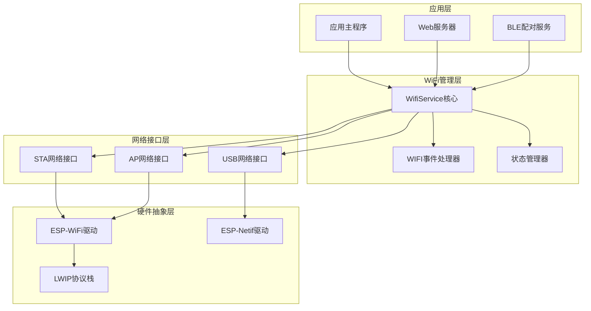
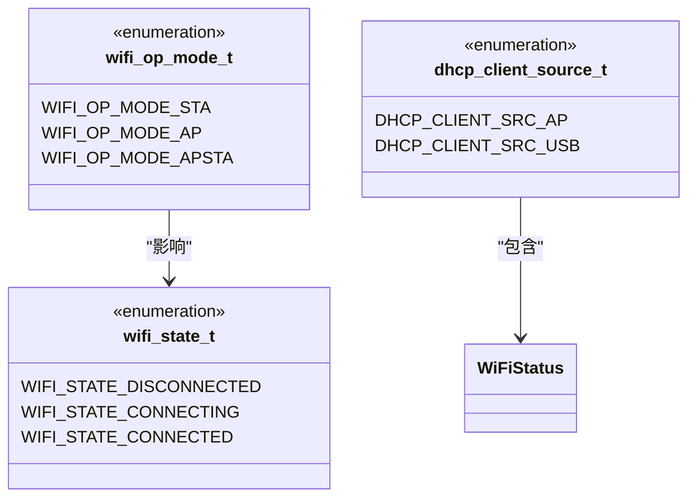
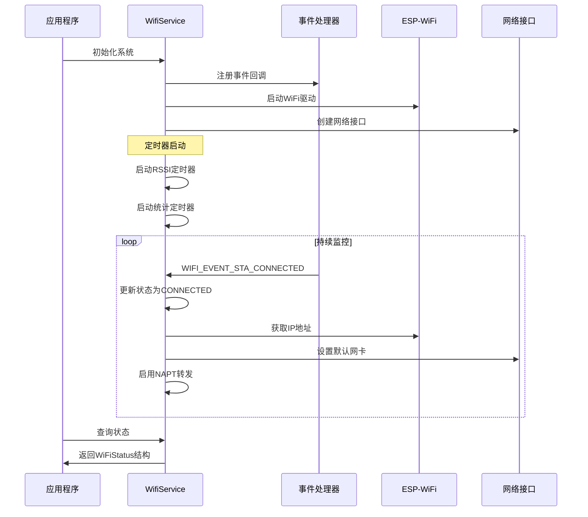
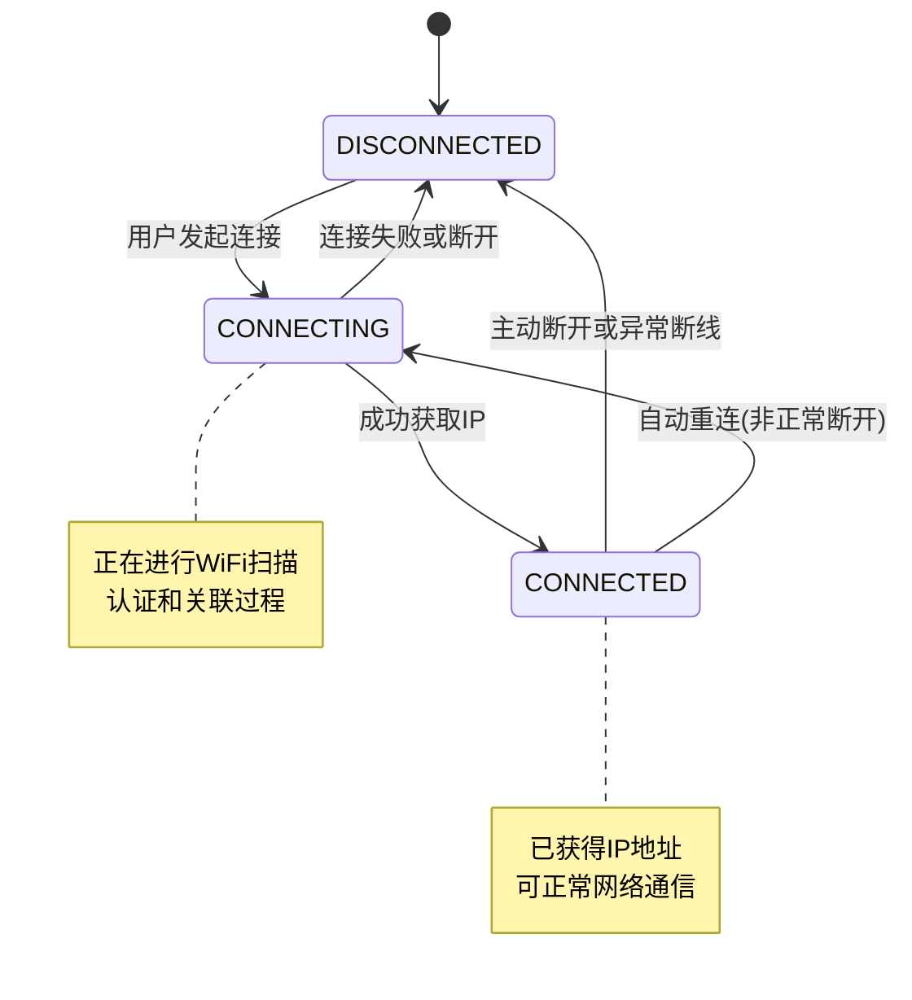
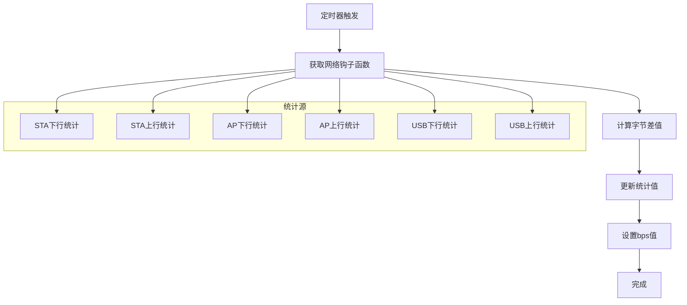
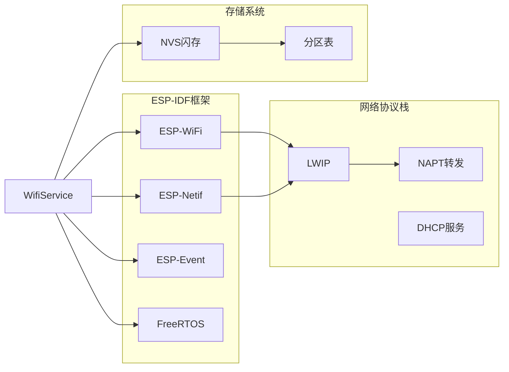
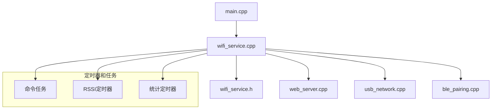
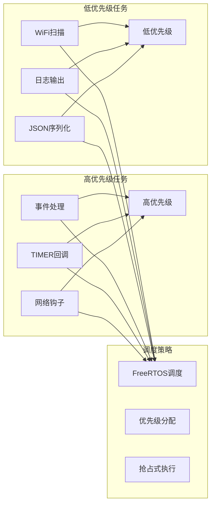

# WiFi状态管理

<cite>
**本文档引用的文件**
- [wifi_service.h](file://main/wifi_service.h)
- [wifi_service.cpp](file://main/wifi_service.cpp)
- [main.cpp](file://main/main.cpp)
- [CMakeLists.txt](file://CMakeLists.txt)
- [sdkconfig.defaults](file://sdkconfig.defaults)
</cite>

## 目录
1. [简介](#简介)
2. [项目结构](#项目结构)
3. [核心组件](#核心组件)
4. [架构概览](#架构概览)
5. [详细组件分析](#详细组件分析)
6. [依赖关系分析](#依赖关系分析)
7. [性能考虑](#性能考虑)
8. [故障排除指南](#故障排除指南)
9. [结论](#结论)

## 简介

本项目是一个基于ESP32-S3的WiFi状态管理系统，提供了完整的WiFi连接管理、状态监控和网络共享功能。系统支持STA模式、AP模式和AP+STA双模式运行，具备自动重连、信号强度监控、流量统计和DHCP客户端管理等功能。

该系统通过事件驱动架构实现WiFi状态的实时监控和状态转换，为上层应用提供统一的WiFi状态查询接口和JSON格式的数据输出。

## 项目结构

项目采用模块化设计，主要包含以下核心模块：



**图表来源**
- [main.cpp:19-81](file://main/main.cpp#L19-L81)
- [wifi_service.cpp:604-703](file://main/wifi_service.cpp#L604-L703)

**章节来源**
- [main.cpp:19-81](file://main/main.cpp#L19-L81)
- [CMakeLists.txt:1-7](file://CMakeLists.txt#L1-L7)

## 核心组件

### WiFi状态枚举定义

系统定义了完整的WiFi状态管理枚举体系：



**图表来源**
- [wifi_service.h:22-31](file://main/wifi_service.h#L22-L31)

### WiFiStatus结构体详解

WiFiStatus是系统的核心状态容器，包含完整的WiFi状态信息：

| 字段名 | 类型 | 描述 | 数据范围 |
|--------|------|------|----------|
| mode | wifi_op_mode_t | 当前工作模式 | STA/AP/APSTA |
| sta_ssid | char[33] | 连接的WiFi SSID | UTF-8字符串 |
| sta_password | char[65] | WiFi密码 | UTF-8字符串 |
| sta_state | wifi_state_t | STA状态 | DISCONNECTED/CONNECTING/CONNECTED |
| sta_ip | char[16] | STA IP地址 | IPv4地址字符串 |
| sta_rssi | int | 信号强度(dBm) | -120到0 |
| ap_ssid | char[33] | AP SSID | UTF-8字符串 |
| ap_password | char[65] | AP密码 | UTF-8字符串 |
| ap_active | bool | AP是否激活 | true/false |
| ap_clients | int | AP连接客户端数 | 0-4 |
| sta_down_bps | uint32_t | STA下行速率(B/s) | 实时统计 |
| sta_up_bps | uint32_t | STA上行速率(B/s) | 实时统计 |
| ap_down_bps | uint32_t | AP下行速率(B/s) | 实时统计 |
| ap_up_bps | uint32_t | AP上行速率(B/s) | 实时统计 |
| usb_down_bps | uint32_t | USB下行速率(B/s) | 实时统计 |
| usb_up_bps | uint32_t | USB上行速率(B/s) | 实时统计 |

**章节来源**
- [wifi_service.h:46-63](file://main/wifi_service.h#L46-L63)

## 架构概览

系统采用事件驱动的异步架构，通过FreeRTOS任务和定时器实现非阻塞的状态管理：



**图表来源**
- [wifi_service.cpp:416-595](file://main/wifi_service.cpp#L416-L595)
- [wifi_service.cpp:604-703](file://main/wifi_service.cpp#L604-L703)

## 详细组件分析

### 状态转换机制

WiFi状态转换遵循严格的有限状态机模型：



**图表来源**
- [wifi_service.h:22-26](file://main/wifi_service.h#L22-L26)
- [wifi_service.cpp:430-450](file://main/wifi_service.cpp#L430-L450)

### 事件处理机制

系统通过ESP-IDF的事件系统实现WiFi状态的实时监控：

#### 关键事件类型

| 事件类型 | 触发条件 | 处理逻辑 |
|----------|----------|----------|
| WIFI_EVENT_STA_START | WiFi STA启动 | 记录日志 |
| WIFI_EVENT_STA_CONNECTED | 成功连接到AP | 更新RSSI，启动统计 |
| WIFI_EVENT_STA_DISCONNECTED | 断开连接 | 设置DISCONNECTED状态 |
| WIFI_EVENT_AP_STACONNECTED | AP有客户端连接 | 增加客户端计数 |
| WIFI_EVENT_AP_STADISCONNECTED | AP客户端断开 | 减少客户端计数 |
| IP_EVENT_STA_GOT_IP | 获得IP地址 | 设置CONNECTED状态 |
| IP_EVENT_ASSIGNED_IP_TO_CLIENT | 分配DHCP IP | 更新客户端信息 |

**章节来源**
- [wifi_service.cpp:416-595](file://main/wifi_service.cpp#L416-L595)

### 状态获取API

#### wifi_service_get_status()

同步获取当前WiFi状态，适用于需要直接访问结构体的应用场景。

**参数：**
- `WiFiStatus* status` - 输出参数，指向WiFi状态结构体

**返回值：** 无

**使用示例路径：**
- [wifi_service.cpp:887-914](file://main/wifi_service.cpp#L887-L914)

#### wifi_service_get_status_json()

异步获取JSON格式的WiFi状态，适用于Web API和远程监控。

**参数：**
- `char* buffer` - 输出缓冲区
- `size_t buffer_size` - 缓冲区大小

**返回值：** 无

**JSON格式示例：**
```json
{
  "mode": "sta",
  "sta_state": "connected",
  "sta_ssid": "MyWiFiNetwork",
  "sta_password": "",
  "sta_ip": "192.168.1.100",
  "sta_rssi": -55,
  "ap_active": false,
  "ap_ssid": "ESP32-S3-AP",
  "ap_password": "12345678",
  "ap_clients": 0,
  "sta_down_bps": 102400,
  "sta_up_bps": 51200,
  "ap_down_bps": 0,
  "ap_up_bps": 0,
  "usb_down_bps": 0,
  "usb_up_bps": 0
}
```

**使用示例路径：**
- [wifi_service.cpp:916-963](file://main/wifi_service.cpp#L916-L963)

### 流量统计机制

系统实现了精确的网络流量统计，包括：



**图表来源**
- [wifi_service.cpp:207-229](file://main/wifi_service.cpp#L207-L229)
- [wifi_service.cpp:340-414](file://main/wifi_service.cpp#L340-L414)

**章节来源**
- [wifi_service.cpp:200-229](file://main/wifi_service.cpp#L200-L229)

### DHCP客户端管理

系统支持同时管理AP和USB网络的DHCP客户端：

| 客户端来源 | 说明 | IP分配方式 |
|------------|------|------------|
| DHCP_CLIENT_SRC_AP | 通过AP网络连接的设备 | AP DHCP服务器分配 |
| DHCP_CLIENT_SRC_USB | 通过USB网络连接的设备 | USB DHCP服务器分配 |

**章节来源**
- [wifi_service.h:33-37](file://main/wifi_service.h#L33-L37)
- [wifi_service.cpp:565-593](file://main/wifi_service.cpp#L565-L593)

## 依赖关系分析

### 外部依赖

系统依赖以下关键库和组件：



**图表来源**
- [wifi_service.cpp:1-21](file://main/wifi_service.cpp#L1-L21)
- [sdkconfig.defaults:7-10](file://sdkconfig.defaults#L7-L10)

### 内部模块依赖



**图表来源**
- [main.cpp:9-13](file://main/main.cpp#L9-L13)
- [wifi_service.cpp:118-144](file://main/wifi_service.cpp#L118-L144)

**章节来源**
- [main.cpp:9-13](file://main/main.cpp#L9-L13)
- [wifi_service.cpp:118-144](file://main/wifi_service.cpp#L118-L144)

## 性能考虑

### 内存管理

系统采用静态内存分配策略，确保实时性能：
- 状态结构体占用约256字节
- DHCP客户端数组最大支持16个客户端
- 扫描结果缓存最多32个AP
- 队列深度8条命令，避免内存溢出

### 实时性优化



**图表来源**
- [wifi_service.cpp:32-35](file://main/wifi_service.cpp#L32-L35)
- [wifi_service.cpp:118-144](file://main/wifi_service.cpp#L118-L144)

### 网络性能特性

- **RSSI采样间隔**: 3秒
- **流量统计间隔**: 1秒  
- **最大AP客户端数**: 4个
- **DHCP客户端上限**: 16个
- **扫描结果缓存**: 32个AP

## 故障排除指南

### 常见问题诊断

#### WiFi连接问题

**症状**: 设备无法连接到WiFi网络
**诊断步骤**:
1. 检查WiFi配置是否正确保存
2. 验证AP密码和SSID
3. 确认信号强度足够(-60dBm以上)
4. 查看断开原因码

**解决方案**:
- 重新输入正确的WiFi凭据
- 移动到信号更好的位置
- 检查路由器配置

#### 状态查询问题

**症状**: `wifi_service_get_status()`返回错误状态
**诊断步骤**:
1. 确认系统已正确初始化
2. 检查互斥锁状态
3. 验证网络接口状态

**解决方案**:
- 重新调用`wifi_service_init()`
- 检查内存分配情况
- 重启WiFi服务

#### 性能监控问题

**症状**: 流量统计值异常
**诊断步骤**:
1. 检查网络钩子函数安装
2. 验证定时器运行状态
3. 确认统计变量更新

**解决方案**:
- 重新安装网络钩子
- 重启统计定时器
- 清除统计缓存

### 调试技巧

#### 日志分析

系统提供了详细的日志输出，可通过以下方式启用：
- 使用ESP-IDF的ESP_LOG工具
- 监控关键事件日志
- 分析状态转换时间

#### 实时监控

建议使用以下监控方法：
- 定期调用`wifi_service_get_status_json()`
- 设置状态变化回调
- 监控RSSI和流量趋势

**章节来源**
- [wifi_service.cpp:430-450](file://main/wifi_service.cpp#L430-L450)
- [wifi_service.cpp:546-565](file://main/wifi_service.cpp#L546-L565)

## 结论

本WiFi状态管理系统提供了完整、可靠的WiFi连接管理功能，具有以下特点：

**优势**:
- 事件驱动的异步架构，保证实时响应
- 完整的状态监控和统计功能
- 支持多种工作模式的灵活切换
- 提供多种状态查询接口

**应用场景**:
- USB网络共享设备
- WiFi路由器管理
- IoT设备连接管理
- 网络监控系统

**扩展建议**:
- 添加更多网络质量指标
- 实现状态持久化存储
- 增强安全认证机制
- 优化内存使用效率

该系统为ESP32-S3平台提供了专业级的WiFi状态管理能力，适合各种嵌入式网络应用开发。