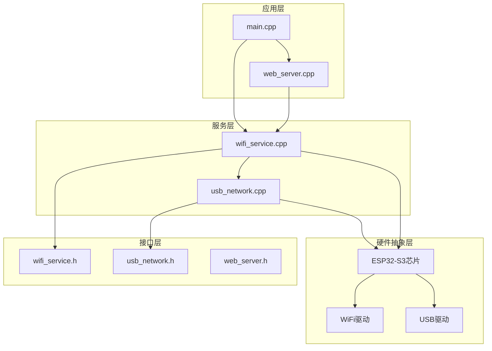
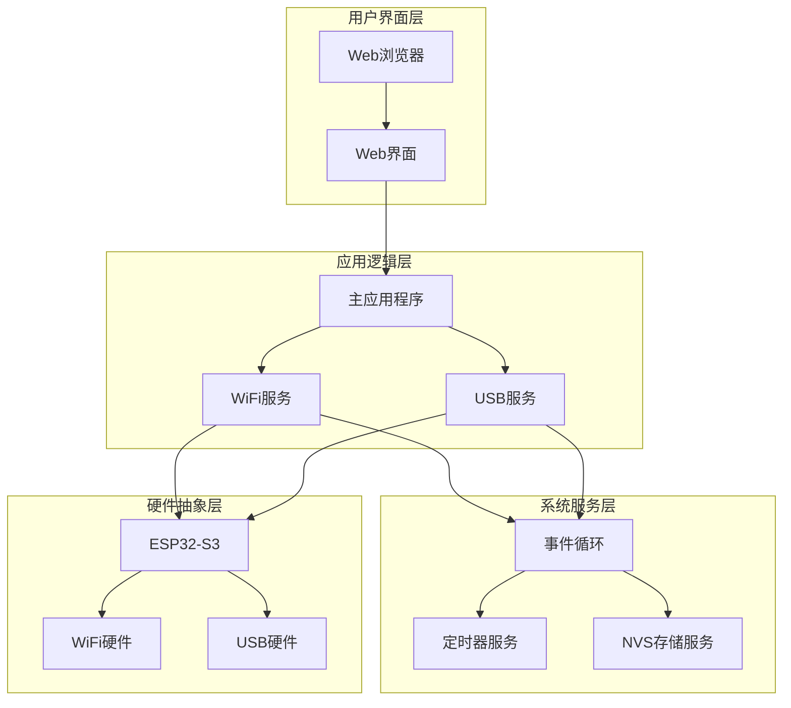
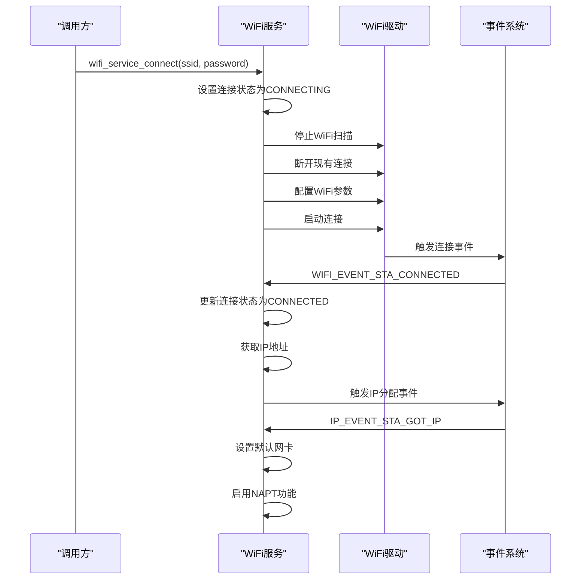
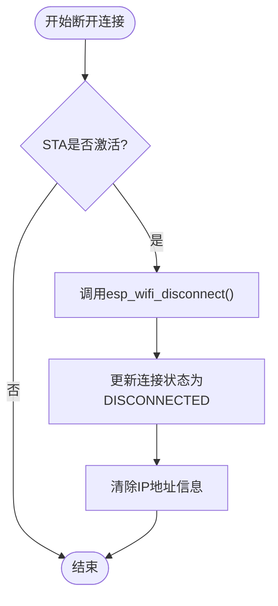
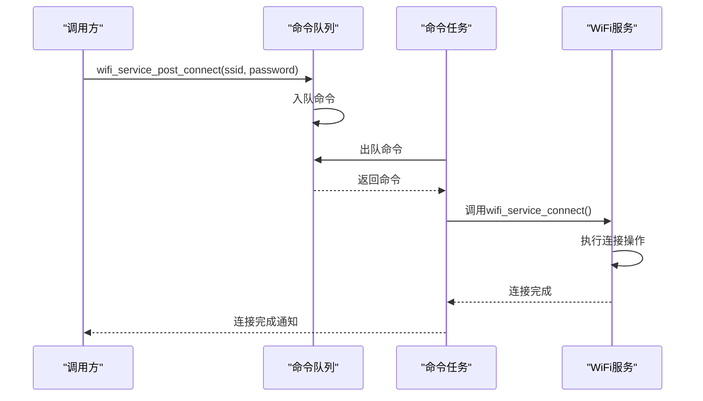
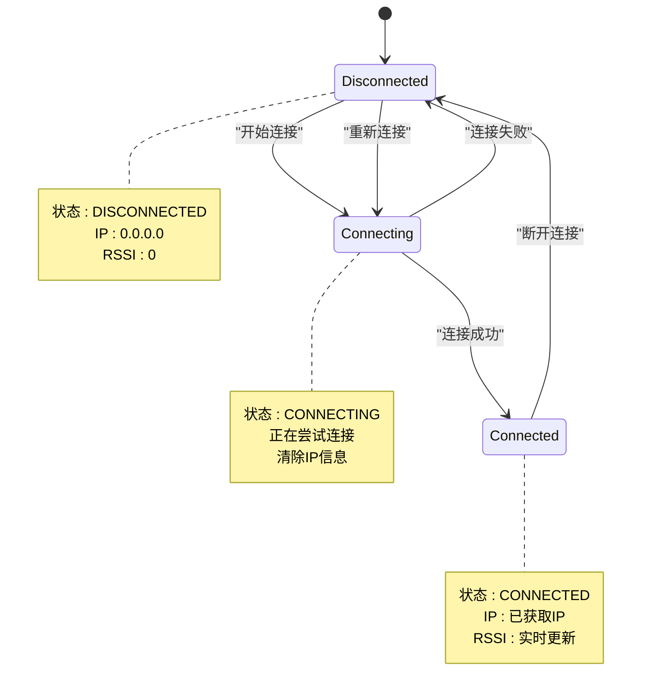
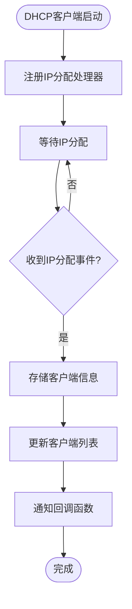
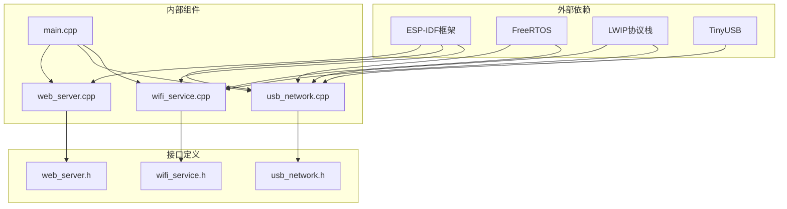

# WiFi连接控制

<cite>
**本文档引用的文件**
- [wifi_service.h](file://main/wifi_service.h)
- [wifi_service.cpp](file://main/wifi_service.cpp)
- [main.cpp](file://main/main.cpp)
- [usb_network.h](file://main/usb_network.h)
- [usb_network.cpp](file://main/usb_network.cpp)
- [web_server.h](file://main/web_server.h)
- [web_server.cpp](file://main/web_server.cpp)
</cite>

## 目录
1. [简介](#简介)
2. [项目结构](#项目结构)
3. [核心组件](#核心组件)
4. [架构概览](#架构概览)
5. [详细组件分析](#详细组件分析)
6. [依赖关系分析](#依赖关系分析)
7. [性能考虑](#性能考虑)
8. [故障排除指南](#故障排除指南)
9. [结论](#结论)

## 简介

这是一个基于ESP32-S3的WiFi连接控制系统，实现了STA模式下的WiFi连接管理功能。该系统提供了完整的WiFi连接生命周期管理，包括连接建立、断开连接、连接状态跟踪、事件回调机制以及与USB网络的集成。

系统支持多种工作模式：
- STA模式：作为WiFi客户端连接到现有网络
- AP模式：创建WiFi热点供其他设备连接
- APSTA模式：同时支持客户端和热点功能

## 项目结构

该项目采用模块化设计，主要包含以下核心模块：

**图表来源**
- [main.cpp:19-81](file://main/main.cpp#L19-L81)
- [wifi_service.cpp:604-703](file://main/wifi_service.cpp#L604-L703)
- [usb_network.cpp:191-290](file://main/usb_network.cpp#L191-L290)

**章节来源**
- [main.cpp:19-81](file://main/main.cpp#L19-L81)
- [CMakeLists.txt:1-7](file://CMakeLists.txt#L1-L7)

## 核心组件

### WiFi服务组件

WiFi服务是整个系统的核心，负责管理WiFi连接状态和提供统一的API接口。

**主要功能特性：**
- 连接管理：支持STA模式连接和断开
- 状态跟踪：实时监控连接状态、RSSI信号强度
- 配置管理：保存和加载WiFi配置信息
- 扫描功能：主动扫描可用的WiFi网络
- 事件处理：处理WiFi事件和网络事件

**章节来源**
- [wifi_service.h:69-93](file://main/wifi_service.h#L69-L93)
- [wifi_service.cpp:604-703](file://main/wifi_service.cpp#L604-L703)

### USB网络组件

USB网络组件提供USB网络接口，实现USB到WiFi的数据转发功能。

**主要功能：**
- USB网络初始化和配置
- 数据包转发和路由
- DHCP服务器功能
- 性能统计和监控

**章节来源**
- [usb_network.h:12-16](file://main/usb_network.h#L12-L16)
- [usb_network.cpp:191-290](file://main/usb_network.cpp#L191-L290)

### Web服务器组件

Web服务器提供用户界面，允许通过浏览器管理WiFi设置。

**功能特点：**
- 实时状态显示
- WiFi配置界面
- 设备管理功能
- 性能监控面板

**章节来源**
- [web_server.h:15-16](file://main/web_server.h#L15-L16)
- [web_server.cpp:1-200](file://main/web_server.cpp#L1-L200)

## 架构概览

系统采用分层架构设计，确保各组件之间的松耦合和高内聚。

**图表来源**
- [main.cpp:19-81](file://main/main.cpp#L19-L81)
- [wifi_service.cpp:604-703](file://main/wifi_service.cpp#L604-L703)
- [usb_network.cpp:191-290](file://main/usb_network.cpp#L191-L290)

## 详细组件分析

### WiFi连接管理组件

#### 连接函数 (wifi_service_connect)

连接函数是STA模式下WiFi连接的核心实现，负责建立与目标WiFi网络的连接。

**图表来源**
- [wifi_service.cpp:705-728](file://main/wifi_service.cpp#L705-L728)
- [wifi_service.cpp:416-595](file://main/wifi_service.cpp#L416-L595)

**连接参数配置：**
- SSID：网络名称，最大长度32字符
- 密码：网络密码，最大长度64字符
- 扫描方法：使用全通道扫描
- 认证模式：自动选择支持的认证方式

**章节来源**
- [wifi_service.cpp:705-728](file://main/wifi_service.cpp#L705-L728)
- [wifi_service.h:39-63](file://main/wifi_service.h#L39-L63)

#### 断开连接函数 (wifi_service_disconnect)

断开连接函数负责安全地断开当前的WiFi连接。

**图表来源**
- [wifi_service.cpp:730-737](file://main/wifi_service.cpp#L730-L737)

**章节来源**
- [wifi_service.cpp:730-737](file://main/wifi_service.cpp#L730-L737)

#### 连接后处理 (wifi_service_post_connect)

连接后处理函数提供异步连接机制，通过命令队列实现非阻塞连接。

**图表来源**
- [wifi_service.cpp:146-154](file://main/wifi_service.cpp#L146-L154)
- [wifi_service.cpp:118-144](file://main/wifi_service.cpp#L118-L144)

**章节来源**
- [wifi_service.cpp:146-154](file://main/wifi_service.cpp#L146-L154)
- [wifi_service.cpp:118-144](file://main/wifi_service.cpp#L118-L144)

### 连接状态跟踪

系统实现了完整的连接状态跟踪机制，包括以下状态：

**图表来源**
- [wifi_service.h:22-26](file://main/wifi_service.h#L22-L26)
- [wifi_service.cpp:416-595](file://main/wifi_service.cpp#L416-L595)

**章节来源**
- [wifi_service.h:22-26](file://main/wifi_service.h#L22-L26)
- [wifi_service.cpp:416-595](file://main/wifi_service.cpp#L416-L595)

### 事件回调机制

系统实现了基于事件驱动的回调机制，用于处理各种WiFi事件：

**主要事件类型：**
- 连接事件：WIFI_EVENT_STA_CONNECTED
- 断开事件：WIFI_EVENT_STA_DISCONNECTED  
- IP分配事件：IP_EVENT_STA_GOT_IP
- 客户端连接事件：WIFI_EVENT_AP_STACONNECTED
- 客户端断开事件：WIFI_EVENT_AP_STADISCONNECTED

**章节来源**
- [wifi_service.cpp:416-595](file://main/wifi_service.cpp#L416-L595)

### DHCP客户端集成

系统集成了DHCP客户端功能，支持动态IP地址分配：

**图表来源**
- [wifi_service.cpp:565-593](file://main/wifi_service.cpp#L565-L593)

**DHCP客户端信息结构：**
- 源类型：AP或USB
- MAC地址：客户端唯一标识
- IP地址：分配的IPv4地址

**章节来源**
- [wifi_service.h:33-37](file://main/wifi_service.h#L33-L37)
- [wifi_service.cpp:565-593](file://main/wifi_service.cpp#L565-L593)

## 依赖关系分析

系统采用模块化设计，各组件之间存在清晰的依赖关系：

**图表来源**
- [wifi_service.cpp:1-19](file://main/wifi_service.cpp#L1-L19)
- [usb_network.cpp:1-16](file://main/usb_network.cpp#L1-L16)

**章节来源**
- [wifi_service.cpp:1-19](file://main/wifi_service.cpp#L1-L19)
- [usb_network.cpp:1-16](file://main/usb_network.cpp#L1-L16)

## 性能考虑

### 内存管理

系统采用了高效的内存管理策略：

**静态内存分配：**
- WiFi配置信息：固定大小数组
- DHCP客户端列表：预分配固定容量
- 扫描结果缓存：固定大小缓冲区

**动态内存管理：**
- 扫描结果：按需分配，使用后释放
- 事件处理：临时缓冲区，及时清理

### 任务调度

系统使用了多任务架构来提高响应性：

**定时器任务：**
- RSSI定时器：每3秒更新一次信号强度
- 统计定时器：每1秒计算一次流量统计

**命令队列：**
- 异步命令处理
- 队列深度限制：8个命令
- 优先级分离：高优先级命令

### 网络性能优化

**NAPT功能：**
- 启用网络地址转换
- 支持WiFi到USB的流量共享
- 自动启用和禁用

**流量统计：**
- 实时流量监控
- 带宽计算精度：每秒统计
- 多接口流量分离

## 故障排除指南

### 常见连接问题

**问题1：无法连接到WiFi网络**
- 检查SSID和密码是否正确
- 确认网络是否支持WPA2/WPA3认证
- 验证信号强度是否足够

**问题2：连接后无法获取IP地址**
- 检查DHCP服务器状态
- 确认网络中是否有其他DHCP冲突
- 查看路由器配置

**问题3：连接不稳定**
- 检查信号干扰情况
- 验证路由器设置
- 考虑网络拥塞问题

### 调试工具和方法

**日志分析：**
- 启用详细日志级别
- 关注连接事件日志
- 监控错误码和返回值

**状态检查：**
- 使用状态查询接口
- 检查连接状态和IP信息
- 监控流量统计

**章节来源**
- [wifi_service.cpp:416-595](file://main/wifi_service.cpp#L416-L595)
- [main.cpp:25-66](file://main/main.cpp#L25-L66)

### 性能优化建议

**连接优化：**
- 使用智能重连机制
- 实现连接超时处理
- 优化扫描策略

**资源优化：**
- 合理配置定时器频率
- 优化内存使用效率
- 减少不必要的任务切换

**网络优化：**
- 启用适当的QoS设置
- 优化数据包大小
- 实现流量控制机制

## 结论

该WiFi连接控制系统提供了完整而可靠的STA模式WiFi连接管理功能。系统采用模块化设计，具有良好的可维护性和扩展性。通过事件驱动的架构和异步处理机制，系统能够高效地管理WiFi连接状态并提供丰富的功能特性。

主要优势包括：
- 完整的连接生命周期管理
- 实时状态跟踪和监控
- 高效的事件处理机制
- 与USB网络的无缝集成
- 良好的性能和稳定性

该系统为ESP32-S3平台提供了强大的WiFi连接能力，适用于各种物联网应用场景。