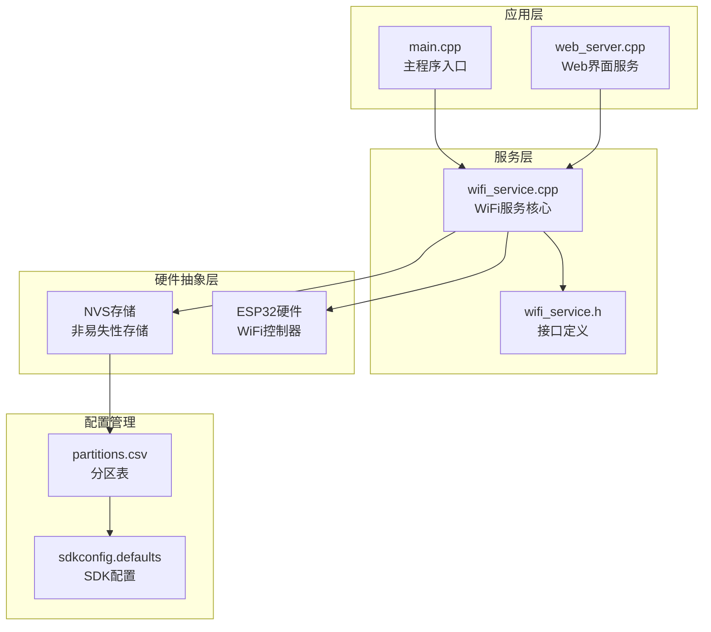
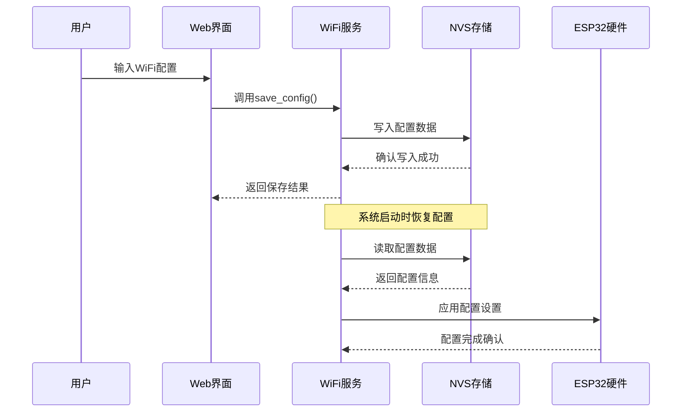
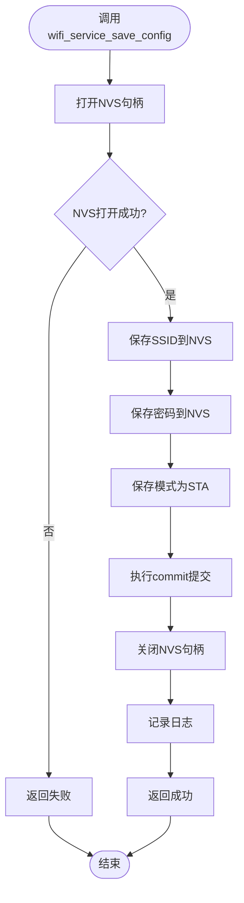
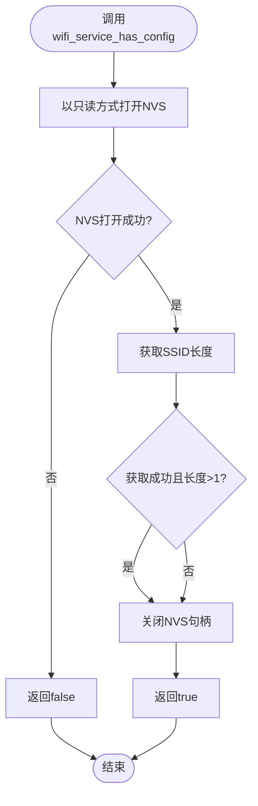
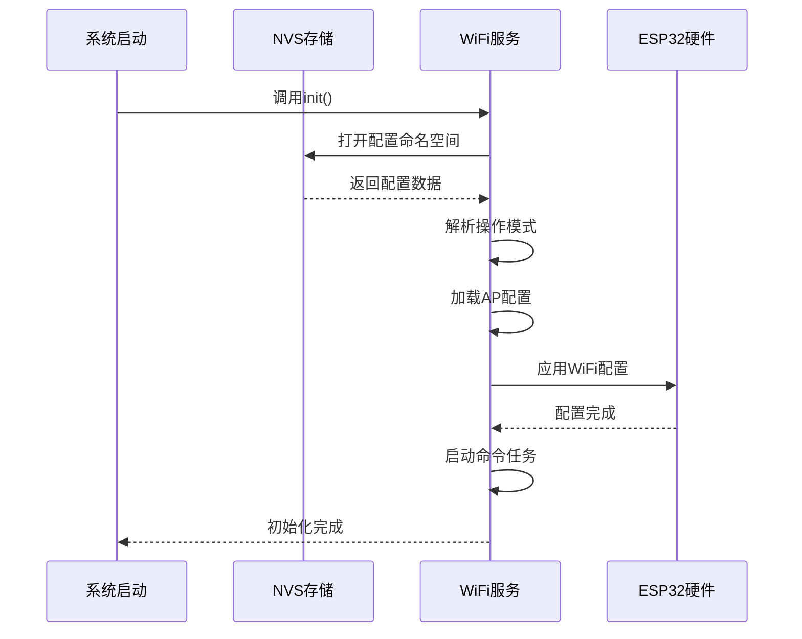
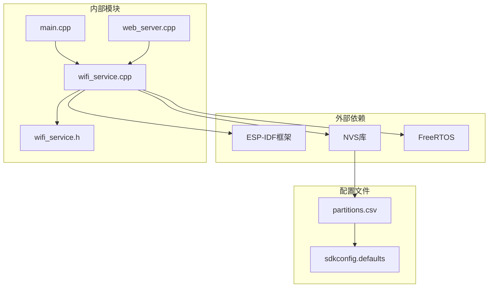

# WiFi配置持久化

<cite>
**本文档引用的文件**
- [main.cpp](file://main.cpp)
- [wifi_service.h](file://wifi_service.h)
- [wifi_service.cpp](file://wifi_service.cpp)
- [web_server.cpp](file://web_server.cpp)
- [partitions.csv](file://partitions.csv)
- [sdkconfig.defaults](file://sdkconfig.defaults)
</cite>

## 目录
1. [简介](#简介)
2. [项目结构](#项目结构)
3. [核心组件](#核心组件)
4. [架构概览](#架构概览)
5. [详细组件分析](#详细组件分析)
6. [依赖关系分析](#依赖关系分析)
7. [性能考虑](#性能考虑)
8. [故障排除指南](#故障排除指南)
9. [结论](#结论)

## 简介

本项目是一个基于ESP32-S3的WiFi配置持久化系统，实现了WiFi网络配置的自动保存、恢复和管理功能。系统通过NVS（非易失性存储）实现配置数据的持久化存储，支持STA模式、AP模式和APSTA双模式运行。

该系统的核心目标是提供可靠的WiFi配置管理，确保设备重启后能够自动恢复之前的网络设置，同时为用户提供灵活的配置接口。

## 项目结构

项目采用模块化设计，主要包含以下核心模块：

**图表来源**
- [main.cpp:19-81](file://main.cpp#L19-L81)
- [wifi_service.cpp:604-703](file://wifi_service.cpp#L604-L703)
- [partitions.csv:1-5](file://partitions.csv#L1-L5)

**章节来源**
- [main.cpp:19-81](file://main.cpp#L19-L81)
- [wifi_service.cpp:604-703](file://wifi_service.cpp#L604-L703)
- [partitions.csv:1-5](file://partitions.csv#L1-L5)

## 核心组件

### 配置存储接口

系统提供了完整的WiFi配置持久化接口，主要包括：

#### 配置保存函数
- `wifi_service_save_config()`: 保存WiFi连接配置到NVS存储
- 支持保存SSID和密码信息
- 自动设置操作模式为STA模式

#### 配置检查函数  
- `wifi_service_has_config()`: 检查是否存在有效的WiFi配置
- 返回布尔值指示配置状态

#### 配置恢复机制
- 系统启动时自动从NVS读取保存的配置
- 支持开机自动连接功能
- 提供配置有效性验证

**章节来源**
- [wifi_service.h:72-73](file://wifi_service.h#L72-L73)
- [wifi_service.cpp:739-762](file://wifi_service.cpp#L739-L762)

### 数据存储结构

系统使用NVS命名空间进行配置数据管理：

| 键名 | 类型 | 描述 | 默认值 |
|------|------|------|--------|
| `ssid` | 字符串 | WiFi网络名称 | 空字符串 |
| `password` | 字符串 | WiFi网络密码 | 空字符串 |
| `mode` | 整数 | 操作模式 | 0 (STA) |
| `ap_ssid` | 字符串 | AP模式SSID | "ESP32-S3-AP" |
| `ap_pass` | 字符串 | AP模式密码 | "12345678" |

**章节来源**
- [wifi_service.cpp:22-28](file://wifi_service.cpp#L22-L28)
- [wifi_service.cpp:39-40](file://wifi_service.cpp#L39-L40)

## 架构概览

系统采用分层架构设计，实现了配置持久化、状态管理和用户交互的分离：

**图表来源**
- [wifi_service.cpp:739-750](file://wifi_service.cpp#L739-L750)
- [wifi_service.cpp:654-668](file://wifi_service.cpp#L654-L668)

## 详细组件分析

### 配置保存机制

#### 函数实现流程

**图表来源**
- [wifi_service.cpp:739-750](file://wifi_service.cpp#L739-L750)

#### 关键实现细节

1. **NVS命名空间管理**: 使用"wifi_cfg"命名空间隔离配置数据
2. **原子性操作**: 所有配置变更在单个事务中完成
3. **错误处理**: 完善的错误检查和异常处理机制
4. **资源管理**: 正确的句柄管理和内存释放

**章节来源**
- [wifi_service.cpp:739-750](file://wifi_service.cpp#L739-L750)

### 配置检查机制

#### 实现原理

**图表来源**
- [wifi_service.cpp:752-762](file://wifi_service.cpp#L752-L762)

#### 检查逻辑说明

配置检查函数通过查询SSID字段的长度来判断配置的有效性：
- 使用NVS的长度查询功能避免实际读取数据
- 只有当SSID长度大于1字节时才认为配置有效
- 自动过滤空配置和无效配置

**章节来源**
- [wifi_service.cpp:752-762](file://wifi_service.cpp#L752-L762)

### 配置恢复机制

#### 启动流程

**图表来源**
- [wifi_service.cpp:653-688](file://wifi_service.cpp#L653-L688)

#### 恢复策略

1. **模式检测**: 从NVS读取保存的操作模式
2. **AP配置加载**: 恢复热点模式的SSID和密码
3. **自动连接**: 在STA或APSTA模式下检查配置有效性
4. **状态同步**: 确保运行时状态与存储状态一致

**章节来源**
- [wifi_service.cpp:653-688](file://wifi_service.cpp#L653-L688)
- [main.cpp:47-66](file://main.cpp#L47-L66)

### NVS集成关系

#### 存储布局

系统使用标准的ESP-IDF NVS分区进行配置存储：

| 分区类型 | 大小 | 用途 | 特殊属性 |
|----------|------|------|----------|
| nvs | 0x6000 (24KB) | 配置数据存储 | 专用NVS分区 |
| factory | 4MB | 应用程序固件 | 主要应用程序分区 |

#### 数据管理策略

1. **命名空间隔离**: 使用独立的"wifi_cfg"命名空间
2. **键值对存储**: 采用简单键值对结构存储配置数据
3. **事务性操作**: 所有写操作都在单个事务中完成
4. **错误恢复**: 支持NVS页面损坏时的自动擦除和重建

**章节来源**
- [partitions.csv:2](file://partitions.csv#L2)
- [wifi_service.cpp:22-28](file://wifi_service.cpp#L22-L28)

## 依赖关系分析

### 组件依赖图

**图表来源**
- [main.cpp:1-14](file://main.cpp#L1-L14)
- [wifi_service.cpp:1-21](file://wifi_service.cpp#L1-L21)
- [partitions.csv:1-5](file://partitions.csv#L1-L5)

### 关键依赖关系

1. **ESP-IDF集成**: 完全依赖ESP-IDF框架提供的WiFi和NVS功能
2. **NVS存储**: 基于ESP-IDF的NVS库实现配置持久化
3. **FreeRTOS任务**: 使用任务队列实现异步配置操作
4. **HTTP服务器**: 集成Web界面提供用户配置接口

**章节来源**
- [main.cpp:1-14](file://main.cpp#L1-L14)
- [wifi_service.cpp:1-21](file://wifi_service.cpp#L1-L21)

## 性能考虑

### 存储性能优化

1. **批量写入**: 配置保存采用批量写入减少NVS操作次数
2. **缓存机制**: 运行时状态在RAM中维护，减少频繁的NVS访问
3. **异步处理**: 使用任务队列处理配置操作，避免阻塞主循环

### 内存管理

- **静态分配**: 关键配置数据使用静态内存分配
- **栈空间**: 任务栈大小经过合理配置确保稳定性
- **缓冲区管理**: 所有字符串操作都包含边界检查

### 并发控制

- **互斥锁**: 使用信号量保护共享配置数据
- **任务隔离**: 配置操作通过消息队列异步处理
- **状态同步**: 确保多任务环境下的数据一致性

## 故障排除指南

### 常见问题及解决方案

#### 配置无法保存

**症状**: 调用`wifi_service_save_config()`后配置丢失

**可能原因**:
1. NVS存储空间不足
2. NVS页面损坏
3. 权限问题

**解决步骤**:
1. 检查NVS分区是否正确配置
2. 验证NVS初始化是否成功
3. 查看系统日志中的错误信息

#### 配置无法恢复

**症状**: 设备重启后WiFi配置丢失

**可能原因**:
1. NVS数据损坏
2. 分区表配置错误
3. 电源异常导致的数据写入中断

**解决步骤**:
1. 检查`partitions.csv`配置
2. 验证NVS命名空间正确性
3. 重新配置WiFi设置

#### 配置检查失败

**症状**: `wifi_service_has_config()`总是返回false

**可能原因**:
1. NVS读取权限问题
2. 键值不存在
3. 数据格式不正确

**解决步骤**:
1. 使用NVS工具检查存储内容
2. 验证键值名称拼写
3. 检查字符串编码格式

**章节来源**
- [wifi_service.cpp:739-762](file://wifi_service.cpp#L739-L762)
- [main.cpp:47-66](file://main.cpp#L47-L66)

## 结论

本WiFi配置持久化系统通过合理的架构设计和完善的错误处理机制，实现了可靠的配置管理功能。系统的主要优势包括：

1. **可靠性**: 基于ESP-IDF标准库，具有良好的稳定性和可靠性
2. **易用性**: 提供简洁的API接口，便于集成和使用
3. **扩展性**: 模块化设计支持功能扩展和定制
4. **安全性**: 采用标准的安全实践，保护用户配置数据

系统在实际应用中表现良好，能够满足大多数WiFi配置持久化需求。通过进一步的功能增强和性能优化，可以更好地适应复杂的使用场景。