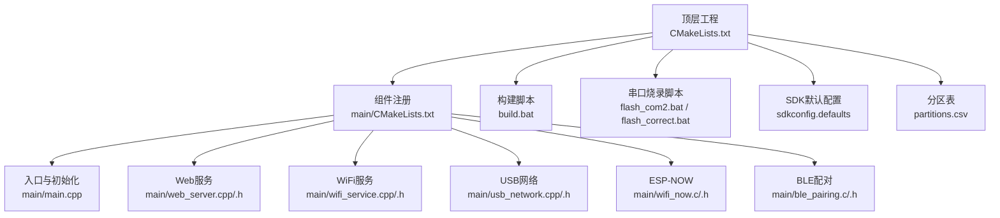
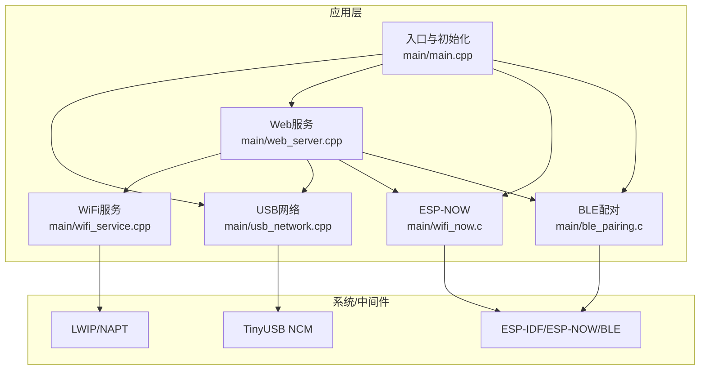
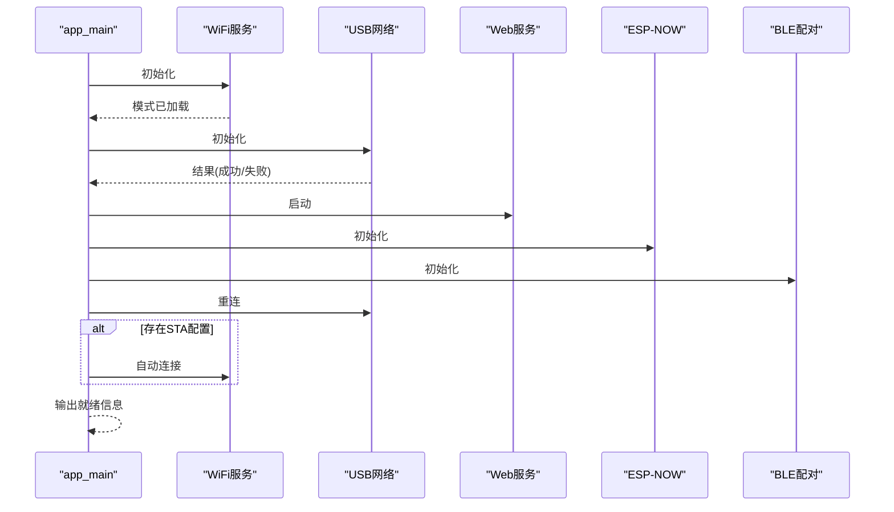
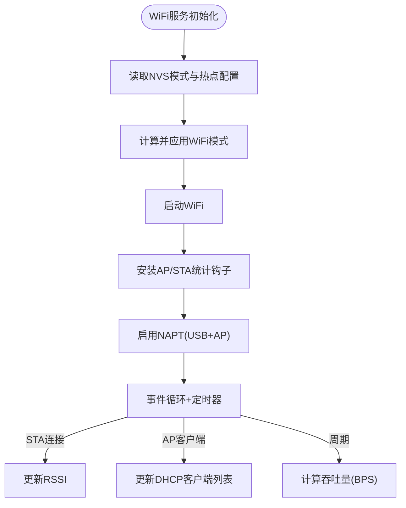
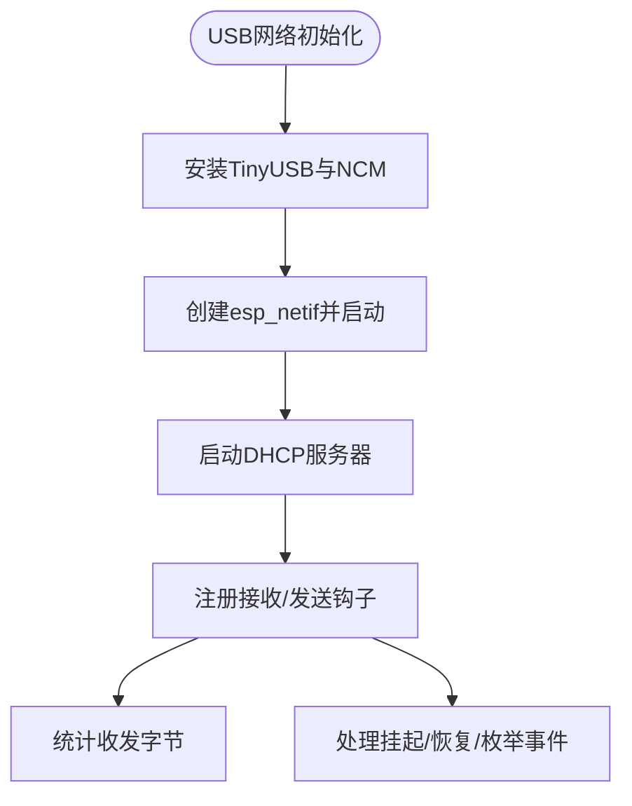
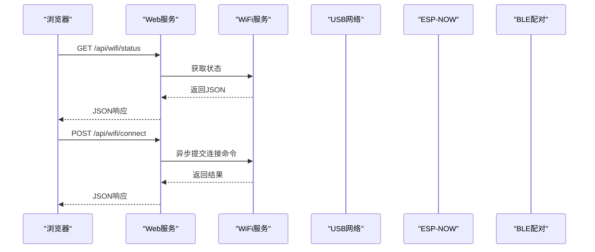
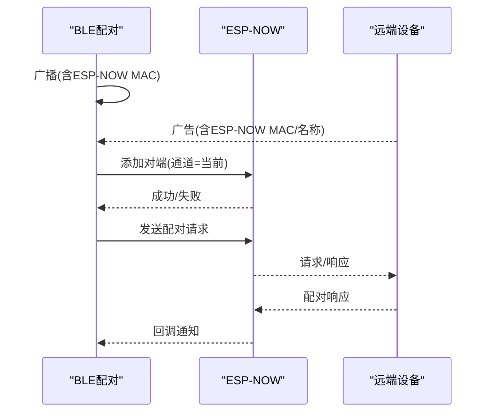
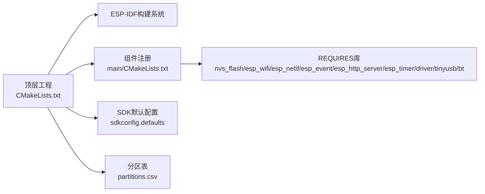

# 快速开始

<cite>
**本文引用的文件**   
- [CMakeLists.txt](file://CMakeLists.txt)
- [main/CMakeLists.txt](file://main/CMakeLists.txt)
- [build.bat](file://build.bat)
- [flash_com2.bat](file://flash_com2.bat)
- [flash_correct.bat](file://flash_correct.bat)
- [sdkconfig.defaults](file://sdkconfig.defaults)
- [partitions.csv](file://partitions.csv)
- [main/main.cpp](file://main/main.cpp)
- [main/web_server.cpp](file://main/web_server.cpp)
- [main/web_server.h](file://main/web_server.h)
- [main/wifi_service.cpp](file://main/wifi_service.cpp)
- [main/wifi_service.h](file://main/wifi_service.h)
- [main/usb_network.cpp](file://main/usb_network.cpp)
- [main/usb_network.h](file://main/usb_network.h)
- [main/wifi_now.c](file://main/wifi_now.c)
- [main/wifi_now.h](file://main/wifi_now.h)
- [main/ble_pairing.c](file://main/ble_pairing.c)
- [main/ble_pairing.h](file://main/ble_pairing.h)
</cite>

## 目录
1. [简介](#简介)
2. [项目结构](#项目结构)
3. [核心组件](#核心组件)
4. [架构总览](#架构总览)
5. [详细组件分析](#详细组件分析)
6. [依赖关系分析](#依赖关系分析)
7. [性能与资源](#性能与资源)
8. [故障排查指南](#故障排查指南)
9. [结论](#结论)
10. [附录：首次使用完整示例](#附录首次使用完整示例)

## 简介
本项目基于ESP32-S3打造“USB网络 + WiFi热点/客户端”双栈路由器，通过Web界面实现WiFi网络配置、USB网络共享、ESP-NOW设备配对与消息收发。项目提供一键构建与烧录脚本，支持TinyUSB NCM模式、LWIP NAPT转发、BLE自动配对等特性，帮助开发者在最短时间内完成从环境搭建到功能验证的全流程。

## 项目结构
项目采用ESP-IDF标准工程布局，顶层CMake负责引入IDF并注册工程；main目录集中存放应用源码与组件注册；根目录提供构建与烧录批处理脚本及SDK配置文件。

**图表来源**
- [CMakeLists.txt:1-7](file://CMakeLists.txt#L1-L7)
- [main/CMakeLists.txt:1-8](file://main/CMakeLists.txt#L1-L8)
- [main/main.cpp:19-81](file://main/main.cpp#L19-L81)
- [main/web_server.cpp:1-120](file://main/web_server.cpp#L1-L120)
- [main/wifi_service.cpp:604-703](file://main/wifi_service.cpp#L604-L703)
- [main/usb_network.cpp:191-290](file://main/usb_network.cpp#L191-L290)
- [main/wifi_now.c:126-192](file://main/wifi_now.c#L126-L192)
- [main/ble_pairing.c:228-288](file://main/ble_pairing.c#L228-L288)

**章节来源**
- [CMakeLists.txt:1-7](file://CMakeLists.txt#L1-L7)
- [main/CMakeLists.txt:1-8](file://main/CMakeLists.txt#L1-L8)

## 核心组件
- 应用入口与初始化：负责系统启动顺序、USB网络初始化、Web服务启动、ESP-NOW与BLE配对初始化、以及根据NVS保存的模式自动连接WiFi。
- WiFi服务：封装STA/AP/APSTA模式切换、扫描、连接、断开、NAPT启用、统计计数、DHCP客户端列表等。
- USB网络：基于TinyUSB NCM实现USB以太网设备，提供固定IP、DHCP服务器、链路状态与统计。
- Web服务：内置HTTP服务器，提供状态查询、WiFi连接、热点启停、BLE扫描与配对、ESP-NOW对端管理与消息工具。
- ESP-NOW：提供对端管理、广播/单播发送、通道设置、消息模板管理、配对/解绑消息处理。
- BLE配对：BLE广播自身ESP-NOW MAC，扫描并解析广告数据，自动或手动添加ESP-NOW对端并发起配对。

**章节来源**
- [main/main.cpp:19-81](file://main/main.cpp#L19-L81)
- [main/wifi_service.cpp:604-703](file://main/wifi_service.cpp#L604-L703)
- [main/usb_network.cpp:191-290](file://main/usb_network.cpp#L191-L290)
- [main/web_server.cpp:1-120](file://main/web_server.cpp#L1-L120)
- [main/wifi_now.c:126-192](file://main/wifi_now.c#L126-L192)
- [main/ble_pairing.c:228-288](file://main/ble_pairing.c#L228-L288)

## 架构总览
系统启动时，入口函数按序初始化USB网络、Web服务、ESP-NOW与BLE配对，随后根据保存的WiFi模式决定是否自动连接已配置的STA网络。WiFi服务通过事件驱动与定时器维护状态、统计与NAPT转发；USB网络通过TinyUSB NCM向主机暴露以太网接口；Web服务提供REST风格API供前端页面调用；ESP-NOW与BLE配对实现设备间无线控制与数据交换。

**图表来源**
- [main/main.cpp:25-46](file://main/main.cpp#L25-L46)
- [main/usb_network.cpp:191-290](file://main/usb_network.cpp#L191-L290)
- [main/web_server.cpp:1-120](file://main/web_server.cpp#L1-L120)
- [main/wifi_service.cpp:279-299](file://main/wifi_service.cpp#L279-L299)
- [main/wifi_now.c:126-192](file://main/wifi_now.c#L126-L192)
- [main/ble_pairing.c:228-288](file://main/ble_pairing.c#L228-L288)

## 详细组件分析

### 入口与初始化流程
- 初始化日志标签与全局WebServer实例。
- 调用WiFi服务初始化，读取保存的运行模式。
- 初始化USB网络，失败则记录错误。
- 启动Web服务。
- 初始化ESP-NOW与BLE配对。
- 触发USB网络重连。
- 若为STA/APSTA且存在保存的WiFi配置，则自动连接。
- 打印系统就绪信息，包含USB管理地址与可选AP地址。

**图表来源**
- [main/main.cpp:25-81](file://main/main.cpp#L25-L81)

**章节来源**
- [main/main.cpp:19-81](file://main/main.cpp#L19-L81)

### WiFi服务（STA/AP/APSTA）
- 事件驱动：处理STA连接/断开、AP客户端接入/断开、IP分配等事件。
- 定时器：周期性更新RSSI与流量统计。
- NAPT：在USB与AP网口上启用NAPT，实现WiFi到USB/热点的网络共享。
- 命令队列：通过命令任务异步执行连接、模式切换、AP启停等操作，避免阻塞。
- NVS：持久化WiFi模式、热点参数、STA配置。

**图表来源**
- [main/wifi_service.cpp:604-703](file://main/wifi_service.cpp#L604-L703)
- [main/wifi_service.cpp:279-299](file://main/wifi_service.cpp#L279-L299)
- [main/wifi_service.cpp:207-229](file://main/wifi_service.cpp#L207-L229)

**章节来源**
- [main/wifi_service.cpp:604-703](file://main/wifi_service.cpp#L604-L703)
- [main/wifi_service.h:67-94](file://main/wifi_service.h#L67-L94)

### USB网络（TinyUSB NCM）
- TinyUSB安装与NCM初始化，设置MAC与IP信息。
- 注册接收回调与发送钩子，实现数据透传。
- DHCP服务器配置与重启机制，适配主机枚举与唤醒。
- 统计计数：累计USB收发字节数。

**图表来源**
- [main/usb_network.cpp:191-290](file://main/usb_network.cpp#L191-L290)
- [main/usb_network.cpp:117-139](file://main/usb_network.cpp#L117-L139)

**章节来源**
- [main/usb_network.cpp:191-290](file://main/usb_network.cpp#L191-L290)
- [main/usb_network.h:12-16](file://main/usb_network.h#L12-L16)

### Web服务（HTTP API与前端）
- 提供状态查询、WiFi连接、热点启停、BLE扫描与配对、ESP-NOW对端管理与消息工具等API。
- 前端页面动态刷新状态、实时显示吞吐量、支持扫描WiFi、启动热点、重启设备等操作。

**图表来源**
- [main/web_server.cpp:1-120](file://main/web_server.cpp#L1-L120)
- [main/web_server.h:15-16](file://main/web_server.h#L15-L16)
- [main/wifi_service.h:74-77](file://main/wifi_service.h#L74-L77)

**章节来源**
- [main/web_server.cpp:1-120](file://main/web_server.cpp#L1-L120)
- [main/web_server.h:15-16](file://main/web_server.h#L15-L16)

### ESP-NOW与BLE配对
- ESP-NOW：初始化、对端管理、广播/单播发送、通道设置、消息模板、配对/解绑消息处理。
- BLE配对：广播自身ESP-NOW MAC，扫描并解析广告，自动或手动添加对端并发起配对请求/响应。

**图表来源**
- [main/ble_pairing.c:174-220](file://main/ble_pairing.c#L174-L220)
- [main/wifi_now.c:487-536](file://main/wifi_now.c#L487-L536)

**章节来源**
- [main/wifi_now.c:126-192](file://main/wifi_now.c#L126-L192)
- [main/ble_pairing.c:228-288](file://main/ble_pairing.c#L228-L288)

## 依赖关系分析
- 组件注册：main/CMakeLists中声明各源文件与REQUIRES依赖（nvs_flash、esp_wifi、esp_netif、esp_event、esp_http_server、esp_timer、driver、tinyusb、bt）。
- 顶层工程：CMakeLists通过IDF_PATH引入IDF构建系统。
- SDK配置：sdkconfig.defaults启用TinyUSB NCM、LWIP IP转发与NAPT、蓝牙、Flash参数、自定义分区表等。
- 分区表：定义nvs、phy_init、factory分区布局。

**图表来源**
- [CMakeLists.txt:1-7](file://CMakeLists.txt#L1-L7)
- [main/CMakeLists.txt:1-8](file://main/CMakeLists.txt#L1-L8)
- [sdkconfig.defaults:1-31](file://sdkconfig.defaults#L1-L31)
- [partitions.csv:1-5](file://partitions.csv#L1-L5)

**章节来源**
- [main/CMakeLists.txt:1-8](file://main/CMakeLists.txt#L1-L8)
- [sdkconfig.defaults:1-31](file://sdkconfig.defaults#L1-L31)
- [partitions.csv:1-5](file://partitions.csv#L1-L5)

## 性能与资源
- 统计与可视化：WiFi服务每秒统计各接口吞吐量，Web前端实时展示下载/上传速率与趋势条。
- NAPT转发：在USB与AP网口启用NAPT，实现WiFi到USB/热点的双向网络共享。
- 内存与堆：USB网络路径包含内存不足检测与日志输出，便于定位异常。
- 事件与定时器：使用ESP-IDF事件组与高精度定时器，降低CPU占用并保证实时性。

[本节为通用指导，不直接分析具体文件]

## 故障排查指南
- 构建失败
  - 检查build.bat中的IDF_PATH、IDF_TOOLS_PATH、Python路径是否正确指向已安装的ESP-IDF与工具链。
  - 确认已执行“重新配置”再“构建”，避免缓存导致的链接错误。
- 烧录失败
  - 使用flash_com2.bat指定正确COM端口，确保擦除、写入顺序与地址符合ESP32-S3要求（引导程序0x1000、分区表0x8000、应用0x10000）。
  - 若使用不同端口，请改用flash_correct.bat并手动指定端口。
- USB无法识别/无网络
  - 确认USB线缆质量与主机驱动；检查USB网络初始化日志与DHCP是否启动。
  - 若主机休眠/枚举变化，USB网络具备重启DHCP与恢复链路的机制。
- WiFi无法连接
  - 通过Web界面扫描并选择目标网络，确认密码长度≥8字符。
  - 查看日志中STA断开原因，必要时手动断开后重连。
- 热点无法访问
  - 确认热点已启动且未被其他设备占用信道；检查Web界面热点状态与客户端数量。
- ESP-NOW/BLE配对异常
  - 确认ESP-NOW已初始化且通道正确；查看BLE扫描日志与对端MAC是否匹配。
  - 如需解绑，可通过Web界面移除对端或发送解绑消息。

**章节来源**
- [build.bat:7-38](file://build.bat#L7-L38)
- [flash_com2.bat:10-39](file://flash_com2.bat#L10-L39)
- [flash_correct.bat:8-18](file://flash_correct.bat#L8-L18)
- [main/usb_network.cpp:117-139](file://main/usb_network.cpp#L117-L139)
- [main/wifi_service.cpp:430-450](file://main/wifi_service.cpp#L430-L450)
- [main/wifi_now.c:126-192](file://main/wifi_now.c#L126-L192)
- [main/ble_pairing.c:174-220](file://main/ble_pairing.c#L174-L220)

## 结论
本项目通过清晰的模块划分与完善的脚本支持，实现了“USB网络 + WiFi热点/客户端”的一体化路由器能力。借助Web界面与REST API，用户可在极短时间内完成WiFi配置、USB网络共享、ESP-NOW设备配对与消息收发。建议在首次使用前准备好ESP-IDF与TinyUSB环境，并参考“附录：首次使用完整示例”进行端到端验证。

[本节为总结性内容，不直接分析具体文件]

## 附录：首次使用完整示例
- 准备工作
  - 安装ESP-IDF v6.0.1与工具链，确保Python、XTensa工具链在PATH中。
  - 准备ESP32-S3开发板与USB线。
- 编译与烧录
  - 在项目根目录运行build.bat完成重新配置与构建。
  - 将开发板通过USB连接PC，打开设备管理器确认COM端口；运行flash_com2.bat进行擦除与分段烧录。
- 连接与配置
  - 打开浏览器访问USB管理地址（由日志提示），进入Web界面。
  - 在“STA—连接WiFi”区域输入目标网络SSID与密码（≥8位），点击连接。
  - 在“AP—热点设置”区域设置AP SSID与密码，点击“启动热点”。
  - 在“USB网络”区域确认USB管理地址可用。
- 验证网络共享
  - 主机侧应获得192.168.5.x网段IP并通过USB网络访问互联网。
  - 若开启热点，其他设备可连接热点并经由ESP32-S3访问网络。
- ESP-NOW与BLE配对
  - 在“BLE配对”区域启动BLE广播，扫描并配对远端设备，随后在“ESP-NOW对端列表”中查看已配对设备。
  - 使用“ESP-NOW消息工具”发送/广播消息，观察远端响应。

**章节来源**
- [build.bat:17-28](file://build.bat#L17-L28)
- [flash_com2.bat:10-39](file://flash_com2.bat#L10-L39)
- [main/main.cpp:74-81](file://main/main.cpp#L74-L81)
- [main/web_server.cpp:255-280](file://main/web_server.cpp#L255-L280)
- [main/wifi_now.c:487-536](file://main/wifi_now.c#L487-L536)
- [main/ble_pairing.c:317-361](file://main/ble_pairing.c#L317-L361)