# 数据模型和结构

<cite>
**本文档引用的文件**
- [wifi_now.h](file://main/wifi_now.h)
- [wifi_now.c](file://main/wifi_now.c)
- [wifi_service.h](file://main/wifi_service.h)
- [wifi_service.cpp](file://main/wifi_service.cpp)
- [ble_pairing.h](file://main/ble_pairing.h)
- [ble_pairing.c](file://main/ble_pairing.c)
- [web_server.h](file://main/web_server.h)
- [web_server.cpp](file://main/web_server.cpp)
- [ESP_NOW_BLE_Discovery_Specification.md](file://docs/ESP_NOW_BLE_Discovery_Specification.md)
- [ESP_NOW_WiFi_API_Specification.md](file://docs/ESP_NOW_WiFi_API_Specification.md)
- [ESP_NOW_BLE_Quick_Reference_CN.md](file://docs/ESP_NOW_BLE_Quick_Reference_CN.md)
</cite>

## 目录
1. [简介](#简介)
2. [项目结构](#项目结构)
3. [核心组件](#核心组件)
4. [架构概览](#架构概览)
5. [详细组件分析](#详细组件分析)
6. [依赖分析](#依赖分析)
7. [性能考虑](#性能考虑)
8. [故障排除指南](#故障排除指南)
9. [结论](#结论)
10. [附录](#附录)

## 简介

本文档详细说明了ESP32 WiFi项目的综合数据模型和结构，涵盖核心数据结构、状态枚举定义和回调函数接口。文档重点记录了WiFi状态、BLE设备信息和ESP-NOW对端信息的数据格式，解释了数据验证规则、业务规则和约束条件，提供了数据类型定义、字段含义和数据关系说明。

该项目实现了基于BLE的ESP-NOW设备自动发现和配对服务，支持WiFi网络状态监控、DHCP客户端管理、USB网络共享等功能。系统采用模块化设计，通过清晰的数据模型和严格的约束规则确保数据的一致性和完整性。

## 项目结构

项目采用模块化架构，主要包含以下核心模块：

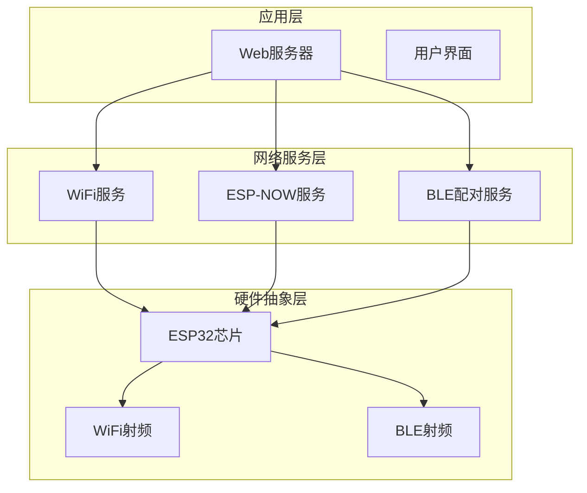

**图表来源**
- [web_server.cpp:1-2350](file://main/web_server.cpp#L1-L2350)
- [wifi_service.cpp:1-1105](file://main/wifi_service.cpp#L1-L1105)
- [wifi_now.c:1-862](file://main/wifi_now.c#L1-L862)

**章节来源**
- [web_server.h:1-22](file://main/web_server.h#L1-L22)
- [web_server.cpp:1-2350](file://main/web_server.cpp#L1-L2350)
- [wifi_service.h:1-99](file://main/wifi_service.h#L1-L99)
- [wifi_service.cpp:1-1105](file://main/wifi_service.cpp#L1-L1105)

## 核心组件

### WiFi状态数据模型

WiFi服务模块提供了完整的WiFi状态管理，包括STA/AP模式切换、连接状态监控、流量统计等功能。

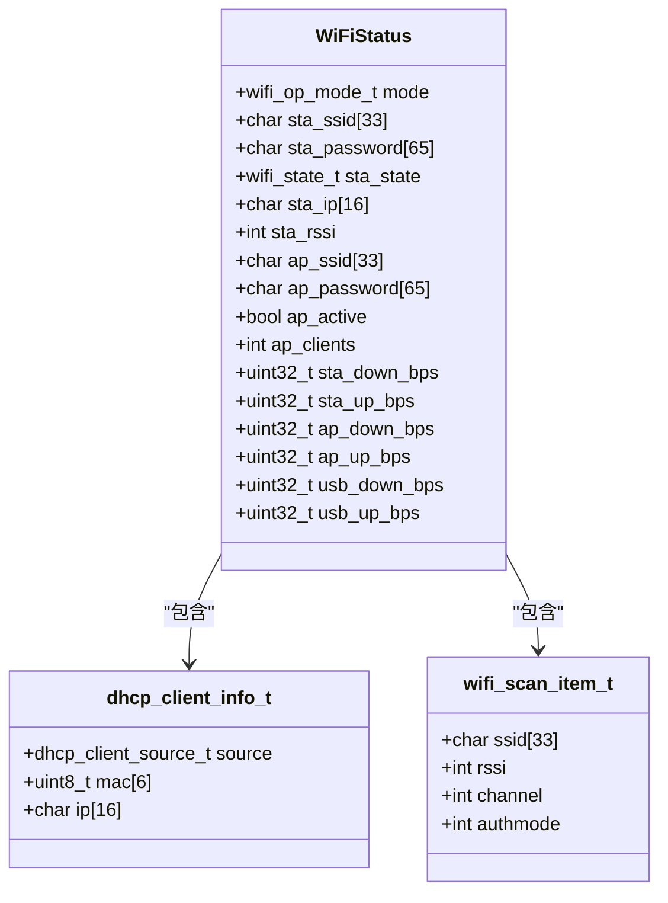

**图表来源**
- [wifi_service.h:33-63](file://main/wifi_service.h#L33-L63)

### ESP-NOW对端数据模型

ESP-NOW服务模块管理对端设备的配对状态和通信参数。

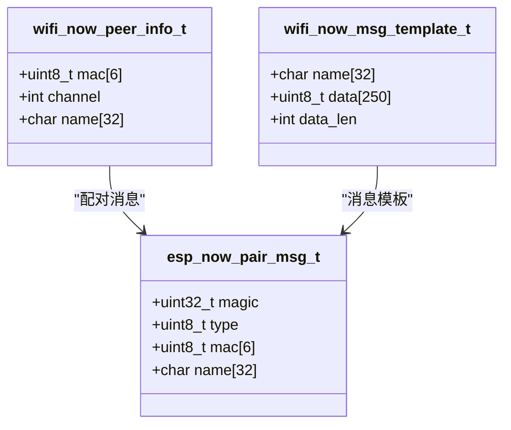

**图表来源**
- [wifi_now.h:27-50](file://main/wifi_now.h#L27-L50)

### BLE设备发现数据模型

BLE配对服务模块负责设备发现和自动配对。

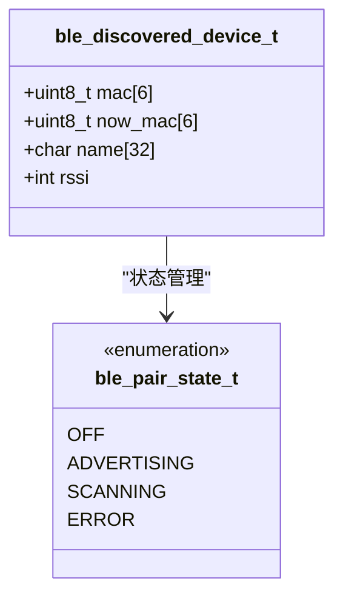

**图表来源**
- [ble_pairing.h:22-27](file://main/ble_pairing.h#L22-L27)

**章节来源**
- [wifi_service.h:16-63](file://main/wifi_service.h#L16-L63)
- [wifi_now.h:27-50](file://main/wifi_now.h#L27-L50)
- [ble_pairing.h:15-27](file://main/ble_pairing.h#L15-L27)

## 架构概览

系统采用分层架构设计，各层职责明确，数据流清晰：

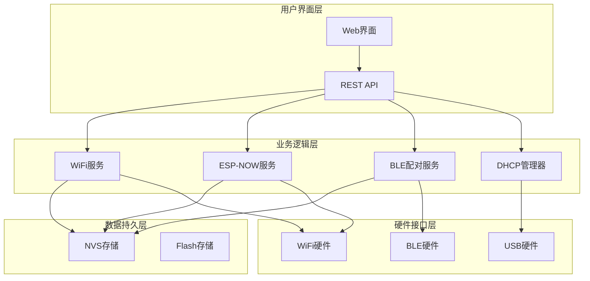

**图表来源**
- [web_server.cpp:1-2350](file://main/web_server.cpp#L1-L2350)
- [wifi_service.cpp:1-1105](file://main/wifi_service.cpp#L1-L1105)
- [wifi_now.c:1-862](file://main/wifi_now.c#L1-L862)
- [ble_pairing.c:1-487](file://main/ble_pairing.c#L1-L487)

## 详细组件分析

### WiFi服务组件

WiFi服务组件提供完整的WiFi网络管理功能，包括STA/AP模式切换、连接状态监控、流量统计等。

#### WiFi状态枚举定义

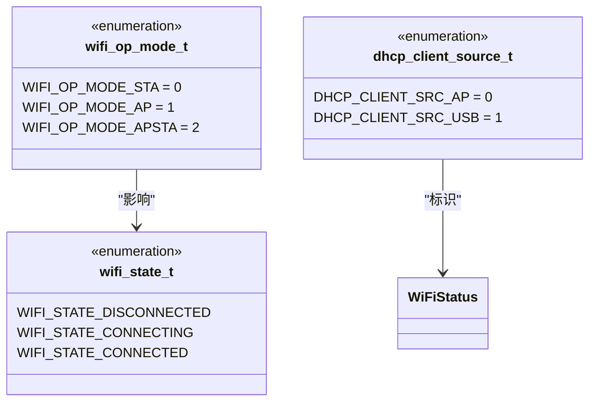

**图表来源**
- [wifi_service.h:16-31](file://main/wifi_service.h#L16-L31)

#### WiFi状态管理流程

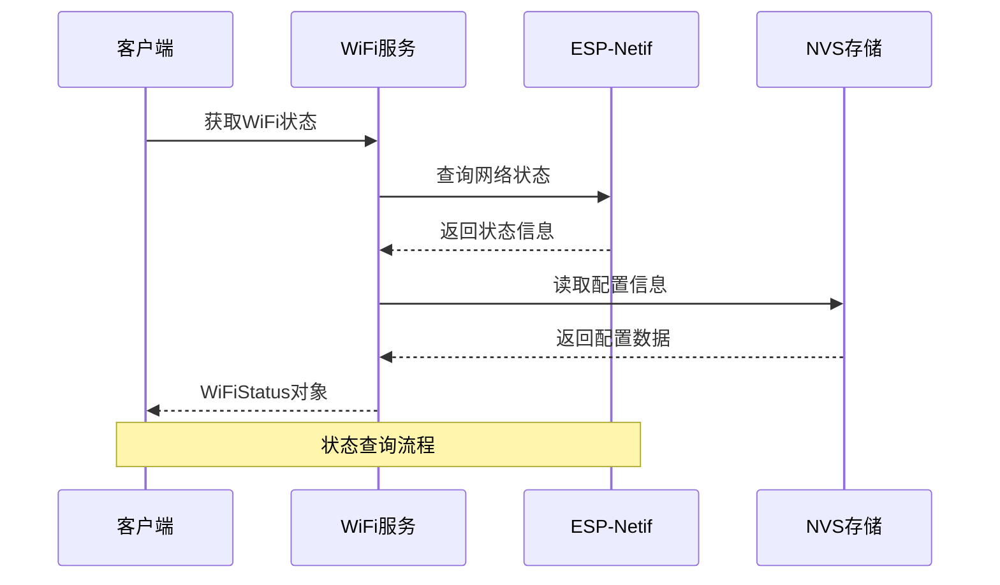

**图表来源**
- [wifi_service.cpp:887-914](file://main/wifi_service.cpp#L887-L914)

**章节来源**
- [wifi_service.h:16-63](file://main/wifi_service.h#L16-L63)
- [wifi_service.cpp:416-595](file://main/wifi_service.cpp#L416-L595)

### ESP-NOW服务组件

ESP-NOW服务组件实现设备间的直接通信，支持自动配对、消息传输和解绑功能。

#### ESP-NOW状态管理

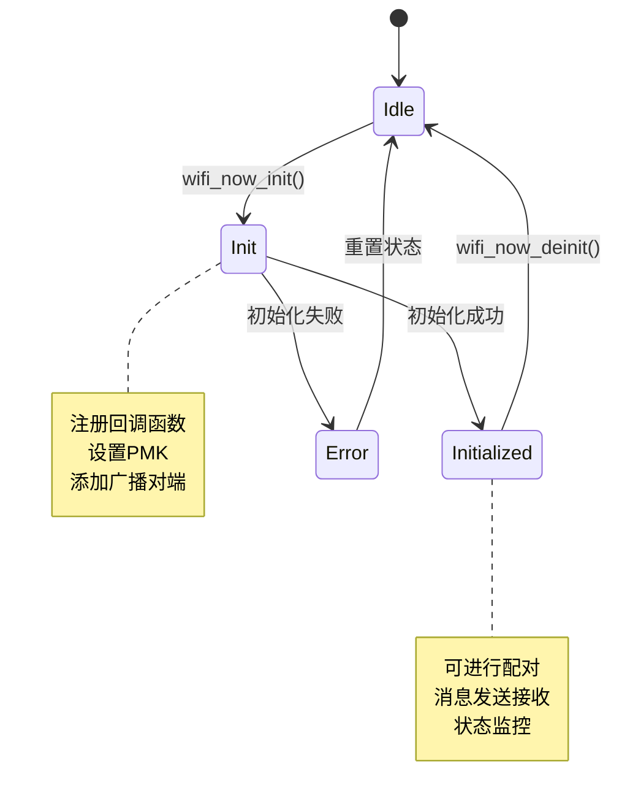

**图表来源**
- [wifi_now.c:126-207](file://main/wifi_now.c#L126-L207)

#### ESP-NOW配对协议

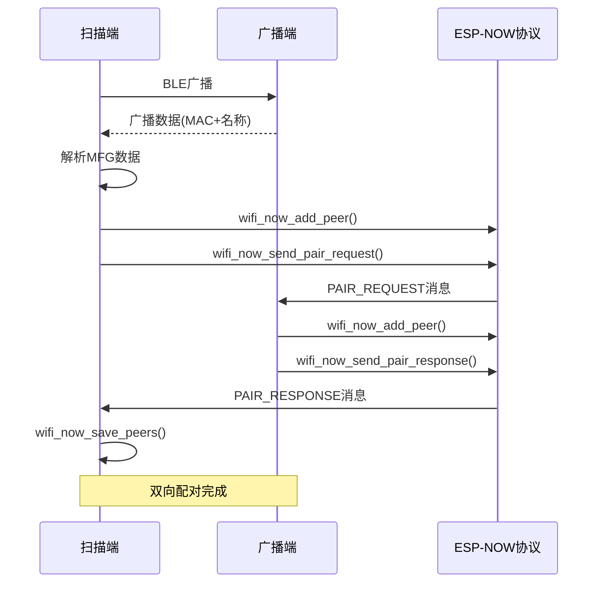

**图表来源**
- [ESP_NOW_BLE_Discovery_Specification.md:214-246](file://docs/ESP_NOW_BLE_Discovery_Specification.md#L214-L246)

**章节来源**
- [wifi_now.h:34-38](file://main/wifi_now.h#L34-L38)
- [wifi_now.c:487-691](file://main/wifi_now.c#L487-L691)

### BLE配对服务组件

BLE配对服务组件实现设备的自动发现和配对，支持广播和扫描功能。

#### BLE设备发现流程

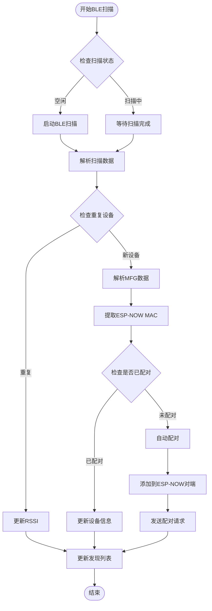

**图表来源**
- [ble_pairing.c:174-216](file://main/ble_pairing.c#L174-L216)

**章节来源**
- [ble_pairing.h:15-27](file://main/ble_pairing.h#L15-L27)
- [ble_pairing.c:129-220](file://main/ble_pairing.c#L129-L220)

### 数据验证规则

系统实施了严格的数据验证规则以确保数据完整性：

#### WiFi状态验证规则

| 验证类型 | 规则描述 | 验证范围 | 错误处理 |
|---------|---------|---------|---------|
| SSID长度 | 1-32字符 | `sta_ssid`, `ap_ssid` | 截断或拒绝 |
| 密码长度 | 8-64字符 | `sta_password`, `ap_password` | 拒绝连接 |
| IP地址格式 | IPv4格式 | `sta_ip` | 无效地址 |
| 信道范围 | 1-14 | `channel` | 使用默认值 |
| 流量统计 | 非负值 | `*_bps`字段 | 重置为0 |

#### ESP-NOW对端验证规则

| 验证类型 | 规则描述 | 验证范围 | 错误处理 |
|---------|---------|---------|---------|
| MAC地址 | 6字节十六进制 | `mac[6]` | 丢弃消息 |
| 消息类型 | 有效枚举值 | `type`字段 | 忽略消息 |
| 消息长度 | 1-250字节 | `data_len` | 截断或拒绝 |
| 配对状态 | 已初始化 | `wifi_now_is_initialized()` | 返回错误 |

#### BLE设备验证规则

| 验证类型 | 规则描述 | 验证范围 | 错误处理 |
|---------|---------|---------|---------|
| 设备名称 | 1-32字符 | `name`字段 | 使用默认名称 |
| RSSI范围 | -100到0dBm | `rssi`字段 | 修正到有效范围 |
| 发现数量 | 不超过16个 | 发现列表 | 覆盖最旧设备 |
| 广播数据 | 31字节以内 | 广播包 | 截断数据 |

**章节来源**
- [wifi_service.cpp:1038-1105](file://main/wifi_service.cpp#L1038-L1105)
- [wifi_now.c:713-771](file://main/wifi_now.c#L713-L771)
- [ble_pairing.c:113-127](file://main/ble_pairing.c#L113-L127)

## 依赖分析

系统采用模块化设计，各组件间依赖关系清晰：

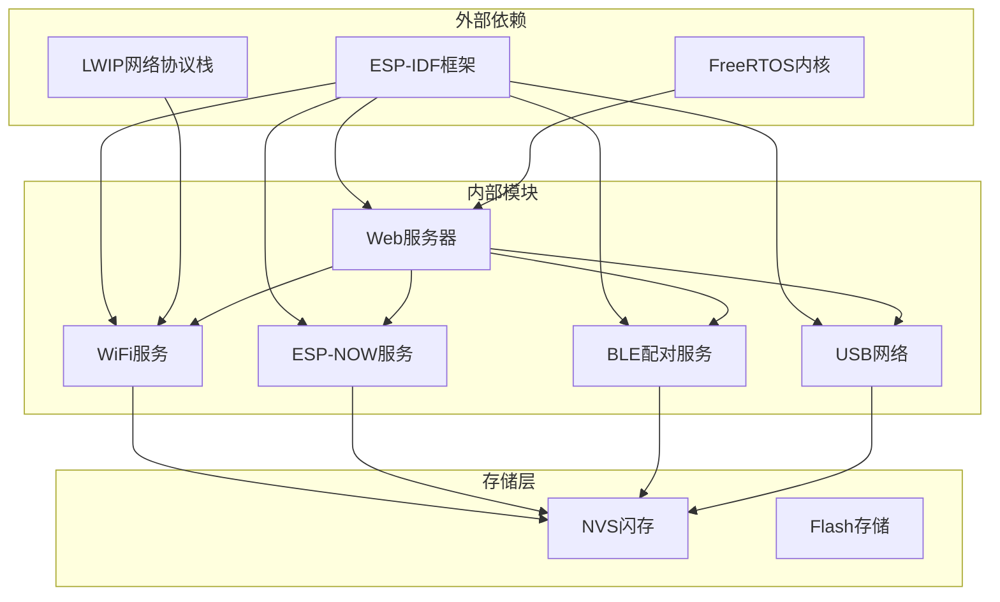

**图表来源**
- [web_server.cpp:1-2350](file://main/web_server.cpp#L1-L2350)
- [wifi_service.cpp:1-1105](file://main/wifi_service.cpp#L1-L1105)
- [wifi_now.c:1-862](file://main/wifi_now.c#L1-L862)
- [ble_pairing.c:1-487](file://main/ble_pairing.c#L1-L487)

**章节来源**
- [web_server.h:1-22](file://main/web_server.h#L1-L22)
- [wifi_service.h:1-99](file://main/wifi_service.h#L1-L99)
- [wifi_now.h:1-113](file://main/wifi_now.h#L1-L113)
- [ble_pairing.h:1-55](file://main/ble_pairing.h#L1-L55)

## 性能考虑

系统在设计时充分考虑了性能优化：

### 内存管理

- **静态内存分配**：关键数据结构采用静态分配，避免运行时内存碎片
- **缓冲区复用**：网络缓冲区和消息缓冲区复用，减少内存分配开销
- **内存池管理**：使用FreeRTOS内存池管理动态内存分配

### 任务调度

- **优先级分离**：网络任务和用户界面任务分离，避免相互阻塞
- **中断处理**：网络中断在ISR中处理，减少延迟
- **定时器优化**：使用高精度定时器进行周期性任务调度

### 网络优化

- **批量处理**：DHCP客户端信息批量处理，减少系统调用次数
- **缓存机制**：WiFi状态和对端信息缓存，避免频繁查询
- **流量整形**：网络流量整形，防止拥塞

## 故障排除指南

### 常见问题诊断

#### WiFi连接问题

| 问题症状 | 可能原因 | 解决方案 |
|---------|---------|---------|
| 无法连接WiFi | SSID不存在或密码错误 | 检查WiFi配置，重新输入密码 |
| 连接不稳定 | 信号强度差或干扰 | 调整位置或信道 |
| IP地址冲突 | DHCP租约冲突 | 重启路由器或修改IP范围 |

#### ESP-NOW通信问题

| 问题症状 | 可能原因 | 解决方案 |
|---------|---------|---------|
| 无法发现对端 | BLE广播未开启 | 检查BLE服务状态 |
| 配对失败 | PMK不匹配 | 确保双方使用相同PMK |
| 消息丢失 | 信道不一致 | 检查并同步信道设置 |

#### BLE配对问题

| 问题症状 | 可能原因 | 解决方案 |
|---------|---------|---------|
| 设备未显示 | BLE扫描超时 | 增加扫描时间或靠近设备 |
| 配对循环 | 自动配对设置错误 | 检查自动配对配置 |
| RSSI异常 | 硬件问题 | 更换设备或检查天线连接 |

**章节来源**
- [ESP_NOW_WiFi_API_Specification.md:787-800](file://docs/ESP_NOW_WiFi_API_Specification.md#L787-L800)
- [ESP_NOW_BLE_Discovery_Specification.md:668-700](file://docs/ESP_NOW_BLE_Discovery_Specification.md#L668-L700)

## 结论

本项目建立了完整的数据模型和结构体系，通过模块化设计实现了WiFi网络管理、ESP-NOW通信和BLE设备发现的统一平台。系统采用严格的验证规则和错误处理机制，确保了数据的完整性和系统的稳定性。

核心数据结构设计合理，状态枚举定义清晰，回调函数接口完善，为上层应用提供了丰富的功能接口。通过合理的缓存策略和性能优化，系统在资源受限的嵌入式环境中实现了高效运行。

未来可以在以下方面进一步改进：
- 增强数据加密和安全机制
- 优化大规模设备管理能力
- 扩展更多网络协议支持
- 提供更丰富的监控和诊断工具

## 附录

### 数据访问模式

系统支持多种数据访问模式：

1. **实时访问**：通过回调函数实时获取状态变化
2. **轮询访问**：定期查询状态信息
3. **事件驱动**：基于事件的状态变更通知
4. **批量访问**：批量获取设备列表和统计数据

### 缓存策略

- **状态缓存**：WiFi状态和对端信息缓存1秒
- **设备缓存**：BLE发现设备列表缓存30秒
- **配置缓存**：NVS配置信息缓存至下次写入
- **统计缓存**：网络流量统计每秒更新一次

### 数据生命周期

| 数据类型 | 生命周期 | 存储介质 | 清理策略 |
|---------|---------|---------|---------|
| WiFi状态 | 运行时 | RAM | 程序退出时释放 |
| 对端信息 | 持久化 | NVS | 重启后恢复 |
| DHCP记录 | 临时 | RAM | 会话结束清理 |
| 日志信息 | 临时 | NVS | 达到容量时覆盖 |
| 配置参数 | 持久化 | NVS | 用户修改时更新 |

### 安全和隐私

- **数据加密**：ESP-NOW通信支持PMK加密
- **访问控制**：HTTP API提供基本的身份验证
- **隐私保护**：设备名称和MAC地址的最小化收集
- **安全更新**：固件升级通道的安全保证

### 数据迁移和版本管理

系统支持平滑的数据迁移和版本管理：

- **向后兼容**：新版本自动适配旧版本数据
- **数据迁移**：自动检测和迁移旧格式数据
- **版本检查**：运行时检查组件版本兼容性
- **回滚机制**：支持降级到兼容的旧版本