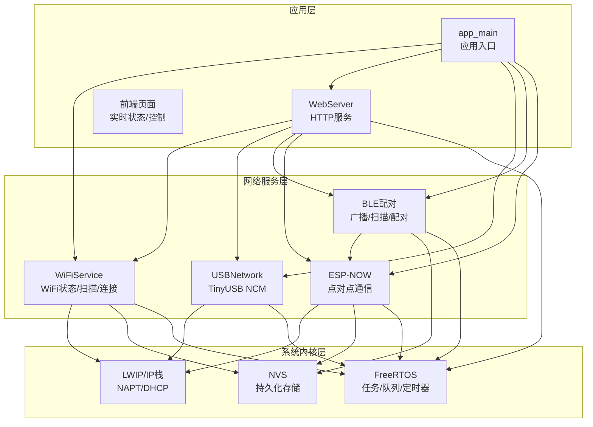
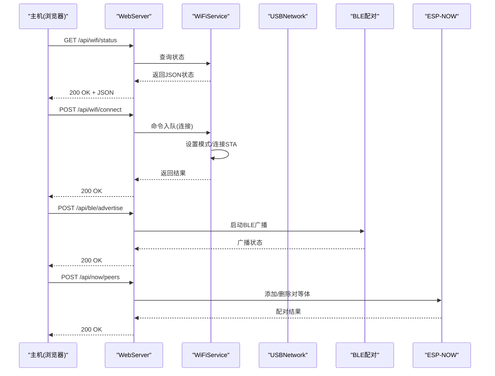
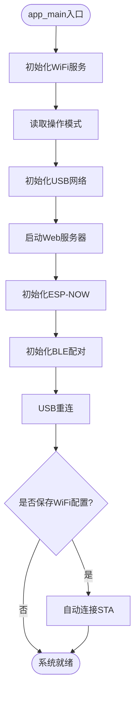
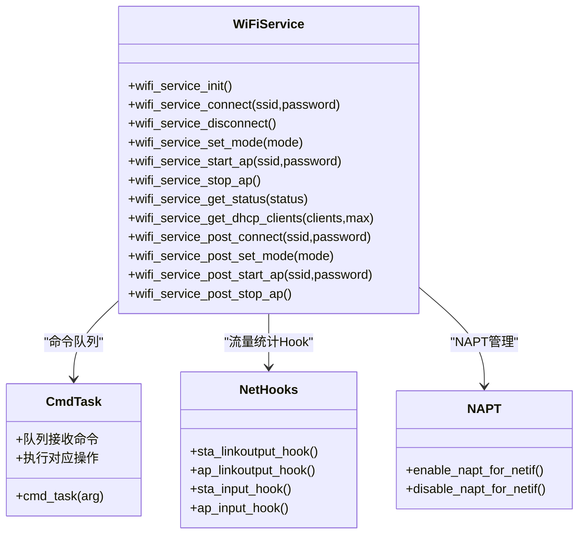
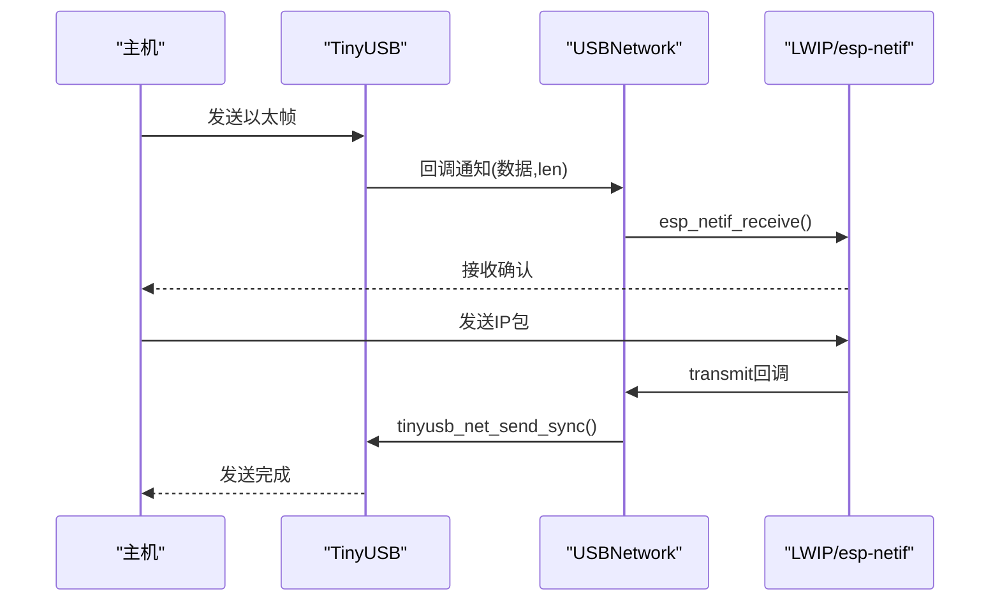
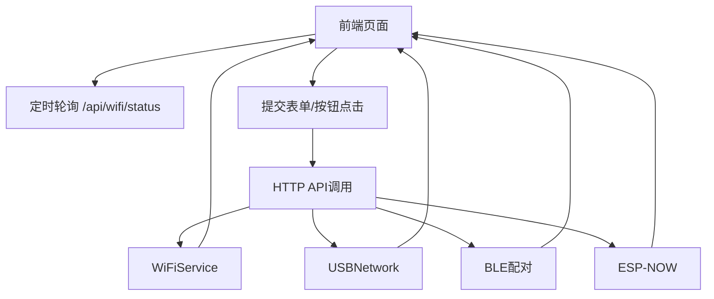
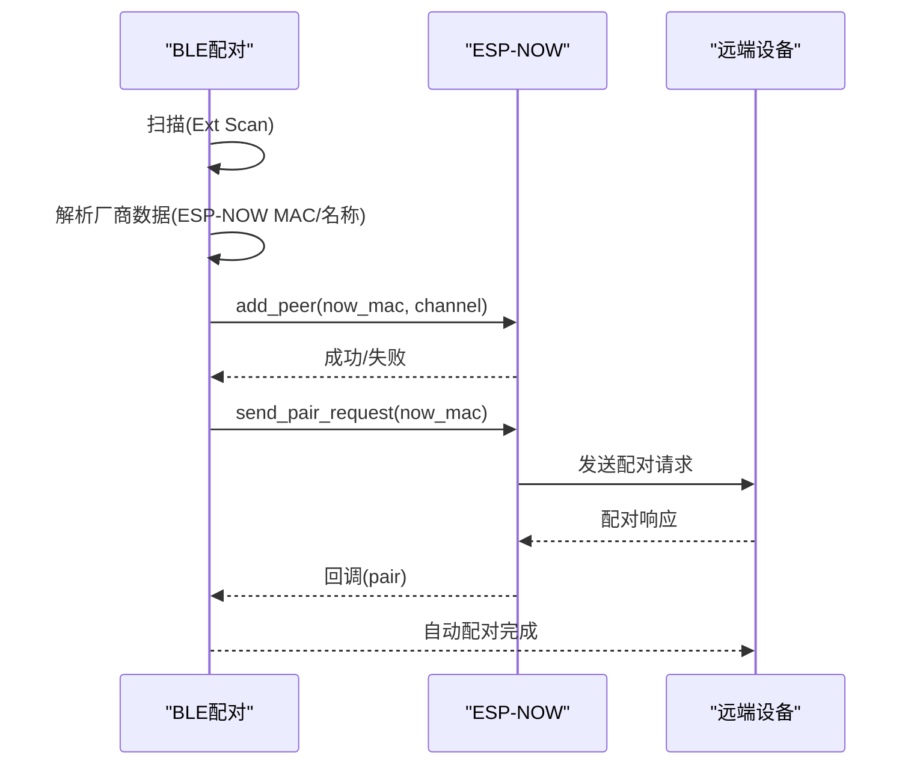
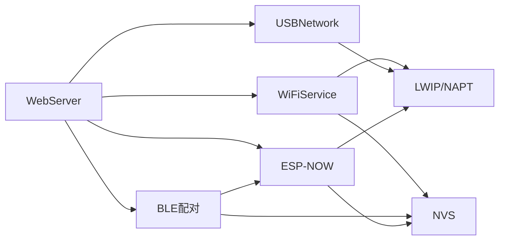

# 系统架构设计

<cite>
**本文档引用的文件**
- [main.cpp](file://main/main.cpp)
- [wifi_service.h](file://main/wifi_service.h)
- [wifi_service.cpp](file://main/wifi_service.cpp)
- [web_server.h](file://main/web_server.h)
- [web_server.cpp](file://main/web_server.cpp)
- [usb_network.h](file://main/usb_network.h)
- [usb_network.cpp](file://main/usb_network.cpp)
- [ble_pairing.h](file://main/ble_pairing.h)
- [ble_pairing.c](file://main/ble_pairing.c)
- [wifi_now.h](file://main/wifi_now.h)
- [wifi_now.c](file://main/wifi_now.c)
- [CMakeLists.txt](file://CMakeLists.txt)
- [sdkconfig.defaults](file://sdkconfig.defaults)
- [idf_component.yml](file://main/idf_component.yml)
</cite>

## 目录
1. [引言](#引言)
2. [项目结构](#项目结构)
3. [核心组件](#核心组件)
4. [架构总览](#架构总览)
5. [详细组件分析](#详细组件分析)
6. [依赖关系分析](#依赖关系分析)
7. [性能考量](#性能考量)
8. [故障排查指南](#故障排查指南)
9. [结论](#结论)
10. [附录](#附录)

## 引言
本项目为ESP32-S3 WiFi管理器，提供USB网络与WiFi双栈能力：通过TinyUSB实现USB以太网功能，支持USB端口自动识别计算机；通过ESP-WROOM-32S的WiFi能力提供STA/AP/APSTA模式；内置Web管理界面用于状态展示与配置下发；同时集成BLE与ESP-NOW用于设备发现与配对，形成“USB网络 + WiFi热点/客户端”的一体化路由器式设备。系统采用FreeRTOS事件驱动与模块化设计，具备NAPT共享、DHCP服务、流量统计与可视化界面等特性。

## 项目结构
项目采用ESP-IDF工程组织方式，核心源码位于main目录，包含应用入口、WiFi服务、Web服务器、USB网络、BLE配对与ESP-NOW通信等模块。顶层构建脚本与SDK配置文件定义了硬件平台、外设使能与分区表等基础环境。

**图表来源**
- [main.cpp:19-81](file://main/main.cpp#L19-L81)
- [wifi_service.cpp:604-703](file://main/wifi_service.cpp#L604-L703)
- [web_server.cpp:17-2350](file://main/web_server.cpp#L17-L2350)
- [usb_network.cpp:191-290](file://main/usb_network.cpp#L191-L290)
- [ble_pairing.c:228-288](file://main/ble_pairing.c#L228-L288)
- [wifi_now.c:126-192](file://main/wifi_now.c#L126-L192)

**章节来源**
- [CMakeLists.txt:1-7](file://CMakeLists.txt#L1-L7)
- [sdkconfig.defaults:1-31](file://sdkconfig.defaults#L1-L31)
- [main.cpp:19-81](file://main/main.cpp#L19-L81)

## 核心组件
- 应用入口与初始化序列：负责按序初始化WiFi、USB、Web、ESP-NOW、BLE，并在必要时自动连接已保存的WiFi配置。
- WiFi服务：封装WiFi模式切换、STA连接、AP启动、扫描、状态查询、DHCP客户端列表、流量统计与NAPT共享。
- USB网络：基于TinyUSB NCM模式，提供USB以太网接口、DHCP服务器、链路状态与错误处理。
- Web服务器：提供REST风格API与HTML页面，实时展示WiFi/AP/USB/NAPT状态、流量、DHCP客户端、ESP-NOW对等体与消息模板。
- BLE配对：BLE广播/扫描，解析ESP-NOW MAC，自动或手动配对，维护设备名与状态。
- ESP-NOW：点对点通信、配对/解配对消息、消息模板管理、通道设置与广播。

**章节来源**
- [main.cpp:25-80](file://main/main.cpp#L25-L80)
- [wifi_service.h:16-99](file://main/wifi_service.h#L16-L99)
- [wifi_service.cpp:604-703](file://main/wifi_service.cpp#L604-L703)
- [web_server.h:11-22](file://main/web_server.h#L11-L22)
- [web_server.cpp:17-2350](file://main/web_server.cpp#L17-L2350)
- [usb_network.h:12-22](file://main/usb_network.h#L12-L22)
- [usb_network.cpp:191-290](file://main/usb_network.cpp#L191-L290)
- [ble_pairing.h:15-55](file://main/ble_pairing.h#L15-L55)
- [ble_pairing.c:228-288](file://main/ble_pairing.c#L228-L288)
- [wifi_now.h:19-113](file://main/wifi_now.h#L19-L113)
- [wifi_now.c:126-192](file://main/wifi_now.c#L126-L192)

## 架构总览
系统采用事件驱动与模块化分层设计：
- 事件驱动：WiFi事件、IP事件、定时器回调、BLE GAP事件等均通过ESP-IDF事件循环与回调机制处理。
- 模块化：各子系统独立初始化与运行，通过统一的命令队列与状态接口进行交互。
- 数据流：USB与WiFi通过LWIP与NAPT实现共享，Web界面通过HTTP API读取状态与下发指令。
- 安全性：ESP-NOW使用预置PMK，BLE配对流程包含握手消息；NVS存储敏感配置需配合擦写策略。
- 可靠性：USB链路异常检测与重连、WiFi断线自动重连、BLE扫描超时控制、NAPT动态启用/禁用。

**图表来源**
- [web_server.cpp:17-2350](file://main/web_server.cpp#L17-L2350)
- [wifi_service.cpp:118-181](file://main/wifi_service.cpp#L118-L181)
- [ble_pairing.c:317-360](file://main/ble_pairing.c#L317-L360)
- [wifi_now.c:229-311](file://main/wifi_now.c#L229-L311)

## 详细组件分析

### 应用入口与初始化流程
- 初始化顺序：WiFi服务 → USB网络 → Web服务器 → ESP-NOW → BLE配对 → USB重连 → 自动STA连接（若存在配置）。
- 模式判断：根据NVS中保存的模式决定AP/STA/APSTA状态。
- 日志输出：清晰标注各阶段完成情况与当前工作模式。

**图表来源**
- [main.cpp:25-80](file://main/main.cpp#L25-L80)

**章节来源**
- [main.cpp:25-80](file://main/main.cpp#L25-L80)

### WiFi服务模块
- 职责：WiFi模式管理（STA/AP/APSTA）、STA连接/断开、AP启动/停止、扫描与结果缓存、状态查询与JSON导出、DHCP客户端统计、流量统计与NAPT共享。
- 关键机制：
  - 命令队列与专用任务：所有外部命令通过队列投递至命令任务执行，避免直接调用WiFi API导致阻塞。
  - 事件回调：WIFI_EVENT/IP_EVENT回调处理连接状态、RSSI更新、AP客户端接入/断开、DHCP分配等。
  - 定时器：周期性更新RSSI与带宽统计。
  - Hook：对netif输入/输出进行hook统计字节量。
  - NAPT：在STA/AP/USB网卡上启用/禁用NAPT，实现WiFi与USB共享。
- 数据结构：WiFiStatus、dhcp_client_info_t、wifi_scan_item_t等。

**图表来源**
- [wifi_service.h:69-94](file://main/wifi_service.h#L69-L94)
- [wifi_service.cpp:118-181](file://main/wifi_service.cpp#L118-L181)
- [wifi_service.cpp:340-414](file://main/wifi_service.cpp#L340-L414)
- [wifi_service.cpp:248-299](file://main/wifi_service.cpp#L248-L299)

**章节来源**
- [wifi_service.h:16-99](file://main/wifi_service.h#L16-L99)
- [wifi_service.cpp:604-703](file://main/wifi_service.cpp#L604-L703)
- [wifi_service.cpp:118-181](file://main/wifi_service.cpp#L118-L181)
- [wifi_service.cpp:340-414](file://main/wifi_service.cpp#L340-L414)
- [wifi_service.cpp:248-299](file://main/wifi_service.cpp#L248-L299)

### USB网络模块
- 职责：安装TinyUSB驱动与NCM网络栈，创建USB网卡、配置DHCP服务器、处理收发缓冲、链路状态与异常检测、USB枚举/挂起/恢复事件。
- 关键机制：
  - TinyUSB NCM：通过回调接收主机数据包并注入LWIP，发送时通过同步接口传输。
  - DHCP选项：设置租期、DNS服务器等。
  - 重连与重启：USB枚举或恢复后重启DHCP服务，确保主机侧网络可用。
  - 错误处理：TX失败计数、链路降级、内存不足告警。

**图表来源**
- [usb_network.cpp:41-91](file://main/usb_network.cpp#L41-L91)
- [usb_network.cpp:191-290](file://main/usb_network.cpp#L191-L290)

**章节来源**
- [usb_network.h:12-22](file://main/usb_network.h#L12-L22)
- [usb_network.cpp:191-290](file://main/usb_network.cpp#L191-L290)
- [usb_network.cpp:41-91](file://main/usb_network.cpp#L41-L91)

### Web服务器模块
- 职责：提供HTTP API与HTML页面，实时展示WiFi/AP/USB/NAPT状态、流量、DHCP客户端、ESP-NOW对等体与消息模板；接收用户配置并下发至WiFi/USB/BLE/ESP-NOW模块。
- 关键机制：
  - 页面：包含STA连接、AP热点、USB信息、DHCP表格、BLE/ESP-NOW工具区。
  - API：/api/wifi/*、/api/dhcp/*、/api/ble/*、/api/now/*、/api/restart等。
  - 实时刷新：定时轮询状态接口，动态更新UI。

**图表来源**
- [web_server.cpp:17-2350](file://main/web_server.cpp#L17-L2350)

**章节来源**
- [web_server.h:11-22](file://main/web_server.h#L11-L22)
- [web_server.cpp:17-2350](file://main/web_server.cpp#L17-L2350)

### BLE配对与ESP-NOW模块
- BLE配对：BLE广播（含自定义厂商数据携带ESP-NOW MAC与设备名）、扫描过滤、去重、自动配对与手动配对、状态查询。
- ESP-NOW：对等体管理（增删查改、持久化）、消息模板管理、配对/解配对握手、广播与单播发送、通道设置。
- 协同：BLE扫描发现ESP-NOW MAC后，自动添加对等体并发送配对请求，实现“即见即连”。

**图表来源**
- [ble_pairing.c:174-220](file://main/ble_pairing.c#L174-L220)
- [wifi_now.c:487-508](file://main/wifi_now.c#L487-L508)
- [wifi_now.c:662-712](file://main/wifi_now.c#L662-L712)

**章节来源**
- [ble_pairing.h:15-55](file://main/ble_pairing.h#L15-L55)
- [ble_pairing.c:228-288](file://main/ble_pairing.c#L228-L288)
- [wifi_now.h:19-113](file://main/wifi_now.h#L19-L113)
- [wifi_now.c:126-192](file://main/wifi_now.c#L126-L192)

## 依赖关系分析
- 外部依赖：
  - TinyUSB NCM：用于USB以太网功能，需满足ESP32-S3目标与配置。
  - ESP-IDF组件：esp_wifi、esp_netif、esp_event、LWIP、NVS、BLE/ESP-NOW。
- 内部模块耦合：
  - WebServer依赖WiFiService、USBNetwork、BLE配对、ESP-NOW接口。
  - WiFiService与USBNetwork通过NAPT共享实现互通。
  - BLE配对与ESP-NOW通过消息握手实现自动配对。
- 可能的环形依赖：未发现直接环形依赖，模块间通过接口与回调解耦。

**图表来源**
- [web_server.cpp:17-2350](file://main/web_server.cpp#L17-L2350)
- [wifi_service.cpp:604-703](file://main/wifi_service.cpp#L604-L703)
- [usb_network.cpp:191-290](file://main/usb_network.cpp#L191-L290)
- [wifi_now.c:126-192](file://main/wifi_now.c#L126-L192)

**章节来源**
- [idf_component.yml:1-6](file://main/idf_component.yml#L1-L6)
- [sdkconfig.defaults:1-31](file://sdkconfig.defaults#L1-L31)

## 性能考量
- 任务与调度：
  - 命令任务：独立任务处理WiFi命令，避免阻塞主循环。
  - 定时器：RSSI与统计定时器周期性触发，注意CPU占用与抖动。
- 内存与堆：
  - USB RX路径使用malloc复制缓冲，需关注堆大小与碎片；出现OOM时记录日志。
  - NVS读写与JSON序列化需考虑栈空间与缓冲区大小。
- 网络吞吐：
  - NAPT启用时，STA/AP共享USB出口，需监控带宽与丢包率。
  - ESP-NOW广播与多对多通信可能影响信道利用率，建议合理设置通道与模板数量。
- 优化建议：
  - 将高频统计与UI刷新分离，减少主线程压力。
  - 对USB TX失败进行指数退避或限速，避免持续失败导致CPU占用。
  - 合理设置BLE扫描窗口与间隔，平衡发现速度与功耗。

[本节为通用指导，无需特定文件引用]

## 故障排查指南
- USB无法联网：
  - 检查TinyUSB是否正确安装与初始化，确认NCM模式启用。
  - 观察USB枚举/挂起/恢复事件日志，必要时重启DHCP服务。
  - 查看TX失败计数与链路降级日志。
- WiFi无法连接：
  - 确认STA配置已保存且模式正确，检查自动连接逻辑。
  - 查看WIFI_EVENT/IP_EVENT回调日志，定位断线原因。
  - 检查NAPT是否启用，确保默认网卡设置正确。
- BLE/ESP-NOW配对失败：
  - 确认BLE广播/扫描状态，检查厂商数据格式与ESP-NOW MAC。
  - 查看配对请求/响应消息是否成功发送与接收。
  - 检查对等体列表与通道设置，必要时清理并重新添加。
- Web界面无响应：
  - 检查HTTP API是否可达，查看返回状态与错误信息。
  - 关注UI轮询频率与网络延迟，适当调整刷新间隔。

**章节来源**
- [usb_network.cpp:152-188](file://main/usb_network.cpp#L152-L188)
- [wifi_service.cpp:416-595](file://main/wifi_service.cpp#L416-L595)
- [ble_pairing.c:174-220](file://main/ble_pairing.c#L174-L220)
- [wifi_now.c:487-508](file://main/wifi_now.c#L487-L508)

## 结论
该系统以模块化与事件驱动为核心，结合USB与WiFi双栈能力，提供了完整的无线路由器式功能：自动STA连接、AP热点、USB以太网、NAPT共享、BLE/ESP-NOW自动配对与Web管理界面。通过命令队列、定时器与回调机制实现了高可靠与低耦合的架构设计。部署时需关注USB链路稳定性、WiFi信道与NAPT配置、BLE扫描策略与ESP-NOW对等体数量，以获得最佳用户体验。

[本节为总结性内容，无需特定文件引用]

## 附录

### 技术栈与版本兼容
- 开发框架：ESP-IDF
- 目标芯片：ESP32-S3
- 外设使能：TinyUSB NCM、BLE、ESP-NOW、LWIP NAPT、IP转发
- 组件依赖：espressif/esp_tinyusb（版本范围与目标平台规则）

**章节来源**
- [sdkconfig.defaults:1-31](file://sdkconfig.defaults#L1-L31)
- [idf_component.yml:1-6](file://main/idf_component.yml#L1-L6)

### 基础设施要求与部署拓扑
- 硬件：ESP32-S3开发板，USB Type-A接口用于连接PC。
- 固件：按ESP-IDF流程编译与烧录，使用自定义分区表。
- 网络拓扑：
  - USB侧：PC通过USB以太网访问管理页面与共享网络。
  - WiFi侧：STA连接外部WiFi网络，AP向终端设备提供热点；NAPT实现STA与AP共享USB出口。
- 可扩展性：支持AP+STA双栈、多对多ESP-NOW通信、可扩展的Web API与消息模板。

**章节来源**
- [sdkconfig.defaults:7-19](file://sdkconfig.defaults#L7-L19)
- [main.cpp:68-80](file://main/main.cpp#L68-L80)