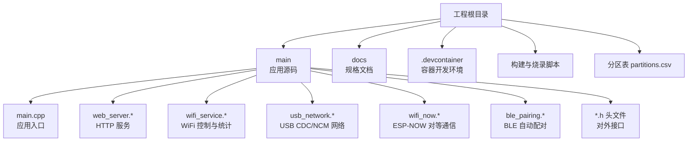
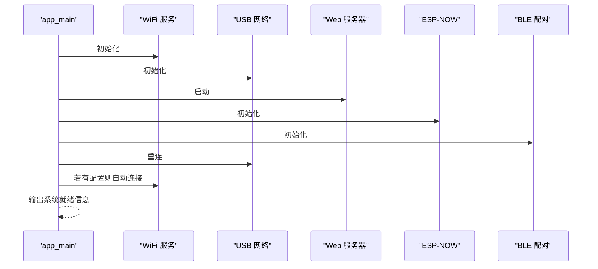
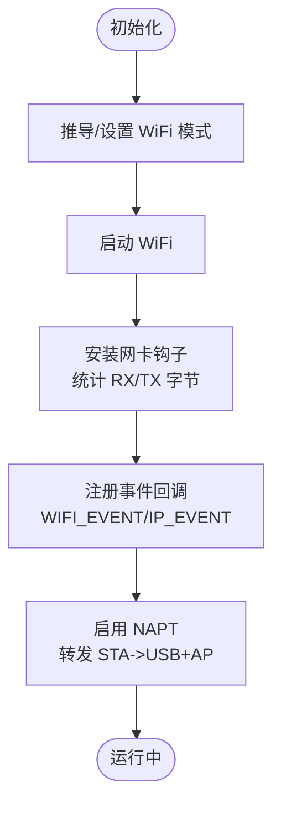
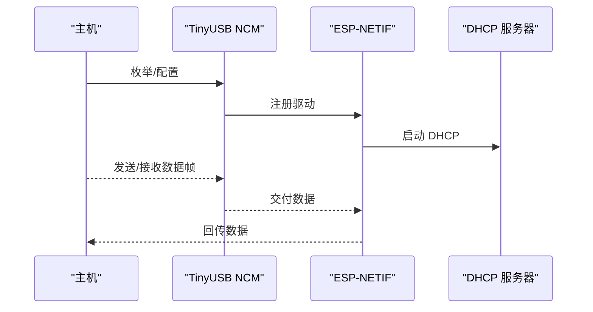
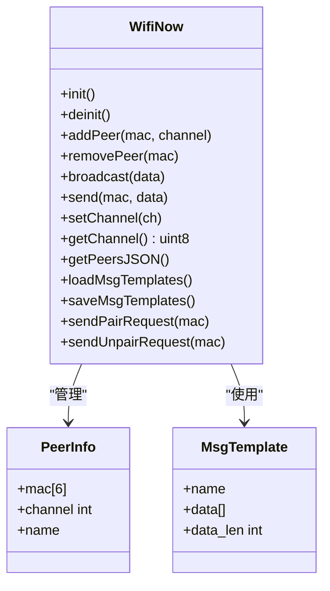
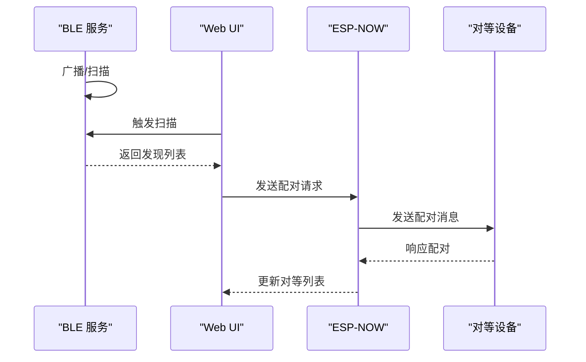
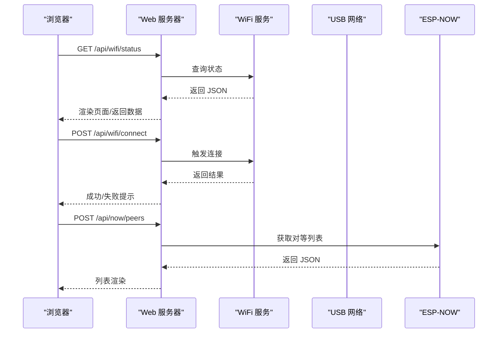
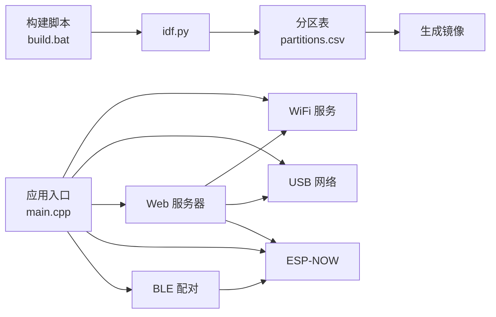

# 部署和运维

<cite>
**本文引用的文件**
- [CMakeLists.txt](file://CMakeLists.txt)
- [main.cpp](file://main/main.cpp)
- [web_server.cpp](file://main/web_server.cpp)
- [web_server.h](file://main/web_server.h)
- [wifi_service.cpp](file://main/wifi_service.cpp)
- [wifi_service.h](file://main/wifi_service.h)
- [usb_network.cpp](file://main/usb_network.cpp)
- [usb_network.h](file://main/usb_network.h)
- [wifi_now.c](file://main/wifi_now.c)
- [wifi_now.h](file://main/wifi_now.h)
- [ble_pairing.h](file://main/ble_pairing.h)
- [build.bat](file://build.bat)
- [flash_com2.bat](file://flash_com2.bat)
- [flash_correct.bat](file://flash_correct.bat)
- [partitions.csv](file://partitions.csv)
</cite>

## 目录
1. [简介](#简介)
2. [项目结构](#项目结构)
3. [核心组件](#核心组件)
4. [架构总览](#架构总览)
5. [详细组件分析](#详细组件分析)
6. [依赖关系分析](#依赖关系分析)
7. [性能与监控](#性能与监控)
8. [运维与故障排查](#运维与故障排查)
9. [结论](#结论)
10. [附录](#附录)

## 简介
本指南面向生产部署与长期运维，围绕该 ESP32-S3 Wi-Fi 管理器项目，提供从构建、烧录、批量部署到版本升级、监控与故障诊断的全链路实践方案。系统支持 USB 网络、WiFi STA/AP/双模、ESP-NOW 对等通信与 BLE 自动配对，具备 Web 管理界面与实时状态展示能力。

## 项目结构
项目采用 ESP-IDF 工程组织方式，核心应用入口位于 main 目录，包含主程序、网络服务、Web 服务器、WiFi 服务、USB 网络与 ESP-NOW/BLE 模块。构建与烧录通过批处理脚本完成，并使用分区表进行镜像布局。



图表来源
- [CMakeLists.txt](file://CMakeLists.txt)
- [main.cpp](file://main/main.cpp)
- [web_server.cpp](file://main/web_server.cpp)
- [wifi_service.cpp](file://main/wifi_service.cpp)
- [usb_network.cpp](file://main/usb_network.cpp)
- [wifi_now.c](file://main/wifi_now.c)
- [partitions.csv](file://partitions.csv)

章节来源
- [CMakeLists.txt](file://CMakeLists.txt)
- [partitions.csv](file://partitions.csv)

## 核心组件
- 应用入口与启动流程：初始化 USB 网络、Web 服务、ESP-NOW、BLE，随后根据配置自动连接 WiFi 或进入热点模式。
- WiFi 服务：统一管理 STA/AP 模式切换、连接状态、RSSI 统计、DHCP 客户端列表、NAPT 转发。
- USB 网络：基于 TinyUSB 的 CDC/NCM 实现，向主机暴露以太网设备，内置 DHCP 服务器与 DNS。
- ESP-NOW：对等通信、广播、消息模板、配对/解绑消息处理。
- BLE 自动配对：BLE 广播与扫描，发现对等设备后触发 ESP-NOW 配对。
- Web 服务：提供 WiFi 扫描、连接、热点开关、DHCP 客户端、ESP-NOW 设备管理与系统重启等操作。

章节来源
- [main.cpp](file://main/main.cpp)
- [wifi_service.cpp](file://main/wifi_service.cpp)
- [usb_network.cpp](file://main/usb_network.cpp)
- [wifi_now.c](file://main/wifi_now.c)
- [web_server.cpp](file://main/web_server.cpp)

## 架构总览
系统在 ESP32-S3 上运行，通过 USB 向主机提供以太网接口，同时可作为 STA 连接外部 WiFi，或作为 AP 为其他设备提供热点；ESP-NOW 用于与对等设备直接通信，BLE 用于简化配对流程。

```mermaid
graph TB
subgraph "主机侧"
PC["PC/笔记本"]
Browser["浏览器<br/>Web UI"]
end
subgraph "设备侧"
MCU["ESP32-S3"]
USB["USB CDC/NCM<br/>以太网设备"]
WIFI["WiFi 接口<br/>STA/AP"]
NOW["ESP-NOW<br/>对等通信"]
BLE["BLE<br/>自动配对"]
HTTP["Web 服务器<br/>HTTPD"]
end
PC < --> USB
Browser --> HTTP
HTTP --> WIFI
HTTP --> NOW
HTTP --> BLE
WIFI <- --> NOW
BLE --> NOW
```

图表来源
- [main.cpp](file://main/main.cpp)
- [web_server.cpp](file://main/web_server.cpp)
- [wifi_service.cpp](file://main/wifi_service.cpp)
- [usb_network.cpp](file://main/usb_network.cpp)
- [wifi_now.c](file://main/wifi_now.c)
- [ble_pairing.h](file://main/ble_pairing.h)

## 详细组件分析

### 应用入口与启动序列
应用入口负责按序初始化各子系统，并根据保存的 WiFi 模式决定是否自动连接。



图表来源
- [main.cpp](file://main/main.cpp)

章节来源
- [main.cpp](file://main/main.cpp)

### WiFi 服务（STA/AP/NAPT）
WiFi 服务负责：
- 模式切换（STA/AP/APSTA）
- 连接/断开、状态查询、RSSI 采集
- DHCP 客户端跟踪（AP/USB）
- NAPT 转发（STA->USB+AP）
- 统计计数钩子（字节速率计算）



图表来源
- [wifi_service.cpp](file://main/wifi_service.cpp)

章节来源
- [wifi_service.cpp](file://main/wifi_service.cpp)
- [wifi_service.h](file://main/wifi_service.h)

### USB 网络（CDC/NCM）
USB 网络通过 TinyUSB 提供以太网设备，向主机提供固定 IP 与 DHCP/DNS 服务，并在主机枚举变化时自动重启 DHCP。



图表来源
- [usb_network.cpp](file://main/usb_network.cpp)
- [usb_network.h](file://main/usb_network.h)

章节来源
- [usb_network.cpp](file://main/usb_network.cpp)
- [usb_network.h](file://main/usb_network.h)

### ESP-NOW 对等通信
ESP-NOW 支持添加/删除对等、广播、通道设置、消息模板管理与配对/解绑消息处理。



图表来源
- [wifi_now.c](file://main/wifi_now.c)
- [wifi_now.h](file://main/wifi_now.h)

章节来源
- [wifi_now.c](file://main/wifi_now.c)
- [wifi_now.h](file://main/wifi_now.h)

### BLE 自动配对
BLE 用于广播设备名称与 ESP-NOW MAC，扫描发现后可触发配对请求，实现零配置接入。



图表来源
- [ble_pairing.h](file://main/ble_pairing.h)
- [wifi_now.c](file://main/wifi_now.c)

章节来源
- [ble_pairing.h](file://main/ble_pairing.h)
- [wifi_now.c](file://main/wifi_now.c)

### Web 服务器与 API
Web 服务器提供 HTML 页面与 REST API，覆盖 WiFi 状态、扫描、连接、热点、DHCP 客户端、ESP-NOW 管理、BLE 状态、系统重启等功能。



图表来源
- [web_server.cpp](file://main/web_server.cpp)
- [web_server.h](file://main/web_server.h)
- [wifi_service.cpp](file://main/wifi_service.cpp)
- [usb_network.cpp](file://main/usb_network.cpp)
- [wifi_now.c](file://main/wifi_now.c)

章节来源
- [web_server.cpp](file://main/web_server.cpp)
- [web_server.h](file://main/web_server.h)
- [wifi_service.cpp](file://main/wifi_service.cpp)
- [usb_network.cpp](file://main/usb_network.cpp)
- [wifi_now.c](file://main/wifi_now.c)

## 依赖关系分析
- 构建系统：使用 ESP-IDF 的 CMake 与 idf.py，通过批处理脚本封装构建与烧录。
- 分区布局：使用 CSV 描述分区，包含 NVS、PHY、Factory。
- 组件耦合：Web 服务依赖 WiFi 服务与 USB 网络；ESP-NOW 依赖 WiFi 模式；BLE 与 ESP-NOW 协同配对。



图表来源
- [build.bat](file://build.bat)
- [partitions.csv](file://partitions.csv)
- [main.cpp](file://main/main.cpp)

章节来源
- [build.bat](file://build.bat)
- [partitions.csv](file://partitions.csv)
- [main.cpp](file://main/main.cpp)

## 性能与监控
- 实时吞吐统计：WiFi 服务与 USB 网络分别维护 RX/TX 字节计数，并通过定时器计算每秒字节数，Web UI 实时展示。
- RSSI 采样：周期性读取当前 AP 的 RSSI，辅助判断信号质量。
- DHCP 客户端追踪：记录 AP/USB 下已分配 IP 的客户端列表，便于运维定位。
- NAPT 转发：在 STA 模式下启用，使 USB+AP 共享外网连接，降低网络复杂度。

章节来源
- [wifi_service.cpp](file://main/wifi_service.cpp)
- [usb_network.cpp](file://main/usb_network.cpp)
- [web_server.cpp](file://main/web_server.cpp)

## 运维与故障排查

### 生产部署流程
- 环境准备
  - 安装 ESP-IDF v6.0.1 及 Python 环境，确保 PATH 正确。
  - 准备 USB 线缆与目标设备。
- 构建
  - 使用构建脚本执行重新配置与编译。
- 烧录
  - 使用烧录脚本擦除 Flash 并按地址写入引导、分区表与应用程序。
  - 如需指定串口，使用 COM2 版本脚本。
- 首次上电
  - 通过 USB 访问 Web 管理界面，默认地址见应用输出。
  - 配置 WiFi 连接或开启热点，必要时通过 BLE 自动配对 ESP-NOW 对等设备。

章节来源
- [build.bat](file://build.bat)
- [flash_com2.bat](file://flash_com2.bat)
- [flash_correct.bat](file://flash_correct.bat)
- [main.cpp](file://main/main.cpp)

### 系统监控与日志
- 日志采集
  - 使用 ESP-IDF 默认日志接口，结合串口监视器或远程日志收集（如 JTAG/UART）。
- Web 监控
  - 通过 /api/wifi/status 获取实时状态与速率，/api/dhcp/clients 查看客户端列表。
- 健康检查
  - 定期轮询 /api/wifi/status，观察 STA/AP 状态、RSSI、速率与客户端数量。
  - 关注 USB 网络 RX/TX 总量变化，异常波动可能指示主机侧问题。

章节来源
- [web_server.cpp](file://main/web_server.cpp)
- [wifi_service.cpp](file://main/wifi_service.cpp)
- [usb_network.cpp](file://main/usb_network.cpp)

### 固件烧录与批量部署
- 批量烧录
  - 将烧录脚本封装为自动化任务，按设备序列号或 MAC 地址分组执行。
  - 建议先擦除再写入，确保分区表与应用一致。
- 版本升级
  - 采用 OTA（若扩展）或重复烧录流程；升级前备份 NVS（含 WiFi 配置与 ESP-NOW 对等信息）。
  - 升级后验证 Web 界面、USB 网络与 WiFi 连接。

章节来源
- [flash_com2.bat](file://flash_com2.bat)
- [flash_correct.bat](file://flash_correct.bat)
- [wifi_service.cpp](file://main/wifi_service.cpp)
- [wifi_now.c](file://main/wifi_now.c)

### 常见运维场景与应急响应
- 无法联网
  - 检查 /api/wifi/status 中 STA 状态与 RSSI；尝试重新连接或切换热点。
- USB 不识别
  - 检查 USB 线缆与主机驱动；确认 DHCP 是否正常；必要时重启 USB 网络。
- 对等设备未发现
  - 确认 BLE 广播与扫描状态；检查 ESP-NOW 通道一致性；尝试重新配对。
- 热点不稳定
  - 检查 AP 密码强度与客户端数量；调整信道避免干扰。

章节来源
- [web_server.cpp](file://main/web_server.cpp)
- [wifi_service.cpp](file://main/wifi_service.cpp)
- [usb_network.cpp](file://main/usb_network.cpp)
- [wifi_now.c](file://main/wifi_now.c)

### 安全加固与审计
- 默认密码
  - 热点默认密码在代码中可见，建议首次部署即修改为强口令。
- 访问控制
  - Web 界面无内置鉴权，建议通过前置反向代理或防火墙限制访问范围。
- 审计日志
  - 可在应用层增加关键事件日志（连接/断开、配对/解绑、热点开关），便于审计。

章节来源
- [wifi_service.cpp](file://main/wifi_service.cpp)
- [wifi_now.c](file://main/wifi_now.c)

### 运维工具与自动化
- 构建与烧录
  - build.bat：重新配置并编译。
  - flash_com2.bat / flash_correct.bat：按地址烧录镜像。
- 监控仪表板
  - 基于 /api/* 接口编写采集脚本，定时抓取状态并入库，可视化展示速率、客户端与健康指标。
- 自动化脚本示例思路
  - 批量烧录：循环执行烧录脚本，按设备参数写入配置。
  - 健康巡检：定时访问 /api/wifi/status 与 /api/dhcp/clients，异常告警。

章节来源
- [build.bat](file://build.bat)
- [flash_com2.bat](file://flash_com2.bat)
- [flash_correct.bat](file://flash_correct.bat)
- [web_server.cpp](file://main/web_server.cpp)

### 维护建议、性能调优与容量规划
- 维护建议
  - 定期检查日志与错误计数（如 USB TX 失败次数）。
  - 保持固件版本与分区表一致，避免升级回滚。
- 性能调优
  - 优化扫描策略与定时器周期，减少 CPU 占用。
  - 合理设置 AP 信道与客户端上限，避免拥塞。
- 容量规划
  - 评估并发客户端数量与带宽需求，预留 USB 与 WiFi 资源余量。

章节来源
- [wifi_service.cpp](file://main/wifi_service.cpp)
- [usb_network.cpp](file://main/usb_network.cpp)

## 结论
本项目提供了完整的 USB+WiFi 双栈与对等通信能力，配合 Web 管理界面与统计监控，适合在边缘场景快速部署与运维。建议在生产环境中强化访问控制、完善日志与告警体系，并建立标准化的批量部署与版本升级流程，以保障系统的稳定性与可维护性。

## 附录

### API 摘要（路径与用途）
- GET /api/wifi/status：获取 WiFi 状态、速率与模式
- POST /api/wifi/connect：提交 SSID/密码连接
- POST /api/wifi/ap/start：启动热点（SSID/密码）
- POST /api/wifi/ap/stop：停止热点
- GET /api/dhcp/clients：获取 DHCP 客户端列表
- GET /api/now/mac：获取 ESP-NOW MAC
- GET /api/espnow/master：获取热点主设备信息
- GET /api/ble/status：获取 BLE 广播/扫描状态
- POST /api/ble/advertise：控制 BLE 广播
- POST /api/ble/scan：触发 BLE 扫描
- POST /api/ble/pair：与发现设备配对
- GET /api/now/peers：获取对等设备列表
- POST /api/now/peer/remove：移除对等设备
- POST /api/restart：重启设备

章节来源
- [web_server.cpp](file://main/web_server.cpp)