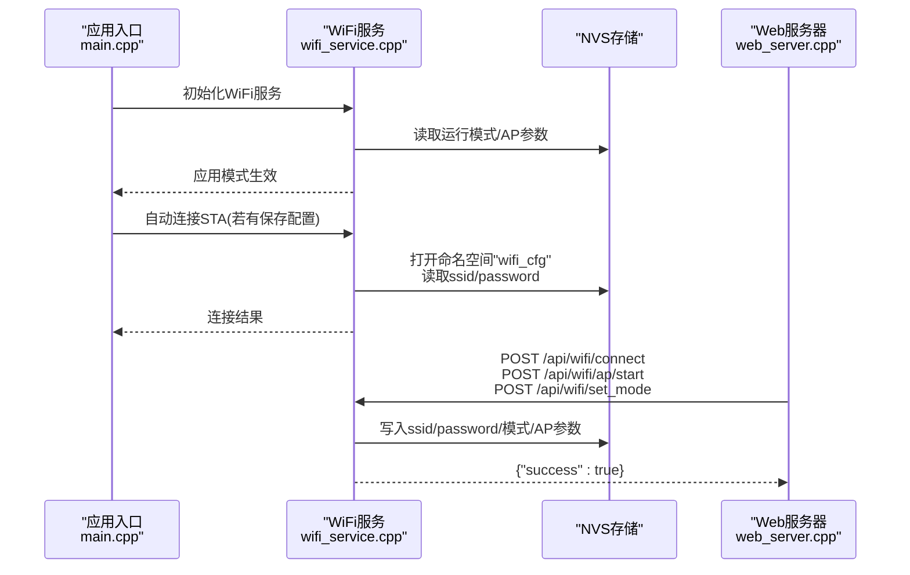
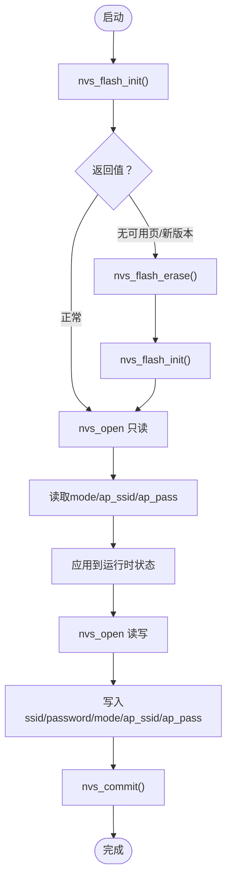
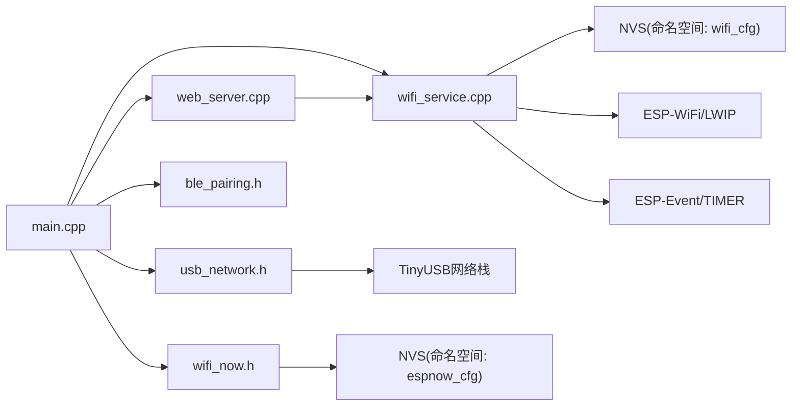

# 配置管理

<cite>
**本文引用的文件**
- [main.cpp](file://main.cpp)
- [wifi_service.cpp](file://wifi_service.cpp)
- [wifi_service.h](file://wifi_service.h)
- [web_server.cpp](file://web_server.cpp)
- [web_server.h](file://web_server.h)
- [usb_network.h](file://usb_network.h)
- [wifi_now.h](file://wifi_now.h)
- [ble_pairing.h](file://ble_pairing.h)
- [partitions.csv](file://partitions.csv)
- [sdkconfig.defaults](file://sdkconfig.defaults)
- [CMakeLists.txt](file://CMakeLists.txt)
- [ESP_NOW_BLE_Discovery_Specification.md](file://docs/ESP_NOW_BLE_Discovery_Specification.md)
- [ESP_NOW_WiFi_API_Specification.md](file://docs/ESP_NOW_WiFi_API_Specification.md)
</cite>

## 目录
1. [简介](#简介)
2. [项目结构](#项目结构)
3. [核心组件](#核心组件)
4. [架构总览](#架构总览)
5. [详细组件分析](#详细组件分析)
6. [依赖关系分析](#依赖关系分析)
7. [性能考量](#性能考量)
8. [故障排除指南](#故障排除指南)
9. [结论](#结论)
10. [附录](#附录)

## 简介
本文件系统化梳理该ESP32-S3 WiFi项目的配置管理体系，覆盖以下方面：
- 分区表配置：NVS、PHY、Factory等分区布局与用途
- SDK配置参数：Flash模式、分区表、网络与蓝牙功能开关
- 运行时配置管理：STA/AP/APSTA模式、WiFi凭据、AP热点参数、NAPT转发、DHCP客户端列表
- NVS存储机制：命名空间、键值、读写与迁移策略
- 配置验证与迁移：启动时NVS初始化、擦除与重写、默认值回退
- WiFi配置与网络参数：SSID/密码长度、认证方式、信道与DNS
- 系统行为配置：USB网络共享、流量统计钩子、事件回调
- 最佳实践：修改配置、备份恢复、版本管理
- 兼容性与硬件限制：分区大小、Flash频率、引导加载器偏移
- 调试工具与验证方法：日志、状态接口、错误排查流程

## 项目结构
该项目采用“功能模块化 + 组件化”的组织方式，核心入口在应用主函数，通过服务层统一管理WiFi、USB网络、Web服务与BLE/ESP-NOW配对。

```mermaid
graph TB
A["应用入口<br/>main.cpp"] --> B["WiFi服务<br/>wifi_service.cpp/.h"]
A --> C["Web服务器<br/>web_server.cpp/.h"]
A --> D["USB网络接口<br/>usb_network.h"]
A --> E["BLE配对<br/>ble_pairing.h"]
A --> F["ESP-NOW接口<br/>wifi_now.h"]
B --> G["NVS命名空间<br/>\"wifi_cfg\""]
B --> H["事件循环/定时器"]
B --> I["LWIP/NAPT/DHCP"]
C --> J["HTTP API路由"]
C --> K["状态JSON输出"]
D --> L["TinyUSB网络栈"]
E --> M["BLE广告/扫描"]
F --> N["对等设备持久化<br/>\"espnow_cfg\"(参考文档)"]
```

图表来源
- [main.cpp:19-81](file://main.cpp#L19-L81)
- [wifi_service.cpp:604-703](file://wifi_service.cpp#L604-L703)
- [web_server.cpp:1219-1261](file://web_server.cpp#L1219-L1261)
- [usb_network.h:12-16](file://usb_network.h#L12-L16)
- [wifi_now.h:78-79](file://wifi_now.h#L78-L79)

章节来源
- [main.cpp:19-81](file://main.cpp#L19-L81)
- [CMakeLists.txt:1-8](file://CMakeLists.txt#L1-8)

## 核心组件
- 应用入口与初始化
  - 初始化顺序：USB网络 → Web服务器 → ESP-NOW → BLE配对 → USB重连
  - 启动后根据运行模式自动连接已保存的STA配置
- WiFi服务
  - 管理STA/AP/APSTA模式切换、连接/断开、AP启停、NAPT转发、DHCP客户端统计
  - 通过NVS保存/读取运行模式与AP热点参数
- Web服务器
  - 提供HTTP API用于设置STA连接、AP启停、模式切换、重启等
  - 提供状态查询接口，返回JSON格式的WiFi/AP/USB/流量信息
- USB网络
  - 提供USB网络接口句柄、统计总收发字节数、触发重连
- ESP-NOW与BLE配对
  - 对等设备持久化到NVS命名空间“espnow_cfg”（参考文档），支持自动配对与消息模板

章节来源
- [main.cpp:25-80](file://main.cpp#L25-L80)
- [wifi_service.cpp:604-703](file://wifi_service.cpp#L604-L703)
- [web_server.cpp:1219-1261](file://web_server.cpp#L1219-L1261)
- [wifi_now.h:78-79](file://wifi_now.h#L78-L79)

## 架构总览
下图展示配置相关的运行时交互：应用入口负责初始化与自动连接；WiFi服务负责模式与配置持久化；Web服务器提供配置变更入口；NVS作为持久化后端。



图表来源
- [main.cpp:50-66](file://main.cpp#L50-L66)
- [wifi_service.cpp:653-688](file://wifi_service.cpp#L653-L688)
- [web_server.cpp:1219-1261](file://web_server.cpp#L1219-L1261)

## 详细组件分析

### 分区表配置
- 分区定义
  - nvs：数据分区，类型nvs，大小0x6000（24KB），用于存放配置键值
  - phy_init：数据分区，类型phy，大小0x1000（4KB），存放PHY初始化数据
  - factory：应用程序分区，类型app，subtype factory，大小4MB，用于固件镜像
- 影响
  - NVS容量决定可存储的配置项数量与大小上限
  - 分区表需与SDK配置一致，避免运行时异常

章节来源
- [partitions.csv:1-5](file://partitions.csv#L1-L5)

### SDK配置参数
- TinyUSB网络模式与回调
  - NCM模式启用、挂起/唤醒回调启用、IN NTB缓冲区数量
- LWIP转发与NAPT
  - IP转发、IPv4 NAPT、统计开启
- Flash与引导加载器
  - DIO模式、80MHz频率、16MB容量
  - 引导加载器偏移固定为0x1000（ESP32-S3要求）
- 分区表
  - 使用自定义分区表，文件名指向partitions.csv

章节来源
- [sdkconfig.defaults:1-31](file://sdkconfig.defaults#L1-L31)

### 运行时配置管理（STA/AP/APSTA）
- 模式枚举与状态
  - 模式：STA、AP、APSTA
  - 状态：断开、连接中、已连接
- 关键配置项
  - STA：ssid（最大32字符）、password（最大64字符）
  - AP：ap_ssid（最大32字符）、ap_password（最大64字符）、最大连接数、认证方式WPA2-PSK、默认信道
- 默认值与回退
  - AP默认SSID/密码、AP最大连接数、默认信道
- NVS键与命名空间
  - 命名空间："wifi_cfg"
  - 键：mode（u8）、ssid（str）、password（str）、ap_ssid（str）、ap_pass（str）

章节来源
- [wifi_service.h:16-63](file://wifi_service.h#L16-L63)
- [wifi_service.cpp:40-41](file://wifi_service.cpp#L40-L41)
- [wifi_service.cpp:23-29](file://wifi_service.cpp#L23-L29)

### NVS存储机制与迁移策略
- 初始化与迁移
  - 启动时调用nvs_flash_init，若返回无可用页或新版本，执行擦除并重新初始化
  - 保证NVS分区可用且版本兼容
- 读写流程
  - 读取：打开命名空间"wifi_cfg"只读，读取mode、ap_ssid、ap_pass
  - 写入：打开命名空间"wifi_cfg"读写，写入ssid/password/mode/ap_ssid/ap_pass，commit后关闭
- 迁移策略
  - 当检测到新版本或无可用页时，先擦除再初始化，确保配置可写
  - 读取失败时使用默认值，避免崩溃



图表来源
- [wifi_service.cpp:611-616](file://wifi_service.cpp#L611-L616)
- [wifi_service.cpp:653-668](file://wifi_service.cpp#L653-L668)
- [wifi_service.cpp:739-750](file://wifi_service.cpp#L739-L750)

章节来源
- [wifi_service.cpp:611-616](file://wifi_service.cpp#L611-L616)
- [wifi_service.cpp:653-668](file://wifi_service.cpp#L653-L668)
- [wifi_service.cpp:739-750](file://wifi_service.cpp#L739-L750)

### WiFi配置与网络参数
- 凭据长度约束
  - STA SSID：最大32字符
  - STA 密码：最大64字符
  - AP SSID：最大32字符
  - AP 密码：最大64字符
- 认证与信道
  - AP认证方式：WPA2-PSK
  - 默认AP信道：1
  - 最大连接数：4
- DNS与DHCP
  - AP侧DHCP租期：3600秒
  - AP侧DNS：8.8.8.8
- 流量统计与NAPT
  - 通过netif hook统计各接口吞吐
  - 启动STA连接后启用NAPT，实现USB+AP共享WAN

章节来源
- [wifi_service.cpp:39-40](file://wifi_service.cpp#L39-L40)
- [wifi_service.cpp:318-326](file://wifi_service.cpp#L318-L326)
- [wifi_service.cpp:516-533](file://wifi_service.cpp#L516-L533)
- [wifi_service.cpp:340-362](file://wifi_service.cpp#L340-L362)
- [wifi_service.cpp:279-299](file://wifi_service.cpp#L279-L299)

### Web服务器配置接口
- 接口概览
  - POST /api/wifi/connect：保存STA配置并发起连接
  - POST /api/wifi/ap/start：启动AP（可带ssid/password）
  - POST /api/wifi/ap/stop：停止AP
  - POST /api/wifi/set_mode：设置运行模式（apsta/ap/sta）
  - POST /api/restart：重启设备
- 参数校验
  - 客户端JS侧对密码长度进行最小长度校验
  - 服务端解析URL编码参数，必要时进行长度与范围检查
- 状态查询
  - GET /api/wifi/status：返回STA/AP/USB/流量等JSON状态

章节来源
- [web_server.cpp:1219-1261](file://web_server.cpp#L1219-L1261)
- [web_server.cpp:489-493](file://web_server.cpp#L489-L493)

### ESP-NOW与BLE配对的配置持久化
- ESP-NOW对等设备持久化
  - 命名空间："espnow_cfg"
  - 键：peer_cnt、peer_0..N、ble_name
- BLE配对
  - 广告/扫描状态、发现设备列表、自动配对开关
  - 通过Web API控制BLE广告名称与开关

章节来源
- [ESP_NOW_BLE_Discovery_Specification.md:584-595](file://docs/ESP_NOW_BLE_Discovery_Specification.md#L584-L595)
- [ble_pairing.h:15-27](file://ble_pairing.h#L15-L27)

## 依赖关系分析
- 组件耦合
  - main.cpp依赖wifi_service、web_server、usb_network、ble_pairing、wifi_now
  - wifi_service依赖NVS、WiFi/Netif/LWIP、事件/定时器
  - web_server依赖wifi_service状态与命令队列
- 外部依赖
  - NVS Flash、ESP-WiFi、ESP-Netif、ESP-Event、HTTP Server、ESP-Timer、驱动、TinyUSB、蓝牙



图表来源
- [CMakeLists.txt:1-8](file://CMakeLists.txt#L1-L8)
- [main.cpp:19-43](file://main.cpp#L19-L43)
- [wifi_service.cpp:604-703](file://wifi_service.cpp#L604-L703)
- [web_server.cpp:1219-1261](file://web_server.cpp#L1219-L1261)

章节来源
- [CMakeLists.txt:1-8](file://CMakeLists.txt#L1-L8)
- [main.cpp:19-43](file://main.cpp#L19-L43)

## 性能考量
- NVS写入
  - 使用nvs_commit减少频繁写入带来的磨损
  - 将STA连接与AP启停合并为一次写入，避免抖动
- 事件与定时器
  - RSSI与统计定时器周期分别为3s与1s，兼顾实时性与CPU占用
- 网络转发
  - NAPT仅在STA连接后启用，避免不必要的内核回调开销
- USB网络
  - 通过hook统计USB接口吞吐，便于监控与限速策略

## 故障排除指南
- 常见问题与定位
  - NVS初始化失败：检查分区表与SDK配置是否匹配；若出现“无可用页/新版本”，执行擦除后再初始化
  - 连接失败：确认STA SSID/密码长度与格式；检查AP认证方式与密码强度
  - AP无法被发现：确认AP已启动、SSID未被隐藏、信道合法
  - USB网络不通：确认USB网络接口已初始化并重连；检查NAPT是否启用
- 调试流程（基于文档）
  - 发送失败排查：检查MAC格式、数据字段、ESP-NOW初始化状态
  - 成功但对端收不到：PMK一致性、信道匹配、对端是否添加主设备为peer、加密设置、是否注册接收回调、数据长度限制
- 日志与状态
  - 使用日志查看STA/AP事件、RSSI变化、DHCP分配、NAPT启用/禁用
  - 通过GET /api/wifi/status获取当前状态快照

章节来源
- [wifi_service.cpp:611-616](file://wifi_service.cpp#L611-L616)
- [wifi_service.cpp:416-595](file://wifi_service.cpp#L416-L595)
- [ESP_NOW_WiFi_API_Specification.md:1205-1279](file://docs/ESP_NOW_WiFi_API_Specification.md#L1205-L1279)

## 结论
本项目通过清晰的分区表与SDK配置、规范的NVS命名空间与键设计、完善的运行时状态机与Web API，实现了稳定的WiFi配置管理。结合事件驱动与定时器机制，系统在低开销下提供了STA/AP/APSTA多模式、USB网络共享与流量统计能力。建议在生产环境中遵循本文最佳实践，确保配置安全、可迁移与可维护。

## 附录

### 配置选项清单与取值范围
- 运行模式（mode）
  - 取值：STA(0)、AP(1)、APSTA(2)
  - 存储：NVS键“mode”（u8）
- STA配置
  - 键：ssid（str，≤32字符）、password（str，≤64字符）
  - 存储：NVS键“ssid”、“password”
- AP配置
  - 键：ap_ssid（str，≤32字符）、ap_pass（str，≤64字符）
  - 默认：WPA2-PSK，最大连接4，信道1
  - 存储：NVS键“ap_ssid”、“ap_pass”
- 系统行为
  - NAPT：随STA连接自动启用
  - DHCP：AP侧DHCP租期3600秒，DNS 8.8.8.8
  - USB网络：提供接口句柄与总收发统计

章节来源
- [wifi_service.h:16-63](file://wifi_service.h#L16-L63)
- [wifi_service.cpp:23-29](file://wifi_service.cpp#L23-L29)
- [wifi_service.cpp:318-326](file://wifi_service.cpp#L318-L326)
- [wifi_service.cpp:516-533](file://wifi_service.cpp#L516-L533)

### 配置修改最佳实践
- 修改STA配置
  - 通过Web API提交ssid/password，服务端保存至NVS并立即应用
  - 建议在断开现有连接后更新，避免冲突
- 修改AP配置
  - 更新ap_ssid/ap_pass后立即生效；如处于AP模式则直接更新WiFi配置
- 模式切换
  - 通过set_mode接口切换；注意STA断开与AP停止的副作用
- 备份与恢复
  - 备份：读取NVS命名空间“wifi_cfg”的所有键值
  - 恢复：按相同键写入对应值并commit
- 版本管理
  - 若NVS版本升级导致不兼容，先执行擦除再初始化，再写入新版本键值

章节来源
- [web_server.cpp:1219-1261](file://web_server.cpp#L1219-L1261)
- [wifi_service.cpp:739-750](file://wifi_service.cpp#L739-L750)
- [wifi_service.cpp:611-616](file://wifi_service.cpp#L611-L616)

### 兼容性与硬件限制
- 分区表与SDK配置
  - NVS大小0x6000，满足当前配置项需求
  - 引导加载器偏移固定为0x1000（ESP32-S3）
- Flash参数
  - DIO模式、80MHz频率、16MB容量
- 网络与蓝牙
  - 启用BT/BLE与GATT服务，配合BLE配对与ESP-NOW使用

章节来源
- [partitions.csv:1-5](file://partitions.csv#L1-L5)
- [sdkconfig.defaults:12-31](file://sdkconfig.defaults#L12-L31)