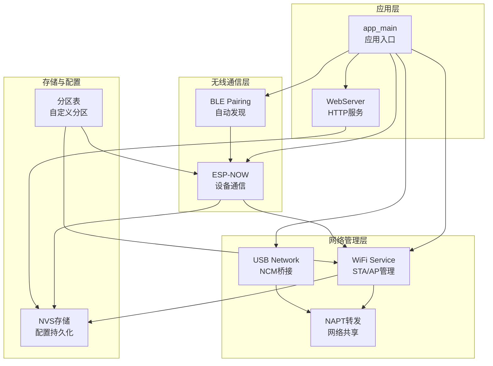
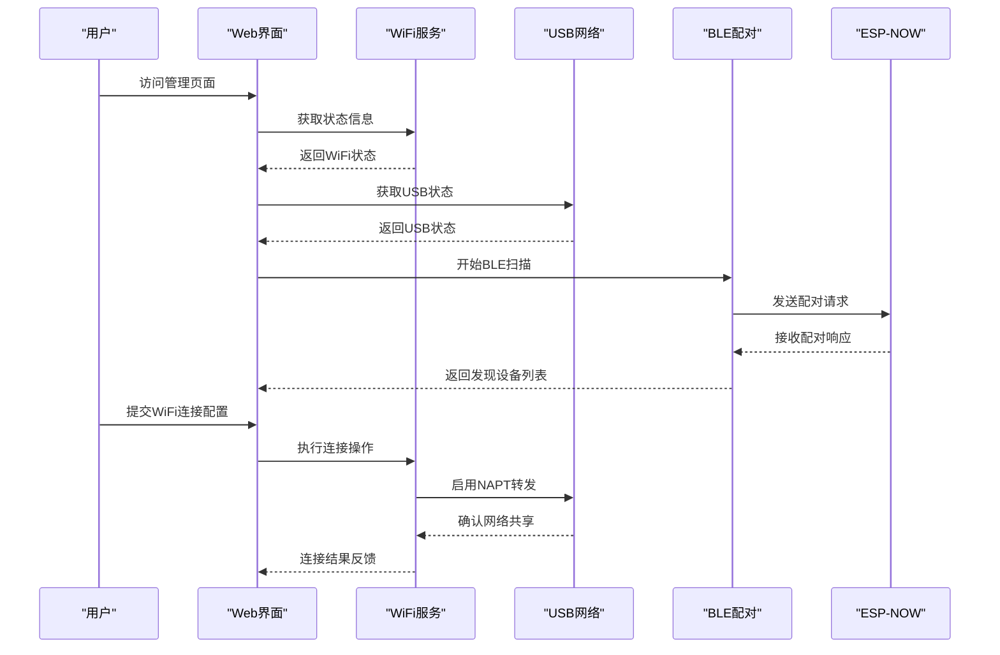
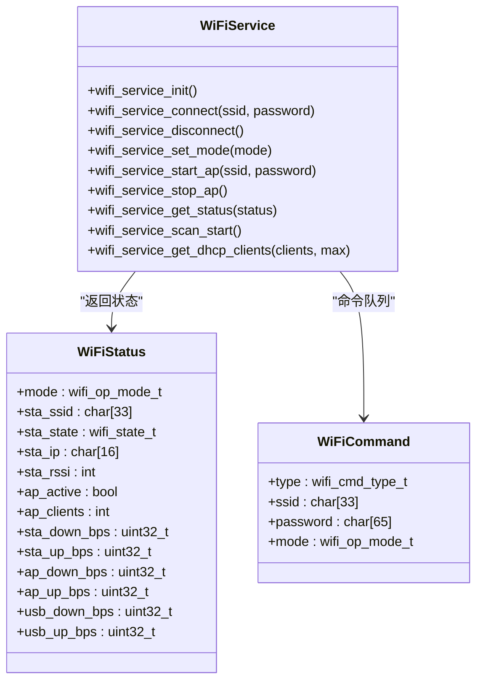
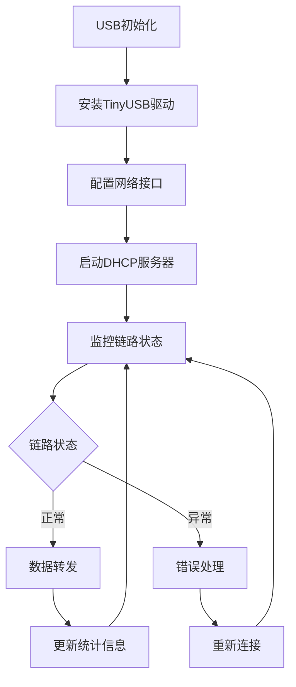
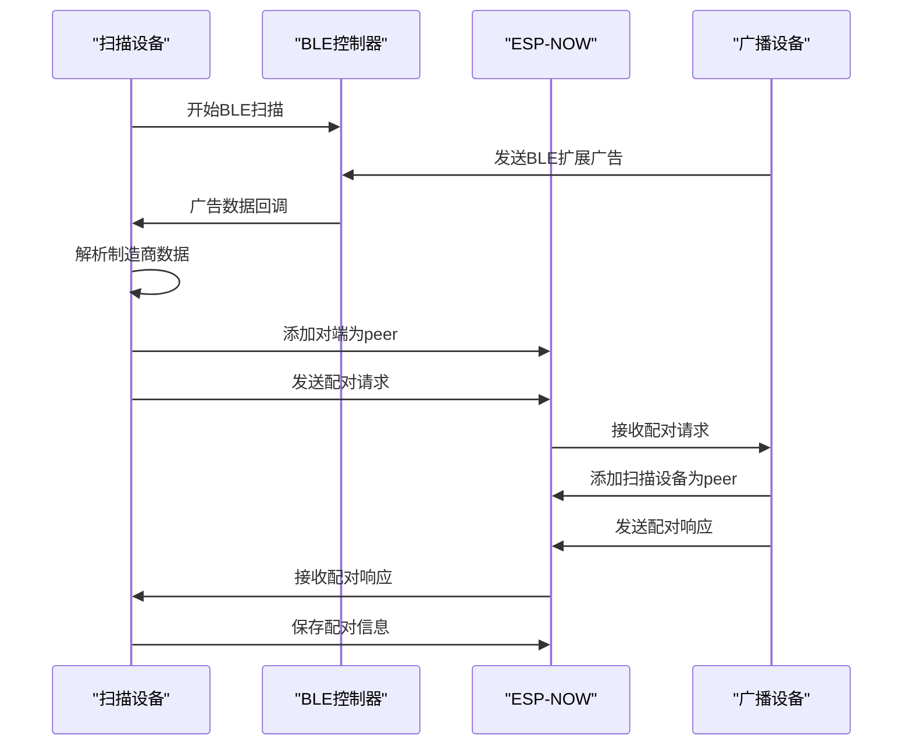
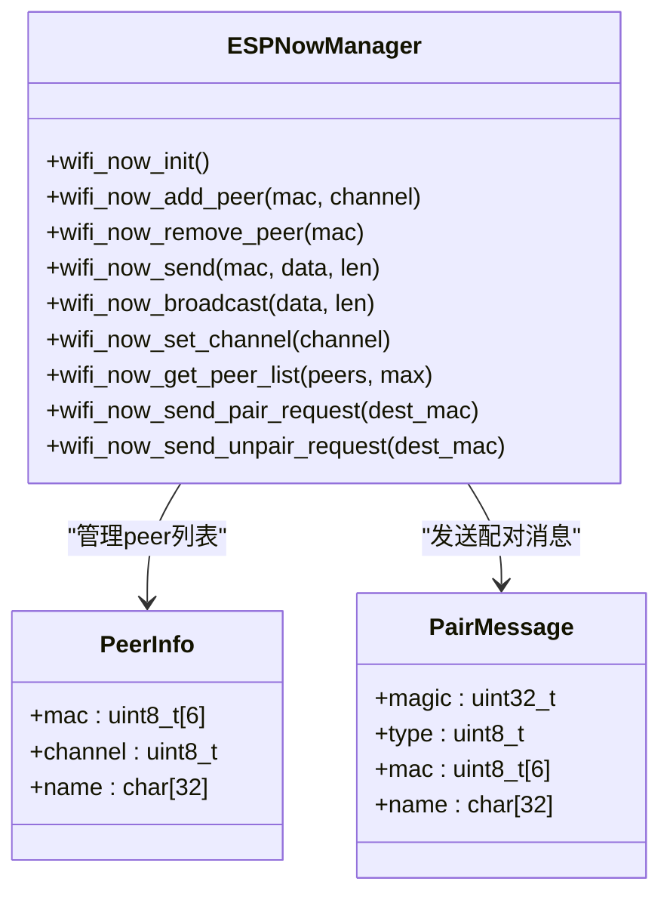
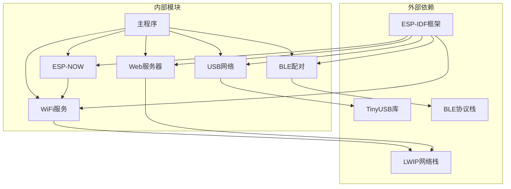

# 项目概述

<cite>
**本文档引用的文件**
- [main/main.cpp](file://main/main.cpp)
- [main/wifi_service.cpp](file://main/wifi_service.cpp)
- [main/wifi_service.h](file://main/wifi_service.h)
- [main/usb_network.cpp](file://main/usb_network.cpp)
- [main/usb_network.h](file://main/usb_network.h)
- [main/web_server.cpp](file://main/web_server.cpp)
- [main/web_server.h](file://main/web_server.h)
- [main/ble_pairing.c](file://main/ble_pairing.c)
- [main/ble_pairing.h](file://main/ble_pairing.h)
- [main/wifi_now.c](file://main/wifi_now.c)
- [CMakeLists.txt](file://CMakeLists.txt)
- [sdkconfig.defaults](file://sdkconfig.defaults)
- [main/idf_component.yml](file://main/idf_component.yml)
- [docs/ESP_NOW_BLE_Discovery_Specification.md](file://docs/ESP_NOW_BLE_Discovery_Specification.md)
</cite>

## 目录
1. [简介](#简介)
2. [项目结构](#项目结构)
3. [核心组件](#核心组件)
4. [架构总览](#架构总览)
5. [详细组件分析](#详细组件分析)
6. [依赖关系分析](#依赖关系分析)
7. [性能考虑](#性能考虑)
8. [故障排除指南](#故障排除指南)
9. [结论](#结论)
10. [附录](#附录)

## 简介
本项目是一个基于ESP32-S3的WiFi管理器系统，旨在通过USB网络共享、WiFi管理和BLE自动配对等能力，实现设备间的无缝网络连接与数据传输。系统采用ESP-IDF框架开发，结合TinyUSB NCM模式提供USB以太网桥接，利用ESP-NOW协议在WiFi链路上进行低延迟设备间通信，并通过BLE扩展广告机制实现零配置的自动发现与配对。项目支持STA/AP双模工作模式，具备实时流量统计、DHCP客户端管理、NAPT网络地址转换等功能，适用于移动设备接入、边缘计算网关、IoT网桥等多种应用场景。

## 项目结构
项目采用模块化设计，核心模块包括：
- 应用入口与初始化：负责系统启动顺序、组件初始化与状态展示
- WiFi服务层：统一管理STA/AP模式切换、扫描、连接、NAPT转发、流量统计
- USB网络层：基于TinyUSB NCM实现USB以太网桥接，提供DHCP服务器与链路监控
- Web管理界面：提供图形化配置界面，支持WiFi连接、热点设置、BLE配对、ESP-NOW消息工具
- BLE配对服务：通过BLE扩展广告实现ESP-NOW设备的自动发现与双向配对
- ESP-NOW通信层：实现设备间消息收发、配对/解配对协议、消息模板管理

**图表来源**
- [main/main.cpp:19-81](file://main/main.cpp#L19-L81)
- [main/wifi_service.cpp:604-703](file://main/wifi_service.cpp#L604-L703)
- [main/usb_network.cpp:191-290](file://main/usb_network.cpp#L191-L290)
- [main/web_server.cpp:15-20](file://main/web_server.cpp#L15-L20)

**章节来源**
- [main/main.cpp:1-81](file://main/main.cpp#L1-L81)
- [CMakeLists.txt:1-7](file://CMakeLists.txt#L1-L7)
- [sdkconfig.defaults:1-31](file://sdkconfig.defaults#L1-L31)

## 核心组件
系统包含以下核心组件，每个组件都有明确的职责边界和清晰的接口定义：

### WiFi服务组件
- 统一的STA/AP模式管理，支持动态切换与状态查询
- WiFi扫描、连接、断开的完整生命周期管理
- NAPT网络地址转换，实现WiFi到USB的网络共享
- 实时流量统计与RSSI监控
- DHCP客户端管理与IP分配跟踪

### USB网络组件
- 基于TinyUSB NCM的USB以太网桥接
- DHCP服务器配置与自动重启机制
- 链路状态监控与错误处理
- 内存使用监控与OOM保护

### Web管理组件
- 响应式HTML界面，支持WiFi连接、热点设置
- 实时状态显示与流量监控
- BLE配对与ESP-NOW消息工具
- RESTful API接口，支持远程控制

### BLE配对组件
- BLE扩展广告与扫描实现
- 自动配对协议，支持双向设备添加
- 设备发现列表与状态管理
- 持久化设备名称与配对状态

### ESP-NOW通信组件
- 设备间消息收发与广播
- 配对/解配对协议实现
- 消息模板管理与批量发送
- 回调机制与状态通知

**章节来源**
- [main/wifi_service.h:16-99](file://main/wifi_service.h#L16-L99)
- [main/usb_network.h:12-22](file://main/usb_network.h#L12-L22)
- [main/web_server.h:11-22](file://main/web_server.h#L11-L22)
- [main/ble_pairing.h:15-55](file://main/ble_pairing.h#L15-L55)

## 架构总览
系统采用分层架构设计，各层之间通过明确定义的接口进行交互。整体架构遵循"硬件抽象层-中间件层-应用层"的设计原则，确保了良好的可移植性和可维护性。

**图表来源**
- [main/main.cpp:25-66](file://main/main.cpp#L25-L66)
- [main/web_server.cpp:495-627](file://main/web_server.cpp#L495-L627)
- [main/ble_pairing.c:174-226](file://main/ble_pairing.c#L174-L226)

系统的关键创新点包括：
- **零配置自动发现**：通过BLE扩展广告实现ESP-NOW设备的自动发现与配对
- **USB网络共享**：利用NAPT技术实现WiFi到USB的透明网络共享
- **多模式协同**：STA/AP双模工作模式，支持灵活的网络拓扑
- **实时监控**：提供完整的流量统计与设备状态监控
- **持久化配置**：所有配置信息保存在NVS中，支持断电不丢失

## 详细组件分析

### WiFi服务组件分析
WiFi服务组件是整个系统的核心，负责WiFi网络的完整生命周期管理。

**图表来源**
- [main/wifi_service.h:46-99](file://main/wifi_service.h#L46-L99)
- [main/wifi_service.cpp:111-182](file://main/wifi_service.cpp#L111-L182)

WiFi服务的核心特性：
- **异步命令处理**：通过命令队列和任务实现非阻塞的WiFi操作
- **状态机管理**：完整的STA/AP状态机，支持动态切换
- **NAPT集成**：自动启用/禁用NAPT，实现网络共享
- **流量统计**：实时监控各接口的上下行流量

**章节来源**
- [main/wifi_service.cpp:604-703](file://main/wifi_service.cpp#L604-L703)
- [main/wifi_service.cpp:118-182](file://main/wifi_service.cpp#L118-L182)

### USB网络组件分析
USB网络组件基于TinyUSB NCM实现，提供USB以太网桥接功能。

**图表来源**
- [main/usb_network.cpp:191-290](file://main/usb_network.cpp#L191-L290)

USB网络的关键特性：
- **NCM模式支持**：符合USB CDC NCM规范的网络适配器
- **DHCP自动重启**：检测主机重枚举后自动重启DHCP服务
- **链路监控**：连续TX失败检测与自动恢复
- **内存保护**：OOM错误处理与堆栈监控

**章节来源**
- [main/usb_network.cpp:191-312](file://main/usb_network.cpp#L191-L312)

### BLE配对组件分析
BLE配对组件实现了基于BLE扩展广告的ESP-NOW设备自动发现与配对。

**图表来源**
- [main/ble_pairing.c:174-226](file://main/ble_pairing.c#L174-L226)
- [main/wifi_now.c:487-536](file://main/wifi_now.c#L487-L536)

BLE配对的核心协议：
- **制造商数据格式**：包含ESP-NOW MAC地址和设备名称
- **自动配对流程**：扫描→解析→添加peer→发送请求→接收响应
- **双向配对保证**：双方都成为彼此的peer
- **持久化存储**：配对信息保存在NVS中

**章节来源**
- [main/ble_pairing.c:228-487](file://main/ble_pairing.c#L228-L487)
- [docs/ESP_NOW_BLE_Discovery_Specification.md:186-317](file://docs/ESP_NOW_BLE_Discovery_Specification.md#L186-L317)

### ESP-NOW通信组件分析
ESP-NOW通信组件提供了设备间的消息传递与管理功能。

**图表来源**
- [main/wifi_now.c:126-207](file://main/wifi_now.c#L126-L207)
- [main/wifi_now.c:229-311](file://main/wifi_now.c#L229-L311)

ESP-NOW通信的关键特性：
- **消息模板系统**：支持预定义消息模板的批量发送
- **配对协议**：完整的PAIR_REQUEST/RESPONSE双向配对
- **解配对协议**：UNPAIR_REQUEST/RESPONSE双向解配对（v3.0）
- **回调机制**：支持配对/解配对事件回调

**章节来源**
- [main/wifi_now.c:126-800](file://main/wifi_now.c#L126-L800)

## 依赖关系分析
系统依赖关系清晰，遵循最小耦合设计原则。

**图表来源**
- [main/idf_component.yml:1-6](file://main/idf_component.yml#L1-L6)
- [sdkconfig.defaults:1-31](file://sdkconfig.defaults#L1-L31)

**章节来源**
- [main/idf_component.yml:1-6](file://main/idf_component.yml#L1-L6)
- [sdkconfig.defaults:1-31](file://sdkconfig.defaults#L1-L31)

## 性能考虑
系统在性能方面采用了多项优化策略：

### 内存管理
- **堆栈监控**：定期检查可用堆内存，防止内存泄漏
- **缓冲区管理**：TX/RX缓冲区的动态分配与释放
- **定时器优化**：使用ESP-Timer实现低开销的周期性任务

### 网络性能
- **NAPT加速**：启用内核级NAPT，减少数据包处理开销
- **流量统计**：精确的字节级统计，避免额外的计算开销
- **链路监控**：快速检测链路状态变化，及时调整网络行为

### 实时性保证
- **优先级分离**：WiFi事件处理与用户界面更新分离
- **异步处理**：大量操作采用异步方式，避免阻塞主线程
- **定时器调度**：精确的周期性任务调度

## 故障排除指南
常见问题及解决方案：

### USB连接问题
- **症状**：主机无法识别USB网络适配器
- **原因**：驱动未正确安装或设备枚举失败
- **解决**：检查TinyUSB配置，确认NCM模式启用

### WiFi连接不稳定
- **症状**：频繁断线或连接失败
- **原因**：信号强度不足或认证失败
- **解决**：检查AP设置，确认密码正确，改善信号环境

### BLE配对失败
- **症状**：无法发现其他设备或配对失败
- **原因**：BLE范围限制或设备已满
- **解决**：缩短距离，清理配对列表，重启BLE服务

### 性能问题
- **症状**：系统响应缓慢或内存不足
- **原因**：内存泄漏或过多并发任务
- **解决**：检查日志输出，优化任务优先级，清理临时数据

**章节来源**
- [main/usb_network.cpp:30-34](file://main/usb_network.cpp#L30-L34)
- [main/wifi_service.cpp:430-450](file://main/wifi_service.cpp#L430-L450)

## 结论
ESP32-S3 WiFi管理器项目通过巧妙的技术组合，实现了从硬件抽象到应用服务的完整网络解决方案。项目的主要优势包括：

1. **技术创新**：BLE自动发现与ESP-NOW配对协议的结合，实现了真正的零配置网络连接
2. **架构清晰**：模块化设计确保了良好的可维护性和扩展性
3. **性能优异**：通过NAPT、异步处理等技术实现了高效的网络共享
4. **用户体验**：直观的Web界面和丰富的API接口提升了易用性

该系统适用于需要移动网络接入、设备间通信和网络共享的各种场景，为开发者提供了一个功能完整、性能可靠的参考实现。

## 附录

### 硬件兼容性
- **目标芯片**：ESP32-S3系列
- **Flash容量**：支持16MB，推荐使用DIO模式
- **USB接口**：全速USB 2.0，支持NCM网络模式
- **WiFi标准**：支持802.11 b/g/n，ESP-NOW协议

### 软件依赖
- **ESP-IDF版本**：支持ESP-IDF v4.4及以上
- **编译工具链**：ESP-IDF默认工具链
- **第三方库**：TinyUSB 2.0+，LWIP 2.x

### 系统要求
- **最低内存**：建议至少8MB PSRAM
- **运行环境**：Windows/Linux/macOS均可
- **开发环境**：ESP-IDF开发环境配置完成

### 实际应用场景
- **移动网络网关**：为笔记本电脑提供WiFi网络访问
- **IoT设备桥接**：将传统设备接入现代网络
- **边缘计算节点**：作为网络枢纽连接多个设备
- **测试与开发**：为网络应用提供灵活的测试环境